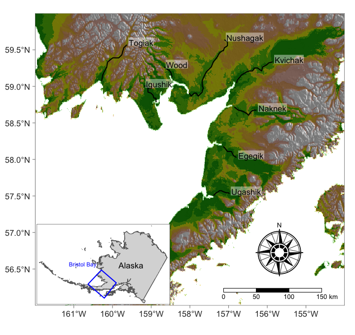

--- 
title: "Applied Time Series Analysis for Fisheries and Environmental Sciences"
author: "E. E. Holmes, M. D. Scheuerell, and E. J. Ward"
date: "2021-02-03"
site: bookdown::bookdown_site
fontsize: 12pt
documentclass: book
bibliography: [tex/Fish507.bib, tex/book.bib, tex/packages.bib]
biblio-style: apalike
link-citations: yes
description: "These are the computer labs for Fish 507: Applied Time Series Analysis for Fisheries and Environmental Sciences."
cover-image: images/cover.png
favicon: "favicon.ico"
---

# Preface {-}


This is material that was developed as part of a course we teach at the University of Washington on applied time series analysis for fisheries and environmental data.  You can find our lectures on our course website [ATSA](https://nwfsc-timeseries.github.io/atsa/).

### Book package {-}

The book uses a number of R packages and a variety of fisheries data sets.  The packages and data sets can be installed by installing our  **atsalibrary** package which is hosted on GitHub:


```r
library(devtools)
# Windows users will likely need to set this
# Sys.setenv('R_REMOTES_NO_ERRORS_FROM_WARNINGS' = 'true')
devtools::install_github("nwfsc-timeseries/atsalibrary")
```

### Authors {-}

Links to more code and publications can be found on our academic websites:

* http://faculty.washington.edu/eeholmes
* http://faculty.washington.edu/scheuerl
* http://faculty.washington.edu/warde


### Citation {-}


Holmes, E. E., M. D. Scheuerell, and E. J. Ward. Applied time series analysis for fisheries and environmental data. NOAA Fisheries, Northwest Fisheries Science Center, 2725 Montlake Blvd E., Seattle, WA 98112.  Contacts eeholmes@uw.edu, warde@uw.edu, and scheuerl@uw.edu


<!--chapter:end:index.Rmd-->


# Basic matrix math in R  {#chap-basicmat}
\chaptermark{Matrix math}

This chapter reviews the basic matrix math operations that you will need to understand the course material and shows how to do these operations in R.

A script with all the R code in the chapter can be downloaded  [here](./Rcode/basic-matrix-math.R).

After reviewing the material, you can check your knowledge via an [online quiz](https://atsa.shinyapps.io/matrix/) (with solutions) or run the quiz from R using the atsalibrary package:
```
learnr::run_tutorial("matrix", package="atsalibrary")
```


## Creating matrices in R  {#sec-basicmat-create}
Create a $3 \times 4$ matrix, meaning 3 row and 4 columns, that is all 1s:

```r
matrix(1, 3, 4)
```

```
     [,1] [,2] [,3] [,4]
[1,]    1    1    1    1
[2,]    1    1    1    1
[3,]    1    1    1    1
```
Create a $3 \times 4$ matrix filled in with the numbers 1 to 12 by column (default) and by row:

```r
matrix(1:12, 3, 4)
```

```
     [,1] [,2] [,3] [,4]
[1,]    1    4    7   10
[2,]    2    5    8   11
[3,]    3    6    9   12
```

```r
matrix(1:12, 3, 4, byrow = TRUE)
```

```
     [,1] [,2] [,3] [,4]
[1,]    1    2    3    4
[2,]    5    6    7    8
[3,]    9   10   11   12
```
Create a matrix with one column:

```r
matrix(1:4, ncol = 1)
```

```
     [,1]
[1,]    1
[2,]    2
[3,]    3
[4,]    4
```
Create a matrix with one row:

```r
matrix(1:4, nrow = 1)
```

```
     [,1] [,2] [,3] [,4]
[1,]    1    2    3    4
```
Check the dimensions of a matrix

```r
A = matrix(1:6, 2, 3)
A
```

```
     [,1] [,2] [,3]
[1,]    1    3    5
[2,]    2    4    6
```

```r
dim(A)
```

```
[1] 2 3
```
Get the number of rows in a matrix:

```r
dim(A)[1]
```

```
[1] 2
```

```r
nrow(A)
```

```
[1] 2
```
Create a 3D matrix (called array):

```r
A = array(1:6, dim = c(2, 3, 2))
A
```

```
, , 1

     [,1] [,2] [,3]
[1,]    1    3    5
[2,]    2    4    6

, , 2

     [,1] [,2] [,3]
[1,]    1    3    5
[2,]    2    4    6
```

```r
dim(A)
```

```
[1] 2 3 2
```
Check if an object is a matrix.  A data frame is not a matrix.  A vector is not a matrix.

```r
A = matrix(1:4, 1, 4)
A
```

```
     [,1] [,2] [,3] [,4]
[1,]    1    2    3    4
```

```r
class(A)
```

```
[1] "matrix" "array" 
```

```r
B = data.frame(A)
B
```

```
  X1 X2 X3 X4
1  1  2  3  4
```

```r
class(B)
```

```
[1] "data.frame"
```

```r
C = 1:4
C
```

```
[1] 1 2 3 4
```

```r
class(C)
```

```
[1] "integer"
```


## Matrix multiplication, addition and transpose  {#sec-basicmat-multiply}
You will need to be very solid in matrix multiplication for the course.  If you haven't done it in awhile, google `matrix multiplication youtube' and you find lots of 5min videos to remind you.

In R, you use the ```%*%``` operation to do matrix multiplication.  When you do matrix multiplication, the columns of the matrix on the left must equal the rows of the matrix on the right.  The result is a matrix that has the number of rows of the matrix on the left and number of columns of the matrix on the right.
$$(n \times m)(m \times p) = (n \times p)$$

```r
A=matrix(1:6, 2, 3) #2 rows, 3 columns
B=matrix(1:6, 3, 2) #3 rows, 2 columns
A%*%B #this works
```

```
     [,1] [,2]
[1,]   22   49
[2,]   28   64
```

```r
B%*%A #this works
```

```
     [,1] [,2] [,3]
[1,]    9   19   29
[2,]   12   26   40
[3,]   15   33   51
```

```r
try(B%*%B) #this doesn't
```

```
Error in B %*% B : non-conformable arguments
```
To add two matrices use ```+```. The matrices have to have the same dimensions.

```r
A+A #works
```

```
     [,1] [,2] [,3]
[1,]    2    6   10
[2,]    4    8   12
```

```r
A+t(B) #works
```

```
     [,1] [,2] [,3]
[1,]    2    5    8
[2,]    6    9   12
```

```r
try(A+B) #does not work since A has 2 rows and B has 3
```

```
Error in A + B : non-conformable arrays
```
The transpose of a matrix is denoted $\mathbf{A}^\top$ or $\mathbf{A}^\prime$.  To transpose a matrix in R, you use ```t()```.

```r
A=matrix(1:6, 2, 3) #2 rows, 3 columns
t(A) #is the transpose of A
```

```
     [,1] [,2]
[1,]    1    2
[2,]    3    4
[3,]    5    6
```

```r
try(A%*%A) #this won't work
```

```
Error in A %*% A : non-conformable arguments
```

```r
A%*%t(A) #this will
```

```
     [,1] [,2]
[1,]   35   44
[2,]   44   56
```


## Subsetting a matrix  {#sec-basicmat-subset}
To subset a matrix, we use ```[ ]```:

```r
A=matrix(1:9, 3, 3) #3 rows, 3 columns
#get the first and second rows of A
#it's a 2x3 matrix
A[1:2,]
```

```
     [,1] [,2] [,3]
[1,]    1    4    7
[2,]    2    5    8
```

```r
#get the top 2 rows and left 2 columns
A[1:2,1:2]
```

```
     [,1] [,2]
[1,]    1    4
[2,]    2    5
```

```r
#What does this do?
A[c(1,3),c(1,3)]
```

```
     [,1] [,2]
[1,]    1    7
[2,]    3    9
```

```r
#This?
A[c(1,2,1),c(2,3)]
```

```
     [,1] [,2]
[1,]    4    7
[2,]    5    8
[3,]    4    7
```
If you have used matlab, you know you can say something like ```A[1,end]``` to denote the element of a matrix in row 1 and the last column.  R does not have `end'.  To do, the same in R you do something like:

```r
A=matrix(1:9, 3, 3)
A[1,ncol(A)]
```

```
[1] 7
```

```r
#or
A[1,dim(A)[2]]
```

```
[1] 7
```

**Warning R will create vectors from subsetting matrices!**

One of the really bad things that R does with matrices is create a vector if you happen to subset a matrix to create a matrix with 1 row or 1 column.  Look at this:

```r
A=matrix(1:9, 3, 3)
#take the first 2 rows
B=A[1:2,]
#everything is ok
dim(B)
```

```
[1] 2 3
```

```r
class(B)
```

```
[1] "matrix" "array" 
```

```r
#take the first row
B=A[1,]
#oh no! It should be a 1x3 matrix but it is not.
dim(B)
```

```
NULL
```

```r
#It is not even a matrix any more
class(B)
```

```
[1] "integer"
```

```r
#and what happens if we take the transpose?
#Oh no, it's a 1x3 matrix not a 3x1 (transpose of 1x3)
t(B)
```

```
     [,1] [,2] [,3]
[1,]    1    4    7
```

```r
#A%*%B should fail because A is (3x3) and B is (1x3)
A%*%B
```

```
     [,1]
[1,]   66
[2,]   78
[3,]   90
```

```r
#It works? That is horrible!
```
This will create hard to find bugs in your code because you will look at ```B=A[1,]``` and everything looks fine.  Why is R saying it is not a matrix!  To stop R from doing this use ```drop=FALSE```.

```r
B=A[1,,drop=FALSE]
#Now it is a matrix as it should be
dim(B)
```

```
[1] 1 3
```

```r
class(B)
```

```
[1] "matrix" "array" 
```

```r
#this fails as it should (alerting you to a problem!)
try(A%*%B)
```

```
Error in A %*% B : non-conformable arguments
```


## Replacing elements in a matrix  {#sec-basicmat-replace}
Replace 1 element.

```r
A=matrix(1, 3, 3)
A[1,1]=2
A
```

```
     [,1] [,2] [,3]
[1,]    2    1    1
[2,]    1    1    1
[3,]    1    1    1
```
Replace a row with all 1s or a string of values

```r
A=matrix(1, 3, 3)
A[1,]=2
A
```

```
     [,1] [,2] [,3]
[1,]    2    2    2
[2,]    1    1    1
[3,]    1    1    1
```

```r
A[1,]=1:3
A
```

```
     [,1] [,2] [,3]
[1,]    1    2    3
[2,]    1    1    1
[3,]    1    1    1
```
Replace group of elements.  This often does not work as one expects so be sure look at your matrix after trying something like this.  Here I want to replace elements (1,3) and (3,1) with 2, but it didn't work as I wanted.

```r
A=matrix(1, 3, 3)
A[c(1,3),c(3,1)]=2
A
```

```
     [,1] [,2] [,3]
[1,]    2    1    2
[2,]    1    1    1
[3,]    2    1    2
```
How do I replace elements (1,1) and (3,3) with 2 then?  It's tedious.  If you have a lot of elements to replace, you might want to use a for loop.

```r
A=matrix(1, 3, 3)
A[1,3]=2
A[3,1]=2
A
```

```
     [,1] [,2] [,3]
[1,]    1    1    2
[2,]    1    1    1
[3,]    2    1    1
```


## Diagonal matrices and identity matrices  {#sec-basicmat-diagonal}
A diagonal matrix is one that is square, meaning number of rows equals number of columns, and it has 0s on the off-diagonal and non-zeros on the diagonal.  In R, you form a diagonal matrix with the ```diag()``` function:

```r
diag(1,3) #put 1 on diagonal of 3x3 matrix
```

```
     [,1] [,2] [,3]
[1,]    1    0    0
[2,]    0    1    0
[3,]    0    0    1
```

```r
diag(2, 3) #put 2 on diagonal of 3x3 matrix
```

```
     [,1] [,2] [,3]
[1,]    2    0    0
[2,]    0    2    0
[3,]    0    0    2
```

```r
diag(1:4) #put 1 to 4 on diagonal of 4x4 matrix
```

```
     [,1] [,2] [,3] [,4]
[1,]    1    0    0    0
[2,]    0    2    0    0
[3,]    0    0    3    0
[4,]    0    0    0    4
```
The ```diag()``` function can also be used to replace elements on the diagonal of a matrix:

```r
A = matrix(3, 3, 3)
diag(A) = 1
A
```

```
     [,1] [,2] [,3]
[1,]    1    3    3
[2,]    3    1    3
[3,]    3    3    1
```

```r
A = matrix(3, 3, 3)
diag(A) = 1:3
A
```

```
     [,1] [,2] [,3]
[1,]    1    3    3
[2,]    3    2    3
[3,]    3    3    3
```

```r
A = matrix(3, 3, 4)
diag(A[1:3, 2:4]) = 1
A
```

```
     [,1] [,2] [,3] [,4]
[1,]    3    1    3    3
[2,]    3    3    1    3
[3,]    3    3    3    1
```
The ```diag()``` function is also used to get the diagonal of a matrix.

```r
A = matrix(1:9, 3, 3)
diag(A)
```

```
[1] 1 5 9
```
The identity matrix is a special kind of diagonal matrix with 1s on the diagonal.  It is denoted $\mathbf{I}$.  $\mathbf{I}_3$ would mean a $3 \times 3$ diagonal matrix.  A identity matrix has the property that $\mathbf{A}\mathbf{I}=\mathbf{A}$ and $\mathbf{I}\mathbf{A}=\mathbf{A}$ so it is like a 1.

```r
A = matrix(1:9, 3, 3)
I = diag(3)  #shortcut for 3x3 identity matrix
A %*% I
```

```
     [,1] [,2] [,3]
[1,]    1    4    7
[2,]    2    5    8
[3,]    3    6    9
```


## Taking the inverse of a square matrix  {#sec-basicmat-inverse}
The inverse of a matrix is denoted $\mathbf{A}^{-1}$.  You can think of the inverse of a matrix like $1/a$.  $1/a \times a = 1$. $\mathbf{A}^{-1}\mathbf{A} = \mathbf{A}\mathbf{A}^{-1} = \mathbf{I}$.  The inverse of a matrix does not always exist; for one it has to be square.  We'll be using inverses for variance-covariance matrices and by definition (of a variance-covariance matrix), the inverse of those exist.  In R, there are a couple way common ways to take the inverse of a variance-covariance matrix (or something with the same properties).  ```solve()``` is the most common probably:

```r
A = diag(3, 3) + matrix(1, 3, 3)
invA = solve(A)
invA %*% A
```

```
             [,1]          [,2] [,3]
[1,] 1.000000e+00 -6.938894e-18    0
[2,] 2.081668e-17  1.000000e+00    0
[3,] 0.000000e+00  0.000000e+00    1
```

```r
A %*% invA
```

```
             [,1]          [,2] [,3]
[1,] 1.000000e+00 -6.938894e-18    0
[2,] 2.081668e-17  1.000000e+00    0
[3,] 0.000000e+00  0.000000e+00    1
```
Another option is to use ```chol2inv()``` which uses a Cholesky decomposition\footnote{The Cholesky decomposition is a handy way to keep your variance-covariance matrices valid when doing a parameter search.  Don't search over the raw variance-covariance matrix.  Search over a matrix where the lower triangle is 0, that is what a Cholesky decomposition looks like.  Let's call it $\texttt{B}$. Your variance-covariance matrix is $\texttt{t(B)\%*\%B}$.}:

```r
A = diag(3, 3) + matrix(1, 3, 3)
invA = chol2inv(chol(A))
invA %*% A
```

```
              [,1]         [,2]          [,3]
[1,]  1.000000e+00 6.938894e-17  0.000000e+00
[2,]  2.081668e-17 1.000000e+00 -2.775558e-17
[3,] -5.551115e-17 0.000000e+00  1.000000e+00
```

```r
A %*% invA
```

```
             [,1]          [,2]          [,3]
[1,] 1.000000e+00  2.081668e-17 -5.551115e-17
[2,] 6.938894e-17  1.000000e+00  0.000000e+00
[3,] 0.000000e+00 -2.775558e-17  1.000000e+00
```
For the purpose of this course, ```solve()``` is fine.

\clearpage

## Problems  {#sec-basicmat-problems}

1. Build a $4 \times 3$ matrix with the numbers 1 through 3 in each column. Try the same with the numbers 1 through 4 in each row. 

2. Extract the elements in the 1st and 2nd rows and 1st and 2nd columns (you'll have a $2 \times 2$ matrix). Show the R code that will do this.

3. Build a $4 \times 3$ matrix with the numbers 1 through 12 by row (meaning the first row will have the numbers 1 through 3 in it).

4. Extract the 3rd row of the above.  Show R code to do this where you end up with a vector and how to do this where you end up with a $1 \times 3$ matrix.

5. Build a $4 \times 3$ matrix that is all 1s except a 2 in the (2,3) element (2nd row, 3rd column).

6. Take the transpose of the above.

7. Build a $4 \times 4$ diagonal matrix with 1 through 4 on the diagonal.

8. Build a $5 \times 5$ identity matrix.

9. Replace the diagonal in the above matrix with 2 (the number 2).

10. Build a matrix with 2 on the diagonal and 1s on the offdiagonals.

11. Take the inverse of the above.

12. Build a $3 \times 3$ matrix with the first 9 letters of the alphabet.  First column should be "a", "b", "c".  ```letters[1:9]``` gives you these letters.

13. Replace the diagonal of this matrix with the word "cat".

14. Build a $4 \times 3$ matrix with all 1s. Multiply by a $3 \times 4$ matrix with all 2s.

15. If $\mathbf{A}$ is a $4 \times 3$ matrix, is $\mathbf{A} \mathbf{A}$ possible? Is $\mathbf{A}  \mathbf{A}^\top$ possible?  Show how to write $\mathbf{A}\mathbf{A}^\top$ in R.

16. In the equation, $\mathbf{A} \mathbf{B} = \mathbf{C}$, let $\mathbf{A}=\left[ \begin{smallmatrix}1&4&7\\2&5&8\\3&6&9\end{smallmatrix}\right]$.  Build a $3 \times 3$ $\mathbf{B}$ matrix with only 1s and 0s such that the values on the diagonal of $\mathbf{C}$ are 1, 8, 6 (in that order).  Show your R code for $\mathbf{A}$, $\mathbf{B}$ and $\mathbf{A} \mathbf{B}$.

17. Same $\mathbf{A}$ matrix as above and same equation $\mathbf{A} \mathbf{B} = \mathbf{C}$.  Build a $3 \times 3$ $\mathbf{B}$ matrix such that $\mathbf{C}=2\mathbf{A}$.  So $\mathbf{C}=\left[ \begin{smallmatrix}2&8&14\\ 4&10&16\\ 6&12&18\end{smallmatrix}\right]$. Hint, $\mathbf{B}$ is diagonal.

18. Same $\mathbf{A}$ and $\mathbf{A} \mathbf{B}=\mathbf{C}$ equation.  Build a $\mathbf{B}$ matrix to compute the row sums of $\mathbf{A}$.  So the first `row sum' would be $1+4+7$, the sum of all elements in row 1 of $\mathbf{A}$.  $\mathbf{C}$ will be $\left[ \begin{smallmatrix}12\\ 15\\ 18\end{smallmatrix}\right]$, the row sums of $\mathbf{A}$. Hint, $\mathbf{B}$ is a column matrix (1 column).

19. Same $\mathbf{A}$ matrix as above but now equation $\mathbf{B} \mathbf{A}  = \mathbf{C}$.  Build a $\mathbf{B}$ matrix to compute the column sums of $\mathbf{A}$.  So the first `column sum' would be $1+2+3$.  $\mathbf{C}$ will be a $1 \times 3$ matrix.

20. Let $\mathbf{A} \mathbf{B}=\mathbf{C}$ equation but $\mathbf{A}=\left[ \begin{smallmatrix}2&1&1\\1&2&1\\1&1&2\end{smallmatrix}\right]$ (so A=```diag(3)+1```).  Build a $\mathbf{B}$ matrix such that $\mathbf{C}=\left[ \begin{smallmatrix}3\\ 3\\ 3\end{smallmatrix}\right]$. Hint, you need to use the inverse of $\mathbf{A}$.


<!--chapter:end:cleanedRmd/basic-matrix-math.Rmd-->


# Linear regression in matrix form  {#chap-mlr}
\chaptermark{Linear regression}

This chapter shows how to write linear regression models in matrix form. The purpose is to get you comfortable writing multivariate linear models in different matrix forms before we start working with time series versions of these models.  Each matrix form is an equivalent model for the data, but written in different forms.  You do not need to worry which form is better or worse at this point.  Simply get comfortable writing multivariate linear models in different matrix forms.

A script with all the R code in the chapter can be downloaded  [here](./Rcode/linear-regression-models-matrix.R).  The Rmd file of this chapter can be downloaded [here](./Rmds/linear-regression-models-matrix.Rmd).

### Data and packages {-}

This chapter uses the **stats**, **MARSS** and **datasets** packages. Install those packages, if needed, and load:

```r
library(stats)
library(MARSS)
library(datasets)
```

We will work with the ```stackloss``` dataset available in the **datasets** package.  The dataset consists of 21 observations on the efficiency of a plant that produces nitric acid as a function of three explanatory variables: air flow, water temperature and acid concentration.  We are going to use just the first 4 datapoints so that it is easier to write the matrices, but the concepts extend to as many datapoints as you have.

```r
data(stackloss, package = "datasets")
dat = stackloss[1:4, ]  #subsetted first 4 rows
dat
```

```
  Air.Flow Water.Temp Acid.Conc. stack.loss
1       80         27         89         42
2       80         27         88         37
3       75         25         90         37
4       62         24         87         28
```


## A simple regression: one explanatory variable {#sec-mlr-lr1}

We will start by regressing stack loss against air flow.  In R using the ```lm()``` function this is

```r
# the dat data.frame is defined on the first page of the
# chapter
lm(stack.loss ~ Air.Flow, data = dat)
```

This fits the following model for the $i$-th measurment:
\begin{equation}
(\#eq:stacklossi)
stack.loss_i = \alpha + \beta air_i + e_i, \text{ where } e_i \sim \text{N}(0,\sigma^2) 
\end{equation}
We will write the model for all the measurements together in two different ways, Form 1 and Form 2.


## Matrix Form 1  {#sec-mlr-form1}
In this form, we have the explanatory variables in a matrix on the left of our parameter matrix:
\begin{equation}
(\#eq:stackloss-form1)
\begin{bmatrix}stack.loss_1\\stack.loss_2\\stack.loss_3\\stack.loss_4\end{bmatrix}
= 
\begin{bmatrix}1&air_1\\1&air_2\\1&air_3\\1&air_4\end{bmatrix}
\begin{bmatrix}\alpha\\ \beta\end{bmatrix}
+
\begin{bmatrix}e_1\\e_2\\e_3\\e_4\end{bmatrix}
\end{equation}
You should work through the matrix algebra to make sure you understand why Equation \@ref(eq:stackloss-form1) is Equation \@ref(eq:stacklossi) for all the $i$ data points together.


We can write the first line of Equation \@ref(eq:stackloss-form1) succinctly as
\begin{equation}
(\#eq:stackloss-form1-succinct)
\mathbf{y} = \mathbf{Z}\mathbf{x} + \mathbf{e}
\end{equation}
where $\mathbf{x}$ are our parameters, $\mathbf{y}$ are our response variables, and $\mathbf{Z}$ are our explanatory variables (with a 1 column for the intercept).  The ```lm()``` function uses Form 1, and we can recover the $\mathbf{Z}$ matrix for Form 1 by using the ```model.matrix()``` function on the output from a ```lm()``` call:

```r
fit = lm(stack.loss ~ Air.Flow, data = dat)
Z = model.matrix(fit)
Z[1:4, ]
```

```
  (Intercept) Air.Flow
1           1       80
2           1       80
3           1       75
4           1       62
```


### Solving for the parameters  {#sec-mlr-solveform1}

Note: You will not need to know how to solve linear matrix equations for this course.  This section just shows you what the ```lm()``` function is doing to estimate the parameters.

Notice that $\mathbf{Z}$ is not a square matrix and its inverse does not exist but the inverse of $\mathbf{Z}^\top\mathbf{Z}$ exists---if this is a solveable problem.  We can go through the following steps to solve for $\mathbf{x}$, our parameters $\alpha$ and $\beta$.

Start with $\mathbf{y} = \mathbf{Z}\mathbf{x} + \mathbf{e}$ and multiply by $\mathbf{Z}^\top$ on the left to get
\begin{equation*}
\mathbf{Z}^\top\mathbf{y} = \mathbf{Z}^\top\mathbf{Z}\mathbf{x} + \mathbf{Z}^\top\mathbf{e}
\end{equation*}
Multiply that by $(\mathbf{Z}^\top\mathbf{Z})^{-1}$ on the left to get
\begin{equation*}
(\mathbf{Z}^\top\mathbf{Z})^{-1}\mathbf{Z}^\top\mathbf{y} = (\mathbf{Z}^\top\mathbf{Z})^{-1}\mathbf{Z}^\top\mathbf{Z}\mathbf{x} + (\mathbf{Z}^\top\mathbf{Z})^{-1}\mathbf{Z}^\top\mathbf{e}
\end{equation*}
$(\mathbf{Z}^\top\mathbf{Z})^{-1}\mathbf{Z}^\top\mathbf{Z}$  equals the identity matrix, thus
\begin{equation*}
(\mathbf{Z}^\top\mathbf{Z})^{-1}\mathbf{Z}^\top\mathbf{y} = \mathbf{x} + (\mathbf{Z}^\top\mathbf{Z})^{-1}\mathbf{Z}^\top\mathbf{e}\\
\end{equation*}
Move $\mathbf{x}$ to the right by itself, to get
\begin{equation*}
(\mathbf{Z}^\top\mathbf{Z})^{-1}\mathbf{Z}^\top\mathbf{y} - (\mathbf{Z}^\top\mathbf{Z})^{-1}\mathbf{Z}^\top\mathbf{e} = \mathbf{x}
\end{equation*}


Let's assume our errors, the $\mathbf{e}$, are i.i.d. which means that
\begin{equation*}
\mathbf{e} \sim \text{MVN}\begin{pmatrix}0,
\begin{bmatrix}
\sigma^2&0&0&0\\ 0&\sigma^2&0&0\\ 0&0&\sigma^2&0\\ 0&0&0&\sigma^2
\end{bmatrix}
\end{pmatrix}
\end{equation*}
This equation means $\mathbf{e}$ is drawn from a multivariate normal distribution with a variance-covariance matrix that is diagonal with equal variances.
Under that assumption, the expected value of $(\mathbf{Z}^\top\mathbf{Z})^{-1}\mathbf{Z}^\top\mathbf{e}$ is zero.  So we can solve for $\mathbf{x}$ as
\begin{equation*}
\mathbf{x} = (\mathbf{Z}^\top\mathbf{Z})^{-1}\mathbf{Z}^\top\mathbf{y}
\end{equation*}

Let's try that with R and compare to what you get with ```lm()```:

```r
y = matrix(dat$stack.loss, ncol = 1)
Z = cbind(1, dat$Air.Flow)  #or use model.matrix() to get Z
solve(t(Z) %*% Z) %*% t(Z) %*% y
```

```
            [,1]
[1,] -11.6159170
[2,]   0.6412918
```

```r
coef(lm(stack.loss ~ Air.Flow, data = dat))
```

```
(Intercept)    Air.Flow 
-11.6159170   0.6412918 
```
As you see, you get the same values.


### Form 1 with multiple explanatory variables  {#sec-mlr-form1m}

We can easily extend Form 1 to multiple explanatory variables.  Let's say we wanted to fit this model:
\begin{equation}
(\#eq:stacklossi-mult)
stack.loss_i = \alpha + \beta_1 air_i + \beta_2 water_i + \beta_3 acid_i + e_i 
\end{equation}
With ```lm()```, we can fit this with

```r
fit1.mult = lm(stack.loss ~ Air.Flow + Water.Temp + Acid.Conc., 
    data = dat)
```
Written in matrix form (Form 1), this is
\begin{equation}
(\#eq:stackloss-form1-mult)
\begin{bmatrix}stack.loss_1\\stack.loss_2\\stack.loss_3\\stack.loss_4\end{bmatrix}
= 
\begin{bmatrix}1&air_1&water_1&acid_1\\1&air_2&water_2&acid_2\\1&air_3&water_3&acid_3\\1&air_4&water_4&acid_4\end{bmatrix}
\begin{bmatrix}\alpha\\ \beta_1 \\ \beta_2 \\ \beta_3\end{bmatrix}
+
\begin{bmatrix}e_1\\e_2\\e_3\\e_4\end{bmatrix}
\end{equation}
Now $\mathbf{Z}$ is a matrix with 4 columns and $\mathbf{x}$ is a column vector with 4 rows.  We can show the $\mathbf{Z}$ matrix again directly from our ```lm()``` fit:

```r
Z = model.matrix(fit1.mult)
Z
```

```
  (Intercept) Air.Flow Water.Temp Acid.Conc.
1           1       80         27         89
2           1       80         27         88
3           1       75         25         90
4           1       62         24         87
attr(,"assign")
[1] 0 1 2 3
```


We can solve for $\mathbf{x}$ just like before and compare to what we get with ```lm()```:

```r
y = matrix(dat$stack.loss, ncol = 1)
Z = cbind(1, dat$Air.Flow, dat$Water.Temp, dat$Acid.Conc)
# or Z=model.matrix(fit2)
solve(t(Z) %*% Z) %*% t(Z) %*% y
```

```
            [,1]
[1,] -524.904762
[2,]   -1.047619
[3,]    7.619048
[4,]    5.000000
```

```r
coef(fit1.mult)
```

```
(Intercept)    Air.Flow  Water.Temp  Acid.Conc. 
-524.904762   -1.047619    7.619048    5.000000 
```
Take a look at the $\mathbf{Z}$ we made in R.  It looks exactly like what is in our model written in matrix form (Equation \@ref(eq:stackloss-form1-mult)).


### When does Form 1 arise?  {#sec-mlr-form1when}

This form of writing a regression model will come up when you work with dynamic linear models (DLMs).  With DLMs, you will be fitting models of the form $\mathbf{y}_t=\mathbf{Z}_t\mathbf{x}_t+\mathbf{e}_t$.  In these models you have multiple $\mathbf{y}$ at regular time points and you allow your regression parameters, the $\mathbf{x}$, to evolve through time as a random walk.


### Matrix Form 1b: The transpose of Form 1  {#sec-mlr-form1b}
We could also write Form 1 as follows:
\begin{equation}
(\#eq:stackloss-form1b) 
\begin{split}
\begin{bmatrix}stack.loss_1&stack.loss_2&stack.loss_3 &stack.loss_4\end{bmatrix}
= \\
\begin{bmatrix}\alpha& \beta_1 & \beta_2 & \beta_3 \end{bmatrix}
\begin{bmatrix}1&1&1&1\\air_1&air_2&air_3&air_4\\wind_1&wind_2&wind_3&wind_4\\acid_1&acid_2&acid_3&acid_4\end{bmatrix}
+
\begin{bmatrix}e_1&e_2&e_3&e_4\end{bmatrix}
\end{split}
\end{equation}
This is just the transpose of Form 1.  Work through the matrix algebra to make sure you understand why Equation \@ref(eq:stackloss-form1b) is Equation \@ref(eq:stacklossi) for all the $i$ data points together and why it is equal to the transpose of Equation \@ref(eq:stackloss-form1).  You'll need the relationship $(\mathbf{A}\mathbf{B})^\top=\mathbf{B}^\top \mathbf{A}^\top$.

Let's write Equation \@ref(eq:stackloss-form1b) as $\mathbf{y} = \mathbf{D}\mathbf{d}$, where $\mathbf{D}$ contains our parameters.  Then we can solve for $\mathbf{D}$ following the steps in Section \@ref(sec-mlr-solveform1) but multiplying from the right instead of from the left.  Work through the steps to show that 
$\mathbf{d} = \mathbf{y}\mathbf{d}^\top(\mathbf{d}\mathbf{d}^\top)^{-1}$.


```r
y = matrix(dat$stack.loss, nrow = 1)
d = rbind(1, dat$Air.Flow, dat$Water.Temp, dat$Acid.Conc)
y %*% t(d) %*% solve(d %*% t(d))
```

```
          [,1]      [,2]     [,3] [,4]
[1,] -524.9048 -1.047619 7.619048    5
```

```r
coef(fit1.mult)
```

```
(Intercept)    Air.Flow  Water.Temp  Acid.Conc. 
-524.904762   -1.047619    7.619048    5.000000 
```


## Matrix Form 2  {#sec-mlr-form2}

In this form, we have the explanatory variables in a matrix on the right of our parameter matrix as in Form 1b but we arrange everything a little differently:
\begin{equation}
(\#eq:stackloss-form2)
\begin{bmatrix}stack.loss_1\\stack.loss_2\\stack.loss_3\\stack.loss_4\end{bmatrix}
= 
\begin{bmatrix}
\beta&0&0&0\\
0&\beta&0&0\\
0&0&\beta&0\\
0&0&0&\beta
\end{bmatrix}
\begin{bmatrix}air_1\\air_2\\air_3\\air_4\end{bmatrix}
+
\begin{bmatrix}
\alpha\\
\alpha\\
\alpha\\
\alpha
\end{bmatrix} + 
\begin{bmatrix}e_1\\e_2\\e_3\\e_4\end{bmatrix}
\end{equation}
Work through the matrix algebra to make sure you understand why Equation \@ref(eq:stackloss-form2) is the same as Equation \@ref(eq:stacklossi) for all the $i$ data points together.

We will write Form 2 succinctly as
\begin{equation}
(\#eq:form2-succinct)
\mathbf{y}=\mathbf{Z}\mathbf{x}+\mathbf{a}+\mathbf{e}
\end{equation}


### Form 2 with multiple explanatory variables  {#sec-mlr-form2m}

The $\mathbf{x}$ is a column vector of the explanatory variables. If we have more explanatory variables, we add them to the column vector at the bottom.  So if we had air flow, water temperature and acid concentration as explanatory variables, $\mathbf{x}$ looks like
\begin{equation}
(\#eq:ss2-form2)
\begin{bmatrix}air_1 \\ air_2 \\ air_3 \\ air_4 \\ water_1 \\ water_2 \\ water_3 \\ water_4 \\ acid_1 \\ acid_2 \\ acid_3 \\ acid_4 \end{bmatrix}
\end{equation}
Add columns to the  $\mathbf{Z}$ matrix for each new variable.
\begin{equation}
\begin{bmatrix}
\beta_1 & 0 & 0 & 0 & \beta_2 & 0 & 0 & 0 & \beta_3 & 0 & 0 & 0\\
0 & \beta_1 & 0 & 0 & 0 & \beta_2 & 0 & 0 & 0 & \beta_3 & 0 & 0\\
0&0&\beta_1&0&0&0&\beta_2&0&0&0&\beta_3&0\\
0&0&0&\beta_1&0&0&0&\beta_2&0&0&0&\beta_3
\end{bmatrix}
\end{equation}
The number of rows of $\mathbf{Z}$ is always $n$, the number of rows of $\mathbf{y}$, because the number of rows on the left and right of the equal sign must match.  The number of columns in $\mathbf{Z}$ is determined by the size of $\mathbf{x}$.  Each explanatory variable (like air flow and wind) appears $n$ times ($air_1$, $air_2$, $\dots$, $air_n$, etc).  So if the number of explanatory variables is $k$, the number of columns in $\mathbf{Z}$ is $k \times n$. The $\mathbf{a}$ column matrix holds the intercept terms.

### When does Form 2 arise?  {#sec-mlr-form2when}
Form 2 is similar to how multivariate time series models are typically written for reading by humans (on a whiteboard or paper).  In these models, we see equations like this:
\begin{equation}
(\#eq:ss1)
\begin{bmatrix}y_1\\y_2\\y_3\\y_4\end{bmatrix}_t
= 
\begin{bmatrix}
\beta_a&\beta_b\\
\beta_a&0.1\\
\beta_b&\beta_a\\
0&\beta_a
\end{bmatrix}
\begin{bmatrix}x_1 \\ x_2 \end{bmatrix}_t
+
\begin{bmatrix}
a\\
a\\
a\\
a
\end{bmatrix} +
\begin{bmatrix}e_1\\e_2\\e_3\\e_4\end{bmatrix}_t
\end{equation}
In this case, $\mathbf{y}_t$ is the set of four observations at time $t$ and $\mathbf{x}_t$ is the set of two explanatory variables at time $t$. The $\mathbf{Z}$ is showing how we are modeling the effects of $x_1$ and $x_2$ on the $y$s.  Notice that the effects are not consistent across the $x$ and $y$.  This model would not be possible to fit with ```lm()``` but will be easy to fit with ```MARSS()```.  

## Groups of intercepts  {#sec-mlr-intercepts}

Let's say that the odd numbered plants are in the north and the even numbered are in the south. We want to include this as a factor in our model that affects the intercept.  Let's go back to just having air flow be our explanatory variable.  Now if the plant is in the north our model is
\begin{equation}
(\#eq:groups-intercepts1)
stack.loss_i = \alpha_n + \beta air_i + e_i, \text{ where } e_i \sim \text{N}(0,\sigma^2) 
\end{equation}
If the plant is in the south, our model is
\begin{equation}
(\#eq:groups-intercepts2)
stack.loss_i = \alpha_s + \beta air_i + e_i, \text{ where } e_i \sim \text{N}(0,\sigma^2) 
\end{equation}
We'll add north/south as a factor called `reg' (region) to our dataframe:

```r
dat = cbind(dat, reg = rep(c("n", "s"), 4)[1:4])
dat
```

```
  Air.Flow Water.Temp Acid.Conc. stack.loss reg
1       80         27         89         42   n
2       80         27         88         37   s
3       75         25         90         37   n
4       62         24         87         28   s
```
And we can easily fit this model with ```lm()```.

```r
fit2 = lm(stack.loss ~ -1 + Air.Flow + reg, data = dat)
coef(fit2)
```

```
  Air.Flow       regn       regs 
 0.5358166 -2.0257880 -5.5429799 
```
The -1 is added to the ```lm()``` call to get rid of $\alpha$.  We just want the $\alpha_n$ and $\alpha_s$ intercepts coming from our regions.  


### North/South intercepts in Form 1  {#sec-mlr-intercepts-form1}

Written in matrix form, Form 1 for this model is
\begin{equation}
(\#eq:stackloss-form1-ns)
\begin{bmatrix}stack.loss_1\\ stack.loss_2\\ stack.loss_3\\ stack.loss_4\end{bmatrix}
= 
\begin{bmatrix}air_1&1&0\\ air_2&0&1 \\air_3&1&0\\air_4&0&1\end{bmatrix}
\begin{bmatrix}\beta \\ \alpha_n \\ \alpha_s \end{bmatrix}
+
\begin{bmatrix}e_1\\e_2\\e_3\\e_4\end{bmatrix}
\end{equation}
Notice that odd plants get $\alpha_n$ and even plants get $\alpha_s$.  Use ```model.matrix()``` to see that this is the $\mathbf{Z}$ matrix that ```lm()``` formed. Notice the matrix output by ```model.matrix()``` looks exactly like $\mathbf{Z}$ in Equation \@ref(eq:stackloss-form1-ns).

```r
Z = model.matrix(fit2)
Z[1:4, ]
```

```
  Air.Flow regn regs
1       80    1    0
2       80    0    1
3       75    1    0
4       62    0    1
```

We can solve for the parameters using $\mathbf{x} = (\mathbf{Z}^\top\mathbf{Z})^{-1}\mathbf{Z}^\top\mathbf{y}$ as we did for Form 1 before by adding on the 1s and 0s columns we see in the $\mathbf{Z}$ matrix in Equation \@ref(eq:stackloss-form1-ns).  We could build this $\mathbf{Z}$ using the following R code:

```r
Z = cbind(dat$Air.Flow, c(1, 0, 1, 0), c(0, 1, 0, 1))
colnames(Z) = c("beta", "regn", "regs")
```
Or just use ```model.matrix()```.  This will save time when models are more complex.

```r
Z = model.matrix(fit2)
Z[1:4, ]
```

```
  Air.Flow regn regs
1       80    1    0
2       80    0    1
3       75    1    0
4       62    0    1
```
Now we can solve for the parameters:

```r
y = matrix(dat$stack.loss, ncol = 1)
solve(t(Z) %*% Z) %*% t(Z) %*% y
```

```
               [,1]
Air.Flow  0.5358166
regn     -2.0257880
regs     -5.5429799
```
Compare to the output from ```lm()``` and you will see it is the same. 

```r
coef(fit2)
```

```
  Air.Flow       regn       regs 
 0.5358166 -2.0257880 -5.5429799 
```


### North/South intercepts in Form 2  {#sec-mlr-intercepts-form2}
We would write this model in Form 2 as
\begin{equation}
(\#eq:stackloss-form2-ns)
\begin{bmatrix}stack.loss_1\\ stack.loss_2\\ stack.loss_3\\ stack.loss_4\end{bmatrix}
= 
\begin{bmatrix}
\beta&0&0&0\\
0&\beta&0&0\\
0&0&\beta&0\\
0&0&0&\beta
\end{bmatrix}\begin{bmatrix}air_1\\air_2\\air_3\\air_4\end{bmatrix}
+
\begin{bmatrix}
\alpha_n\\
\alpha_s\\
\alpha_n\\
\alpha_s
\end{bmatrix}
+
\begin{bmatrix}e_1\\e_2\\e_3\\e_4\end{bmatrix}=\mathbf{Z}\mathbf{x}+\mathbf{a}+\mathbf{e}
\end{equation}

## Groups of $\beta$'s  {#sec-mlr-betas}

Now let's say that the plants have different owners, Sue and Aneesh, and we want to have $\beta$ for the air flow effect vary by owner.  If the plant is in the north and owned by Sue, the model is
\begin{equation}
(\#eq:groups-betas1)
stack.loss_i = \alpha_n + \beta_s air_i + e_i, \text{ where } e_i \sim \text{N}(0,\sigma^2) 
\end{equation}
If it is in the south and owned by Aneesh, the model is
\begin{equation}
(\#eq:groups-betas2)
stack.loss_i = \alpha_s + \beta_a air_i + e_i, \text{ where } e_i \sim \text{N}(0,\sigma^2) 
\end{equation}
You get the idea.

Now we need to add an operator variable as a factor in our stackloss dataframe. Plants 1,3 are run by Sue and plants 2,4 are run by Aneesh.

```r
dat = cbind(dat, owner = c("s", "a"))
dat
```

```
  Air.Flow Water.Temp Acid.Conc. stack.loss reg owner
1       80         27         89         42   n     s
2       80         27         88         37   s     a
3       75         25         90         37   n     s
4       62         24         87         28   s     a
```
Since the operator names can be replicated the length of our data set,  R fills in the operator colmun by replicating our string of operator names to the right length, conveniently (or alarmingly).

We can easily fit this model with ```lm()``` using the ":" notation.

```r
coef(lm(stack.loss ~ -1 + Air.Flow:owner + reg, data = dat))
```

```
           regn            regs Air.Flow:ownera Air.Flow:owners 
          -38.0            -3.0             0.5             1.0 
```
Notice that we have 4 datapoints and are estimating 4 parameters.  We are not going to be able to estimate any more parameters than data points.  If we want to estimate any more, we'll need to use the fuller stackflow dataset (which has 21 data points).


### Owner $\beta$'s in Form 1  {#sec-mlr-betas-form1}
Written in Form 1, this model is
\begin{equation}
(\#eq:stackloss-form1-owner)
\begin{bmatrix}stack.loss_1\\ stack.loss_2\\ stack.loss_3\\ stack.loss_4\end{bmatrix}
= 
\begin{bmatrix}1&0&0&air_1\\ 0&1&air_2&0 \\ 1&0&0&air_3\\ 0&1&air_4&0\end{bmatrix}
\begin{bmatrix}\alpha_n \\ \alpha_s \\ \beta_a \\ \beta_s \end{bmatrix}
+
\begin{bmatrix}e_1\\e_2\\e_3\\e_4\end{bmatrix}=\mathbf{Z}\mathbf{x}+\mathbf{e}
\end{equation}
The air data have been written to the right of the 1s and 0s for north/south intercepts because that is how ```lm()``` writes this model in Form 1 and I want to duplicate that (for teaching purposes). Also the $\beta$'s are ordered to be alphabetical because ```lm()``` writes the $\mathbf{Z}$ matrix like that.

Now our model is more complicated and using ```model.matrix()``` to get our $\mathbf{Z}$ saves us a lot tedious matrix building.

```r
fit3 = lm(stack.loss ~ -1 + Air.Flow:owner + reg, data = dat)
Z = model.matrix(fit3)
Z[1:4, ]
```

```
  regn regs Air.Flow:ownera Air.Flow:owners
1    1    0               0              80
2    0    1              80               0
3    1    0               0              75
4    0    1              62               0
```
Notice the matrix output by ```model.matrix()``` looks exactly like $\mathbf{Z}$ in Equation \@ref(eq:stackloss-form1-owner) (ignore the attributes info).  Now we can solve for the parameters:

```r
y = matrix(dat$stack.loss, ncol = 1)
solve(t(Z) %*% Z) %*% t(Z) %*% y
```

```
                 [,1]
regn            -38.0
regs             -3.0
Air.Flow:ownera   0.5
Air.Flow:owners   1.0
```
Compare to the output from ```lm()``` and you will see it is the same. 


### Owner $\beta$'s in Form 2  {#sec-mlr-betas-form2}
To write this model in Form 2, we just add subscripts to the $\beta$'s in our Form 2 $\mathbf{Z}$ matrix:
\begin{equation}
(\#eq:stackloss-form2-owners)
\begin{bmatrix}stack.loss_1\\ stack.loss_2\\ stack.loss_3\\ stack.loss_4\end{bmatrix}
= 
\begin{bmatrix}
\beta_s&0&0&0\\
0&\beta_a&0&0\\
0&0&\beta_s&0\\
0&0&0&\beta_a
\end{bmatrix}\begin{bmatrix}air_1\\air_2\\air_3\\air_4\end{bmatrix}
+
\begin{bmatrix}
\alpha_n\\
\alpha_s\\
\alpha_n\\
\alpha_s
\end{bmatrix}
+
\begin{bmatrix}e_1\\e_2\\e_3\\e_4\end{bmatrix}=\mathbf{Z}\mathbf{x}+\mathbf{a}+\mathbf{e}
\end{equation}


## Seasonal effect as a factor  {#sec-mlr-season-factor}

Let's imagine that the data were taken consecutively in time by quarter.  We want to model the seasonal effect as an intercept change.  We will drop all other effects for now.
If the data were collected in quarter 1, the model is
\begin{equation}
(\#eq:season-i)
stack.loss_i = \alpha_1 + e_i, \text{ where } e_i \sim \text{N}(0,\sigma^2) 
\end{equation}
If collected in quarter 2, the model is
\begin{equation}
(\#eq:season-i2)
stack.loss_i = \alpha_2 + e_i, \text{ where } e_i \sim \text{N}(0,\sigma^2) 
\end{equation}
etc.

We add a column to our dataframe to account for season:

```r
dat = cbind(dat, qtr = paste(rep("qtr", 4), 1:4, sep = ""))
dat
```

```
  Air.Flow Water.Temp Acid.Conc. stack.loss reg owner  qtr
1       80         27         89         42   n     s qtr1
2       80         27         88         37   s     a qtr2
3       75         25         90         37   n     s qtr3
4       62         24         87         28   s     a qtr4
```
And we can easily fit this model with ```lm()```.

```r
coef(lm(stack.loss ~ -1 + qtr, data = dat))
```

```
qtrqtr1 qtrqtr2 qtrqtr3 qtrqtr4 
     42      37      37      28 
```
The -1 is added to the ```lm()``` call to get rid of $\alpha$.  We just want the $\alpha_1$, $\alpha_2$, etc. intercepts coming from our quarters.  

For comparison look at 

```r
coef(lm(stack.loss ~ qtr, data = dat))
```

```
(Intercept)     qtrqtr2     qtrqtr3     qtrqtr4 
         42          -5          -5         -14 
```
Why does it look like that when -1 is missing from the ```lm()``` call?  Where did the intercept for quarter 1 go and why are the other intercepts so much smaller?


### Seasonal intercepts written in Form 1  {#sec-mlr-season-form1}
Remembering that ```lm()``` puts models in Form 1, look at the $\mathbf{Z}$ matrix for Form 1:

```r
fit4 = lm(stack.loss ~ -1 + qtr, data = dat)
Z = model.matrix(fit4)
Z[1:4, ]
```

```
  qtrqtr1 qtrqtr2 qtrqtr3 qtrqtr4
1       1       0       0       0
2       0       1       0       0
3       0       0       1       0
4       0       0       0       1
```

Written in Form 1, this model is
\begin{equation}
(\#eq:stackloss-form1-season)
\begin{bmatrix}stack.loss_1\\ stack.loss_2\\ stack.loss_3\\ stack.loss_4\end{bmatrix}
= 
\begin{bmatrix}1&0&0&0\\ 0&1&0&0 \\ 0&0&1&0\\ 0&0&0&1\end{bmatrix}
\begin{bmatrix}\alpha_1 \\ \alpha_2 \\ \alpha_3 \\ \alpha_4 \end{bmatrix}
+
\begin{bmatrix}e_1\\e_2\\e_3\\e_4\end{bmatrix}=\mathbf{Z}\mathbf{x}+\mathbf{e}
\end{equation}


Compare to the model that ```lm()``` is using when the intercept included.  What does this model look like written in matrix form?

```r
fit5 = lm(stack.loss ~ qtr, data = dat)
Z = model.matrix(fit5)
Z[1:4, ]
```

```
  (Intercept) qtrqtr2 qtrqtr3 qtrqtr4
1           1       0       0       0
2           1       1       0       0
3           1       0       1       0
4           1       0       0       1
```


### Seasonal intercepts written in Form 2  {#sec-mlr-season-form2}
We do not need to add 1s and 0s to our $\mathbf{Z}$ matrix in Form 2; we just add subscripts to our intercepts matrix like we did when we had north-south intercepts.  In this model, we do not have any explanatory variables so $\mathbf{Z}\mathbf{x}$ does not appear.
\begin{equation}
(\#eq:stackloss-form2-season)
\begin{bmatrix}stack.loss_1\\ stack.loss_2\\ stack.loss_3\\ stack.loss_4\end{bmatrix}
= 
\begin{bmatrix}
\alpha_1\\
\alpha_2\\
\alpha_3\\
\alpha_4
\end{bmatrix}
+
\begin{bmatrix}e_1\\e_2\\e_3\\e_4\end{bmatrix}=\mathbf{a}+\mathbf{e}
\end{equation}


## Seasonal effect plus other explanatory variables*  {#sec-mlr-season-w-var}
With our four data points, we are limited to estimating four parameters.  Let's use the full 21 data points so we can estimate some more complex models.  We'll add an owner variable and a quarter variable to the stackloss dataset.


```r
data(stackloss, package = "datasets")
fulldat = stackloss
n = nrow(fulldat)
fulldat = cbind(fulldat, owner = rep(c("sue", "aneesh", "joe"), 
    n)[1:n], qtr = paste("qtr", rep(1:4, n)[1:n], sep = ""), 
    reg = rep(c("n", "s"), n)[1:n])
```

Let's fit a model where there is only an effect of air flow, but that effect varies by owner and by quarter.  We also want a different intercept for each quarter.  So if datapoint $i$ is from quarter $j$ on a plant owned by owner $k$, the model is
\begin{equation}
(\#eq:stackloss-mult-beta)
stack.loss_i = \alpha_j + \beta_{j,k} air_i + e_i
\end{equation}
So there there are $4 \times 3$ $\beta$'s (4 quarters and 3 owners) and 4 $\alpha$'s (4 quarters).

With ```lm()```, we fit the model as:

```r
fit7 = lm(stack.loss ~ -1 + qtr + Air.Flow:qtr:owner, data = fulldat)
```

Take a look at $\mathbf{Z}$ for Form 1 using ```model.matrix(Z)```.  It's not shown since it is large:

```r
model.matrix(fit7)
```
The $\mathbf{x}$ will be
\begin{equation}
\begin{bmatrix}\alpha_1 \\ \alpha_2 \\ \alpha_3 \\ \alpha_4 \\ \beta_{1,a} \\ \beta_{2,a} \\ \beta_{3,a} \\ \dots \end{bmatrix}
\end{equation}

Take a look at the model matrix that ```lm()``` is using and make sure you understand how $\mathbf{Z}\mathbf{x}$ produces Equation \@ref(eq:stackloss-mult-beta).

```r
Z = model.matrix(fit7)
```

## Models with confounded parameters*  {#sec-mlr-confound}

Try adding region as another factor in your model along with quarter and fit with ```lm()```:

```r
coef(lm(stack.loss ~ -1 + Air.Flow + reg + qtr, data = fulldat))
```

```
  Air.Flow       regn       regs    qtrqtr2    qtrqtr3    qtrqtr4 
  1.066524 -49.024320 -44.831760  -3.066094   3.499428         NA 
```
The estimate for quarter 1 is gone (actually it was set to 0) and the estimate for quarter 4 is NA.  Look at the $\mathbf{Z}$ matrix for Form 1 and see if you can figure out the problem.  Try also writing out the model for the 1st plant and you'll see what part of the problem is and why the estimate for quarter 1 is fixed at 0.  

```r
fit = lm(stack.loss ~ -1 + Air.Flow + reg + qtr, data = fulldat)
Z = model.matrix(fit)
```
But why is the estimate for quarter 4 equal to NA?  What if the ordering of north and south regions was different, say 1 through 4 north, 5 through 8 south, 9 through 12 north, etc?

```r
fulldat2 = fulldat
fulldat2$reg2 = rep(c("n", "n", "n", "n", "s", "s", "s", "s"), 
    3)[1:21]
fit = lm(stack.loss ~ Air.Flow + reg2 + qtr, data = fulldat2)
coef(fit)
```

```
(Intercept)    Air.Flow       reg2s     qtrqtr2     qtrqtr3     qtrqtr4 
-45.6158421   1.0407975  -3.5754722   0.7329027   3.0389763   3.6960928 
```
Now an estimate for quarter 4 appears.

The problem is two-fold.  First by having both region and quarter intercepts, we created models where 2 intercepts appear for one $i$ model and we cannot estimate both.  ```lm()``` helps us out by setting one of the factor effects to 0.  It will chose the first alphabetically. But as we saw with the model where odd numbered plants were north and even numbered were south, we can still have a situation where one of the intercepts is non-identifiable.  ```lm()``` helps us out by alerting us to the problem by setting one to NA.  

Once you start developing your own models, you will need to make sure that all your parameters are identifiable.  If they are not, your code will simply `chase its tail'.  The code will generally take forever to converge or if you did not try different starting conditions, it may look like it converged but actually the estimates for the confounded parameters are meaningless.   So you will need to think carefully about the model you are fitting and consider if there are multiple parameters measuring the same thing (for example 2 intercept parameters).

## Solving for the parameters for Form 2*  {#sec-mlr-solveform2}
Solving for the parameters when the model is written in Form 2 is not straight-forward. We could re-write the model in Form 1, or another approach is to use Kronecker products and permutation matrices.

To solve for $\alpha$ and $\beta$, we need our parameters in a column matrix like so $\left[ \begin{smallmatrix}\alpha\\\beta\end{smallmatrix} \right]$.  We start by moving the intercept matrix, $\mathbf{a}$ into $\mathbf{Z}$.
\begin{equation}
(\#eq:stackloss-form2-solve)
\begin{bmatrix}stack.loss_1\\stack.loss_2\\stack.loss_3\\stack.loss_4\end{bmatrix}
= 
\begin{bmatrix}
\alpha&\beta&0&0&0\\
\alpha&0&\beta&0&0\\
\alpha&0&0&\beta&0\\
\alpha&0&0&0&\beta
\end{bmatrix}
\begin{bmatrix}1\\air_1\\air_2\\air_3\\air_4\end{bmatrix}
+
\begin{bmatrix}e_1\\e_2\\e_3\\e_4\end{bmatrix}
= \mathbf{Z}\mathbf{x} + \mathbf{e}.
\end{equation}


Then we rewrite $\mathbf{Z}\mathbf{x}$ in Equation \@ref(eq:stackloss-form2-solve) in `vec' form:  if $\mathbf{Z}$ is a $n \times m$ matrix and  $\mathbf{x}$ is a matrix with 1 column and $m$ rows, then $\mathbf{Z}\mathbf{x} = (\mathbf{x}^\top \otimes \mathbf{I}_n)\,\text{vec}(\mathbf{Z})$. The symbol $\otimes$ means Kronecker product and just ignore it since you'll never see it again in our course (or google 'kronecker product' if you are curious).   The "vec" of a matrix is that matrix rearranged as a single column:
\begin{equation*}
\,\text{vec} \begin{bmatrix}
1&2\\
3&4
\end{bmatrix} = \begin{bmatrix}
1\\3\\2\\4
\end{bmatrix} 
\end{equation*}
Notice how you just take each column one by one and stack them under each other.  In R, the vec is 

```r
A = matrix(1:6, nrow = 2, byrow = TRUE)
vecA = matrix(A, ncol = 1)
```
$\mathbf{I}_n$ is a $n \times n$ identity matrix, a diagonal matrix with all 0s on the off-diagonals and all 1s on the diagonal.  In R, this is simply ```diag(n)```.

To show how we solve for $\alpha$ and $\beta$, let's use an example with only 3 data points so Equation \@ref(eq:stackloss-form2-solve) becomes:
\begin{equation}
(\#eq:stackloss-form2-small)
\begin{bmatrix}stack.loss_1\\stack.loss_2\\stack.loss_3\end{bmatrix}
= 
\begin{bmatrix}
\alpha&\beta&0&0\\
\alpha&0&\beta&0\\
\alpha&0&0&\beta
\end{bmatrix}
\begin{bmatrix}1\\air_1\\air_2\\air_3\end{bmatrix}
+
\begin{bmatrix}e_1\\e_2\\e_3\end{bmatrix}
\end{equation}
Using $\mathbf{Z}\mathbf{x} = (\mathbf{x}^\top \otimes \mathbf{I}_n)\,\text{vec}(\mathbf{Z})$, this means
\begin{equation}
\begin{bmatrix}
\alpha&\beta&0&0\\
\alpha&0&\beta&0\\
\alpha&0&0&\beta
\end{bmatrix}
\begin{bmatrix}1\\air_1\\air_2\\air_3\end{bmatrix}
=\big(\begin{bmatrix}1&air_1&air_2& air_3\end{bmatrix} \otimes \begin{bmatrix}1&0&0\\ 0&1&0 \\ 0&0&1 \end{bmatrix} \bigr)
\begin{bmatrix}
\alpha\\
\alpha\\
\alpha\\
\beta\\
0\\
0\\
0\\
\beta\\
0\\
0\\
0\\
\beta
\end{bmatrix}
\end{equation}
We need to rewrite the $\,\text{vec}(\mathbf{Z})$ as a `permutation' matrix times $\left[ \begin{smallmatrix}\alpha\\\beta\end{smallmatrix} \right]$:
\begin{equation}
\begin{bmatrix}
\alpha\\
\alpha\\
\alpha\\
\beta\\
0\\
0\\
0\\
\beta\\
0\\
0\\
0\\
\beta
\end{bmatrix}
=
\begin{bmatrix}
1&0\\
1&0\\
1&0\\
0&1\\
0&0\\
0&0\\
0&0\\
0&1\\
0&0\\
0&0\\
0&0\\
0&1\\
\end{bmatrix}
\begin{bmatrix}
\alpha\\
\beta
\end{bmatrix} = \mathbf{P}\mathbf{p}
\end{equation}
where $\mathbf{P}$ is the permutation matrix and $\mathbf{p}=\left[ \begin{smallmatrix}\alpha\\\beta\end{smallmatrix} \right]$.
Thus,
\begin{equation}
(\#eq:stackloss-form2-small2)
\mathbf{y}=\mathbf{Z}\mathbf{x}+\mathbf{e} = (\mathbf{x}^\top \otimes \mathbf{I}_n)\mathbf{P}\begin{bmatrix}\alpha\\ \beta\end{bmatrix} = \mathbf{M}\mathbf{p} + \mathbf{e}
\end{equation}
where $\mathbf{M}=(\mathbf{x}^\top \otimes \mathbf{I}_n)\mathbf{P}$.
We can solve for $\mathbf{p}$, the parameters, using 
$$(\mathbf{M}^\top\mathbf{M})^{-1}\mathbf{M}^\top\mathbf{y}$$
as before.  


#### Code to solve for parameters in Form 2  {#sec-mlr-solveform2code}
In the homework, you will use the R code in this section to solve for the parameters in Form 2.  


```r
#make your y and x matrices
y=matrix(dat$stack.loss, ncol=1)
x=matrix(c(1,dat$Air.Flow),ncol=1)
#make the Z matrix
n=nrow(dat) #number of rows in our data file
k=1
#Z has n rows and 1 col for intercept, and n cols for the n air data points
#a list matrix allows us to combine "characters" and numbers
Z=matrix(list(0),n,k*n+1) 
Z[,1]="alpha"
diag(Z[1:n,1+1:n])="beta" 
#this function creates that permutation matrix for you
P=MARSS:::convert.model.mat(Z)$free[,,1]
M=kronecker(t(x),diag(n))%*%P
solve(t(M)%*%M)%*%t(M)%*%y
```

```
             [,1]
alpha -11.6159170
beta    0.6412918
```

```r
coef(lm(dat$stack.loss ~ dat$Air.Flow))
```

```
 (Intercept) dat$Air.Flow 
 -11.6159170    0.6412918 
```
Go through this code line by line at the R command line.  Look at ```Z```. It is a list matrix that allows you to combine numbers (the 0s) with character string (names of parameters).  Notice that ```class(Z[1,3])="numeric"``` while ```class(Z[1,2])="character"```.  This is important.  ```0``` in R is a number while ```"0"``` would be a character (the name of a parameter).
Look at the permutation matrix ```P```.  Try ```MARSS:::convert.model.mat(Z)$free``` and see that it returns a 3D matrix, which is why the ```[,,1]``` appears (to get us a 2D matrix).  To use more data points, you can redefine 
```dat``` to say ```dat=stackloss``` to use all 21 data points.

Here's another example. Rewrite the model with multiple intercepts (Equation \@ref(eq:stackloss-form2-ns) ) as
\begin{equation}
(\#eq:stackloss-form2-ns-compact)
\begin{bmatrix}stack.loss_1\\ stack.loss_2\\ stack.loss_3\\ stack.loss_4\end{bmatrix}
= 
\begin{bmatrix}
\alpha_n&\beta&0&0&0\\
\alpha_s&0&\beta&0&0\\
\alpha_n&0&0&\beta&0\\
\alpha_s&0&0&0&\beta
\end{bmatrix}\begin{bmatrix}1\\air_1\\air_2\\air_3\\air_4\end{bmatrix}
+
\begin{bmatrix}e_1\\e_2\\e_3\\e_4\end{bmatrix}=\mathbf{Z}\mathbf{x}+\mathbf{a}+\mathbf{e}
\end{equation}
To estimate the parameters, we need to be able to write a list matrix that looks like $\mathbf{Z}$ in Equation \@ref(eq:stackloss-form2-ns-compact). We can use the same code as above with $\mathbf{Z}$ changed to look like that in Equation \@ref(eq:stackloss-form2-ns-compact).

```r
y = matrix(dat$stack.loss, ncol = 1)
x = matrix(c(1, dat$Air.Flow), ncol = 1)
n = nrow(dat)
k = 1
# list matrix allows us to combine numbers and character
# strings
Z = matrix(list(0), n, k * n + 1)
Z[seq(1, n, 2), 1] = "alphanorth"
Z[seq(2, n, 2), 1] = "alphasouth"
diag(Z[1:n, 1 + 1:n]) = "beta"
P = MARSS:::convert.model.mat(Z)$free[, , 1]
M = kronecker(t(x), diag(n)) %*% P
solve(t(M) %*% M) %*% t(M) %*% y
```

```
                 [,1]
alphanorth -2.0257880
alphasouth -5.5429799
beta        0.5358166
```

Similarly to estimate the parameters for Equation \@ref(eq:stackloss-form2-owners), we change the $\beta$'s in our $\mathbf{Z}$ list matrix to have owner designations:

```r
Z = matrix(list(0), n, k * n + 1)
Z[seq(1, n, 2), 1] = "alphanorth"
Z[seq(2, n, 2), 1] = "alphasouth"
diag(Z[1:n, 1 + 1:n]) = rep(c("beta.s", "beta.a"), n)[1:n]
P = MARSS:::convert.model.mat(Z)$free[, , 1]
M = kronecker(t(x), diag(n)) %*% P
solve(t(M) %*% M) %*% t(M) %*% y
```

```
            [,1]
alphanorth -38.0
alphasouth  -3.0
beta.s       1.0
beta.a       0.5
```
The parameters estimates are the same as with the model in Form 1, though $\beta$'s are given in reversed order simply due to the way ```convert.model.mat()``` is ordering the columns in Form 2's $\mathbf{Z}$.


\clearpage

## Problems  {#sec-mlr-problems}

For the homework questions, we will using part of the ```airquality``` data set in R.  Load that as

```r
data(airquality, package="datasets")
#remove any rows with NAs omitted.
airquality=na.omit(airquality)
#make Month a factor (i.e., the Month number is a name rather than a number)
airquality$Month=as.factor(airquality$Month)
#add a region factor
airquality$region = rep(c("north","south"),60)[1:111]
#Only use 5 data points for the homework so you can show the matrices easily
homeworkdat = airquality[1:5,]
```


1. Using Form 1 $\mathbf{y}=\mathbf{Z}\mathbf{x}+\mathbf{e}$, write out the model, showing the $\mathbf{Z}$ and $\mathbf{x}$ matrices, being fit by this command
    
    ```r
    fit = lm(Ozone ~ Wind + Temp, data = homeworkdat)
    ```

2. For the above model, write out the following R code.
    a. Create the $\mathbf{y}$ and $\mathbf{Z}$ matrices in R.
    b. Solve for $\mathbf{x}$ (the parameters).  Show that they match what you get from the first ```lm()``` call.

3. Add -1 to your ```lm()``` call in question 1: 
    
    ```r
    fit = lm(Ozone ~ -1 + Wind + Temp, data = homeworkdat)
    ```
    a. What changes in  your model? 
    b. Write out the in Form 1 as an equation. Show the new $\mathbf{Z}$ and $\mathbf{x}$ matrices. 
    c. Solve for the parameters ($\mathbf{x}$) and show they match what is returned by ```lm()```.

4.  For the model for question 1,
    a. Write in Form 2 as an equation.
    b. Adapt the code from subsection \@ref(sec-mlr-solveform2code) and construct new `Z`, `y` and `x` in R code.
    c. Solve for the parameters using the code from subsection \@ref(sec-mlr-solveform2code).

5. A model of the ozone data with only a region (north/south) effect can be written:
    
    ```r
    fit = lm(Ozone ~ -1 + region, data = homeworkdat)
    ```

    a. Write this model in Form 1 as an equation.
    b. Solve for the parameter values and show that they match what you get from the ```lm()``` call.

6. Using the same model from question 5,

   a. Write the model in Form 2 as an equation. 
   b. Write out the `Z` and `x` in R code.
   c. Solve for the parameter values and show that they match what you get from the ```lm()``` call.  To do this, you adapt the code from subsection \@ref(sec-mlr-solveform2code).

7. Write the model below in Form 2 as an equation. Show the $\mathbf{Z}$, $\mathbf{y}$ and $\mathbf{x}$ matrices.
    
    ```r
    fit = lm(Ozone ~ Temp:region, data = homeworkdat)
    ```

8.  Using the airquality dataset with 111 data points

    a. Write the model below in Form 2.
    
    ```r
    fit = lm(Ozone ~ -1 + Temp:region + Month, data = airquality)
    ```
    b. Solve for the parameters by adapting code from subsection \@ref(sec-mlr-solveform2code).


<!--chapter:end:cleanedRmd/linear-regression-models-matrix.Rmd-->


# Introduction to time series {#chap-ts}
\chaptermark{Introduction to time series}

At a very basic level, a time series is a set of observations taken sequentially in time. It is different than non-temporal data because each data point has an order and is, typically, related to the data points before and after by some process.

A script with all the R code in the chapter can be downloaded  [here](./Rcode/intro-ts-funcs.R).  The Rmd for this chapter can be downloaded [here](./Rmds/intro-ts-funcs.Rmd).


<center></center>


## Examples of time series {#sec-ts-examples}


```r
data(WWWusage, package = "datasets")
par(mai = c(0.9, 0.9, 0.1, 0.1), omi = c(0, 0, 0, 0))
plot.ts(WWWusage, ylab = "", las = 1, col = "blue", lwd = 2)
```

<div class="figure" style="text-align: center">

<p class="caption">(\#fig:ts-plot-www)Number of users connected to the internet</p>
</div>


```r
data(lynx, package = "datasets")
par(mai = c(0.9, 0.9, 0.1, 0.1), omi = c(0, 0, 0, 0))
plot.ts(lynx, ylab = "", las = 1, col = "blue", lwd = 2)
```

<div class="figure" style="text-align: center">

<p class="caption">(\#fig:ts-plot-lynx)Number of lynx trapped in Canada from 1821-1934</p>
</div>


## Classification of time series {#sec-ts-classification}

A ts can be represented as a set

$$
\{ x_1,x_2,x_3,\dots,x_n \} 
$$

For example,
$$
\{ 10,31,27,42,53,15 \}
$$
It can be further classified.

### By some _index set_ 

Interval across real time; $x(t)$    

* begin/end: $t \in [1.1,2.5]$    

Discrete time; $x_t$    

* Equally spaced: $t = \{1,2,3,4,5\}$  
* Equally spaced w/ missing value: $t = \{1,2,4,5,6\}$  
* Unequally spaced: $t = \{2,3,4,6,9\}$  


### By the _underlying process_    

Discrete (eg, total # of fish caught per trawl)

Continuous (eg, salinity, temperature)


### By the _number of values recorded_    

Univariate/scalar (eg, total # of fish caught)    

Multivariate/vector (eg, # of each spp of fish caught)


### By the _type of values recorded_    

Integer (eg, # of fish in 5 min trawl = 2413)

Rational (eg, fraction of unclipped fish = 47/951)

Real (eg, fish mass = 10.2 g)

Complex (eg, cos(2 $\pi$ 2.43) + _i_ sin(2 $\pi$ 2.43))


## Statistical analyses of time series {#sec-ts-stat-analysis}

Most statistical analyses are concerned with estimating properties of a population from a sample.  For example, we use fish caught in a seine to infer the mean size of fish in a lake.  Time series analysis, however, presents a different situation:

* Although we could vary the _length_ of an observed time series, it is often impossible to make multiple observations at a _given_ point in time

For example, one cant observe todays closing price of Microsoft stock more than once. Thus, conventional statistical procedures, based on large sample estimates, are inappropriate.


## What is a time series model? {#sec-ts-definition}

We use a time series model to analyze time series data.  A _time series model_ for $\{x_t\}$ is a specification of the joint distributions of a sequence of random variables $\{X_t\}$, of which $\{x_t\}$ is thought to be a realization.  

Here is a plot of many realizations from a time series model.

<div class="figure" style="text-align: center">

<p class="caption">(\#fig:ts-plot-joint-dist)Distribution of realizations</p>
</div>

These lines represent the distribution of possible realizations.  However, we have only one realization. The time series model allows us to use the one realization we have to make inferences about the underlying joint distribution from whence our realization came.

<div class="figure" style="text-align: center">

<p class="caption">(\#fig:ts-plot-joint-dist-2)Blue line is our one realization.</p>
</div>


## Two simple and classic time series models {#sec-ts-two-examples}

White noise: $x_t \sim N(0,1)$


```r
par(mai = c(0.9, 0.9, 0.1, 0.1), omi = c(0, 0, 0, 0))
matplot(ww, type = "l", lty = "solid", las = 1, ylab = expression(italic(x[t])), 
    xlab = "Time", col = gray(0.5, 0.4))
```


Random walk: $x_t = x_{t-1} + w_t,~\text{with}~w_t \sim N(0,1)$


```r
par(mai = c(0.9, 0.9, 0.1, 0.1), omi = c(0, 0, 0, 0))
matplot(apply(ww, 2, cumsum), type = "l", lty = "solid", las = 1, 
    ylab = expression(italic(x[t])), xlab = "Time", col = gray(0.5, 
        0.4))
```


## Classical decomposition {#sec-ts-classical-decomposition}

Model time series $\{x_t\}$ as a combination of

1. trend ($m_t$)  
2. seasonal component ($s_t$)  
3. remainder ($e_t$)

$x_t = m_t + s_t + e_t$


### 1. The trend ($m_t$)

We need a way to extract the so-called _signal_.  One common method is via "linear filters"

$$
m_t = \sum_{i=-\infty}^{\infty} \lambda_i x_{t+1}
$$

For example, a moving average

$$
m_t = \sum_{i=-a}^{a} \frac{1}{2a + 1} x_{t+i}
$$

If $a = 1$, then

$$
m_t = \frac{1}{3}(x_{t-1} + x_t + x_{t+1})
$$


### Example of linear filtering

Here is a time series.

<div class="figure" style="text-align: center">

<p class="caption">(\#fig:ts-plot-airpass)Monthly airline passengers from 1949-1960</p>
</div>

A linear filter with $a=3$ closely tracks the data.

<div class="figure" style="text-align: center">

<p class="caption">(\#fig:ts-plot-airpass-fltr1)Monthly airline passengers from 1949-1960 with a low filter.</p>
</div>

As we increase the length of data that is averaged from 1 on each side ($a=3$) to 4 on each side ($a=9$), the trend line is smoother.

<div class="figure" style="text-align: center">

<p class="caption">(\#fig:ts-plot-airpass-fltr2)Monthly airline passengers from 1949-1960 with a medium filter.</p>
</div>

When we increase up to 13 points on each side ($a=27$), the trend line is very smooth.

<div class="figure" style="text-align: center">

<p class="caption">(\#fig:ts-plot-airpass-fltr3)Monthly airline passengers from 1949-1960 with a high filter.</p>
</div>


### 2. Seasonal effect ($s_t$)

Once we have an estimate of the trend $m_t$, we can estimate $s_t$ simply by subtraction:

$$
s_t = x_t - m_t
$$


This is the seasonal effect ($s_t$), assuming $\lambda = 1/9$, 
but, $s_t$ includes the remainder $e_t$ as well.  Instead we can estimate the mean seasonal effect ($s_t$).


```r
seas_2 <- decompose(xx)$seasonal
par(mai = c(0.9, 0.9, 0.1, 0.1), omi = c(0, 0, 0, 0))
plot.ts(seas_2, las = 1, ylab = "")
```

<div class="figure" style="text-align: center">

<p class="caption">(\#fig:ts-mean-seasonal-effects)Mean seasonal effect.</p>
</div>


### 3. Remainder ($e_t$)

Now we can estimate $e_t$ via subtraction:

$$
e_t = x_t - m_t - s_t
$$


```r
ee <- decompose(xx)$random
par(mai = c(0.9, 0.9, 0.1, 0.1), omi = c(0, 0, 0, 0))
plot.ts(ee, las = 1, ylab = "")
```

<div class="figure" style="text-align: center">

<p class="caption">(\#fig:ts-errors)Errors.</p>
</div>

## Decomposition on log-transformed data {#sec-ts-decomposition-log-data}

Let's repeat the decomposition with the log of the airline data.


```r
lx <- log(AirPassengers)
par(mai = c(0.9, 0.9, 0.1, 0.1), omi = c(0, 0, 0, 0))
plot.ts(lx, las = 1, ylab = "")
```

<div class="figure" style="text-align: center">

<p class="caption">(\#fig:ts-plot-ln-airpass)Log monthly airline passengers from 1949-1960</p>
</div>

### The trend ($m_t$)


### Seasonal effect ($s_t$) with error ($e_t$)


### Mean seasonal effect ($s_t$)


### Remainder ($e_t$)


```r
le <- lx - pp - seas_2
par(mai = c(0.9, 0.9, 0.1, 0.1), omi = c(0, 0, 0, 0))
plot.ts(le, las = 1, ylab = "")
```


<!--chapter:end:cleanedRmd/intro-to-ts.Rmd-->


# Basic time series functions in R  {#chap-tslab}
\chaptermark{Basic ts functions in R}

This chapter introduces you to some of the basic functions in R for plotting and analyzing univariate time series data.  Many of the things you learn here will be relevant when we start examining multivariate time series as well.  We will begin with the creation and plotting of time series objects in R, and then moves on to decomposition, differencing, and correlation (*e.g.*, ACF, PACF) before ending with fitting and simulation of ARMA models.

A script with all the R code in the chapter can be downloaded  [here](./Rcode/intro-ts-funcs-lab.R).  The Rmd for this chapter can be downloaded [here](./Rmds/intro-ts-funcs-lab.Rmd).

### Data and packages {-}

This chapter uses the **stats** package, which is often loaded by default when you start R, the **MARSS** package and the **forecast** package. The problems use a dataset in the **datasets** package.  After installing the packages, if needed, load:


```r
library(stats)
library(MARSS)
library(forecast)
library(datasets)
```

The chapter uses data sets which are in the **atsalibrary** package.  If needed, install  using the **devtools** package.


```r
library(devtools)
# Windows users will likely need to set this
# Sys.setenv('R_REMOTES_NO_ERRORS_FROM_WARNINGS' = 'true')
devtools::install_github("nwfsc-timeseries/atsalibrary")
```

The main one is a time series of the atmospheric concentration of CO$_2$ collected at the Mauna Loa Observatory in Hawai'i (`MLCO2`). The second is Northern Hemisphere land and ocean temperature anomalies from NOAA. (`NHTemp`).  The problems use a data set on hourly phytoplankton counts (`hourlyphyto`). Use `?MLCO2`, `?NHTemp` and `?hourlyphyto` for information on these datasets.

Load the data.


```r
data(NHTemp, package = "atsalibrary")
Temp <- NHTemp
data(MLCO2, package = "atsalibrary")
CO2 <- MLCO2
data(hourlyphyto, package = "atsalibrary")
phyto_dat <- hourlyphyto
```


## Time series plots {#sec-tslab-time-series-plots}

Time series plots are an excellent way to begin the process of understanding what sort of process might have generated the data of interest.  Traditionally, time series have been plotted with the observed data on the $y$-axis and time on the $x$-axis.  Sequential time points are usually connected with some form of line, but sometimes other plot forms can be a useful way of conveying important information in the time series (*e.g.*, bAR_p_coeflots of sea-surface temperature anomolies show nicely the contrasting El Nio and La Nia phenomena).


### **ts** objects and `plot.ts()`  {#sec-tslab-textbfts-objects-and-verbplotts}

The CO$_2$ [data](#sec-tslab-data) are stored in R as a `data.frame` object, but we would like to transform the class to a more user-friendly format for dealing with time series.  Fortunately, the `ts()` function will do just that, and return an object of class **ts** as well.  In addition to the data themselves, we need to provide `ts()` with 2 pieces of information about the time index for the data.

The first, `frequency`, is a bit of a misnomer because it does not really refer to the number of cycles per unit time, but rather the number of observations/samples per cycle.  So, for example, if the data were collected each hour of a day then `frequency = 24`.

The second, `start`, specifies the first sample in terms of ($day$, $hour$), ($year$, $month$), etc.  So, for example, if the data were collected monthly beginning in November of 1969, then `frequency = 12` and `start = c(1969, 11)`.  If the data were collected annually, then you simply specify `start` as a scalar (*e.g.*, `start = 1991`) and omit `frequency` (*i.e.*, R will set `frequency = 1` by default).

The Mauna Loa time series is collected monthly and begins in March of 1958, which we can get from the data themselves, and then pass to `ts()`.  


```r
## create a time series (ts) object from the CO2 data
co2 <- ts(data = CO2$ppm, frequency = 12, start = c(CO2[1, "year"], 
    CO2[1, "month"]))
```


Now let's plot the data using `plot.ts()`, which is designed specifically for **ts** objects like the one we just created above.  It's nice because we don't need to specify any $x$-values as they are taken directly from the **ts** object.


```r
## plot the ts
plot.ts(co2, ylab = expression(paste("CO"[2], " (ppm)")))
```


(ref:tslab-plotdata1) Time series of the atmospheric CO$_2$ concentration at Mauna Loa, Hawai'i measured monthly from March 1958 to present.

<div class="figure" style="text-align: center">

<p class="caption">(\#fig:tslab-plotdata1)(ref:tslab-plotdata1)</p>
</div>
 

Examination of the plotted time series (Figure \@ref(fig:tslab-plotdata1)) shows 2 obvious features that would violate any assumption of stationarity: 1) an increasing (and perhaps non-linear) trend over time, and 2) strong seasonal patterns. (*Aside*: Do you know the causes of these 2 phenomena?)


### Combining and plotting multiple **ts** objects {#sec-tslab-combining-and-plotting-multiple-textbfts-objects}

Before we examine the CO$_2$ data further, however, let's see a quick example of how you can combine and plot multiple time series together. We'll use the [data](#sec-tslab-data) on monthly mean temperature anomolies for the Northern Hemisphere (`Temp`).  First convert `Temp` to a `ts` object.


```r
temp_ts <- ts(data = Temp$Value, frequency = 12, start = c(1880, 
    1))
```

Before we can plot the two time series together, however, we need to line up their time indices because the temperature data start in January of 1880, but the CO$_2$ data start in March of 1958.  Fortunately, the `ts.intersect()` function makes this really easy once the data have been transformed to **ts** objects by trimming the data to a common time frame.  Also, `ts.union()` works in a similar fashion, but it pads one or both series with the appropriate number of NA's.  Let's try both.


```r
## intersection (only overlapping times)
dat_int <- ts.intersect(co2, temp_ts)
## dimensions of common-time data
dim(dat_int)
```

```
[1] 682   2
```

```r
## union (all times)
dat_unn <- ts.union(co2, temp_ts)
## dimensions of all-time data
dim(dat_unn)
```

```
[1] 1647    2
```

\noindent As you can see, the intersection of the two data sets is much smaller than the union.  If you compare them, you will see that the first 938 rows of `dat_unn` contains `NA` in the `co2` column.

It turns out that the regular `plot()` function in R is smart enough to recognize a **ts** object and use the information contained therein appropriately.  Here's how to plot the intersection of the two time series together with the y-axes on alternate sides (results are shown in Figure \@ref(fig:tslab-plotdata2)):


```r
## plot the ts
plot(dat_int, main = "", yax.flip = TRUE)
```


(ref:tslab-plotdata2) Time series of the atmospheric CO$_2$ concentration at Mauna Loa, Hawai'i (top) and the mean temperature index for the Northern Hemisphere (bottom) measured monthly from March 1958 to present.

<div class="figure" style="text-align: center">

<p class="caption">(\#fig:tslab-plotdata2)(ref:tslab-plotdata2)</p>
</div>
 


## Decomposition of time series {#sec-tslab-decomposition-of-time-series}

Plotting time series data is an important first step in analyzing their various components.  Beyond that, however, we need a more formal means for identifying and removing characteristics such as a trend or seasonal variation.  As discussed in lecture, the decomposition model reduces a time series into 3 components: trend, seasonal effects, and random errors.  In turn, we aim to model the random errors as some form of stationary process.

Let's begin with a simple, additive decomposition model for a time series $x_t$

\begin{equation}
(\#eq:classDecomp)
x_t = m_t + s_t + e_t,
\end{equation}

\noindent where, at time $t$, $m_t$ is the trend, $s_t$ is the seasonal effect, and $e_t$ is a random error that we generally assume to have zero-mean and to be correlated over time.  Thus, by estimating and subtracting both $\{m_t\}$ and $\{s_t\}$ from $\{x_t\}$, we hope to have a time series of stationary residuals $\{e_t\}$.


### Estimating trends {#sec-tslab-estimating-trends}

In lecture we discussed how linear filters are a common way to estimate trends in time series.  One of the most common linear filters is the moving average, which for time lags from $-a$ to $a$ is defined as

\begin{equation}
(\#eq:linearFilter)
\hat{m}_t = \sum_{k=-a}^{a} \left(\frac{1}{1+2a}\right) x_{t+k}.
\end{equation}

\noindent This model works well for moving windows of odd-numbered lengths, but should be adjusted for even-numbered lengths by adding only $\frac{1}{2}$ of the 2 most extreme lags so that the filtered value at time $t$ lines up with the original observation at time $t$.  So, for example, in a case with monthly data such as the atmospheric CO$_2$ concentration where a 12-point moving average would be an obvious choice, the linear filter would be

\begin{equation}
(\#eq:linearFilterEx)
\hat{m}_t = \frac{\frac{1}{2}x_{t-6} + x_{t-5} + \dots + x_{t-1} + x_t + x_{t+1} + \dots + x_{t+5} + \frac{1}{2}x_{t+6}}{12}
\end{equation}

\noindent It is important to note here that our time series of the estimated trend $\{\hat{m}_t\}$ is actually shorter than the observed time series by $2a$ units.

Conveniently, R has the built-in function `filter()` for estimating moving-average (and other) linear filters.  In addition to specifying the time series to be filtered, we need to pass in the filter weights (and 2 other arguments we won't worry about here--type `?filter` to get more information).  The easiest way to create the filter is with the `rep()` function:


```r
## weights for moving avg
fltr <- c(1/2, rep(1, times = 11), 1/2)/12
```

Now let's get our estimate of the trend $\{\hat{m}\}$ with `filter()`} and plot it:


```r
## estimate of trend
co2_trend <- filter(co2, filter = fltr, method = "convo", sides = 2)
## plot the trend
plot.ts(co2_trend, ylab = "Trend", cex = 1)
```

\noindent The trend is a more-or-less smoothly increasing function over time, the average slope of which does indeed appear to be increasing over time as well (Figure \@ref(fig:tslab-plotTrendTSb)).


(ref:tslab-plotTrendTSb) Time series of the estimated trend $\{\hat{m}_t\}$ for the atmospheric CO$_2$ concentration at Mauna Loa, Hawai'i.

<div class="figure" style="text-align: center">

<p class="caption">(\#fig:tslab-plotTrendTSb)(ref:tslab-plotTrendTSb)</p>
</div>
 


### Estimating seasonal effects {#sec-tslab-estimating-seasonal-effects}

Once we have an estimate of the trend for time $t$ ($\hat{m}_t$) we can easily obtain an estimate of the seasonal effect at time $t$ ($\hat{s}_t$) by subtraction

\begin{equation}
(\#eq:seasEst)
\hat{s}_t = x_t - \hat{m}_t,
\end{equation}

\noindent which is really easy to do in R:


```r
## seasonal effect over time
co2_seas <- co2 - co2_trend
```

This estimate of the seasonal effect for each time $t$ also contains the random error $e_t$, however, which can be seen by plotting the time series and careful comparison of Equations \@ref(eq:classDecomp) and \@ref(eq:seasEst).


```r
## plot the monthly seasonal effects
plot.ts(co2_seas, ylab = "Seasonal effect", xlab = "Month", cex = 1)
```


(ref:tslab-plotSeasTSb) Time series of seasonal effects plus random errors for the atmospheric CO$_2$ concentration at Mauna Loa, Hawai'i, measured monthly from March 1958 to present.

<div class="figure" style="text-align: center">

<p class="caption">(\#fig:tslab-plotSeasTSb)(ref:tslab-plotSeasTSb)</p>
</div>
 

We can obtain the overall seasonal effect by averaging the estimates of $\{\hat{s}_t\}$ for each month and repeating this sequence over all years.


```r
## length of ts
ll <- length(co2_seas)
## frequency (ie, 12)
ff <- frequency(co2_seas)
## number of periods (years); %/% is integer division
periods <- ll%/%ff
## index of cumulative month
index <- seq(1, ll, by = ff) - 1
## get mean by month
mm <- numeric(ff)
for (i in 1:ff) {
    mm[i] <- mean(co2_seas[index + i], na.rm = TRUE)
}
## subtract mean to make overall mean = 0
mm <- mm - mean(mm)
```

Before we create the entire time series of seasonal effects, let's plot them for each month to see what is happening within a year:


```r
## plot the monthly seasonal effects
plot.ts(mm, ylab = "Seasonal effect", xlab = "Month", cex = 1)
```

\noindent It looks like, on average, that the CO$_2$ concentration is highest in spring (March) and lowest in summer (August) (Figure \@ref(fig:tslab-plotSeasMean)).  (*Aside*: Do you know why this is?)


(ref:tslab-plotSeasMean) Estimated monthly seasonal effects for the atmospheric CO$_2$ concentration at Mauna Loa, Hawai'i.

<div class="figure" style="text-align: center">

<p class="caption">(\#fig:tslab-plotSeasMean)(ref:tslab-plotSeasMean)</p>
</div>
 

Finally, let's create the entire time series of seasonal effects $\{\hat{s}_t\}$:


```r
## create ts object for season
co2_seas_ts <- ts(rep(mm, periods + 1)[seq(ll)], start = start(co2_seas), 
    frequency = ff)
```


### Completing the model {#sec-tslab-completing-the-model}

The last step in completing our full decomposition model is obtaining the random errors $\{\hat{e}_t\}$, which we can get via simple subtraction

\begin{equation}
(\#eq:errorEst)
\hat{e}_t = x_t - \hat{m}_t - \hat{s}_t.
\end{equation}

\noindent Again, this is really easy in R:


```r
## random errors over time
co2_err <- co2 - co2_trend - co2_seas_ts
```
  
Now that we have all 3 of our model components, let's plot them together with the observed data $\{x_t\}$.  The results are shown in Figure \@ref(fig:tslab-plotTrSeas).


```r
## plot the obs ts, trend & seasonal effect
plot(cbind(co2, co2_trend, co2_seas_ts, co2_err), main = "", 
    yax.flip = TRUE)
```


(ref:tslab-plotTrSeas) Time series of the observed atmospheric CO$_2$ concentration at Mauna Loa, Hawai'i (top) along with the estimated trend, seasonal effects, and random errors.

<div class="figure" style="text-align: center">

<p class="caption">(\#fig:tslab-plotTrSeas)(ref:tslab-plotTrSeas)</p>
</div>
 


### Using `decompose()` for decomposition {#sec-tslab-using-verbdecompose-for-decomposition}

Now that we have seen how to estimate and plot the various components of a classical decomposition model in a piecewise manner, let's see how to do this in one step in R with the function `decompose()`, which accepts a **ts** object as input and returns an object of class **decomposed.ts**.


```r
## decomposition of CO2 data
co2_decomp <- decompose(co2)
```

\noindent `co2_decomp` is a list with the following elements, which should be familiar by now:


* `x`: the observed time series $\{x_t\}$
* `seasonal`: time series of estimated seasonal component $\{\hat{s}_t\}$
* `figure`: mean seasonal effect (`length(figure) == frequency(x)`)
* `trend`: time series of estimated trend $\{\hat{m}_t\}$
* `random`: time series of random errors $\{\hat{e}_t\}$
* `type`: type of error (`"additive"` or `"multiplicative"`)


We can easily make plots of the output and compare them to those in Figure \@ref(fig:tslab-plotTrSeas):


```r
## plot the obs ts, trend & seasonal effect
plot(co2_decomp, yax.flip = TRUE)
```


(ref:tslab-plotDecompB) Time series of the observed atmospheric CO$_2$ concentration at Mauna Loa, Hawai'i (top) along with the estimated trend, seasonal effects, and random errors obtained with the function `decompose()`.

<div class="figure" style="text-align: center">

<p class="caption">(\#fig:tslab-plotDecompB)(ref:tslab-plotDecompB)</p>
</div>
 

\noindent The results obtained with `decompose()` (Figure \@ref(fig:tslab-plotDecompB)) are identical to those we estimated previously.

Another nice feature of the `decompose()` function is that it can be used for decomposition models with multiplicative (*i.e.*, non-additive) errors (*e.g.*, if the original time series had a seasonal amplitude that increased with time).  To do, so pass in the argument `type = "multiplicative"`, which is set to `type = "additive"` by default.


## Differencing to remove a trend or seasonal effects {#sec-tslab-differencing-to-remove-a-trend-or-seasonal-effects}

An alternative to decomposition for removing trends is differencing.  We saw in lecture how the difference operator works and how it can be used to remove linear and nonlinear trends as well as various seasonal features that might be evident in the data.  As a reminder, we define the difference operator as

\begin{equation}
(\#eq:diffDefnA)
\nabla x_t = x_t - x_{t-1},
\end{equation}

\noindent and, more generally, for order $d$

\begin{equation}
(\#eq:diffDefnB)
\nabla^d x_t = (1-\mathbf{B})^d x_t,
\end{equation}
where **B** is the backshift operator (*i.e.*, $\mathbf{B}^k x_t = x_{t-k}$ for $k \geq 1$).

So, for example, a random walk is one of the most simple and widely used time series models, but it is not stationary.  We can write a random walk model as

\begin{equation}
(\#eq:defnRW)
  x_t = x_{t-1} + w_t, \text{ with } w_t \sim \text{N}(0,q).
\end{equation}

\noindent Applying the difference operator to Equation \@ref(eq:defnRW) will yield a time series of Gaussian white noise errors $\{w_t\}$:

\begin{equation}
(\#eq:diffRW)
  \begin{aligned}
    \nabla (x_t &= x_{t-1} + w_t) \\
    x_t - x_{t-1} &= x_{t-1} - x_{t-1} + w_t \\
    x_t - x_{t-1} &= w_t
  \end{aligned}
\end{equation}


### Using the `diff()` function {#sec-tslab-using-the-verbdiff-function}

In R we can use the `diff()` function for differencing a time series, which requires 3 arguments: `x` (the data),  `lag` (the lag at which to difference), and `differences` (the order of differencing; $d$ in Equation \@ref(eq:diffDefnB)).  For example, first-differencing a time series will remove a linear trend (*i.e.*, `differences = 1`); twice-differencing will remove a quadratic trend (*i.e.*, `differences = 2`).  In addition, first-differencing a time series at a lag equal to the period will remove a seasonal trend (*e.g.*, set `lag = 12` for monthly data).

Let's use `diff()` to remove the trend and seasonal signal from the CO$_2$ time series, beginning with the trend.  Close inspection of Figure \@ref(fig:tslab-plotdata1) would suggest that there is a nonlinear increase in CO$_2$ concentration over time, so we'll set `differences = 2`):
  

```r
## twice-difference the CO2 data
co2_d2 <- diff(co2, differences = 2)
## plot the differenced data
plot(co2_d2, ylab = expression(paste(nabla^2, "CO"[2])))
```


  

(ref:tslab-plotCO2diff2) Time series of the twice-differenced atmospheric CO$_2$ concentration at Mauna Loa, Hawai'i.

<div class="figure" style="text-align: center">

<p class="caption">(\#fig:tslab-plotCO2diff2)(ref:tslab-plotCO2diff2)</p>
</div>
 

We were apparently successful in removing the trend, but the seasonal effect still appears obvious (Figure \@ref(fig:tslab-plotCO2diff2)).  Therefore, let's go ahead and difference that series at lag-12 because our data were collected monthly.


```r
## difference the differenced CO2 data
co2_d2d12 <- diff(co2_d2, lag = 12)
## plot the newly differenced data
plot(co2_d2d12, ylab = expression(paste(nabla, "(", nabla^2, 
    "CO"[2], ")")))
```


  

(ref:tslab-plotCO2diff12) Time series of the lag-12 difference of the twice-differenced atmospheric CO$_2$ concentration at Mauna Loa, Hawai'i.

<div class="figure" style="text-align: center">

<p class="caption">(\#fig:tslab-plotCO2diff12)(ref:tslab-plotCO2diff12)</p>
</div>
 

\noindent Now we have a time series that appears to be random errors without any obvious trend or seasonal components (Figure \@ref(fig:tslab-plotCO2diff12)).


## Correlation within and among time series {#sec-tslab-correlation-within-and-among-time-series}
  
The concepts of covariance and correlation are very important in time series analysis.  In particular, we can examine the correlation structure of the original data or random errors from a decomposition model to help us identify possible form(s) of (non)stationary model(s) for the stochastic process.


### Autocorrelation function (ACF) {#sec-tslab-autocorrelation-function-acf}

Autocorrelation is the correlation of a variable with itself at differing time lags. Recall from lecture that we defined the sample autocovariance function (ACVF), $c_k$, for some lag $k$ as

\begin{equation}
(\#eq:ACVF)
c_k = \frac{1}{n}\sum_{t=1}^{n-k} \left(x_t-\bar{x}\right) \left(x_{t+k}-\bar{x}\right)
\end{equation}

\noindent Note that the sample autocovariance of $\{x_t\}$ at lag 0, $c_0$, equals the sample variance of $\{x_t\}$ calculated with a denominator of $n$.  The sample autocorrelation function (ACF) is defined as

\begin{equation}
(\#eq:ACF)
r_k = \frac{c_k}{c_0} = \text{Cor}(x_t,x_{t+k})
\end{equation}

Recall also that an approximate 95\% confidence interval on the ACF can be estimated by

\begin{equation}
(\#eq:ACF95CI)
-\frac{1}{n} \pm \frac{2}{\sqrt{n}}
\end{equation}

\noindent where $n$ is the number of data points used in the calculation of the ACF.

It is important to remember two things here.  First, although the confidence interval is commonly plotted and interpreted as a horizontal line over all time lags, the interval itself actually grows as the lag increases because the number of data points $n$ used to estimate the correlation decreases by 1 for every integer increase in lag.  Second, care must be exercised when interpreting the "significance" of the correlation at various lags because we should expect, *a priori*, that approximately 1 out of every 20 correlations will be significant based on chance alone.

We can use the `acf()` function in R to compute the sample ACF (note that adding the option `type = "covariance"` will return the sample auto-covariance (ACVF) instead of the ACF--type `?acf` for details).  Calling the function by itself will will automatically produce a correlogram (*i.e.*, a plot of the autocorrelation versus time lag).  The argument `lag.max` allows you to set the number of positive and negative lags.  Let's try it for the CO$_2$ data.


```r
## correlogram of the CO2 data
acf(co2, lag.max = 36)
```


(ref:tslab-plotACFb) Correlogram of the observed atmospheric CO$_2$ concentration at Mauna Loa, Hawai'i obtained with the function `acf()`.

<div class="figure" style="text-align: center">

<p class="caption">(\#fig:tslab-plotACFb)(ref:tslab-plotACFb)</p>
</div>
 

There are 4 things about Figure \@ref(fig:tslab-plotACFb) that are noteworthy:


1.  the ACF at lag 0, $r_0$, equals 1 by default (*i.e.*, the correlation of a time series with itself)--it's plotted as a reference point;
2.  the $x$-axis has decimal values for lags, which is caused by R using the year index as the lag rather than the month;
3.  the horizontal blue lines are the approximate 95\% CI's; and
4.  there is very high autocorrelation even out to lags of 36 months.

As an alternative to the default plots for **acf** objects, let's define a new plot function for **acf** objects with some better features:


```r
## better ACF plot
plot.acf <- function(ACFobj) {
    rr <- ACFobj$acf[-1]
    kk <- length(rr)
    nn <- ACFobj$n.used
    plot(seq(kk), rr, type = "h", lwd = 2, yaxs = "i", xaxs = "i", 
        ylim = c(floor(min(rr)), 1), xlim = c(0, kk + 1), xlab = "Lag", 
        ylab = "Correlation", las = 1)
    abline(h = -1/nn + c(-2, 2)/sqrt(nn), lty = "dashed", col = "blue")
    abline(h = 0)
}
```

Now we can assign the result of `acf()` to a variable and then use the information contained therein to plot the correlogram with our new plot function.


```r
## acf of the CO2 data
co2_acf <- acf(co2, lag.max = 36)
## correlogram of the CO2 data
plot.acf(co2_acf)
```


(ref:tslab-plotbetterACF) Correlogram of the observed atmospheric CO$_2$ concentration at Mauna Loa, Hawai'i obtained with the function `plot.acf()`.

<div class="figure" style="text-align: center">

<p class="caption">(\#fig:tslab-plotbetterACF)(ref:tslab-plotbetterACF)</p>
</div>
Notice that all of the relevant information is still there (Figure \@ref(fig:tslab-plotbetterACF)), but now $r_0=1$ is not plotted at lag-0 and the lags on the $x$-axis are displayed correctly as integers.

Before we move on to the PACF, let's look at the ACF for some deterministic time series, which will help you identify interesting properties (*e.g.*, trends, seasonal effects) in a stochastic time series, and account for them in time series models--an important topic in this course.  First, let's look at a straight line.


```r
## length of ts
nn <- 100
## create straight line
tt <- seq(nn)
## set up plot area
par(mfrow = c(1, 2))
## plot line
plot.ts(tt, ylab = expression(italic(x[t])))
## get ACF
line.acf <- acf(tt, plot = FALSE)
## plot ACF
plot.acf(line.acf)
```


  

(ref:tslab-plotLinearACF) Time series plot of a straight line (left) and the correlogram of its ACF (right).

<div class="figure" style="text-align: center">

<p class="caption">(\#fig:tslab-plotLinearACF)(ref:tslab-plotLinearACF)</p>
</div>

The correlogram for a straight line is itself a linearly decreasing function over time (Figure \@ref(fig:tslab-plotLinearACF)).

Now let's examine the ACF for a sine wave and see what sort of pattern arises.


```r
## create sine wave
tt <- sin(2 * pi * seq(nn)/12)
## set up plot area
par(mfrow = c(1, 2))
## plot line
plot.ts(tt, ylab = expression(italic(x[t])))
## get ACF
sine_acf <- acf(tt, plot = FALSE)
## plot ACF
plot.acf(sine_acf)
```


  

(ref:tslab-plotSineACF) Time series plot of a discrete sine wave (left) and the correlogram of its ACF (right).

<div class="figure" style="text-align: center">

<p class="caption">(\#fig:tslab-plotSineACF)(ref:tslab-plotSineACF)</p>
</div>

Perhaps not surprisingly, the correlogram for a sine wave is itself a sine wave whose amplitude decreases linearly over time (Figure \@ref(fig:tslab-plotSineACF)).

Now let's examine the ACF for a sine wave with a linear downward trend and see what sort of patterns arise.


```r
## create sine wave with trend
tt <- sin(2 * pi * seq(nn)/12) - seq(nn)/50
## set up plot area
par(mfrow = c(1, 2))
## plot line
plot.ts(tt, ylab = expression(italic(x[t])))
## get ACF
sili_acf <- acf(tt, plot = FALSE)
## plot ACF
plot.acf(sili_acf)
```


  

(ref:tslab-plotSiLiACF) Time series plot of a discrete sine wave (left) and the correlogram of its ACF (right).

<div class="figure" style="text-align: center">

<p class="caption">(\#fig:tslab-plotSiLiACF)(ref:tslab-plotSiLiACF)</p>
</div>

The correlogram for a sine wave with a trend is itself a nonsymmetrical sine wave whose amplitude and center decrease over time (Figure \@ref(fig:tslab-plotSiLiACF)).

As we have seen, the ACF is a powerful tool in time series analysis for identifying important features in the data.  As we will see later, the ACF is also an important diagnostic tool for helping to select the proper order of $p$ and $q$ in ARMA($p$,$q$) models.


### Partial autocorrelation function (PACF) {#sec-tslab-partial-autocorrelation-function-pacf}

The partial autocorrelation function (PACF) measures the linear correlation of a series $\{x_t\}$ and a lagged version of itself $\{x_{t+k}\}$ with the linear dependence of $\{x_{t-1},x_{t-2},\dots,x_{t-(k-1)}\}$ removed.  Recall from lecture that we define the PACF as

\begin{equation}
(\#eq:PACFdefn)
f_k = \begin{cases}
        \text{Cor}(x_1,x_0)=r_1 & \text{if } k = 1;\\
        \text{Cor}(x_k-x_k^{k-1},x_0-x_0^{k-1}) & \text{if } k \geq 2;
      \end{cases}
\end{equation}

with

\begin{subequations}(\#eq:PACFdefnP2)
  \begin{align}
    x_k^{k-1} &= \beta_1x_{k-1} + \beta_2x_{k-2} + \dots + \beta_{k-1}x_1; \\
    x_0^{k-1} &= \beta_1x_1 + \beta_2x_2 + \dots + \beta_{k-1}x_{k-1}.
  \end{align}
\end{subequations}

It's easy to compute the PACF for a variable in R using the `pacf()` function, which will automatically plot a correlogram when called by itself (similar to `acf()`).  Let's look at the PACF for the CO$_2$ data.


```r
## PACF of the CO2 data
pacf(co2, lag.max = 36)
```

The default plot for PACF is a bit better than for ACF, but here is another plotting function that might be useful.


```r
## better PACF plot
plot.pacf <- function(PACFobj) {
    rr <- PACFobj$acf
    kk <- length(rr)
    nn <- PACFobj$n.used
    plot(seq(kk), rr, type = "h", lwd = 2, yaxs = "i", xaxs = "i", 
        ylim = c(floor(min(rr)), 1), xlim = c(0, kk + 1), xlab = "Lag", 
        ylab = "PACF", las = 1)
    abline(h = -1/nn + c(-2, 2)/sqrt(nn), lty = "dashed", col = "blue")
    abline(h = 0)
}
```


(ref:tslab-plotPACFb) Correlogram of the PACF for the observed atmospheric CO$_2$ concentration at Mauna Loa, Hawai'i obtained with the function `pacf()`.

<div class="figure" style="text-align: center">

<p class="caption">(\#fig:tslab-plotPACFb)(ref:tslab-plotPACFb)</p>
</div>
Notice in Figure \@ref(fig:tslab-plotPACFb) that the partial autocorrelation at lag-1 is very high (it equals the ACF at lag-1), but the other values at lags > 1 are relatively small, unlike what we saw for the ACF.  We will discuss this in more detail later on in this lab.

Notice also that the PACF plot again has real-valued indices for the time lag, but it does not include any value for lag-0 because it is impossible to remove any intermediate autocorrelation between $t$ and $t-k$ when $k=0$, and therefore the PACF does not exist at lag-0.  If you would like, you can use the `plot.acf()` function we defined above to plot the PACF estimates because `acf()` and `pacf()` produce identical list structures (results not shown here).


```r
## PACF of the CO2 data
co2_pacf <- pacf(co2)
## correlogram of the CO2 data
plot.acf(co2_pacf)
```

As with the ACF, we will see later on how the PACF can also be used to help identify the appropriate order of $p$ and $q$ in ARMA($p$,$q$) models.


### Cross-correlation function (CCF) {#sec-tslab-cross-correlation-function-ccf}

Often we are interested in looking for relationships between 2 different time series.  There are many ways to do this, but a simple method is via examination of their cross-covariance and cross-correlation.

We begin by defining the sample cross-covariance function (CCVF) in a manner similar to the ACVF, in that

\begin{equation}
(\#eq:CCVF)
g_k^{xy} = \frac{1}{n}\sum_{t=1}^{n-k} \left(y_t-\bar{y}\right) \left(x_{t+k}-\bar{x}\right),
\end{equation}

\noindent but now we are estimating the correlation between a variable $y$ and a *different* time-shifted variable $x_{t+k}$.  The sample cross-correlation function (CCF) is then defined analogously to the ACF, such that

\begin{equation}
(\#eq:CCF)
r_k^{xy} = \frac{g_k^{xy}}{\sqrt{\text{SD}_x\text{SD}_y}};
\end{equation}

\noindent SD$_x$ and SD$_y$ are the sample standard deviations of $\{x_t\}$ and $\{y_t\}$, respectively. It is important to re-iterate here that $r_k^{xy} \neq r_{-k}^{xy}$, but $r_k^{xy} = r_{-k}^{yx}$.  Therefore, it is very important to pay particular attention to which variable you call $y$ (*i.e.*, the "response") and which you call $x$ (*i.e.*, the "predictor").

As with the ACF, an approximate 95\% confidence interval on the CCF can be estimated by

\begin{equation}
(\#eq:CCF95CI)
-\frac{1}{n} \pm \frac{2}{\sqrt{n}}
\end{equation}

\noindent where $n$ is the number of data points used in the calculation of the CCF, and the same assumptions apply to its interpretation.

Computing the CCF in R is easy with the function `ccf()` and it works just like `acf()`.  In fact, `ccf()` is just a "wrapper" function that calls `acf()`.  As an example, let's examine the CCF between sunspot activity and number of lynx trapped in Canada as in the classic paper by Moran\footnote{Moran, P.A.P. 1949. The statistical analysis of the sunspot and lynx cycles. *J. Anim. Ecol.* 18:115-116}.

To begin, let's get the data, which are conveniently included in the **datasets** package included as part of the base installation of R.  Before calculating the CCF, however, we need to find the matching years of data.  Again, we'll use the `ts.intersect()` function.


```r
## get the matching years of sunspot data
suns <- ts.intersect(lynx, sunspot.year)[, "sunspot.year"]
## get the matching lynx data
lynx <- ts.intersect(lynx, sunspot.year)[, "lynx"]
```

Here are plots of the time series.


```r
## plot time series
plot(cbind(suns, lynx), yax.flip = TRUE)
```


(ref:tslab-plotSunsLynx) Time series of sunspot activity (top) and lynx trappings in Canada (bottom) from 1821-1934.

<div class="figure" style="text-align: center">

<p class="caption">(\#fig:tslab-plotSunsLynx)(ref:tslab-plotSunsLynx)</p>
</div>
 


It is important to remember which of the 2 variables you call $y$ and $x$ when calling `ccf(x, y, ...)`.  In this case, it seems most relevant to treat lynx as the $y$ and sunspots as the $x$, in which case we are mostly interested in the CCF at negative lags (*i.e.*, when sunspot activity predates inferred lynx abundance).  Furthermore, we'll use log-transformed lynx trappings.


```r
## CCF of sunspots and lynx
ccf(suns, log(lynx), ylab = "Cross-correlation")
```


(ref:tslab-plotCCFb) CCF for annual sunspot activity and the log of the number of lynx trappings in Canada from 1821-1934.

<div class="figure" style="text-align: center">

<p class="caption">(\#fig:tslab-plotCCFb)(ref:tslab-plotCCFb)</p>
</div>
 

From Figures \@ref(fig:tslab-plotSunsLynx) and \@ref(fig:tslab-plotCCFb) it looks like lynx numbers are relatively low 3-5 years after high sunspot activity (*i.e.*, significant correlation at lags of -3 to -5).


## White noise (WN) {#sec-tslab-white-noise-wn}

A time series $\{w_t\}$ is a discrete white noise series (DWN) if the $w_1, w_1, \dots, w_t$ are independent and identically distributed (IID) with a mean of zero. For most of the examples in this course we will assume that the $w_t \sim \text{N}(0,q)$, and therefore we refer to the time series $\{w_t\}$ as Gaussian white noise.  If our time series model has done an adequate job of removing all of the serial autocorrelation in the time series with trends, seasonal effects, etc., then the model residuals ($e_t = y_t - \hat{y}_t$) will be a WN sequence with the following properties for its mean ($\bar{e}$), covariance ($c_k$), and autocorrelation ($r_k$):

\begin{equation}
(\#eq:WNprops)
  \begin{aligned}
    \bar{x} &= 0 \\
    c_k &= \text{Cov}(e_t,e_{t+k}) = \begin{cases}
            q & \text{if } k = 0 \\
            0 & \text{if } k \neq 1
          \end{cases} \\
    r_k &= \text{Cor}(e_t,e_{t+k}) = \begin{cases}
            1 & \text{if } k = 0 \\
            0 & \text{if } k \neq 1.
          \end{cases}
  \end{aligned}
\end{equation}


### Simulating white noise {#sec-tslab-simulating-white-noise}

Simulating WN in R is straightforward with a variety of built-in random number generators for continuous and discrete distributions.  Once you know R's abbreviation for the distribution of interest, you add an $\texttt{r}$ to the beginning to get the function's name.  For example, a Gaussian (or normal) distribution is abbreviated $\texttt{norm}$ and so the function is `rnorm()`.  All of the random number functions require two things: the number of samples from the distribution and the parameters for the distribution itself (*e.g.*, mean \& SD of a normal).  Check the help file for the distribution of interest to find out what parameters you must specify (*e.g.*, type `?rnorm` to see the help for a normal distribution).

Here's how to generate 100 samples from a normal distribution with mean of 5 and standard deviation of 0.2, and 50 samples from a Poisson distribution with a rate ($\lambda$) of 20.


```r
set.seed(123)
## random normal variates
GWN <- rnorm(n = 100, mean = 5, sd = 0.2)
## random Poisson variates
PWN <- rpois(n = 50, lambda = 20)
```

Here are plots of the time series.  Notice that on one occasion the same number was drawn twice in a row from the Poisson distribution, which is discrete.  That is virtually guaranteed to never happen with a continuous distribution.


```r
## set up plot region
par(mfrow = c(1, 2))
## plot normal variates with mean
plot.ts(GWN)
abline(h = 5, col = "blue", lty = "dashed")
## plot Poisson variates with mean
plot.ts(PWN)
abline(h = 20, col = "blue", lty = "dashed")
```


(ref:tslab-plotDWNsims) Time series plots of simulated Gaussian (left) and Poisson (right) white noise.

<div class="figure" style="text-align: center">

<p class="caption">(\#fig:tslab-plotDWNsims)(ref:tslab-plotDWNsims)</p>
</div>
 

Now let's examine the ACF for the 2 white noise series and see if there is, in fact, zero autocorrelation for lags $\geq$ 1.


```r
## set up plot region
par(mfrow = c(1, 2))
## plot normal variates with mean
acf(GWN, main = "", lag.max = 20)
## plot Poisson variates with mean
acf(PWN, main = "", lag.max = 20)
```


(ref:tslab-plotACFdwn) ACF's for the simulated Gaussian (left) and Poisson (right) white noise shown in Figure \@ref(fig:tslab-plotDWNsims).

<div class="figure" style="text-align: center">

<p class="caption">(\#fig:tslab-plotACFdwn)(ref:tslab-plotACFdwn)</p>
</div>
 

Interestingly, the $r_k$ are all greater than zero in absolute value although they are not statistically different from zero for lags 1-20.  This is because we are dealing with a *sample* of the distributions rather than the entire population of all random variates.  As an exercise, try setting `n = 1e6` instead of `n = 100` or `n = 50` in the calls calls above to generate the WN sequences and see what effect it has on the estimation of $r_k$.  It is also important to remember, as we discussed earlier, that we should expect that approximately 1 in 20 of the $r_k$ will be statistically greater than zero based on chance alone, especially for relatively small sample sizes, so don't get too excited if you ever come across a case like then when inspecting model residuals.


## Random walks (RW) {#sec-tslab-random-walks-rw}

Random walks receive considerable attention in time series analyses because of their ability to fit a wide range of data despite their surprising simplicity.  In fact, random walks are the most simple non-stationary time series model.  A random walk is a time series $\{x_t\}$ where

\begin{equation}
(\#eq:defnRW2)
  x_t = x_{t-1} + w_t,
\end{equation}

\noindent and $w_t$ is a discrete white noise series where all values are independent and identically distributed (IID) with a mean of zero. In practice, we will almost always assume that the $w_t$ are Gaussian white noise, such that $w_t \sim \text{N}(0,q)$.  We will see later that a random walk is a special case of an autoregressive model.


### Simulating a random walk {#sec-tslab-simulating-a-random-walk}

Simulating a RW model in R is straightforward with a for loop and the use of `rnorm()` to generate Gaussian errors (type `?rnorm` to see details on the function and its useful relatives `dnorm()` and `pnorm()`).  Let's create 100 obs (we'll also set the random number seed so everyone gets the same results).  


```r
## set random number seed
set.seed(123)
## length of time series
TT <- 100
## initialize {x_t} and {w_t}
xx <- ww <- rnorm(n = TT, mean = 0, sd = 1)
## compute values 2 thru TT
for (t in 2:TT) {
    xx[t] <- xx[t - 1] + ww[t]
}
```

Now let's plot the simulated time series and its ACF.


```r
## setup plot area
par(mfrow = c(1, 2))
## plot line
plot.ts(xx, ylab = expression(italic(x[t])))
## plot ACF
plot.acf(acf(xx, plot = FALSE))
```


(ref:tslab-plotRW) Simulated time series of a random walk model (left) and its associated ACF (right).

<div class="figure" style="text-align: center">

<p class="caption">(\#fig:tslab-plotRW)(ref:tslab-plotRW)</p>
</div>
 

\noindent Perhaps not surprisingly based on their names, autoregressive models such as RW's have a high degree of autocorrelation out to long lags (Figure \@ref(fig:tslab-plotRW)).


### Alternative formulation of a random walk {#sec-tslab-alternative-formulation-of-a-random-walk}

As an aside, let's use an alternative formulation of a random walk model to see an even shorter way to simulate an RW in R.  Based on our definition of a random walk in Equation \@ref(eq:defnRW2), it is easy to see that

\begin{equation}
(\#eq:defnRWalt)
  \begin{aligned}
  x_t &= x_{t-1} + w_t \\
  x_{t-1} &= x_{t-2} + w_{t-1} \\
  x_{t-2} &= x_{t-3} + w_{t-2} \\
  &\; \; \vdots
  \end{aligned}
\end{equation}

\noindent Therefore, if we substitute $x_{t-2} + w_{t-1}$ for $x_{t-1}$ in the first equation, and then $x_{t-3} + w_{t-2}$ for $x_{t-2}$, and so on in a recursive manner, we get

\begin{equation}
(\#eq:defnRWalt2)
  x_t = w_t + w_{t-1} + w_{t-2} + \dots + w_{t-\infty} + x_{t-\infty}.
\end{equation}

\noindent In practice, however, the time series will not start an infinite time ago, but rather at some $t=1$, in which case we can write

\begin{equation}
(\#eq:defnRWalt3)
  \begin{aligned}
  x_t &= w_1 + w_2 + \dots + w_t \\
      &= \sum_{t=1}^{T} w_t.
  \end{aligned}
\end{equation}

From Equation \@ref(eq:defnRWalt3) it is easy to see that the value of an RW process at time step $t$ is the sum of all the random errors up through time $t$.  Therefore, in R we can easily simulate a realization from an RW process using the `cumsum(x)` function, which does cumulative summation of the vector `x` over its entire length.  If we use the same errors as before, we should get the same results.


```r
## simulate RW
x2 <- cumsum(ww)
```

\noindent Let's plot both time series to see if it worked.


```r
## setup plot area
par(mfrow = c(1, 2))
## plot 1st RW
plot.ts(xx, ylab = expression(italic(x[t])))
## plot 2nd RW
plot.ts(x2, ylab = expression(italic(x[t])))
```


(ref:tslab-plotRWalt) Time series of the same random walk model formulated as Equation \@ref(eq:defnRW2) and simulated via a for loop (left), and as Equation \@ref(eq:defnRWalt3) and simulated via `cumsum()` (right).

<div class="figure" style="text-align: center">

<p class="caption">(\#fig:tslab-plotRWalt)(ref:tslab-plotRWalt)</p>
</div>
 

\noindent Indeed, both methods of generating a RW time series appear to be equivalent.


## Autoregressive (AR) models {#sec-tslab-autoregressive-ar-models}

Autoregressive models of order $p$, abbreviated AR($p$), are commonly used in time series analyses.  In particular, AR(1) models (and their multivariate extensions) see considerable use in ecology as we will see later in the course.  Recall from lecture that an AR($p$) model is written as

\begin{equation}
(\#eq:defnAR_p_coef)
  x_t = \phi_1 x_{t-1} + \phi_2 x_{t-2} + \dots + \phi_p x_{t-p} + w_t,
\end{equation}

\noindent where $\{w_t\}$ is a white noise sequence with zero mean and some variance $\sigma^2$.  For our purposes we usually assume that $w_t \sim \text{N}(0,q)$.  Note that the random walk in Equation \@ref(eq:defnRW2) is a special case of an AR(1) model where $\phi_1=1$ and $\phi_k=0$ for $k \geq 2$.


### Simulating an AR($p$) process {#sec-tslab-simulating-an-AR_p_coef-process}

Although we could simulate an AR($p$) process in R using a for loop just as we did for a random walk, it's much easier with the function `arima.sim()`, which works for all forms and subsets of ARIMA models.  To do so, remember that the AR in ARIMA stands for "autoregressive", the I for "integrated", and the MA for "moving-average"; we specify the order of ARIMA models as $p,d,q$.  So, for example, we would specify an AR(2) model as ARIMA(2,0,0), or an MA(1) model as ARIMA(0,0,1).  If we had an ARMA(3,1) model that we applied to data that had been twice-differenced, then we would have an ARIMA(3,2,1) model. 

`arima.sim()` will accept many arguments, but we are interested primarily in three of them (type `?arima.sim` to learn more):

1. `n`: the length of desired time series 

2. `model`: a list with the following elements:

* `order`: a vector of length 3 containing the ARIMA($p,d,q$) order
* `ar`: a vector of length $p$ containing the AR($p$) coefficients
* `ma`: a vector of length $q$ containing the MA($q$) coefficients

3. `sd`: the standard deviation of the Gaussian errors

\noindent Note that you can omit the `ma` element entirely if you have an AR($p$) model, or omit the `ar` element if you have an MA($q$) model.  If you omit the `sd` element, `arima.sim()` will assume you want normally distributed errors with SD = 1.  Also note that you can pass `arima.sim()` your own time series of random errors or the name of a function that will generate the errors (*e.g.*, you could use `rpois()` if you wanted a model with Poisson errors).  Type `?arima.sim` for more details. 

Let's begin by simulating some AR(1) models and comparing their behavior.  First, let's choose models with contrasting AR coefficients.  Recall that in order for an AR(1) model to be stationary, $\phi < \lvert 1 \rvert$, so we'll try 0.1 and 0.9.  We'll again set the random number seed so we will get the same answers. 


```r
set.seed(456)
## list description for AR(1) model with small coef
AR_sm <- list(order = c(1, 0, 0), ar = 0.1)
## list description for AR(1) model with large coef
AR_lg <- list(order = c(1, 0, 0), ar = 0.9)
## simulate AR(1)
AR1_sm <- arima.sim(n = 50, model = AR_sm, sd = 0.1)
AR1_lg <- arima.sim(n = 50, model = AR_lg, sd = 0.1)
```

\noindent Now let's plot the 2 simulated series.


```r
## setup plot region
par(mfrow = c(1, 2))
## get y-limits for common plots
ylm <- c(min(AR1_sm, AR1_lg), max(AR1_sm, AR1_lg))
## plot the ts
plot.ts(AR1_sm, ylim = ylm, ylab = expression(italic(x)[italic(t)]), 
    main = expression(paste(phi, " = 0.1")))
plot.ts(AR1_lg, ylim = ylm, ylab = expression(italic(x)[italic(t)]), 
    main = expression(paste(phi, " = 0.9")))
```


(ref:tslab-plotAR1contrast) Time series of simulated AR(1) processes with $\phi=0.1$ (left) and $\phi=0.9$ (right).

<div class="figure" style="text-align: center">

<p class="caption">(\#fig:tslab-plotAR1contrast)(ref:tslab-plotAR1contrast)</p>
</div>
 

What do you notice about the two plots in Figure \@ref(fig:tslab-plotAR1contrast)?  It looks like the time series with the smaller AR coefficient is more "choppy" and seems to stay closer to 0 whereas the time series with the larger AR coefficient appears to wander around more.  Remember that as the coefficient in an AR(1) model goes to 0, the model approaches a WN sequence, which is stationary in both the mean and variance.  As the coefficient goes to 1, however, the model approaches a random walk, which is not stationary in either the mean or variance.

Next, let's generate two AR(1) models that have the same magnitude coeficient, but opposite signs, and compare their behavior.


```r
set.seed(123)
## list description for AR(1) model with small coef
AR_pos <- list(order = c(1, 0, 0), ar = 0.5)
## list description for AR(1) model with large coef
AR_neg <- list(order = c(1, 0, 0), ar = -0.5)
## simulate AR(1)
AR1_pos <- arima.sim(n = 50, model = AR_pos, sd = 0.1)
AR1_neg <- arima.sim(n = 50, model = AR_neg, sd = 0.1)
```

\noindent OK, let's plot the 2 simulated series.


```r
## setup plot region
par(mfrow = c(1, 2))
## get y-limits for common plots
ylm <- c(min(AR1_pos, AR1_neg), max(AR1_pos, AR1_neg))
## plot the ts
plot.ts(AR1_pos, ylim = ylm, ylab = expression(italic(x)[italic(t)]), 
    main = expression(paste(phi[1], " = 0.5")))
plot.ts(AR1_neg, ylab = expression(italic(x)[italic(t)]), main = expression(paste(phi[1], 
    " = -0.5")))
```


(ref:tslab-plotAR1opps) Time series of simulated AR(1) processes with $\phi_1=0.5$ (left) and $\phi_1=-0.5$ (right).

<div class="figure" style="text-align: center">

<p class="caption">(\#fig:tslab-plotAR1opps)(ref:tslab-plotAR1opps)</p>
</div>
 

\noindent Now it appears like both time series vary around the mean by about the same amount, but the model with the negative coefficient produces a much more "sawtooth" time series.  It turns out that any AR(1) model with $-1<\phi<0$ will exhibit the 2-point oscillation you see here.

We can simulate higher order AR($p$) models in the same manner, but care must be exercised when choosing a set of coefficients that result in a stationary model or else `arima.sim()` will fail and report an error.  For example, an AR(2) model with both coefficients equal to 0.5 is not stationary, and therefore this function call will not work:


```r
arima.sim(n = 100, model = list(order(2, 0, 0), ar = c(0.5, 0.5)))
```

\noindent If you try, R will respond that the "`'ar' part of model is not stationary`".


### Correlation structure of AR($p$) processes {#sec-tslab-correlation-structure-of-AR_p_coef-processes}

Let's review what we learned in lecture about the general behavior of the ACF and PACF for AR($p$) models.  To do so, we'll simulate four stationary AR($p$) models of increasing order $p$ and then examine their ACF's and PACF's.  Let's use a really big $n$ so as to make them "pure", which will provide a much better estimate of the correlation structure.


```r
set.seed(123)
## the 4 AR coefficients
AR_p_coef <- c(0.7, 0.2, -0.1, -0.3)
## empty list for storing models
AR_mods <- list()
## loop over orders of p
for (p in 1:4) {
    ## assume sd = 1, so not specified
    AR_mods[[p]] <- arima.sim(n = 10000, list(ar = AR_p_coef[1:p]))
}
```

Now that we have our four AR($p$) models, lets look at plots of the time series, ACF's, and PACF's.


```r
## set up plot region
par(mfrow = c(4, 3))
## loop over orders of p
for (p in 1:4) {
    plot.ts(AR_mods[[p]][1:50], ylab = paste("AR(", p, ")", sep = ""))
    acf(AR_mods[[p]], lag.max = 12)
    pacf(AR_mods[[p]], lag.max = 12, ylab = "PACF")
}
```


(ref:tslab-plotAR_p_coefComps) Time series of simulated AR($p$) processes (left column) of increasing orders from 1-4 (rows) with their associated ACF's (center column) and PACF's (right column).  Note that only the first 50 values of $x_t$ are plotted.

<div class="figure" style="text-align: center">

<p class="caption">(\#fig:tslab-plotAR_p_coefComps)(ref:tslab-plotAR_p_coefComps)</p>
</div>
 

\noindent As we saw in lecture and is evident from our examples shown in Figure \@ref(fig:tslab-plotAR_p_coefComps), the ACF for an AR($p$) process tails off toward zero very slowly, but the PACF goes to zero for lags > $p$.  This is an important diagnostic tool when trying to identify the order of $p$ in ARMA($p,q$) models.


## Moving-average (MA) models {#sec-tslab-moving-average-ma-models}

A moving-averge process of order $q$, or MA($q$), is a weighted sum of the current random error plus the $q$ most recent errors, and can be written as

\begin{equation}
(\#eq:LW1-MAdefn)
x_t = w_t + \theta_1 w_{t-1} + \theta_2 w_{t-2} + \dots + \theta_q w_{t-q},
\end{equation}

\noindent where $\{w_t\}$ is a white noise sequence with zero mean and some variance $\sigma^2$; for our purposes we usually assume that $w_t \sim \text{N}(0,q)$.  Of particular note is that because MA processes are finite sums of stationary errors, they themselves are stationary.

Of interest to us are so-called "invertible" MA processes that can be expressed as an infinite AR process with no error term.  The term invertible comes from the inversion of the backshift operator (**B**) that we discussed in class (*i.e.*, $\mathbf{B} x_t= x_{t-1}$).  So, for example, an MA(1) process with $\theta < \lvert 1 \rvert$ is invertible because it can be written using the backshift operator as

\begin{equation}
(\#eq:LW1-RWasB)
\begin{aligned}
x_t &= w_t - \theta w_{t-1} \\
x_t &= w_t - \theta \mathbf{B} w_t \\
x_t &= (1 - \theta \mathbf{B}) w_t, \\
    &\Downarrow \\
w_t &= \frac{1}{(1 - \theta \mathbf{B})} x_t \\
w_t &= (1 + \theta \mathbf{B} + \theta^2 \mathbf{B}^2 + \theta^3 \mathbf{B}^3 + \dots) x_t \\
w_t &= x_t + \theta x_{t-1} + \theta^2 x_{t-2} + \theta^3 x_{t-3} + \dots
\end{aligned}
\end{equation}


### Simulating an MA($q$) process {#sec-tslab-simulating-an-MA_q_coef-process}

We can simulate MA($q$) processes just as we did for AR($p$) processes using `arima.sim()`.  Here are 3 different ones with contrasting $\theta$'s:


```r
set.seed(123)
## list description for MA(1) model with small coef
MA_sm <- list(order = c(0, 0, 1), ma = 0.2)
## list description for MA(1) model with large coef
MA_lg <- list(order = c(0, 0, 1), ma = 0.8)
## list description for MA(1) model with large coef
MA_neg <- list(order = c(0, 0, 1), ma = -0.5)
## simulate MA(1)
MA1_sm <- arima.sim(n = 50, model = MA_sm, sd = 0.1)
MA1_lg <- arima.sim(n = 50, model = MA_lg, sd = 0.1)
MA1_neg <- arima.sim(n = 50, model = MA_neg, sd = 0.1)
```

\noindent with their associated plots.


```r
## setup plot region
par(mfrow = c(1, 3))
## plot the ts
plot.ts(MA1_sm, ylab = expression(italic(x)[italic(t)]), main = expression(paste(theta, 
    " = 0.2")))
plot.ts(MA1_lg, ylab = expression(italic(x)[italic(t)]), main = expression(paste(theta, 
    " = 0.8")))
plot.ts(MA1_neg, ylab = expression(italic(x)[italic(t)]), main = expression(paste(theta, 
    " = -0.5")))
```


(ref:tslab-plotMA1opps) Time series of simulated MA(1) processes with $\theta=0.2$ (left), $\theta=0.8$ (middle), and $\theta=-0.5$ (right).

<div class="figure" style="text-align: center">

<p class="caption">(\#fig:tslab-plotMA1opps)(ref:tslab-plotMA1opps)</p>
</div>
 

In contrast to AR(1) processes, MA(1) models do not exhibit radically different behavior with changing $\theta$.  This should not be too surprising given that they are simply linear combinations of white noise.


### Correlation structure of MA($q$) processes {#sec-tslab-correlation-structure-of-MA_q_coef-processes}

We saw in lecture and above how the ACF and PACF have distinctive features for AR($p$) models, and they do for MA($q$) models as well.  Here are examples of four MA($q$) processes.  As before, we'll use a really big $n$ so as to make them "pure", which will provide a much better estimate of the correlation structure.


```r
set.seed(123)
## the 4 MA coefficients
MA_q_coef <- c(0.7, 0.2, -0.1, -0.3)
## empty list for storing models
MA_mods <- list()
## loop over orders of q
for (q in 1:4) {
    ## assume sd = 1, so not specified
    MA_mods[[q]] <- arima.sim(n = 1000, list(ma = MA_q_coef[1:q]))
}
```

Now that we have our four MA($q$) models, lets look at plots of the time series, ACF's, and PACF's.


```r
## set up plot region
par(mfrow = c(4, 3))
## loop over orders of q
for (q in 1:4) {
    plot.ts(MA_mods[[q]][1:50], ylab = paste("MA(", q, ")", sep = ""))
    acf(MA_mods[[q]], lag.max = 12)
    pacf(MA_mods[[q]], lag.max = 12, ylab = "PACF")
}
```


(ref:tslab-plotMApComps) Time series of simulated MA($q$) processes (left column) of increasing orders from 1-4 (rows) with their associated ACF's (center column) and PACF's (right column).  Note that only the first 50 values of $x_t$ are plotted.

<div class="figure" style="text-align: center">

<p class="caption">(\#fig:tslab-plotMApComps)(ref:tslab-plotMApComps)</p>
</div>
 

\noindent Note very little qualitative difference in the realizations of the four MA($q$) processes (Figure \@ref(fig:tslab-plotMApComps)).  As we saw in lecture and is evident from our examples here, however, the ACF for an MA($q$) process goes to zero for lags > $q$, but the PACF tails off toward zero very slowly.  This is an important diagnostic tool when trying to identify the order of $q$ in ARMA($p,q$) models.


## Autoregressive moving-average (ARMA) models {#sec-tslab-autoregressive-moving-average-arma-models}

ARMA($p,q$) models have a rich history in the time series literature, but they are not nearly as common in ecology as plain AR($p$) models.  As we discussed in lecture, both the ACF and PACF are important tools when trying to identify the appropriate order of $p$ and $q$.  Here we will see how to simulate time series from AR($p$), MA($q$), and ARMA($p,q$) processes, as well as fit time series models to data based on insights gathered from the ACF and PACF.

We can write an ARMA($p,q$) as a mixture of AR($p$) and MA($q$) models, such that

\begin{equation}
(\#eq:ARMAdefn)
x_t = \phi_1x_{t-1} + \phi_2x_{t-2} + \dots + \phi_p x_{t-p} + w_t + \theta w_{t-1} + \theta_2 w_{t-2} + \dots + \theta_q x_{t-q},
\end{equation}

\noindent and the $w_t$ are white noise.


### Fitting ARMA($p,q$) models with `arima()` {#sec-tslab-fitting-armapq-models-with-verbarima}

We have already seen how to simulate AR($p$) and MA($q$) models with `arima.sim()`; the same concepts apply to ARMA($p,q$) models and therefore we will not do that here.  Instead, we will move on to fitting ARMA($p,q$) models when we only have a realization of the process (*i.e.*, data) and do not know the underlying parameters that generated it.

The function `arima()` accepts a number of arguments, but two of them are most important:


* `x`: a univariate time series
* `order`: a vector of length 3 specifying the order of ARIMA(p,d,q) model


\noindent In addition, note that by default `arima()` will estimate an underlying mean of the time series unless $d>0$.  For example, an AR(1) process with mean $\mu$ would be written

\begin{equation}
(\#eq:AR1mean)
x_t = \mu + \phi (x_{t-1} - \mu) + w_t.
\end{equation}

\noindent If you know for a fact that the time series data have a mean of zero (*e.g.*, you already subtracted the mean from them), you should include the argument `include.mean = FALSE`, which is set to `TRUE` by default.  Note that ignoring and not estimating a mean in ARMA($p,q$) models when one exists will bias the estimates of all other parameters.

Let's see an example of how `arima()` works.  First we'll simulate an ARMA(2,2) model and then estimate the parameters to see how well we can recover them.  In addition, we'll add in a constant to create a non-zero mean, which `arima()` reports as `intercept` in its output.


```r
set.seed(123)
## ARMA(2,2) description for arim.sim()
ARMA22 <- list(order = c(2, 0, 2), ar = c(-0.7, 0.2), ma = c(0.7, 
    0.2))
## mean of process
mu <- 5
## simulated process (+ mean)
ARMA_sim <- arima.sim(n = 10000, model = ARMA22) + mu
## estimate parameters
arima(x = ARMA_sim, order = c(2, 0, 2))
```

```

Call:
arima(x = ARMA_sim, order = c(2, 0, 2))

Coefficients:
          ar1     ar2     ma1     ma2  intercept
      -0.7079  0.1924  0.6912  0.2001     4.9975
s.e.   0.0291  0.0284  0.0289  0.0236     0.0125

sigma^2 estimated as 0.9972:  log likelihood = -14175.92,  aic = 28363.84
```

It looks like we were pretty good at estimating the true parameters, but our sample size was admittedly quite large; the estimate of the variance of the process errors is reported as `sigma^2` below the other coefficients.  As an exercise, try decreasing the length of time series in the  `arima.sim()` call above from 10,000 to something like 100 and see what effect it has on the parameter estimates.


### Searching over model orders {#sec-tslab-searching-over-model-orders}

In an ideal situation, you could examine the ACF and PACF of the time series of interest and immediately decipher what orders of $p$ and $q$ must have generated the data, but that doesn't always work in practice.  Instead, we are often left with the task of searching over several possible model forms and seeing which of them provides the most parsimonious fit to the data.  There are two easy ways to do this for ARIMA models in R.  The first is to write a little script that loops ove the possible dimensions of $p$ and $q$.  Let's try that for the process we simulated above and search over orders of $p$ and $q$ from 0-3 (it will take a few moments to run and will likely report an error about a "`possible convergence problem`", which you can ignore).


```r
## empty list to store model fits
ARMA_res <- list()
## set counter
cc <- 1
## loop over AR
for (p in 0:3) {
    ## loop over MA
    for (q in 0:3) {
        ARMA_res[[cc]] <- arima(x = ARMA_sim, order = c(p, 0, 
            q))
        cc <- cc + 1
    }
}
```

```
Warning in arima(x = ARMA_sim, order = c(p, 0, q)): possible convergence
problem: optim gave code = 1
```

```r
## get AIC values for model evaluation
ARMA_AIC <- sapply(ARMA_res, function(x) x$aic)
## model with lowest AIC is the best
ARMA_res[[which(ARMA_AIC == min(ARMA_AIC))]]
```

```

Call:
arima(x = ARMA_sim, order = c(p, 0, q))

Coefficients:
          ar1     ar2     ma1     ma2  intercept
      -0.7079  0.1924  0.6912  0.2001     4.9975
s.e.   0.0291  0.0284  0.0289  0.0236     0.0125

sigma^2 estimated as 0.9972:  log likelihood = -14175.92,  aic = 28363.84
```

It looks like our search worked, so let's look at the other method for fitting ARIMA models.  The `auto.arima()` function in the **forecast** package  will conduct an automatic search over all possible orders of ARIMA models that you specify.  For details, type `?auto.arima` after loading the package.  Let's repeat our search using the same criteria.


```r
## find best ARMA(p,q) model
auto.arima(ARMA_sim, start.p = 0, max.p = 3, start.q = 0, max.q = 3)
```

```
Series: ARMA_sim 
ARIMA(2,0,2) with non-zero mean 

Coefficients:
          ar1     ar2     ma1     ma2    mean
      -0.7079  0.1924  0.6912  0.2001  4.9975
s.e.   0.0291  0.0284  0.0289  0.0236  0.0125

sigma^2 estimated as 0.9977:  log likelihood=-14175.92
AIC=28363.84   AICc=28363.84   BIC=28407.1
```

\noindent We get the same results with an increase in speed and less coding, which is nice.  If you want to see the form for each of the models checked by `auto.arima()` and their associated AIC values, include the argument `trace = 1`.


\cleAR_p_coefage

## Problems {#sec-tslab-problems}

We have seen how to do a variety of introductory time series analyses with R.  Now it is your turn to apply the information you learned here and in lecture to complete some analyses.  You have been asked by a colleague to help analyze some time series data she collected as part of an experiment on the effects of light and nutrients on the population dynamics of phytoplankton.  Specifically, after controlling for differences in light and temperature, she wants to know if the natural log of population density can be modeled with some form of ARMA($p,q$) model.  

The data are expressed as the number of cells per milliliter recorded every hour for one week beginning at 8:00 AM on December 1, 2014. You can load the data using


```r
data(hourlyphyto, package = "atsalibrary")
phyto_dat <- hourlyphyto
```

Use the information above to do the following:

1. Convert `phyto_dat`, which is a **data.frame** object, into a **ts** object.  This bit of code might be useful to get you started:


```r
## what day of 2014 is Dec 1st?
date_begin <- as.Date("2014-12-01")
day_of_year <- (date_begin - as.Date("2014-01-01") + 1)
```

2. Plot the time series of phytoplankton density and provide a brief description of any notable features.

3. Although you do not have the actual measurements for the specific temperature and light regimes used in the experiment, you have been informed that they follow a regular light/dark period with accompanying warm/cool temperatures.  Thus, estimating a fixed seasonal effect is justifiable.  Also, the instrumentation is precise enough to preclude any systematic change in measurements over time (*i.e.*, you can assume $m_t = 0$ for all $t$).  Obtain the time series of the estimated log-density of phytoplankton absent any hourly effects caused by variation in temperature or light. (*Hint*: You will need to do some decomposition.)

4. Use diagnostic tools to identify the possible order(s) of ARMA model(s) that most likely describes the log of population density for this particular experiment.  Note that at this point you should be focusing your analysis on the results obtained in Question 3.

5. Use some form of search to identify what form of ARMA($p,q$) model best describes the log of population density for this particular experiment. Use what you learned in Question 4 to inform possible orders of $p$ and $q$. (*Hint*: if you use `auto.arima()`, include the additional argument `seasonal = FALSE`)

6. Write out the best model in the form of Equation \@ref(eq:ARMAdefn) using the underscore notation to refer to subscripts (*e.g.*, write `x_t` for $x_t$). You can round any parameters/coefficients to the nearest hundreth. ($Hint$: if the mean of the time series is not zero, refer to Eqn 1.27 in the lab handout).


<!--chapter:end:cleanedRmd/intro-ts-funcs-lab.Rmd-->


# Box-Jenkins method {#chap-boxjenkins-}
\chaptermark{Box-Jenkins Method}

In this chapter, you will practice selecting and fitting an ARIMA model to catch data using the Box-Jenkins method.  After fitting a model, you will prepare simple forecasts using the **forecast** package.  

### Data and packages {-}

We will use the catch landings from Greek waters (`greeklandings`) and the Chinook landings  (`chinook`) in Washington data sets for this chapter. These datasets are in the **atsalibrary** package on GitHub.  Install  using the **devtools** package.

```r
library(devtools)
# Windows users will likely need to set this
# Sys.setenv('R_REMOTES_NO_ERRORS_FROM_WARNINGS' = 'true')
devtools::install_github("nwfsc-timeseries/atsalibrary")
```

Load the data.


```r
data(greeklandings, package = "atsalibrary")
landings <- greeklandings
# Use the monthly data
data(chinook, package = "atsalibrary")
chinook <- chinook.month
```


Ensure you have the necessary packages.


```r
library(ggplot2)
library(gridExtra)
library(reshape2)
library(tseries)
library(urca)
library(forecast)
```


## Box-Jenkins method {#sec-boxjenkins-intro}

A. Model form selection

  1. Evaluate stationarity
  2. Selection of the differencing level (d) -- to fix stationarity problems
  3. Selection of the AR level (p)
  4. Selection of the MA level (q)

B. Parameter estimation

C. Model checking

## Stationarity  {#sec-boxjenkins-stationarity}

It is important to test and transform (via differencing) your data to ensure stationarity when fitting an ARMA model using standard algorithms. The standard algorithms for ARIMA models assume stationarity and we will be using those algorithms.  It possible to fit ARMA models without transforming the data.  We will cover that in later chapters. However, that is not commonly done in the literature on forecasting with ARMA models, certainly not in the literature on catch forecasting. 

Keep in mind also that many ARMA models are stationary and you do not want to get in the situation of trying to fit an incompatible process model to your data.  We will see examples of this when we start fitting models to non-stationary data and random walks.

### Look at stationarity in simulated data

We will start by looking at white noise and a stationary AR(1) process from simulated data.  White noise is simply a string of random numbers drawn from a Normal distribution.  `rnorm()` with return random numbers drawn from a Normal distribution.  Use `?rnorm` to understand what the function requires.


```r
TT <- 100
y <- rnorm(TT, mean = 0, sd = 1)  # 100 random numbers
op <- par(mfrow = c(1, 2))
plot(y, type = "l")
acf(y)
```


```r
par(op)
```

Here we use `ggplot()` to plot 10 white noise time series.


```r
dat <- data.frame(t = 1:TT, y = y)
p1 <- ggplot(dat, aes(x = t, y = y)) + geom_line() + ggtitle("1 white noise time series") + 
    xlab("") + ylab("value")
ys <- matrix(rnorm(TT * 10), TT, 10)
ys <- data.frame(ys)
ys$id = 1:TT

ys2 <- melt(ys, id.var = "id")
p2 <- ggplot(ys2, aes(x = id, y = value, group = variable)) + 
    geom_line() + xlab("") + ylab("value") + ggtitle("10 white noise processes")
grid.arrange(p1, p2, ncol = 1)
```


These are stationary because the variance and mean (level) does not change with time.

An AR(1) process is also stationary.


```r
theta <- 0.8
nsim <- 10
ar1 <- arima.sim(TT, model = list(ar = theta))
plot(ar1)
```


We can use ggplot to plot 10 AR(1) time series, but we need to change the data to a data frame.


```r
dat <- data.frame(t = 1:TT, y = ar1)
p1 <- ggplot(dat, aes(x = t, y = y)) + geom_line() + ggtitle("AR-1") + 
    xlab("") + ylab("value")
ys <- matrix(0, TT, nsim)
for (i in 1:nsim) ys[, i] <- as.vector(arima.sim(TT, model = list(ar = theta)))
ys <- data.frame(ys)
ys$id <- 1:TT

ys2 <- melt(ys, id.var = "id")
p2 <- ggplot(ys2, aes(x = id, y = value, group = variable)) + 
    geom_line() + xlab("") + ylab("value") + ggtitle("The variance of an AR-1 process is steady")
grid.arrange(p1, p2, ncol = 1)
```

```
Don't know how to automatically pick scale for object of type ts. Defaulting to continuous.
```


### Stationary around a linear trend

Fluctuating around a linear trend is a very common type of stationarity used in ARMA modeling and forecasting.  This is just a stationary process, like white noise or AR(1), around an linear trend up or down.


```r
intercept <- 0.5
trend <- 0.1
sd <- 0.5
TT <- 20
wn <- rnorm(TT, sd = sd)  #white noise
wni <- wn + intercept  #white noise witn interept
wnti <- wn + trend * (1:TT) + intercept
```

See how the white noise with trend is just the white noise overlaid on a linear trend.


```r
op <- par(mfrow = c(1, 3))
plot(wn, type = "l")
plot(trend * 1:TT)
plot(wnti, type = "l")
```


```r
par(op)
```

We can make a similar plot with ggplot.


```r
dat <- data.frame(t = 1:TT, wn = wn, wni = wni, wnti = wnti)
p1 <- ggplot(dat, aes(x = t, y = wn)) + geom_line() + ggtitle("White noise")
p2 <- ggplot(dat, aes(x = t, y = wni)) + geom_line() + ggtitle("with non-zero mean")
p3 <- ggplot(dat, aes(x = t, y = wnti)) + geom_line() + ggtitle("with linear trend")
grid.arrange(p1, p2, p3, ncol = 3)
```


We can make a similar plot with AR(1) data.  Ignore the warnings about not knowing how to pick the scale.


```r
beta1 <- 0.8
ar1 <- arima.sim(TT, model = list(ar = beta1), sd = sd)
ar1i <- ar1 + intercept
ar1ti <- ar1 + trend * (1:TT) + intercept
dat <- data.frame(t = 1:TT, ar1 = ar1, ar1i = ar1i, ar1ti = ar1ti)
p4 <- ggplot(dat, aes(x = t, y = ar1)) + geom_line() + ggtitle("AR1")
p5 <- ggplot(dat, aes(x = t, y = ar1i)) + geom_line() + ggtitle("with non-zero mean")
p6 <- ggplot(dat, aes(x = t, y = ar1ti)) + geom_line() + ggtitle("with linear trend")

grid.arrange(p4, p5, p6, ncol = 3)
```

```
Don't know how to automatically pick scale for object of type ts. Defaulting to continuous.
Don't know how to automatically pick scale for object of type ts. Defaulting to continuous.
Don't know how to automatically pick scale for object of type ts. Defaulting to continuous.
```


### Greek landing data

We will look at the anchovy data.  Notice the two `==` in the subset call not one `=`.  We will use the Greek data before 1989 for the lab.


```r
anchovy <- subset(landings, Species == "Anchovy" & Year <= 1989)$log.metric.tons
anchovyts <- ts(anchovy, start = 1964)
```

Plot the data.


```r
plot(anchovyts, ylab = "log catch")
```


Questions to ask.

* Does it have a trend (goes up or down)? Yes, definitely
* Does it have a non-zero mean?  Yes
* Does it look like it might be stationary around a trend? Maybe

## Dickey-Fuller and Augmented Dickey-Fuller tests {#sec-boxjenkins-aug-dickey-fuller}

### Dickey-Fuller test

The Dickey-Fuller test is testing if $\phi=0$ in this model of the data:
$$y_t = \alpha + \beta t + \phi y_{t-1} + e_t$$
which is written as
$$\Delta y_t = y_t-y_{t-1}= \alpha + \beta t + \gamma y_{t-1} + e_t$$
where $y_t$ is your data.  It is written this way so we can do a linear regression of $\Delta y_t$ against $t$ and $y_{t-1}$ and test if $\gamma$ is different from 0.  If $\gamma=0$, then we have a random walk process. If not and $-1<1+\gamma<1$, then we have a stationary process.

### Augmented Dickey-Fuller test

The Augmented Dickey-Fuller test allows for higher-order autoregressive processes by including $\Delta y_{t-p}$ in the model.  But our test is still if $\gamma = 0$.
$$\Delta y_t = \alpha + \beta t + \gamma y_{t-1} + \delta_1 \Delta y_{t-1} + \delta_2 \Delta y_{t-2} + \dots$$

The null hypothesis for both tests is that the data are non-stationary.  We want to REJECT the null hypothesis for this test, so we want a p-value of less that 0.05 (or smaller).

### ADF test using `adf.test()`

The `adf.test()` from the **tseries** package will do a Augmented Dickey-Fuller test (Dickey-Fuller if we set lags equal to 0) with a trend and an intercept.  Use `?adf.test` to read about this function.  The function is
```
adf.test(x, alternative = c("stationary", "explosive"),
         k = trunc((length(x)-1)^(1/3)))
```
`x` are your data. `alternative="stationary"` means that $-2<\gamma<0$ ($-1<\phi<1$) and `alternative="explosive"` means that is outside these bounds. `k` is the number of $\delta$ lags.  For a Dickey-Fuller test, so only up to AR(1) time dependency in our stationary process, we set `k=0` so we have no $\delta$'s in our test.  Being able to control the lags in our test, allows us to avoid a stationarity test that is too complex to be supported by our data.

#### Test on white noise

Let's start by doing the test on data that we know are stationary, white noise.  We will use an Augmented Dickey-Fuller test where we use the default number of lags (amount of time-dependency) in our test. For a time-series of 100, this is 4.

```r
TT <- 100
wn <- rnorm(TT)  # white noise
tseries::adf.test(wn)
```

```
Warning in tseries::adf.test(wn): p-value smaller than printed p-value
```

```

	Augmented Dickey-Fuller Test

data:  wn
Dickey-Fuller = -4.8309, Lag order = 4, p-value = 0.01
alternative hypothesis: stationary
```
The null hypothesis is rejected.

Try a Dickey-Fuller test.  This is testing with a null hypothesis of AR(1) stationarity versus a null hypothesis with AR(4) stationarity when we used the default `k`.

```r
tseries::adf.test(wn, k = 0)
```

```
Warning in tseries::adf.test(wn, k = 0): p-value smaller than printed p-value
```

```

	Augmented Dickey-Fuller Test

data:  wn
Dickey-Fuller = -10.122, Lag order = 0, p-value = 0.01
alternative hypothesis: stationary
```
Notice that the test-statistic is smaller.  This is a more restrictive test and we can reject the null with a higher significance level.

#### Test on white noise with trend

Try the test on white noise with a trend and intercept.


```r
intercept <- 1
wnt <- wn + 1:TT + intercept
tseries::adf.test(wnt)
```

```
Warning in tseries::adf.test(wnt): p-value smaller than printed p-value
```

```

	Augmented Dickey-Fuller Test

data:  wnt
Dickey-Fuller = -4.8309, Lag order = 4, p-value = 0.01
alternative hypothesis: stationary
```

The null hypothesis is still rejected.  `adf.test()` uses a model that allows an intercept and trend.

#### Test on random walk

Let's try the test on a random walk (nonstationary).


```r
rw <- cumsum(rnorm(TT))
tseries::adf.test(rw)
```

```

	Augmented Dickey-Fuller Test

data:  rw
Dickey-Fuller = -2.3038, Lag order = 4, p-value = 0.4508
alternative hypothesis: stationary
```
The null hypothesis is NOT rejected as the p-value is greater than 0.05.

Try a Dickey-Fuller test.  

```r
tseries::adf.test(rw, k = 0)
```

```

	Augmented Dickey-Fuller Test

data:  rw
Dickey-Fuller = -1.7921, Lag order = 0, p-value = 0.6627
alternative hypothesis: stationary
```
Notice that the test-statistic is larger. 

#### Test the anchovy data


```r
tseries::adf.test(anchovyts)
```

```

	Augmented Dickey-Fuller Test

data:  anchovyts
Dickey-Fuller = -1.6851, Lag order = 2, p-value = 0.6923
alternative hypothesis: stationary
```
The p-value is greater than 0.05.  We cannot reject the null hypothesis.  The null hypothesis is that the data are non-stationary. 

### ADF test using `ur.df()`

The `ur.df()` Augmented Dickey-Fuller test in the **urca** package gives us a bit more information on and control over the test.
```
ur.df(y, type = c("none", "drift", "trend"), lags = 1,
      selectlags = c("Fixed", "AIC", "BIC")) 
```
The `ur.df()` function allows us to specify whether to test stationarity around a zero-mean with no trend, around a non-zero mean with no trend, or around a trend with an intercept.  This can be useful when we know that our data have no trend, for example if you have removed the trend already.  `ur.df()` allows us to specify the lags or select them using model selection.


#### Test on white noise

Let's first do the test on data we know is stationary, white noise.  We have to choose the `type` and `lags`.  If you have no particular reason to not include an intercept and trend, then use `type="trend"`.  This allows both intercept and trend. When you might you have a particular reason not to use `"trend"`? When you have removed the trend and/or intercept.   

Next you need to chose the `lags`.  We will use `lags=0` to do the Dickey-Fuller test.  Note the number of lags you can test will depend on the amount of data that you have.  `adf.test()` used a default of `trunc((length(x)-1)^(1/3))` for the lags, but `ur.df()` requires that you pass in a value or use a fixed default of 1.

`lags=0` is fitting the following model to the data:

`z.diff = gamma * z.lag.1 + intercept + trend * tt`

`z.diff` means $\Delta y_t$  and `z.lag.1` is $y_{t-1}$. You are testing if the effect for `z.lag.1` is 0.  

When you use `summary()` for the output from `ur.df()`, you will see the estimated values for $\gamma$ (denoted `z.lag.1`), intercept and trend.  If you see `***` or `**` on the coefficients list for `z.lag.1`, it suggest that the effect of `z.lag.1` is significantly different than 0 and this supports the assumption of stationarity. However, the test level shown is for independent data not time series data. The correct test levels (critical values) are shown at the bottom of the summary output.


```r
wn <- rnorm(TT)
test <- urca::ur.df(wn, type = "trend", lags = 0)
urca::summary(test)
```

```

############################################### 
# Augmented Dickey-Fuller Test Unit Root Test # 
############################################### 

Test regression trend 


Call:
lm(formula = z.diff ~ z.lag.1 + 1 + tt)

Residuals:
    Min      1Q  Median      3Q     Max 
-2.2170 -0.6654 -0.1210  0.5311  2.6277 

Coefficients:
              Estimate Std. Error t value Pr(>|t|)    
(Intercept)  0.0776865  0.2037709   0.381    0.704    
z.lag.1     -1.0797598  0.1014244 -10.646   <2e-16 ***
tt           0.0004891  0.0035321   0.138    0.890    
---
Signif. codes:  0 '***' 0.001 '**' 0.01 '*' 0.05 '.' 0.1 ' ' 1

Residual standard error: 1.004 on 96 degrees of freedom
Multiple R-squared:  0.5416,	Adjusted R-squared:  0.532 
F-statistic: 56.71 on 2 and 96 DF,  p-value: < 2.2e-16


Value of test-statistic is: -10.646 37.806 56.7083 

Critical values for test statistics: 
      1pct  5pct 10pct
tau3 -4.04 -3.45 -3.15
phi2  6.50  4.88  4.16
phi3  8.73  6.49  5.47
```
Note `urca::` in front of `summary()` is needed if you have not loaded the urca package with `library(urca)`.

We need to look at information at the bottom of the summary output for the test statistics and critical values. The part that looks like this

```
Value of test-statistic is: #1 #2 #3

Critical values for test statistics: 
      1pct  5pct 10pct
tau3   xxx  xxx   xxx
...
```

The first test statistic number is for $\gamma=0$ and will be labeled `tau`, `tau2` or `tau3`. 

In our example with white noise, notice that the test statistic is LESS than the critical value for `tau3` at 5 percent.  This means the null hypothesis is rejected at $\alpha=0.05$, a standard level for significance testing.

#### When you might want to use `ur.df()`

If you remove the trend (and/or level) from your data, the `ur.df()` test allows you to increase the power of the test by removing the trend and/or level from the model.  

## KPSS test {#sec-boxjenkins-kpss}

The null hypothesis for the KPSS test is that the data are stationary.  For this test, we do NOT want to reject the null hypothesis.  In other words, we want the p-value to be greater than 0.05 not less than 0.05.

### Test on simulated data

Let's try the KPSS test on white noise with a trend.  The default is a null hypothesis with no trend.  We will change this to `null="Trend"`.


```r
tseries::kpss.test(wnt, null = "Trend")
```

```
Warning in tseries::kpss.test(wnt, null = "Trend"): p-value greater than printed
p-value
```

```

	KPSS Test for Trend Stationarity

data:  wnt
KPSS Trend = 0.045579, Truncation lag parameter = 4, p-value = 0.1
```

The p-value is greater than 0.05.  The null hypothesis of stationarity around a trend is not rejected.

Let's try the KPSS test on white noise with a trend but let's use the default of stationary with no trend.


```r
tseries::kpss.test(wnt, null = "Level")
```

```
Warning in tseries::kpss.test(wnt, null = "Level"): p-value smaller than printed
p-value
```

```

	KPSS Test for Level Stationarity

data:  wnt
KPSS Level = 2.1029, Truncation lag parameter = 4, p-value = 0.01
```

The p-value is less than 0.05.  The null hypothesis of stationarity around a level is rejected. This is white noise around a trend so it is definitely a stationary process but has a trend.  This illustrates that you need to be thoughtful when applying stationarity tests.

### Test the anchovy data

Let's try the anchovy data.


```r
kpss.test(anchovyts, null = "Trend")
```

```

	KPSS Test for Trend Stationarity

data:  anchovyts
KPSS Trend = 0.14779, Truncation lag parameter = 2, p-value = 0.04851
```

The null is rejected (p-value less than 0.05).  Again stationarity is not supported.


## Dealing with non-stationarity {#sec-boxjenkins-non-stationarity}

The anchovy data have failed both tests for the stationarity, the Augmented Dickey-Fuller and the KPSS test.  How do we fix this?  The approach in the Box-Jenkins method is to use differencing.

Let's see how this works with random walk data.  A random walk is non-stationary but the difference is white noise so is stationary:

$$x_t - x_{t-1} = e_t, e_t \sim N(0,\sigma)$$

```r
adf.test(diff(rw))
```

```

	Augmented Dickey-Fuller Test

data:  diff(rw)
Dickey-Fuller = -3.8711, Lag order = 4, p-value = 0.01834
alternative hypothesis: stationary
```

```r
kpss.test(diff(rw))
```

```
Warning in kpss.test(diff(rw)): p-value greater than printed p-value
```

```

	KPSS Test for Level Stationarity

data:  diff(rw)
KPSS Level = 0.30489, Truncation lag parameter = 3, p-value = 0.1
```
If we difference random walk data, the null is rejected for the ADF test and not rejected for the KPSS test.  This is what we want.

Let's try a single difference with the anchovy data.  A single difference means `dat(t)-dat(t-1)`.  We get this using `diff(anchovyts)`.


```r
diff1dat <- diff(anchovyts)
adf.test(diff1dat)
```

```

	Augmented Dickey-Fuller Test

data:  diff1dat
Dickey-Fuller = -3.2718, Lag order = 2, p-value = 0.09558
alternative hypothesis: stationary
```

```r
kpss.test(diff1dat)
```

```
Warning in kpss.test(diff1dat): p-value greater than printed p-value
```

```

	KPSS Test for Level Stationarity

data:  diff1dat
KPSS Level = 0.089671, Truncation lag parameter = 2, p-value = 0.1
```

If a first difference were not enough, we would try a second difference which is the difference of a first difference.


```r
diff2dat <- diff(diff1dat)
adf.test(diff2dat)
```

```
Warning in adf.test(diff2dat): p-value smaller than printed p-value
```

```

	Augmented Dickey-Fuller Test

data:  diff2dat
Dickey-Fuller = -4.8234, Lag order = 2, p-value = 0.01
alternative hypothesis: stationary
```
The null hypothesis of a random walk is now rejected so you might think that a 2nd difference is needed for the anchovy data.  However the actual problem is that the default for `adf.test()` includes a trend but we removed the trend with our first difference.  Thus we included an unneeded trend parameter in our test.  Our data are not that long and this affects the result.  

Let's repeat without the trend and we'll see that the null hypothesis is rejected.  The number of lags is set to be what would be used by `adf.test()`.  See `?adf.test`.


```r
k <- trunc((length(diff1dat) - 1)^(1/3))
test <- urca::ur.df(diff1dat, type = "drift", lags = k)
summary(test)
```

```

############################################### 
# Augmented Dickey-Fuller Test Unit Root Test # 
############################################### 

Test regression drift 


Call:
lm(formula = z.diff ~ z.lag.1 + 1 + z.diff.lag)

Residuals:
     Min       1Q   Median       3Q      Max 
-0.37551 -0.13887  0.04753  0.13277  0.28223 

Coefficients:
            Estimate Std. Error t value Pr(>|t|)   
(Intercept)  0.11062    0.06165   1.794  0.08959 . 
z.lag.1     -2.16711    0.64900  -3.339  0.00365 **
z.diff.lag1  0.58837    0.47474   1.239  0.23113   
z.diff.lag2  0.13273    0.25299   0.525  0.60623   
---
Signif. codes:  0 '***' 0.001 '**' 0.01 '*' 0.05 '.' 0.1 ' ' 1

Residual standard error: 0.207 on 18 degrees of freedom
Multiple R-squared:  0.7231,	Adjusted R-squared:  0.677 
F-statistic: 15.67 on 3 and 18 DF,  p-value: 2.918e-05


Value of test-statistic is: -3.3391 5.848 

Critical values for test statistics: 
      1pct  5pct 10pct
tau2 -3.75 -3.00 -2.63
phi1  7.88  5.18  4.12
```


### `ndiffs()`

As an alternative to trying many different differences and remembering to include or not include the trend or level, you can use the `ndiffs()` function in the **forecast** package.  This automates finding the number of differences needed.


```r
forecast::ndiffs(anchovyts, test = "kpss")
```

```
[1] 1
```

```r
forecast::ndiffs(anchovyts, test = "adf")
```

```
[1] 1
```

One difference is required to pass both the ADF and KPSS stationarity tests.

## Summary: stationarity testing  {#sec-boxjenkins-stationarity-summary}

The basic stationarity diagnostics are the following

* Plot your data.  Look for
    - An increasing trend
    - A non-zero level (if no trend)
    - Strange shocks or steps in your data (indicating something dramatic changed like the data collection methodology)
* Apply stationarity tests
    - `adf.test()` p-value should be less than 0.05 (reject null)
    - `kpss.test()` p-value should be greater than 0.05 (do not reject null)
* If stationarity tests are failed, then try differencing to correct
    - Try `ndiffs()` in the **forecast** package or manually try different differences.
  
  
## Estimating ARMA parameters {#sec-boxjenkins-est-ARMA-params}

Let's start with fitting to simulated data.

### AR(2) data

Simulate AR(2) data and add a mean level so that the data are not mean 0.

$$x_t = 0.8 x_{t-1} + 0.1 x_{t-2} + e_t\\y_t = x_t + m$$


```r
m <- 1
ar2 <- arima.sim(n = 1000, model = list(ar = c(0.8, 0.1))) + 
    m
```
To see info on `arima.sim()`, type `?arima.sim`.

### Fit with `Arima()`

Fit an ARMA(2) with level to the data.


```r
forecast::Arima(ar2, order = c(2, 0, 0), include.constant = TRUE)
```

```
Series: ar2 
ARIMA(2,0,0) with non-zero mean 

Coefficients:
         ar1     ar2    mean
      0.7684  0.1387  0.9561
s.e.  0.0314  0.0314  0.3332

sigma^2 estimated as 0.9832:  log likelihood=-1409.77
AIC=2827.54   AICc=2827.58   BIC=2847.17
```

Note, the model being fit by `Arima()` is  not this model

$$y_t = m + 0.8 y_{t-1} + 0.1 y_{t-2} + e_t$$
It is this model:

$$(y_t - m) = 0.8 (y_{t-1}-m) + 0.1 (y_{t-2}-m)+ e_t$$
or as written above:
$$x_t = 0.8 x_{t-1} + 0.1 x_{t-2} + e_t\\y_t = x_t + m$$

We could also use `arima()` to fit to the data.

```r
arima(ar2, order = c(2, 0, 0), include.mean = TRUE)
```

```
Warning in arima(ar2, order = c(2, 0, 0), include.mean = TRUE): possible
convergence problem: optim gave code = 1
```

```

Call:
arima(x = ar2, order = c(2, 0, 0), include.mean = TRUE)

Coefficients:
         ar1     ar2  intercept
      0.7684  0.1387     0.9561
s.e.  0.0314  0.0314     0.3332

sigma^2 estimated as 0.9802:  log likelihood = -1409.77,  aic = 2827.54
```
However we will not be using `arima()` directly because for if we have differenced data, it will not allow us to include and estimated mean level.  Unless we have  transformed our differenced data in a way that ensures it is mean zero, then we want to include a mean.

_Try increasing the length of the simulated data (from 100 to 1000 say) and see how that affects your parameter estimates. Run the simulation a few times._

### AR(1) simulated data


```r
ar1 <- arima.sim(n = 100, model = list(ar = c(0.8))) + m
forecast::Arima(ar1, order = c(1, 0, 0), include.constant = TRUE)
```

```
Series: ar1 
ARIMA(1,0,0) with non-zero mean 

Coefficients:
         ar1    mean
      0.7091  0.4827
s.e.  0.0705  0.3847

sigma^2 estimated as 1.34:  log likelihood=-155.85
AIC=317.7   AICc=317.95   BIC=325.51
```

### ARMA(1,2) simulated data

Simulate ARMA(1,2)
$$x_t = 0.8 x_{t-1} + e_t + 0.8 e_{t-1} + 0.2 e_{t-2}$$


```r
arma12 = arima.sim(n = 100, model = list(ar = c(0.8), ma = c(0.8, 
    0.2))) + m
forecast::Arima(arma12, order = c(1, 0, 2), include.constant = TRUE)
```

```
Series: arma12 
ARIMA(1,0,2) with non-zero mean 

Coefficients:
         ar1     ma1     ma2    mean
      0.8138  0.8599  0.1861  0.3350
s.e.  0.0646  0.1099  0.1050  0.8145

sigma^2 estimated as 0.6264:  log likelihood=-118.02
AIC=246.03   AICc=246.67   BIC=259.06
```


We will up the number of data points to 1000 because models with a MA component take a lot of data to estimate.  Models with MA(>1) are not very practical for fisheries data for that reason.

### These functions work for data with missing values

Create some AR(2) data and then add missing values (NA).


```r
ar2miss <- arima.sim(n = 100, model = list(ar = c(0.8, 0.1)))
ar2miss[sample(100, 50)] <- NA
plot(ar2miss, type = "l")
title("many missing values")
```


Fit


```r
fit <- forecast::Arima(ar2miss, order = c(2, 0, 0))
fit
```

```
Series: ar2miss 
ARIMA(2,0,0) with non-zero mean 

Coefficients:
         ar1      ar2     mean
      0.8989  -0.0612  -0.1872
s.e.  0.1817   0.1775   0.6477

sigma^2 estimated as 1.22:  log likelihood=-84.65
AIC=177.3   AICc=177.74   BIC=187.6
```

Note `fitted()` does not return the expected value at time $t$. It is the expected value of $y_t$ given the data up to time $t-1$.


```r
plot(ar2miss, type = "l")
title("many missing values")
lines(fitted(fit), col = "blue")
```


It is easy enough to get the expected value of $y_t$ for all the missing values but we'll learn to do that when we learn the **MARSS** package and can apply the Kalman Smoother in that package.

## Estimating the ARMA orders {#sec-boxjenkins-est-ARMA-orders}

We will use the `auto.arima()` function in **forecast**.  This function will estimate the level of differencing needed to make our data stationary and estimate the AR and MA orders using AICc (or BIC if we choose).

### Example: model selection for AR(2) data


```r
forecast::auto.arima(ar2)
```

```
Series: ar2 
ARIMA(2,0,2) with non-zero mean 

Coefficients:
         ar1     ar2     ma1      ma2    mean
      0.2795  0.5938  0.4861  -0.0943  0.9553
s.e.  1.1261  1.0413  1.1284   0.1887  0.3398

sigma^2 estimated as 0.9848:  log likelihood=-1409.57
AIC=2831.15   AICc=2831.23   BIC=2860.59
```

Works with missing data too though might not estimate very close to the true model form.


```r
forecast::auto.arima(ar2miss)
```

```
Series: ar2miss 
ARIMA(0,1,0) 

sigma^2 estimated as 1.202:  log likelihood=-86.43
AIC=174.86   AICc=174.9   BIC=177.42
```

### Fitting to 100 simulated data sets

Let's fit to 100 simulated data sets and see how often the true (generating) model form is selected.

```r
save.fits <- rep(NA, 100)
for (i in 1:100) {
    a2 <- arima.sim(n = 100, model = list(ar = c(0.8, 0.1)))
    fit <- auto.arima(a2, seasonal = FALSE, max.d = 0, max.q = 0)
    save.fits[i] <- paste0(fit$arma[1], "-", fit$arma[2])
}
table(save.fits)
```

```
save.fits
1-0 2-0 3-0 4-0 
 73  23   2   2 
```

`auto.arima()` uses AICc for selection by default.  You can change that to AIC or BIC using `ic="aic"` or `ic="bic"`.

_Repeat the simulation using AIC and BIC to see how the choice of the information criteria affects the model that is selected._

### Trace=TRUE

We can set `Trace=TRUE` to see what models `auto.arima()` fit.


```r
forecast::auto.arima(ar2, trace = TRUE)
```

```

 Fitting models using approximations to speed things up...

 ARIMA(2,0,2) with non-zero mean : 2824.88
 ARIMA(0,0,0) with non-zero mean : 4430.868
 ARIMA(1,0,0) with non-zero mean : 2842.785
 ARIMA(0,0,1) with non-zero mean : 3690.512
 ARIMA(0,0,0) with zero mean     : 4602.31
 ARIMA(1,0,2) with non-zero mean : 2827.422
 ARIMA(2,0,1) with non-zero mean : 2825.235
 ARIMA(3,0,2) with non-zero mean : 2830.176
 ARIMA(2,0,3) with non-zero mean : 2826.503
 ARIMA(1,0,1) with non-zero mean : 2825.438
 ARIMA(1,0,3) with non-zero mean : 2829.358
 ARIMA(3,0,1) with non-zero mean : Inf
 ARIMA(3,0,3) with non-zero mean : 2825.766
 ARIMA(2,0,2) with zero mean     : 2829.536

 Now re-fitting the best model(s) without approximations...

 ARIMA(2,0,2) with non-zero mean : 2831.232

 Best model: ARIMA(2,0,2) with non-zero mean 
```

```
Series: ar2 
ARIMA(2,0,2) with non-zero mean 

Coefficients:
         ar1     ar2     ma1      ma2    mean
      0.2795  0.5938  0.4861  -0.0943  0.9553
s.e.  1.1261  1.0413  1.1284   0.1887  0.3398

sigma^2 estimated as 0.9848:  log likelihood=-1409.57
AIC=2831.15   AICc=2831.23   BIC=2860.59
```

### stepwise=FALSE

We can set `stepwise=FALSE` to use an exhaustive search.  The model may be different than the result from the non-exhaustive search.


```r
forecast::auto.arima(ar2, trace = TRUE, stepwise = FALSE)
```

```

 Fitting models using approximations to speed things up...

 ARIMA(0,0,0) with zero mean     : 4602.31
 ARIMA(0,0,0) with non-zero mean : 4430.868
 ARIMA(0,0,1) with zero mean     : 3815.931
 ARIMA(0,0,1) with non-zero mean : 3690.512
 ARIMA(0,0,2) with zero mean     : 3425.037
 ARIMA(0,0,2) with non-zero mean : 3334.754
 ARIMA(0,0,3) with zero mean     : 3239.347
 ARIMA(0,0,3) with non-zero mean : 3170.541
 ARIMA(0,0,4) with zero mean     : 3114.265
 ARIMA(0,0,4) with non-zero mean : 3059.938
 ARIMA(0,0,5) with zero mean     : 3042.136
 ARIMA(0,0,5) with non-zero mean : 2998.531
 ARIMA(1,0,0) with zero mean     : 2850.655
 ARIMA(1,0,0) with non-zero mean : 2842.785
 ARIMA(1,0,1) with zero mean     : 2830.652
 ARIMA(1,0,1) with non-zero mean : 2825.438
 ARIMA(1,0,2) with zero mean     : 2832.668
 ARIMA(1,0,2) with non-zero mean : 2827.422
 ARIMA(1,0,3) with zero mean     : 2834.675
 ARIMA(1,0,3) with non-zero mean : 2829.358
 ARIMA(1,0,4) with zero mean     : 2835.539
 ARIMA(1,0,4) with non-zero mean : 2829.825
 ARIMA(2,0,0) with zero mean     : 2828.987
 ARIMA(2,0,0) with non-zero mean : 2823.774
 ARIMA(2,0,1) with zero mean     : 2829.952
 ARIMA(2,0,1) with non-zero mean : 2825.235
 ARIMA(2,0,2) with zero mean     : 2829.536
 ARIMA(2,0,2) with non-zero mean : 2824.88
 ARIMA(2,0,3) with zero mean     : 2831.461
 ARIMA(2,0,3) with non-zero mean : 2826.503
 ARIMA(3,0,0) with zero mean     : 2831.057
 ARIMA(3,0,0) with non-zero mean : 2826.236
 ARIMA(3,0,1) with zero mean     : Inf
 ARIMA(3,0,1) with non-zero mean : Inf
 ARIMA(3,0,2) with zero mean     : 2834.788
 ARIMA(3,0,2) with non-zero mean : 2830.176
 ARIMA(4,0,0) with zero mean     : 2833.323
 ARIMA(4,0,0) with non-zero mean : 2828.759
 ARIMA(4,0,1) with zero mean     : 2827.798
 ARIMA(4,0,1) with non-zero mean : 2823.853
 ARIMA(5,0,0) with zero mean     : 2835.315
 ARIMA(5,0,0) with non-zero mean : 2830.501

 Now re-fitting the best model(s) without approximations...


 Best model: ARIMA(2,0,0) with non-zero mean 
```

```
Series: ar2 
ARIMA(2,0,0) with non-zero mean 

Coefficients:
         ar1     ar2    mean
      0.7684  0.1387  0.9561
s.e.  0.0314  0.0314  0.3332

sigma^2 estimated as 0.9832:  log likelihood=-1409.77
AIC=2827.54   AICc=2827.58   BIC=2847.17
```

### Fit to the anchovy data


```r
fit <- auto.arima(anchovyts)
fit
```

```
Series: anchovyts 
ARIMA(0,1,1) with drift 

Coefficients:
          ma1   drift
      -0.6685  0.0542
s.e.   0.1977  0.0142

sigma^2 estimated as 0.04037:  log likelihood=5.39
AIC=-4.79   AICc=-3.65   BIC=-1.13
```

Note `arima()` writes a MA model like:

$$x_t = e_t + b_1 e_{t-1} + b_2 e_{t-2}$$

while many authors use this notation:

$$x_t = e_t - \theta_1 e_{t-1} - \theta_2 e_{t-2}$$

so the MA parameters reported by `auto.arima()` will be NEGATIVE of that reported in Stergiou and Christou (1996) who analyze these same data.  *Note, in Stergiou and Christou, the model is written in backshift notation on page 112.  To see the model as the equation above, I translated from backshift to non-backshift notation.*


## Check residuals {#sec-boxjenkins-check-resids}

We can do a test of autocorrelation of the residuals with `Box.test()` with `fitdf` adjusted for the number of parameters estimated in the fit.  In our case, MA(1) and drift parameters.


```r
res <- resid(fit)
Box.test(res, type = "Ljung-Box", lag = 12, fitdf = 2)
```

```

	Box-Ljung test

data:  res
X-squared = 5.1609, df = 10, p-value = 0.8802
```

`checkresiduals()` in the **forecast** package will automate this test and show some standard diagnostics plots.


```r
forecast::checkresiduals(fit)
```


```

	Ljung-Box test

data:  Residuals from ARIMA(0,1,1) with drift
Q* = 1.0902, df = 3, p-value = 0.7794

Model df: 2.   Total lags used: 5
```

## Forecast from a fitted ARIMA model {#sec-boxjenkins-forecast}

We can create a forecast from our anchovy ARIMA model using `forecast()`.  The shading is the 80\% and 95\% prediction intervals.


```r
fr <- forecast::forecast(fit, h = 10)
plot(fr)
```


## Seasonal ARIMA model {#sec-boxjenkins-seasonal}

The Chinook data are monthly and start in January 1990.  To make this into a ts object do


```r
chinookts <- ts(chinook$log.metric.tons, start = c(1990, 1), 
    frequency = 12)
```
`start` is the year and month and frequency is the number of months in the year.  

Use `?ts` to see more examples of how to set up ts objects.

### Plot seasonal data


```r
plot(chinookts)
```


### `auto.arima()` for seasonal ts

`auto.arima()` will recognize that our data has season and fit a seasonal ARIMA model to our data by default.  Let's define the training data up to 1998 and use 1999 as the test data.


```r
traindat <- window(chinookts, c(1990, 10), c(1998, 12))
testdat <- window(chinookts, c(1999, 1), c(1999, 12))
fit <- forecast::auto.arima(traindat)
fit
```

```
Series: traindat 
ARIMA(1,0,0)(0,1,0)[12] with drift 

Coefficients:
         ar1    drift
      0.3676  -0.0320
s.e.  0.1335   0.0127

sigma^2 estimated as 0.8053:  log likelihood=-107.37
AIC=220.73   AICc=221.02   BIC=228.13
```

Use `?window` to understand how subsetting a ts object works.

## Forecast using a seasonal model {#sec-boxjenkins-forecast-seasonal}

Forecasting works the same using the `forecast()` function.


```r
fr <- forecast::forecast(fit, h = 12)
plot(fr)
points(testdat)
```


\clearpage

## Problems {#sec-boxjenkins-problems}

For these problems, use the catch landings from Greek waters (`greeklandings`) and the Chinook landings  (`chinook`) in Washington data. Load the data as follows:


```r
data(greeklandings, package = "atsalibrary")
landings <- greeklandings
data(chinook, package = "atsalibrary")
chinook <- chinook.month
```

1. Augmented Dickey-Fuller tests in R.

    a. What is the null hypothesis for the Dickey-Fuller and Augmented Dickey-Fuller tests?
    
    b. How do the Dickey-Fuller and Augmented Dickey-Fuller tests differ?
    
    c. For `adf.test()`, does the test allow the data to have a non-zero level? Does the test allow the data to be stationarity around a trend (a linear slope)?
    
    d. For `ur.df()`, what does type = "none", "drift", and "trend" mean? Which one gives you the same result as `adf.test()`? What do you have to set the lags equal to get the default lags in `adf.test()`?
    
    e. For `ur.df()`, how do you determine if the null hypothesis is rejected?
    
    f. For `ur.df()`, how do you determine if there is a significant trend in the data? How do you determine if the intercept is different than zero?

2. KPSS tests in R.

    a. What is the null hypothesis for the KPSS test?
    
    b. For `kpss.test()`, what does setting null equal to "Level" versus "Trend" change?
    
3. Repeat the stationarity tests for sardine 1964-1987 in the landings data set.  Here is how to set up the data for another species.

    
    ```r
    datdf <- subset(landings, Species == "Sardine")
    dat <- ts(datdf$log.metric.tons, start = 1964)
    dat <- window(dat, start = 1964, end = 1987)
    ```
    
    a. Do a Dickey-Fuller (DF) test using `ur.df()` and `adf.test()`. You will have to set the lags. What does the result tell you? *Note for `ur.df()` use `summary(ur.df(...))` and look at the bottom of the summary information for the test statistics and critical values. The first test statistic is the one you want, labeled `tau` (or `tau3`).*
    
    a. Do an Augmented Dickey-Fuller (ADF) test using `ur.df()`. How did you choose to set the lags? How is the ADF test different than the DF test?
    
    b. Do a KPSS test using `kpss.test()`. What does the result tell you?


4. Use the anchovy 1964-2007 data [Corrected 1/20. If you did the HW with 1964-1987, that's fine but part b won't have any models within 2 of the best for the shorter series.]. Fit this time series using `auto.arima()` with `trace=TRUE`.

    
    ```r
    forecast::auto.arima(anchovy, trace = TRUE)
    ```
    
    a. Fit each of the models listed using `Arima()` and show that you can produce the same AICc value that is shown in the trace table.
    
    b. What models are within $\Delta$AICc of 2 of the best model (model with lowest AICc)? What is different about these models?

5. Repeat the stationarity tests and differencing tests for anchovy using the following two time ranges: 1964-1987 and 1988-2007.  The following shows you how to subset the data:

    
    ```r
    datdf <- subset(landings, Species == "Anchovy")
    dat <- ts(datdf$log.metric.tons, start = 1964)
    dat64.87 <- window(dat, start = 1964, end = 1987)
    ```
    
    a. Plot the time series for the two time periods. For the `kpss.test()`, which null is appropriate, "Level" or "Trend"?
    
    a. Do the conclusions regarding stationarity and the amount of differencing needed change depending on which time period you analyze? For both time periods, use `adf.test()` with default values and `kpss.test()` with null="Trend".
    
    c. Fit each time period using `auto.arima()`.  Do the selected models change? What do the coefficients mean? Coefficients means the mean and drifts terms and the AR and MA terms.
    
    d. Discuss the best models for each time period.  How are they different?
    
    e. You cannot compare the AIC values for an Arima(0,1,0) and Arima(0,0,1). Why do you think that is? Hint when comparing AICs, the data being fit must be the same for each model.

6. For the anchovy 1964-2007 data, use `auto.arima()` with `stepwise=FALSE` to fit models.

    a. find the set of models within $\Delta AICc=2$ of the top model. 
    
    b. Use `Arima()` to fit the models with Inf or -Inf in the list. Does the set of models within $\Delta AICc=2$ change?
    
    c. Create a 5-year forecast for each of the top 3 models according to AICc.  
    d. How do the forecasts differ in trend and size of prediction intervals?

    
7. Using the `chinook` data set,

    a. Set up a monthly time series object for the Chinook log metric tons catch for Jan 1990 to Dec 2015.
    
    a. Fit a seasonal model to the Chinook Jan 1990 to Dec 1999 data using `auto.arima()`.  
    
    b. Create a forecast through 2015 using the model in part b.
    
    c. Plot the forecast with the 2014 and 2015 actual landings added as data points.
    
    d. The model from part b has drift.  Fit this model using `Arima()` without drift and compare the 2015 forecast with this model.


<!--chapter:end:cleanedRmd/box-jenkins.Rmd-->


# Univariate state-space models  {#chap-univariate-state-space}
\chaptermark{Univariate state-space models}


This chapter will show you how to fit some basic univariate state-space models using the **MARSS** package, the `StructTS()` function, and JAGS code. This chapter will also introduce you to the idea of writing AR(1) models in state-space form.  

A script with all the R code in the chapter can be downloaded  [here](./Rcode/fitting-univariate-state-space.R). The Rmd for this chapter can be downloaded [here](./Rmds/fitting-univariate-state-space.Rmd).

### Data and packages  {-}

All the data used in the chapter are in the **MARSS** package. The other  required packages are **stats** (normally loaded by default when starting R), **datasets** and **forecast**.  Install the packages, if needed, and load:

```r
library(stats)
library(MARSS)
library(forecast)
library(datasets)
```

To run the JAGS code example (optional), you will also need [JAGS](http://mcmc-jags.sourceforge.net/) installed and the **R2jags**, **rjags** and **coda** R packages.  To run the Stan code example (optional), you will need the **rstan** package.


## Fitting a state-space model with MARSS {#sec-uss-fitting-a-state-space-model-with-marss}

The **MARSS** package fits multivariate auto-regressive models of this form:
\begin{equation}
\begin{gathered}
\mathbf{x}_t = \mathbf{B} \mathbf{x}_{t-1}+\mathbf{u}+\mathbf{w}_t \text{ where } \mathbf{w}_t \sim \,\text{N}(0,\mathbf{Q}) \\
\mathbf{y}_t = \mathbf{Z}\mathbf{x}_t+\mathbf{a}+\mathbf{v}_t \text{ where } \mathbf{v}_t \sim \,\text{N}(0,\mathbf{R}) \\
\mathbf{x}_0 = \boldsymbol{\mu}
\end{gathered}   
(\#eq:uss-marss)
\end{equation}
To fit your time series model with the **MARSS** package, you need to put your model into the form above.  The $\mathbf{B}$, $\mathbf{Z}$, $\mathbf{u}$, $\mathbf{a}$, $\mathbf{Q}$, $\mathbf{R}$ and $\boldsymbol{\mu}$ are parameters that are (potentially) estimated. The $\mathbf{y}$ are your data.  The $\mathbf{x}$ are the hidden state(s).  Everything in bold is a matrix; if it is a small bolded letter, it is a matrix with 1 column.

*Important: In the state-space model equation, $\mathbf{y}$ is always the data and $\mathbf{x}$ is a hidden random walk estimated from the data.*

A basic ``MARSS()`` call looks like
``fit=MARSS(y, model=list(...))``.
The argument ```model``` tells the function what form the parameters take.  The list has the elements with the names: ```B```, ```U```, ```Q```, etc.  The names correspond to the parameters with the same names in Equation \@ref(eq:uss-marss) except that $\boldsymbol{\mu}$ is called ``x0``. ``tinitx`` indicates whether the initial $\mathbf{x}$ is specified at $t=0$ so $\mathbf{x}_0$ or $t=1$ so $\mathbf{x}_1$.

Here's an example.  Let's say we want to fit a univariate AR(1) model observed with error. Here is that model:
\begin{equation}
\begin{gathered}
x_t = b x_{t-1} + w_t \text{ where } \mathbf{w}_t \sim \,\text{N}(0,q) \\
y_t = x_t+v_t \text{ where } v_t \sim \,\text{N}(0,r) \\
x_0 = \mu
\end{gathered}   
(\#eq:uss-ar1witherror)
\end{equation}

To fit this with ``MARSS()``, we need to write Equation \@ref(eq:uss-ar1witherror) as Equation \@ref(eq:uss-marss).  Equation \@ref(eq:uss-marss) is in MATRIX form.  In the model list, the parameters must be written EXACTLY like they would be written for Equation \@ref(eq:uss-marss).  For example, ``1`` is the number 1 in R.  It is not a matrix:

```r
class(1)
```

```
[1] "numeric"
```
If you need a 1 (or 0) in your model, you need to pass in the parameter as a $1 \times 1$ matrix: ``matrix(1)``.

With that mind, our model list for Equation \@ref(eq:uss-ar1witherror) is:

```r
mod.list <- list(B = matrix(1), U = matrix(0), Q = matrix("q"), 
    Z = matrix(1), A = matrix(0), R = matrix("r"), x0 = matrix("mu"), 
    tinitx = 0)
```

We can simulate some AR(1) plus error data like so


```r
q <- 0.1
r <- 0.1
n <- 100
y <- cumsum(rnorm(n, 0, sqrt(q))) + rnorm(n, 0, sqrt(r))
```
And then fit with ``MARSS()`` using ``mod.list`` above:

```r
fit <- MARSS(y, model = mod.list)
```

```
Success! abstol and log-log tests passed at 16 iterations.
Alert: conv.test.slope.tol is 0.5.
Test with smaller values (<0.1) to ensure convergence.

MARSS fit is
Estimation method: kem 
Convergence test: conv.test.slope.tol = 0.5, abstol = 0.001
Estimation converged in 16 iterations. 
Log-likelihood: -65.70444 
AIC: 137.4089   AICc: 137.6589   
 
      Estimate
R.r     0.1066
Q.q     0.0578
x0.mu  -0.2024
Initial states (x0) defined at t=0

Standard errors have not been calculated. 
Use MARSSparamCIs to compute CIs and bias estimates.
```

If we wanted to fix $q=0.1$, then $\mathbf{Q}=[0.1]$ (a $1 \times 1$ matrix with 0.1). We just change ``mod.list$Q`` and re-fit:

```r
mod.list$Q <- matrix(0.1)
fit <- MARSS(y, model = mod.list)
```


## Examples using the Nile river data {#sec-uss-examples-using-the-nile-river-data}

We will use the data from the Nile River (Figure \@ref(fig:uss-plotdata)). We will fit different flow models to the data and compare the models with AIC.


```r
library(datasets)
dat <- Nile
```


(ref:uss-plotdata) The Nile River flow volume 1871 to 1970 (```Nile``` dataset in R).

<div class="figure" style="text-align: center">

<p class="caption">(\#fig:uss-plotdata)(ref:uss-plotdata)</p>
</div>
 


### Flat level model {#sec-uss-flat-level-model}
We will start by modeling these data as a simple average river flow with variability around some level $\mu$.  
\begin{equation}
y_t = \mu + v_t \text{ where } v_t \sim \,\text{N}(0,r)    
(\#eq:uss-simple-model)
\end{equation}
where $y_t$ is the river flow volume at year $t$.

We can write this model as a univariate state-space model as follows. We use $x_t$ to model the average flow level.  $y_t$ is just an observation of this flat $x_t$.  Work through $x_1$, $x_2$, $\dots$ starting from $x_0$ to convince yourself that $x_t$ will always equal $\mu$.
\begin{equation}
\begin{gathered}
x_t = 1 \times x_{t-1}+ 0 + w_t    \text{ where } w_t \sim \,\text{N}(0,0) \\
y_t = 1 \times x_t + 0 + v_t \text{ where } v_t \sim \,\text{N}(0,r)  \\
x_0 = \mu 
\end{gathered}   
(\#eq:uss-marss-model-0)
\end{equation}
The model is specified as a list as follows:

```r
mod.nile.0 <- list(B = matrix(1), U = matrix(0), Q = matrix(0), 
    Z = matrix(1), A = matrix(0), R = matrix("r"), x0 = matrix("mu"), 
    tinitx = 0)
```

We then fit the model:  

```r
kem.0 <- MARSS(dat, model = mod.nile.0)
```
Output not shown, but here are the estimates and AICc.

```r
c(coef(kem.0, type = "vector"), LL = kem.0$logLik, AICc = kem.0$AICc)
```

```
       R.r      x0.mu         LL       AICc 
28351.5675   919.3500  -654.5157  1313.1552 
```

### Linear trend in flow model {#sec-uss-linear-trend-in-flow-model}
Figure \@ref(fig:uss-plotfit) shows the fit for the flat average river flow model.  Looking at the data, we might expect that a declining average river flow would be better.  In MARSS form, that model would be:
\begin{equation}
\begin{gathered}
x_t = 1 \times x_{t-1}+ u + w_t    \text{ where } w_t \sim \,\text{N}(0,0) \\
y_t = 1 \times x_t + 0 + v_t \text{ where } v_t \sim \,\text{N}(0,r)  \\
x_0 = \mu
\end{gathered}   
(\#eq:uss-marss-model-1)
\end{equation}
where $u$ is now the average per-year decline in river flow volume.  The model is specified  as follows:

```r
mod.nile.1 <- list(B = matrix(1), U = matrix("u"), Q = matrix(0), 
    Z = matrix(1), A = matrix(0), R = matrix("r"), x0 = matrix("mu"), 
    tinitx = 0)
```

We then fit the model:

```r
kem.1 <- MARSS(dat, model = mod.nile.1)
```
Here are the estimates, log-likelihood and AICc:

```r
c(coef(kem.1, type = "vector"), LL = kem.1$logLik, AICc = kem.1$AICc)
```

```
         R.r          U.u        x0.mu           LL         AICc 
22213.595453    -2.692106  1054.935067  -642.315910  1290.881821 
```
Figure \@ref(fig:uss-plotfit) shows the fits for the two models with deterministic models (flat and declining) for mean river flow along with their AICc values (smaller AICc is better).  The AICc for the model with a declining river flow is lower by over 20 (which is a lot).


### Stochastic level model {#sec-uss-stochastic-level-model}
Looking at the flow levels, we might suspect that a model that allows the average flow to change would model the data better and we might suspect that there have been sudden, and anomalous, changes in the river flow level.
We will now model the average river flow at year $t$ as a random walk, specifically an autoregressive process which means that average river flow is year $t$ is a function of average river flow in year $t-1$.  
\begin{equation}
\begin{gathered}
x_t = x_{t-1}+w_t \text{ where } w_t \sim \,\text{N}(0,q) \\
y_t = x_t+v_t \text{ where } v_t \sim \,\text{N}(0,r)  \\
x_0 = \mu
\end{gathered}   
(\#eq:uss-random-walk-w-noise)
\end{equation}
As before, $y_t$ is the river flow volume at year $t$. $x_t$ is the mean level.
The model is specified as:

```r
mod.nile.2 <- list(B = matrix(1), U = matrix(0), Q = matrix("q"), 
    Z = matrix(1), A = matrix(0), R = matrix("r"), x0 = matrix("mu"), 
    tinitx = 0)
```
We could also use the text shortcuts to specify the model.  Because $\mathbf{R}$ and $\mathbf{Q}$ are $1 \times 1$ matrices, "unconstrained", "diagonal and unequal", "diagonal and equal" and "equalvarcov" will all lead to a $1 \times 1$ matrix with one estimated element.  For $\mathbf{a}$ and $\mathbf{u}$, the following shortcut could be used:

```r
A <- "zero"
U <- "zero"
```
Because $\mathbf{x}_0$ is $1 \times 1$, it could be specified as "unequal", "equal" or "unconstrained".


```r
kem.2 <- MARSS(dat, model = mod.nile.2)
```
Here are the estimates, log-likelihood and AICc:

```r
c(coef(kem.2, type = "vector"), LL = kem.2$logLik, AICc = kem.2$AICc)
```

```
       R.r        Q.q      x0.mu         LL       AICc 
15065.6121  1425.0030  1111.6338  -637.7631  1281.7762 
```


### Stochastic level model with drift {#sec-uss-stochastic-level-model-with-drift}
We can add a drift to term to our random walk; the $u$ in the process model ($x$) is the drift term.  This causes the random walk to tend to trend up or down.  

\begin{equation}
\begin{gathered}
x_t = x_{t-1}+u+w_t \text{ where } w_t \sim \,\text{N}(0,q) \\
y_t = x_t+v_t \text{ where } v_t \sim \,\text{N}(0,r)  \\
x_0 = \mu
\end{gathered}   
(\#eq:uss-random-walk-w-noise-w-drift)
\end{equation}
The model is then specified by changing ``U`` to indicate that a $u$ is estimated:

```r
mod.nile.3 <- list(B = matrix(1), U = matrix("u"), Q = matrix("q"), 
    Z = matrix(1), A = matrix(0), R = matrix("r"), x0 = matrix("mu"), 
    tinitx = 0)
```

```r
kem.3 <- MARSS(dat, model = mod.nile.3)
```
Here are the estimates, log-likelihood and AICc:

```r
c(coef(kem.3, type = "vector"), LL = kem.3$logLik, AICc = kem.3$AICc)
```

```
         R.r          U.u          Q.q        x0.mu           LL         AICc 
15585.278194    -3.248793  1088.987455  1124.044484  -637.302692  1283.026436 
```

Figure \@ref(fig:uss-plotfit) shows all the models along with their AICc values. 


## The StructTS function {#sec-uss-the-structts-function}
The ``StructTS`` function in the **stats** package in R will also fit the stochastic level model:

```r
fit.sts <- StructTS(dat, type = "level")
fit.sts
```

```

Call:
StructTS(x = dat, type = "level")

Variances:
  level  epsilon  
   1469    15099  
```
The estimates from ``StructTS()`` will be different (though similar) from ``MARSS()`` because ``StructTS()`` uses $x_1 = y_1$, that is the hidden state at $t=1$ is fixed to be the data at $t=1$.  That is fine if you have a long data set, but would be disastrous for the short data sets typical in fisheries and ecology.  

``StructTS()`` is much, much faster for long time series.  The example in ``?StructTS`` is pretty much instantaneous with ``StructTS()`` but takes minutes with the EM algorithm that is the default in ``MARSS()``.  With the BFGS algorithm, it is much closer to ``StructTS()``:

```r
trees <- window(treering, start = 0)
fitts <- StructTS(trees, type = "level")
fitem <- MARSS(trees, mod.nile.2)
fitbf <- MARSS(trees, mod.nile.2, method = "BFGS")
```
Note that ``mod.nile.2`` specifies a univariate stochastic level model so we can use it just fine with other univariate data sets.

In addition, ``fitted(fit.sts)`` where ``fit.sts`` is a fit from ``StructTS()`` is very different than ``fit.marss$states`` from ``MARSS()``. 

```r
t <- 10
fitted(fit.sts)[t]
```

```
[1] 1162.904
```
is the expected value of $y_{t+1}$ (in this case $y_{11}$ since we set $t=10$) given the data up to $y_t$ (in this case, up to $y_{10}$).  It is called the one-step ahead prediction.  
We are not going to use the one-step ahead predictions unless we are forecasting or doing cross-validation.  

Typically, when we analyze fisheries and ecological data, we want to know the estimate of the state, the $x_t$, given ALL the data (sometimes we might want the estimate of the $y_t$ process given all the data).  For example, we might need an estimate of the population size in year 1990 given a time series of counts from 1930 to 2015.  We don't want to use only the data up to 1989; we want to use all the information.  ``fit.marss$states`` from ``MARSS()`` is the expected value of $x_t$ given all the data. In the MARSS package, this is denoted "xtT".

```r
fitted(kem.2, type = "xtT") %>% subset(t == 11)
```

If you needed the one-step predictions from ``MARSS()``, you can get that using "xtt1".

```r
fitted(kem.2, type = "xtt1") %>% subset(t == 11)
```
This is the expected value of $x_t$ conditioned on $y_1$ to $y_{t-1}$.


(ref:uss-plotfit) The Nile River flow volume with the model estimated flow rates (solid lines).  The bottom model is a stochastic level model, meaning there isn't one level line.  Rather the level line is a distribution that has a mean and standard deviation.  The solid state line in the bottom plots is the mean of the stochastic level and the 2 standard deviations are shown.  The other two models are deterministic level models so the state is not stochastic and does not have a standard deviation.


```
Loading required package: lattice
```

```
Loading required package: survival
```

```
Loading required package: Formula
```

```

Attaching package: 'Hmisc'
```

```
The following object is masked from 'package:quantmod':

    Lag
```

```
The following objects are masked from 'package:base':

    format.pval, units
```

<div class="figure" style="text-align: center">

<p class="caption">(\#fig:uss-plotfit)(ref:uss-plotfit)</p>
</div>
 


## Comparing models with AIC and model weights {#sec-uss-comparing-models-with-aic-and-model-weights}

To get the AIC or AICc values for a model fit from a MARSS fit, use ``fit$AIC`` or ``fit$AICc``.  The log-likelihood is in ``fit$logLik`` and the number of estimated parameters in ``fit$num.params``.  For fits from other functions, try ``AIC(fit)`` or look at the function documentation.

Let's put the AICc values 3 Nile models together:

```r
nile.aic <- c(kem.0$AICc, kem.1$AICc, kem.2$AICc, kem.3$AICc)
```
Then we calculate the AICc minus the minus AICc in our model set and compute the model weights.  $\Delta\text{AIC}$ is the AIC values minus the minimum AIC value in your model set.


```r
delAIC <- nile.aic - min(nile.aic)
relLik <- exp(-0.5 * delAIC)
aicweight <- relLik/sum(relLik)
```
And this leads to our model weights table:

```r
aic.table <- data.frame(AICc = nile.aic, delAIC = delAIC, relLik = relLik, 
    weight = aicweight)
rownames(aic.table) <- c("flat level", "linear trend", "stoc level", 
    "stoc level w drift")
```
Here the table is printed using ``round()`` to limit the number of digits shown.

```r
round(aic.table, digits = 3)
```

```
                       AICc delAIC relLik weight
flat level         1313.155 31.379  0.000  0.000
linear trend       1290.882  9.106  0.011  0.007
stoc level         1281.776  0.000  1.000  0.647
stoc level w drift 1283.026  1.250  0.535  0.346
```

One thing to keep in mind when comparing models within a set of models is that the model set needs to include at least one model that can fit the data reasonably well.  `Reasonably well' means the model can put a fitted line through the data.  Can't all models do that?  Definitely, not.  For example, the flat-level model cannot put a fitted line through the Nile River data.  It is simply impossible.  The straight trend model also cannot put a fitted line through the flow data.  So if our model set only included flat-level and straight trend, then we might have said that the straight trend model is `best' even though it is just the better of two bad models.


## Basic diagnostics {#sec-uss-basic-diagnostics}

The first diagnostic that you do with any statistical analysis is check that your residuals correspond to your assumed error structure.  For a basic residuals diagnostic check for a state-space model, we want to use the 'innovations residuals'. This is the observed data at time $t$ minus the value predicted using the model plus the data up to time $t-1$. Innovations residuals should be Gaussian and temporally independent (no autocorrelation).
`residuals(fit)` will return the innovations residuals as a data frame.


```r
head(residuals(kem.0))
```

```
  type .rownames  name    t value .fitted .resids   .sigma .std.resids
1 ytt1        Y1 model 1871  1120  919.35  200.65 168.3792   1.1916552
2 ytt1        Y1 model 1872  1160  919.35  240.65 168.3792   1.4292142
3 ytt1        Y1 model 1873   963  919.35   43.65 168.3792   0.2592362
4 ytt1        Y1 model 1874  1210  919.35  290.65 168.3792   1.7261629
5 ytt1        Y1 model 1875  1160  919.35  240.65 168.3792   1.4292142
6 ytt1        Y1 model 1876  1160  919.35  240.65 168.3792   1.4292142
```

The innovations residuals should also not be autocorrelated in time.  We can check the autocorrelation with the function ``acf()``.  The autocorrelation plots are shown in Figure \@ref(fig:uss-acfs).  The stochastic level model looks the best in that its innovations residuals are fine. 


```r
par(mfrow = c(2, 2), mar = c(2, 2, 4, 2))
resids <- residuals(kem.0)
acf(resids$.resids, main = "flat level v(t)", na.action = na.pass)
resids <- residuals(kem.1)
acf(resids$.resids, main = "linear trend v(t)", na.action = na.pass)
resids <- residuals(kem.2)
acf(resids$.resids, main = "stoc level v(t)", na.action = na.pass)
```


(ref:uss-acfs) The model innovations residual acfs for the 3 models.

<div class="figure" style="text-align: center">

<p class="caption">(\#fig:uss-acfs)(ref:uss-acfs)</p>
</div>
 

### Outlier diagnostics {#sec-uss-more-diagnostics}

Another type of residual used in state-space models is smoothation residuals. This residual at time $t$ is conditioned on all the data. Smoothation residuals are used for outlier detection and can help detect anomalous shocks in the data. Smoothation residuals can be autocorrelated but should fluctuate around 0. The should not have a trend. Looking at your smoothation residuals can help you determine if there are fundamental problems with the structure of your model. 

We can get the smoothation residuals by passing in `type="tT"` to the `residuals()` call.  Figure \@ref(fig:uss-resids) shows the model and state smoothation residuals. The flat level and linear trend models do not have a stochastic state so their state residuals are all 0. 

(ref:uss-resids) The model and state smoothations residuals for the first 3 models.

<div class="figure" style="text-align: center">

<p class="caption">(\#fig:uss-resids)(ref:uss-resids)</p>
</div>

The flat and linear trend models show problems. The model smoothation residuals are positive early and then are slightly negative. They should fluctuate around 0 the whole time series. The stochastic level model looks fine. The residuals fluctuate around 0.

The smoothation residuals can also help us look for outliers in the data or outlier shifts in the level (sudden anolmalous changes). If we standardize by the variance of the residuals (divide by the square root of the variance), then the standardized residuals should have an approximate standard normal distribution.

We will look just at the stochastic level model since the other models do not have a stochastic state ($x$).  Figure \@ref(fig:uss-resids2) (right panel) shows us that there was a sudden level change around 1902. The Aswan Low Dam was completed in 1902 and changed the mean flow.  The Aswan High Dam was completed in 1970 and also affected the flow though not as much.  You can see these perturbations in Figure \@ref(fig:uss-plotdata).


(ref:uss-resids2) Standardized smoothation residuals.

<div class="figure" style="text-align: center">

<p class="caption">(\#fig:uss-resids2)(ref:uss-resids)</p>
</div>


 
\clearpage


## Fitting with JAGS {#sec-uss-fitting-with-jags}

Here we show how to fit the stochastic level model, model 3 Equation \@ref(eq:uss-random-walk-w-noise-w-drift), with JAGS.  This is a model where the level is a random walk with drift and the Nile River flow is that level plus error. 


```r
library(datasets)
y <- Nile
```

This section requires that you have JAGS installed and the **R2jags**, **rjags** and **coda** R packages loaded.

```r
library(R2jags)
library(rjags)
library(coda)
```

The first step is to write the model for JAGS to a file (filename in ``model.loc``):

```r
model.loc <- "ss_model.txt"
jagsscript <- cat("
   model {  
   # priors on parameters
   mu ~ dnorm(Y1, 1/(Y1*100)); # normal mean = 0, sd = 1/sqrt(0.01)
   tau.q ~ dgamma(0.001,0.001); # This is inverse gamma
   sd.q <- 1/sqrt(tau.q); # sd is treated as derived parameter
   tau.r ~ dgamma(0.001,0.001); # This is inverse gamma
   sd.r <- 1/sqrt(tau.r); # sd is treated as derived parameter
   u ~ dnorm(0, 0.01);
    
   # Because init X is specified at t=0
   X0 <- mu
   X[1] ~ dnorm(X0+u,tau.q);
   Y[1] ~ dnorm(X[1], tau.r);
 
   for(i in 2:TT) {
   predX[i] <- X[i-1]+u; 
   X[i] ~ dnorm(predX[i],tau.q); # Process variation
   Y[i] ~ dnorm(X[i], tau.r); # Observation variation
   }
   }                  
   ", 
    file = model.loc)
```
Next we specify the data (and any other input) that the JAGS code needs.  In this case, we need to pass in ``dat`` and the number of time steps since that is used in the for loop.  We also specify the parameters that we want to monitor.  We need to specify at least one, but we will monitor all of them so we can plot them after fitting.  Note, that the hidden state is a parameter in the Bayesian context (but not in the maximum likelihood context).  

```r
jags.data <- list(Y = y, TT = length(y), Y1 = y[1])
jags.params <- c("sd.q", "sd.r", "X", "mu", "u")
```
Now we can fit the model:

```r
mod_ss <- jags(jags.data, parameters.to.save = jags.params, model.file = model.loc, 
    n.chains = 3, n.burnin = 5000, n.thin = 1, n.iter = 10000, 
    DIC = TRUE)
```

We can then show the posteriors along with the MLEs from MARSS on top (Figure \@ref(fig:uss-fig-posteriors) ) using the code below.

(ref:uss-fig-posteriors) The posteriors for model 3 with MLE estimates from ``MARSS()`` shown in red.


```r
attach.jags(mod_ss)
par(mfrow = c(2, 2))
hist(mu)
abline(v = coef(kem.3)$x0, col = "red")
hist(u)
abline(v = coef(kem.3)$U, col = "red")
hist(log(sd.q^2))
abline(v = log(coef(kem.3)$Q), col = "red")
hist(log(sd.r^2))
abline(v = log(coef(kem.3)$R), col = "red")
```

<div class="figure" style="text-align: center">

<p class="caption">(\#fig:uss-fig-posteriors)(ref:uss-fig-posteriors)</p>
</div>

```r
detach.jags()
```
 

To plot the estimated states ( Figure \@ref(fig:uss-fig-bayesian-states) ), we write a helper function:

```r
plotModelOutput <- function(jagsmodel, Y) {
    attach.jags(jagsmodel)
    x <- seq(1, length(Y))
    XPred <- cbind(apply(X, 2, quantile, 0.025), apply(X, 2, 
        mean), apply(X, 2, quantile, 0.975))
    ylims <- c(min(c(Y, XPred), na.rm = TRUE), max(c(Y, XPred), 
        na.rm = TRUE))
    plot(Y, col = "white", ylim = ylims, xlab = "", ylab = "State predictions")
    polygon(c(x, rev(x)), c(XPred[, 1], rev(XPred[, 3])), col = "grey70", 
        border = NA)
    lines(XPred[, 2])
    points(Y)
}
```

(ref:uss-fig-bayesian-states) The estimated states from the Bayesian fit along with 95\% credible intervals (black and grey) with the MLE states and 95\% condidence intervals in red.


```r
plotModelOutput(mod_ss, y)
```

```
The following objects are masked _by_ .GlobalEnv:

    mu, u
```

```r
lines(kem.3$states[1, ], col = "red")
lines(1.96 * kem.3$states.se[1, ] + kem.3$states[1, ], col = "red", 
    lty = 2)
lines(-1.96 * kem.3$states.se[1, ] + kem.3$states[1, ], col = "red", 
    lty = 2)
title("State estimate and data from\nJAGS (black) versus MARSS (red)")
```

<div class="figure" style="text-align: center">

<p class="caption">(\#fig:uss-fig-bayesian-states)(ref:uss-fig-bayesian-states)</p>
</div>


 
## Fitting with Stan {#sec-uss-fitting-with-stan}

Let's fit the same model with Stan using the **rstan** package. If you have not already, you will need to install the **rstan** package.  This package depends on a number of other packages which should install automatically when you install **rstan**.


```r
library(datasets)
library(rstan)
y <- as.vector(Nile)
```

First we write the model.  We could write this to a file (recommended), but for this example, we write as a character object. Though the syntax is different from the JAGS code, it has many similarities.   Note, unlike the JAGS, the Stan does **not allow** any NAs in your data. Thus we have to specify the location of the NAs in our data.  The Nile data does not have NAs, but we want to write the code so it would work even if there were NAs.


```r
scode <- "
data {
  int<lower=0> TT;
  int<lower=0> n_pos; // number of non-NA values
  int<lower=0> indx_pos[n_pos]; // index of the non-NA values
  vector[n_pos] y;
}
parameters {
  real x0;
  real u;
  vector[TT] pro_dev;
  real<lower=0> sd_q;
  real<lower=0> sd_r;
}
transformed parameters {
  vector[TT] x;
  x[1] = x0 + u + pro_dev[1];
  for(i in 2:TT) {
    x[i] = x[i-1] + u + pro_dev[i];
  }
}
model {
  x0 ~ normal(y[1],10);
  u ~ normal(0,2);
  sd_q ~ cauchy(0,5);
  sd_r ~ cauchy(0,5);
  pro_dev ~ normal(0, sd_q);
  for(i in 1:n_pos){
    y[i] ~ normal(x[indx_pos[i]], sd_r);
  }
}
generated quantities {
  vector[n_pos] log_lik;
  for (i in 1:n_pos) log_lik[i] = normal_lpdf(y[i] | x[indx_pos[i]], sd_r);
}
"
```

Then we call `stan()` and pass in the data, names of parameter we wish to have returned, and information on number of chains, samples (iter), and thinning. The output is verbose (hidden here) and may have some warnings.


```r
# We pass in the non-NA ys as vector
ypos <- y[!is.na(y)]
n_pos <- sum(!is.na(y))  # number on non-NA ys
indx_pos <- which(!is.na(y))  # index on the non-NAs
mod <- rstan::stan(model_code = scode, data = list(y = ypos, 
    TT = length(y), n_pos = n_pos, indx_pos = indx_pos), pars = c("sd_q", 
    "x", "sd_r", "u", "x0"), chains = 3, iter = 1000, thin = 1)
```

We use `extract()` to extract the parameters from the fitted model and we can plot.  The estimated level is `x` and we will plot that with the 95\% credible intervals.

```r
pars <- rstan::extract(mod)
pred_mean <- apply(pars$x, 2, mean)
pred_lo <- apply(pars$x, 2, quantile, 0.025)
pred_hi <- apply(pars$x, 2, quantile, 0.975)
plot(pred_mean, type = "l", lwd = 3, ylim = range(c(pred_mean, 
    pred_lo, pred_hi)), ylab = "Nile River Level")
lines(pred_lo)
lines(pred_hi)
points(y, col = "blue")
```

<div class="figure" style="text-align: center">

<p class="caption">(\#fig:uss-stan-ar-level)Estimated level and 95 percent credible intervals.  Blue dots are the actual Nile River levels.</p>
</div>

Here is a `ggplot()` version of the plot.


```r
library(ggplot2)
nile <- data.frame(y = y, year = 1871:1970)
h <- ggplot(nile, aes(year))
h + geom_ribbon(aes(ymin = pred_lo, ymax = pred_hi), fill = "grey70") + 
    geom_line(aes(y = pred_mean), size = 1) + geom_point(aes(y = y), 
    color = "blue") + labs(y = "Nile River level")
```

<div class="figure" style="text-align: center">

<p class="caption">(\#fig:uss-stan-ar-level-ggplot)Estimated level and 95 percent credible intervals</p>
</div>

We can plot the histogram of the samples against the values estimated via maximum likelihood.


```r
par(mfrow = c(2, 2))
hist(pars$x0)
abline(v = coef(kem.3)$x0, col = "red")
hist(pars$u)
abline(v = coef(kem.3)$U, col = "red")
hist(log(pars$sd_q^2))
abline(v = log(coef(kem.3)$Q), col = "red")
hist(log(pars$sd_r^2))
abline(v = log(coef(kem.3)$R), col = "red")
```

<div class="figure" style="text-align: center">

<p class="caption">(\#fig:uss-stan-hist-pars)Histogram of the parameter samples versus the estimate (red line) from maximum likelihood.</p>
</div>

## A random walk model of animal movement {#sec-uss-a-simple-random-walk-model-of-animal-movement}
A simple random walk model of movement with drift (directional movement) but no correlation is 
\begin{gather}
x_{1,t} = x_{1,t-1} + u_1 + w_{1,t}, \;\; w_{1,t} \sim \,\text{N}(0,\sigma^2_1)\\
x_{2,t} = x_{2,t-1} + u_2 + w_{2,t}, \;\; w_{2,t} \sim \,\text{N}(0,\sigma^2_2)
(\#eq:uss-movement)
\end{gather}
where $x_{1,t}$ is the location at time $t$ along one axis (here, longitude) and $x_{2,t}$ is for another, generally orthogonal, axis (in here, latitude).   The parameter $u_1$ is the rate of longitudinal movement and $u_2$ is the rate of latitudinal movement. We add errors to our observations of location:
\begin{gather}
y_{1,t} = x_{1,t} + v_{1,t}, \;\; v_{1,t} \sim \,\text{N}(0,\eta^2_1)\\
y_{2,t} = x_{2,t} + v_{2,t}, \;\; v_{2,t} \sim \,\text{N}(0,\eta^2_2),
(\#eq:uss-observe)
\end{gather}

This model is  comprised of two separate univariate state-space models.  Note that $y_1$ depends only on $x_1$ and $y_2$ depends only on $x_2$.  There are no actual interactions between these two univariate models.  However, we can write the model down in the form of a multivariate model using diagonal variance-covariance matrices and a diagonal design ($\mathbf{Z}$) matrix.  Because the variance-covariance matrices and $\mathbf{Z}$ are diagonal, the $x_1$:$y_1$ and $x_2$:$y_2$ processes will be independent as intended.  Here are Equations \@ref(eq:uss-movement) and \@ref(eq:uss-observe) written as a MARSS model (in matrix form):
\begin{gather}
\begin{bmatrix}x_{1,t}\\x_{2,t}\end{bmatrix}
= \begin{bmatrix}x_{1,t-1}\\x_{2,t-1}\end{bmatrix}
+ \begin{bmatrix}u_1\\u_2\end{bmatrix}
+ \begin{bmatrix}w_{1,t}\\w_{2,t}\end{bmatrix},
 \textrm{ } \mathbf{w}_t \sim \,\text{MVN}\begin{pmatrix}0,\begin{bmatrix}\sigma^2_1&0\\0&\sigma^2_2\end{bmatrix} \end{pmatrix}  (\#eq:uss-mssmlong-a) \\
\nonumber \\
\begin{bmatrix}y_{1,t}\\y_{2,t}\end{bmatrix}
= \begin{bmatrix}1&0\\0&1\end{bmatrix}
\begin{bmatrix}x_{1,t}\\x_{2,t}\end{bmatrix}
+ \begin{bmatrix}v_{1,t}\\ v_{2,t}\end{bmatrix},
 \textrm{ } \mathbf{v}_t \sim \,\text{MVN}\begin{pmatrix}0,\begin{bmatrix}\eta^2_1&0\\0&\eta^2_2\end{bmatrix} \end{pmatrix}  (\#eq:uss-mssmlong-b)
\end{gather}
The variance-covariance matrix for $\mathbf{w}_t$ is a diagonal matrix with unequal variances, $\sigma^2_1$ and $\sigma^2_2$. The variance-covariance matrix for $\mathbf{v}_t$ is a diagonal matrix with unequal variances,  $\eta^2_1$ and $\eta^2_2$. We can write this succinctly as
\begin{gather}
\mathbf{x}_t = \mathbf{x}_{t-1} + \mathbf{u} + \mathbf{w}_t, \;\; \mathbf{w}_t \sim \,\text{MVN}(0,\mathbf{Q}) \\
\mathbf{y}_t = \mathbf{x}_{t} + \mathbf{v}_t, \;\; \mathbf{v}_t \sim \,\text{MVN}(0,\mathbf{R}). 
(\#eq:uss-mssm)
\end{gather}

\clearpage

## Problems {#sec-uss-problems}

1. Write the equations for each of these models: ARIMA(0,0,0), ARIMA(0,1,0), ARIMA(1,0,0), ARIMA(0,0,1), ARIMA(1,0,1).  Read the help file for the ``Arima()`` function (in the **forecast** package) if you are fuzzy on the arima notation.

2. The **MARSS** package includes a data set of sharp-tailed grouse in Washington.  Load the data to use as follows:
    
    ```r
    library(MARSS)
    dat <- log(grouse[, 2])
    ```
    Consider these two models for the data:

    *  Model 1  random walk with no drift observed with no error
    
    *  Model 2  random walk with drift observed with no error

    Written as a univariate state-space model, model 1 is
\begin{equation}
\begin{gathered}
x_t = x_{t-1}+w_t \text{ where } w_t \sim \,\text{N}(0,q)\\
x_0 = a \\
y_t = x_t 
\end{gathered}   
(\#eq:uss-hw2-1)
\end{equation}
    Model 2 is almost identical except with $u$ added
\begin{equation}
\begin{gathered}
x_t = x_{t-1}+u+w_t \text{ where } w_t \sim \,\text{N}(0,q)\\
x_0 = a \\
y_t = x_t 
\end{gathered}   
(\#eq:uss-hw2-2)
\end{equation}
    $y$ is the log grouse count in year $t$. 

    a.  Plot the data. The year is in column 1 of ``grouse``.
    
    a.  Fit each model using ``MARSS()``.
    
    a.  Which one appears better supported given AICc?
    
    a.  Load the **forecast** package. Use ``?auto.arima`` to learn what it does.  Then use ``auto.arima(dat)``  to fit the data.  Next run ``auto.arima(dat, trace=TRUE)`` to see all the ARIMA models that the function compared. Note, ARIMA(0,1,0) is a random walk with b=1.  ARIMA(0,1,0) with drift would be a random walk (b=1) with drift (with $u$).   
    a.  Is the difference in the AICc values between a random walk with and without drift comparable between MARSS() and auto.arima()?

    Note when using ``auto.arima()``, an AR(1) model of the following form will be fit (notice the $b$): $x_t = b x_{t-1}+w_t$.  ``auto.arima()`` refers to this model $x_t = x_{t-1}+w_t$, which is also AR(1) but with $b=1$, as ARIMA(0,1,0).  This says that the first difference of the data (that's the 1 in the middle) is a ARMA(0,0) process (the 0s in the 1st and 3rd spots).  So ARIMA(0,1,0) means this: $x_t - x_{t-1} = w_t$.  

3. Create a random walk with drift time series using ``cumsum()`` and ``rnorm()``.  Look at the ``rnorm()`` help file (``?rnorm``) to make sure you know what the arguments to the ``rnorm()`` are.
    
    ```r
    dat <- cumsum(rnorm(100, 0.1, 1))
    ```

    a.  What is the order of this random walk written as ARIMA(p, d, q)? "what is the order" means "what is $p$, $d$, and $q$. Model "order" is how ``arima()`` and ``Arima()`` specify arima models.
    
    a.  Fit that model using ``Arima()`` in the **forecast** package.  You'll need to specify the arguments ``order`` and ``include.drift``.  Use ``?Arima`` to review what that function does if needed.
    
    a.  Write out the equation for this random walk as a univariate state-space model.  Notice that there is no observation error, but still write this as a state-space model.
    
    a.  Fit that model with ``MARSS()``.
    
    a.  How are the two estimates from ``Arima()`` and ``MARSS()`` different?


4. The first-difference of ``dat`` used in the previous problem is:
    
    ```r
    diff.dat <- diff(dat)
    ```
    Use ``?diff`` to check what the ``diff()`` function does.

    a.  If $x_t$ denotes a time series.  What is the first difference of $x$?  What is the second difference?

    b.  What is the $\mathbf{x}$ model for ``diff.dat``?  Look at your answer to part (a) and the answer to part (e).

    c.  Fit ``diff.dat`` using ``Arima()``. You'll need to change the arguments ``order`` and ``include.mean``.

    d.  Fit with ``MARSS()``. You will need to write the model for ``diff.dat`` as a state-space model.  If you've done this right, the estimated parameters using ``Arima()`` and ``MARSS()`` will now be the same.

    This question should clue you into the fact that ``Arima()`` is not exactly fitting Equation \@ref(eq:uss-marss).  It's very similar, but not quite written that way.  By the way, Equation \@ref(eq:uss-marss) is how structural time series observed with error are written (state-space models). To recover the estimates that a function like ``arima()`` or ``Arima()`` returns,  you need to write your state-space model in a specific way (as seen above).

5.  ``Arima()`` will also fit what it calls an "AR(1) with drift".  An AR(1) with drift is NOT this model: 
\begin{equation}
x_t = b x_{t-1}+u+w_t \text{ where } w_t \sim \,\text{N}(0,q)  
(\#eq:uss-gompertz)
\end{equation}
    In the population dynamics literature, this equation is called the Gompertz model and is a type of density-dependent population model.

    a.  Write R code to simulate Equation \@ref(eq:uss-gompertz).  Make $b$ less than 1 and greater than 0.  Set $u$ and $x_0$ to whatever you want.  You can use a for loop. 

    a.  Plot the trajectories and show that this model does not "drift" upward or downward.  It fluctuates about a mean value.

    a.  Hold $b$ constant and change $u$.  How do the trajectories change?

    a.  Hold $u$ constant and change $b$.  Make sure to use a $b$ close to 1 and another close to 0. How do the trajectories change?

    a.  Do 2 simulations each with the same $w_t$.  In one simulation, set $u=1$ and in the other $u=2$.  For both simulations, set $x_1 = u/(1-b)$.  You can set $b$ to whatever you want as long as $0<b<1$.  Plot the 2 trajectories on the same plot.  What is different?

    We will fit what ``Arima()`` calls "AR(1) with drift" models in the chapter on MARSS models with covariates.  

6. The **MARSS** package includes a data set of gray whales.  Load the data to use as follows:

    
    ```r
    library(MARSS)
    dat <- log(graywhales[, 2])
    ```

    Fit a random walk with drift model observed with error to the data:
\begin{equation}
\begin{gathered}
x_t = x_{t-1}+u+w_t \text{ where } w_t \sim \,\text{N}(0,q) \\
y_t = x_t+v_t \text{ where } v_t \sim \,\text{N}(0,r) \\
x_0 = a 
\end{gathered}   
(\#eq:uss-marss-rw-w-drift)
\end{equation}
    $y$ is the whale count in year $t$. $x$ is interpreted as the 'true' unknown population size that we are trying to estimate.

    a.  Fit this model with ``MARSS()``

    a.  Plot the estimated $x$ as a line with the actual counts added as points.  $x$ is in ``fit$states``.  It is a matrix. To plot using ``plot()``, you will need to change it to a vector using ``as.vector()`` or ``fit$states[1,]``

    a.  Simulate 1000 sample gray whale populstion trajectories (the $x$ in your model) using the estimated $u$ and $q$ starting at the estimated $x$ in 1997.  You can do this with a couple for loops or write something terse with ``cumsum()`` and ``apply()``.

    a.  Using these simulated trajectories, what is your estimate of the probability that the grey whale population will be above 50,000 graywhales in 2007?

    a.  What kind(s) of uncertainty does your estimate above NOT include?


7. Fit the following models to the graywhales data using MARSS().  Assume $b=1$. 

    *  Model 1  Process error only model with drift
    
    *  Model 2  Process error only model without drift
    
    *  Model 3  Process error with drift and observation error with observation error variance fixed = 0.05.
    
    *  Model 4  Process error with drift and observation error with observation error variance estimated.

    a.  Compute the AICc's for each model and likelihood or deviance (-2 * log likelihood).  Where to find these? Try ``names(fit)``.  ``logLik()`` is the standard R function to return log-likelihood from fits.

    a.  Calculate a table of $\Delta\text{AICc}$ values and AICc weights. 

    a.  Show the acf of the model and state residuals for the best model. You will need a vector of the residuals to do this. If ``fit`` is the fit from a fit call like ``fit = MARSS(dat)``, you get the residuals using this code:
        
        ```r
        residuals(fit)$state.residuals[1, ]
        residuals(fit)$model.residuals[1, ]
        ```
        Do the acf's suggest any problems?


8. Evaluate the predictive accuracy of forecasts using the **forecast** package using the ``airmiles`` dataset.
Load the data to use as follows:

    
    ```r
    library(forecast)
    dat <- log(airmiles)
    n <- length(dat)
    training.dat <- dat[1:(n - 3)]
    test.dat <- dat[(n - 2):n]
    ```
    This will prepare the training data and set aside the last 3 data points for validation. 


    a.  Fit the following four models using ``Arima()``: ARIMA(0,0,0), ARIMA(1,0,0), ARIMA(0,0,1), ARIMA(1,0,1).

    a.  Use ``forecast()`` to make 3 step ahead forecasts from each.

    a.  Calculate the MASE statistic for each using the ``accuracy()`` function in the **forecast** package. Type ``?accuracy`` to learn how to use this function.

    a.  Present the results in a table.

    a.  Which model is best supported based on the MASE statistic?


9. The WhaleNet Archive of STOP Data has movement data on loggerhead turtles on the east coast of the US from ARGOS tags.  The **MARSS** package ``loggerheadNoisy`` dataset is lat/lot data on eight individuals, however we have corrupted this data severely by adding random errors in order to create a "bad tag" problem (very noisy).  Use ``head(loggerheadNoisy)`` to get an idea of the data.  Then load the data on one turtle, MaryLee.  MARSS needs time across the columns to you need to use transpose the data (as shown).
    
    ```r
    turtlename <- "MaryLee"
    dat <- loggerheadNoisy[which(loggerheadNoisy$turtle == turtlename), 
        5:6]
    dat <- t(dat)
    ```

    a.  Plot MaryLee's locations (as a line not dots).  Put the latitude locations on the y-axis and the longitude on the y-axis. You can use ``rownames(dat)`` to see which is in which row. You can just use ``plot()`` for the homework. But if you want, you can look at the MARSS Manual chapter on animal movement to see how to plot the turtle locations on a map using the **maps** package.

    a.  Analyze the data with a state-space model (movement observed with error) using
        
        ```r
        fit0 <- MARSS(dat)
        ```
        Look at the output from the above MARSS call.  What is the meaning of the parameters output from MARSS in terms of turtle movement? What exactly is the $u$ estimate for example?  Look at the data and think about the model you fit.
    
    a.  What assumption did the default MARSS model make about observation error and process error? What does that assumption mean in terms of how steps in the N-S and E-W directions are related?  What does that assumption mean in terms of our assumption about the latitudal and longitudinal observation errors?

    a.  Does MaryLee move faster in the latitude direction versus longitude direction?

    a.  Add MaryLee's estimated "true" positions to your plot of her locations. You can use ``lines(x, y, col="red")`` (with x and y replaced with your x and y data). The true position is the "state".  This is in the states element of an output from MARSS ``fit0$states``.

    a.  Fit the following models with different assumptions regarding the movement in the lat/lon direction:  

        *  Lat/lon movements are independent but the variance is the same
        
        *  Lat/lon movements are correlated and lat/lon variances are different
        
        *  Lat/lon movements are correlated and the lat/lon variances are the same.

        You only need to change ``Q`` specification.  Your MARSS call will now look like the following with ``...`` replaced with your ``Q`` specification.
        
        ```r
        fit1 <- MARSS(dat, list(Q = ...))
        ```
    a.  Plot your state residuals (true location residuals).  What are the problems? Discuss in reference to your plot of the location data.  Here is how to get state residuals from ``MARSS()`` output:
        
        ```r
        resids <- residuals(fit0)$state.residuals
        ```
        The lon residuals are in row 1 and lat residuals are in row 2 (same order as the data).

<!--chapter:end:cleanedRmd/fitting-univariate-state-space.Rmd-->


# MARSS models  {#chap-mss}
\chaptermark{Multivariate state-space models}

This lab will show you how to fit multivariate state-space (MARSS) models using the **MARSS** package. This class of time-series model is also called vector autoregressive state-space (VARSS) models.  This chapter works through an example which uses model selection to test different population structures in west coast harbor seals.  See \citet{Holmesetal2014} for a fuller version of this example. 

A script with all the R code in the chapter can be downloaded  [here](./Rcode/multivariate-ss.R). The Rmd for this chapter can be downloaded [here](./Rmds/multivariate-ss.Rmd)

### Data and packages  {-}

All the data used in the chapter are in the **MARSS** package. For most examples, we will use the ``MARSS()`` function to fit models via maximum-likelihood.  We also show how to fit a Bayesian model using JAGS and Stan.  For these sectiosn you will need the **R2jags**, **coda** and **rstan**  packages.  To run the JAGS code, you will also need [JAGS](http://mcmc-jags.sourceforge.net/) installed.  See Chapter \@ref(chap-jags) for more details on JAGS and Chapter \@ref(chap-stan) for more details on Stan.  

```r
library(MARSS)
library(R2jags)
library(coda)
library(rstan)
```

## Overview {#sec-mss-overview}

As discussed in Chapter \@ref(chap-univariate-state-space), the **MARSS** package fits multivariate state-space models in this form:
\begin{equation}
\begin{gathered}
\mathbf{x}_t = \mathbf{B} \mathbf{x}_{t-1}+\mathbf{u}+\mathbf{w}_t \text{ where } \mathbf{w}_t \sim \,\text{N}(0,\mathbf{Q}) \\
\mathbf{y}_t = \mathbf{Z}\mathbf{x}_t+\mathbf{a}+\mathbf{v}_t \text{ where } \mathbf{v}_t \sim \,\text{N}(0,\mathbf{R}) \\
\mathbf{x}_0 = \boldsymbol{\mu}
\end{gathered}   
(\#eq:mss-marss)
\end{equation}
where each of the bolded terms are matrices.  Those that are bolded and small (not capitalized) have one column only, so are column matrices. 

To fit a multivariate time series model with the **MARSS** package, you need to first determine the size and structure of each of the parameter matrices: $\mathbf{B}$, $\mathbf{u}$, $\mathbf{Q}$, $\mathbf{Z}$, $\mathbf{a}$, $\mathbf{R}$ and $\boldsymbol{\mu}$.  This requires first writing down your model in matrix form.  We will illustarte this with a series of models for the temporal population dynamics of West coast harbor seals.

## West coast harbor seals counts {#sec-mss-west-coast-harbor-seals-counts}

In this example, we will use multivariate state-space models to combine surveys from four survey regions to estimate the average long-term population growth rate and the year-to-year variability in that population growth rate.  

We have five regions (or sites) where harbor seals were censused from 1978-1999 while hauled out of land\footnote{Jeffries et al. 2003.  Trends and status of harbor seals in Washington State: 1978-1999. Journal of Wildlife Management 67(1):208--219 }.  During the period of this dataset, harbor seals were recovering steadily after having been reduced to low levels by hunting prior to protection.  We will assume that the underlying population process is a stochastic exponential growth process with mean rates of increase that were not changing through 1978-1999.  

The survey methodologies were consistent throughout the 20 years of the data but we do not know what fraction of the population that each region represents nor do we know the observation-error variance for each region.  Given differences between the numbers of haul-outs in each region, the observation errors may be quite different.  The regions have had different levels of sampling; the best sampled region has only 4 years missing while the worst has over half the years missing (Figure \@ref(fig:mss-fig1)).  


(ref:mss-fig1) Plot of the of the count data from the five harbor seal regions (Jeffries et al. 2003). The numbers on each line denote the different regions: 1) Strait of Juan de Fuca (SJF), 2) San Juan Islands (SJI), 2) Eastern Bays (EBays), 4) Puget Sound (PSnd), and 5) Hood Canal (HC).  Each region is an index of the total harbor seal population in each region. 

<div class="figure" style="text-align: center">

<p class="caption">(\#fig:mss-fig1)(ref:mss-fig1)</p>
</div>
 


### Load the harbor seal data {#sec-mss-load-the-harbor-seal-data}

The harbor seal data are included in the **MARSS** package as matrix with years in column 1 and the logged counts in the other columns. Let's look at the first few years of data:

```r
data(harborSealWA, package = "MARSS")
print(harborSealWA[1:8, ], digits = 3)
```

```
     Year  SJF  SJI EBays PSnd  HC
[1,] 1978 6.03 6.75  6.63 5.82 6.6
[2,] 1979   NA   NA    NA   NA  NA
[3,] 1980   NA   NA    NA   NA  NA
[4,] 1981   NA   NA    NA   NA  NA
[5,] 1982   NA   NA    NA   NA  NA
[6,] 1983 6.78 7.43  7.21   NA  NA
[7,] 1984 6.93 7.74  7.45   NA  NA
[8,] 1985 7.16 7.53  7.26 6.60  NA
```
We are going to leave out Hood Canal (HC) since that region is somewhat isolated from the others and experiencing very different conditions due to hypoxic events and periodic intense killer whale predation.  We will set up the data as follows:


```r
dat <- MARSS::harborSealWA
years <- dat[, "Year"]
dat <- dat[, !(colnames(dat) %in% c("Year", "HC"))]
dat <- t(dat)  # transpose to have years across columns
colnames(dat) <- years
n <- nrow(dat) - 1
```


## A single well-mixed population {#sec-mss-a-single-well-mixed-population}

When we are looking at data over a large geographic region, we might make the assumption that the different census regions are measuring a single population if we think animals are moving sufficiently such that the whole area (multiple regions together) is "well-mixed".  We write a model of the total  population abundance for this case as:
\begin{equation}
n_t = \,\text{exp}(u + w_t) n_{t-1},
(\#eq:mss-expstoc)
\end{equation}
where $n_t$ is the total count in year $t$, $u$ is the mean population growth rate, and $w_t$ is the deviation from that average in year $t$. 
We then take the log of both sides and write the model in log space:
\begin{equation}
x_t = x_{t-1} + u + w_t, \textrm{ where } w_t \sim \,\text{N}(0,q)
(\#eq:mss-seg)
\end{equation}
$x_t=\log{n_t}$. When there is one effective population, there is one $x$, therefore $\mathbf{x}_t$ is a $1 \times 1$ matrix.  This is our **state** model and $x$ is called the "state".  This is just the jargon used in this type of model (state-space model) for the hidden state that you are estimating from the data.  "Hidden" means that you observe this state with error.


### The observation process {#sec-mss-the-observation-process}

We assume that all four regional time series are observations of this one population trajectory but they are scaled up or down relative to that trajectory.   In effect, we think of each regional survey as an index of the total population.  With this model, we do not think the regions represent independent subpopulations but rather independent observations of one population.
Our model for the data, $\mathbf{y}_t = \mathbf{Z} \mathbf{x}_t + \mathbf{a} + \mathbf{v}_t$, is written as:
\begin{equation}
 \left[ \begin{array}{c}
    y_{1} \\
    y_{2} \\
    y_{3} \\
    y_{4}  \end{array} \right]_t = 
    \left[ \begin{array}{c}
    1\\
    1\\
    1\\
    1\end{array} \right] x_t +  
    \left[ \begin{array}{c}
    0 \\
    a_2 \\
    a_3 \\
    a_4  \end{array} \right] + 
    \left[ \begin{array}{c}
    v_{1} \\
    v_{2} \\
    v_{3} \\
    v_{4}  \end{array} \right]_t 
(\#eq:mss-meas)
\end{equation}
Each $y_{i}$ is the observed time series of counts for a different region.  The $a$'s are the bias between the regional sample and the total population.  $\mathbf{Z}$ specifies which observation time series, $y_i$, is associated with which population trajectory, $x_j$.  In this case, $\mathbf{Z}$ is a matrix with 1 column since each region is an observation of the one population trajectory.

We allow that each region could have a unique observation variance and that the observation errors are independent between regions.  We assume that the observations errors on log(counts) are normal and thus the errors on (counts) are log-normal. The assumption of normality is not unreasonable since these regional counts are the sum of counts across multiple haul-outs.  We specify independent observation errors with different variances by specifying  that $\mathbf{v} \sim \,\text{MVN}(0,\mathbf{R})$, where
\begin{equation}
\mathbf{R} = \begin{bmatrix}
    r_1 & 0 & 0 & 0 \\
    0 & r_2 & 0 & 0\\
    0 & 0 & r_3 & 0 \\
    0 & 0 & 0 & r_4 \end{bmatrix}
(\#eq:mss-Rdiag)
\end{equation}
This is a diagonal matrix with unequal variances.  The shortcut for this structure in ```MARSS()``` is ```"diagonal and unequal"```.


### Fitting the model {#sec-mss-fitting-the-model}

We need to write the model in the form of Equation \@ref(eq:mss-marss) with each parameter written as a matrix.  The observation model (Equation \@ref(eq:mss-meas)) is already in matrix form.  Let's write the state model in matrix form too:
\begin{equation}
[x]_t = [1][x]_{t-1} + [u] + [w]_t, \textrm{ where } [w]_t \sim \,\text{N}(0,[q])
(\#eq:mss-seg-mat)
\end{equation}
It is very simple since all terms are $1 \times 1$ matrices.

To fit our model with ```MARSS()```, we set up a list which precisely describes the size and structure of each parameter matrix.  Fixed values in a matrix are designated with their numeric value and estimated values are given a character name and put in quotes.  Our model list for a single well-mixed population is:

```r
mod.list.0 <- list(B = matrix(1), U = matrix("u"), Q = matrix("q"), 
    Z = matrix(1, 4, 1), A = "scaling", R = "diagonal and unequal", 
    x0 = matrix("mu"), tinitx = 0)
```
and fit:

```r
fit.0 <- MARSS(dat, model = mod.list.0)
```

```
Success! abstol and log-log tests passed at 32 iterations.
Alert: conv.test.slope.tol is 0.5.
Test with smaller values (<0.1) to ensure convergence.

MARSS fit is
Estimation method: kem 
Convergence test: conv.test.slope.tol = 0.5, abstol = 0.001
Estimation converged in 32 iterations. 
Log-likelihood: 21.62931 
AIC: -23.25863   AICc: -19.02786   
 
                Estimate
A.SJI            0.79583
A.EBays          0.27528
A.PSnd          -0.54335
R.(SJF,SJF)      0.02883
R.(SJI,SJI)      0.03063
R.(EBays,EBays)  0.01661
R.(PSnd,PSnd)    0.01168
U.u              0.05537
Q.q              0.00642
x0.mu            6.22810
Initial states (x0) defined at t=0

Standard errors have not been calculated. 
Use MARSSparamCIs to compute CIs and bias estimates.
```
We already discussed that the short-cut ```"diagonal and unequal"``` means a diagonal matrix with each diagonal element having a different value.  The short-cut ```"scaling"``` means the form of $\mathbf{a}$ in Equation \@ref(eq:mss-meas) with one value set to 0 and the rest estimated.  You should run the code in the list to make sure you see that each parameter in the list has the same form as in our mathematical equation for the model.


### Model residuals {#sec-mss-model-residuals}

The model fits fine but look at the model residuals (Figure \@ref(fig:mss-model-resids-plot)).  They have problems.

```r
par(mfrow = c(2, 2))
resids <- MARSSresiduals(fit.0, type = "tt1")
for (i in 1:4) {
    plot(resids$model.residuals[i, ], ylab = "model residuals", 
        xlab = "")
    abline(h = 0)
    title(rownames(dat)[i])
}
```


(ref:mss-model-resids-plot) The model residuals for the first model.  SJI and EBays do not look good.

<div class="figure" style="text-align: center">

<p class="caption">(\#fig:mss-model-resids-plot)(ref:mss-model-resids-plot)</p>
</div>
 

\clearpage


## Four subpopulations with temporally uncorrelated errors {#sec-mss-segind}

The model for one well-mixed population was not very good.  Another reasonable assumption is that the different census regions are measuring four different temporally independent subpopulations.  We write a model of the log subpopulation abundances for this case as:
\begin{equation}
\begin{gathered}
\begin{bmatrix}x_1\\x_2\\x_3\\x_4\end{bmatrix}_t = 
\begin{bmatrix}
    1 & 0 & 0 & 0 \\
    0 & 1 & 0 & 0 \\
    0 & 0 & 1 & 0 \\
    0 & 0 & 0 & 1 
\end{bmatrix}
\begin{bmatrix}x_1\\x_2\\x_3\\x_4\end{bmatrix}_{t-1} +
\begin{bmatrix}u\\u\\u\\u\end{bmatrix} + 
\begin{bmatrix}w_1\\w_2\\w_3\\w_4\end{bmatrix}_t \\
\textrm{ where } \mathbf{w}_t \sim \,\text{MVN}\begin{pmatrix}0,
\begin{bmatrix}
    q & 0 & 0 & 0 \\
    0 & q & 0 & 0\\
    0 & 0 & q & 0 \\
    0 & 0 & 0 & q \end{bmatrix}\end{pmatrix}\\
\begin{bmatrix}x_1\\x_2\\x_3\\x_4\end{bmatrix}_0 = \begin{bmatrix}\mu_1\\\mu_2\\\mu_3\\\mu_4\end{bmatrix}_t 
\end{gathered}
(\#eq:mss-seg-mod1)
\end{equation}
The $\mathbf{Q}$ matrix is diagonal with one variance value.  This means that the process variance (variance in year-to-year population growth rates) is independent (good and bad years are not correlated) but the level of variability is the same across regions.  We made the $\mathbf{u}$ matrix with one $u$ value.  This means that we assume the population growth rates are the same across regions.

Notice that we set the $\mathbf{B}$ matrix equal to a diagonal matrix with 1 on the diagonal.  This is the "identity" matrix and it is like a 1 but for matrices.  We do not need $\mathbf{B}$ for our model, but ```MARSS()``` requires a value.


### The observation process {#sec-mss-the-observation-process-2}

In this model, each survey is an observation of a different $x$:
\begin{equation}
 \left[ \begin{array}{c}
    y_{1} \\
    y_{2} \\
    y_{3} \\
    y_{4}  \end{array} \right]_t = 
\begin{bmatrix}
    1 & 0 & 0 & 0 \\
    0 & 1 & 0 & 0\\
    0 & 0 & 1 & 0 \\
    0 & 0 & 0 & 1 \end{bmatrix} \begin{bmatrix}x_1\\x_2\\x_3\\x_4\end{bmatrix}_t +  
    \left[ \begin{array}{c}
    0 \\
    0 \\
    0 \\
    0  \end{array} \right] + 
    \left[ \begin{array}{c}
    v_{1} \\
    v_{2} \\
    v_{3} \\
    v_{4}  \end{array} \right]_t 
(\#eq:mss-meas-mod1)
\end{equation}
No $a$'s can be estimated since we do not have multiple observations of a given $x$ time series. Our $\mathbf{R}$ matrix doesn't change; the observation errors are still assumed to the independent with different variances.

Notice that our $\mathbf{Z}$ matrix changed.  $\mathbf{Z}$ is specifying which $y_i$ goes to which $x_j$.  The one we have specified means that $y_1$ is observing $x_1$, $y_2$ observes $x_2$, etc. We could have set up $\mathbf{Z}$ like so
\begin{equation}
\begin{bmatrix}
    0 & 1 & 0 & 0 \\
    1 & 0 & 0 & 0 \\
    0 & 0 & 0 & 1 \\
    0 & 0 & 1 & 0 
\end{bmatrix}
\end{equation}

This would mean that $y_1$ observes $x_2$, $y_2$ observes $x_1$, $y_3$ observes $x_4$, and $y_4$ observes $x_3$.  Which $x$ goes to which $y$ is arbitrary; we need to make sure it is one-to-one.  We will stay with $\mathbf{Z}$ as an identity matrix since $y_i$ observing $x_i$ makes it easier to remember which $x$ goes with which $y$.  


### Fitting the model {#sec-mss-fitting-mod1}

We set up the model list for `MARSS()` as:

```r
mod.list.1 <- list(B = "identity", U = "equal", Q = "diagonal and equal", 
    Z = "identity", A = "scaling", R = "diagonal and unequal", 
    x0 = "unequal", tinitx = 0)
```
We introduced a few more short-cuts.  ```"equal"``` means all the values in the matrix are the same.   ```"diagonal and equal"``` means that the matrix is diagonal with one value on the diagonal.  ```"unequal"``` means that all values in the matrix are different.

We can then fit our model for 4 subpopulations as:

```r
fit.1 <- MARSS::MARSS(dat, model = mod.list.1)
```


## Four subpopulations with temporally correlated errors {#sec-mss-four-subpopulations-with-temporally-correlated-errors}

Another reasonable assumption is that the different census regions are measuring different subpopulations but that the year-to-year population growth rates are correlated (good and bad year coincide).  The only parameter that changes is the $\mathbf{Q}$ matrix:
\begin{equation}
\mathbf{Q}=\begin{bmatrix}
    q & c & c & c \\
    c & q & c & c\\
    c & c & q & c \\
    c & c & c & q \end{bmatrix}
(\#eq:mss-qseg-mod2)
\end{equation}
This $\mathbf{Q}$ matrix structure means that the process variance (variance in year-to-year population growth rates) is the same across regions and the covariance in year-to-year population growth rates is also the same across regions.


### Fitting the model {#sec-mss-fitting-mod2}

Set up the model list for `MARSS()` as:

```r
mod.list.2 <- mod.list.1
mod.list.2$Q <- "equalvarcov"
```
```"equalvarcov"``` is a shortcut for the matrix form in Equation \@ref(eq:mss-qseg-mod2).

Fit the model with:

```r
fit.2 <- MARSS::MARSS(dat, model = mod.list.2)
```
Results are not shown, but here are the AICc.  This last model is much better:

```r
c(fit.0$AICc, fit.1$AICc, fit.2$AICc)
```

```
[1] -19.02786 -22.20194 -41.00511
```


### Model residuals {#sec-mss-residuals-mod2}

Look at the model residuals (Figure \@ref(fig:mss-model-resids-2)).  They are also much better.

(ref:mss-model-resids-2) The model residuals for the model with four temporally correlated subpopulations.


```
MARSSresiduals.tt1 reported warnings. See msg element of returned residuals object.
```

<div class="figure" style="text-align: center">

<p class="caption">(\#fig:mss-model-resids-2)(ref:mss-model-resids-2)</p>
</div>
 

Figure \@ref(fig:mss-fig2-plot) shows the estimated states for each region using this code:

```r
par(mfrow = c(2, 2))
for (i in 1:4) {
    plot(years, fit.2$states[i, ], ylab = "log subpopulation estimate", 
        xlab = "", type = "l")
    lines(years, fit.2$states[i, ] - 1.96 * fit.2$states.se[i, 
        ], type = "l", lwd = 1, lty = 2, col = "red")
    lines(years, fit.2$states[i, ] + 1.96 * fit.2$states.se[i, 
        ], type = "l", lwd = 1, lty = 2, col = "red")
    title(rownames(dat)[i])
}
```


(ref:mss-fig2-plot) Plot of the estimate of log harbor seals in each region. The 95\% confidence intervals on the population estimates are the dashed lines.  These are not the confidence intervals on the observations, and the observations (the numbers) will not fall between the confidence interval lines.

<div class="figure" style="text-align: center">

<p class="caption">(\#fig:mss-fig2-plot)(ref:mss-fig2-plot)</p>
</div>
 


## Using MARSS models to study spatial structure {#sec-mss-using-marss-models-to-study-spatial-structure}

For our next example, we will use MARSS models to test hypotheses about the population structure of harbor seals on the west coast.   For this example, we will evaluate the support for different population structures (numbers of subpopulations) using different $\mathbf{Z}$s to specify how survey regions map onto subpopulations.  We will assume correlated process errors with the same magnitude of process variance and covariance.  We will assume independent observations errors with equal variances at each site. We could do unequal variances but it takes a long time to fit so for this example, the observation variances are set equal.

The dataset we will use is ```harborSeal```, a 29-year dataset of abundance indices for 12 regions along the U.S. west coast between 1975-2004 (Figure \@ref(fig:mss-Cs02-fig1)). 

We start by setting up our data matrix.  We will leave off Hood Canal.

```r
dat <- MARSS::harborSeal
years <- dat[, "Year"]
good <- !(colnames(dat) %in% c("Year", "HoodCanal"))
sealData <- t(dat[, good])
```


(ref:mss-Cs02-fig1) Plot of log counts at each survey region in the harborSeal dataset. Each region is an index of the harbor seal abundance in that region. 

<div class="figure" style="text-align: center">

<p class="caption">(\#fig:mss-Cs02-fig1)(ref:mss-Cs02-fig1)</p>
</div>
 


## Hypotheses regarding spatial structure {#sec-mss-hypotheses-regarding-spatial-structure}

We will evaluate the data support for the following hypotheses about the population structure: 


*   H1: ```stock```  3 subpopulations defined by management units
*   H2: ```coast+PS```  2 subpopulations defined by coastal versus WA inland
*   H3: ```N+S```  2 subpopulations defined by north and south split in the middle of Oregon
*   H4:```NC+strait+PS+SC```  4 subpopulations defined by N coastal, S coastal, SJF+Georgia Strait, and Puget Sound
*   H5: ```panmictic```  All regions are part of the same panmictic population
*   H6: ```site```  Each of the 11 regions is a subpopulation


These hypotheses translate to these $\mathbf{Z}$ matrices (H6 not shown; it is an identity matrix):
\begin{equation*}
\begin{array}{rcccc}
&H1&H2&H4&H5\\
&\text{pnw ps ca}&\text{coast pc}&\text{nc is ps sc}&\text{pan}\\
\hline
\begin{array}{r}\text{Coastal Estuaries}\\ \text{Olympic Peninsula} \\ \text{Str. Juan de Fuca} \\ \text{San Juan Islands} \\ 
\text{Eastern Bays} \\ \text{Puget Sound} \\ \text{CA Mainland} \\ \text{CA Channel Islands} \\ \text{OR North Coast} \\ 
\text{OR South Coast} \\ \text{Georgia Strait} \end{array}&
\begin{bmatrix}
1 & 0 & 0 \\
1 & 0 & 0 \\
0 & 1 & 0 \\
0 & 1 & 0 \\
0 & 1 & 0 \\
0 & 1 & 0 \\
0 & 0 & 1 \\
0 & 0 & 1 \\
1 & 0 & 0 \\
1 & 0 & 0 \\
0 & 1 & 0 
\end{bmatrix}&
\begin{bmatrix}
1 & 0  \\
1 & 0  \\
0 & 1  \\
0 & 1  \\
0 & 1  \\
0 & 1  \\
1 & 0  \\
1 & 0  \\
1 & 0  \\
1 & 0  \\
0 & 1  
\end{bmatrix}&
\begin{bmatrix}
1 & 0 & 0 & 0\\
1 & 0 & 0 & 0\\
0 & 1 & 0 & 0\\
0 & 1 & 0 & 0\\
0 & 0 & 1 & 0\\
0 & 0 & 1 & 0\\
0 & 0 & 0 & 1\\
0 & 0 & 0 & 1\\
1 & 0 & 0 & 0\\
0 & 0 & 0 & 1\\
0 & 1 & 0 & 0
\end{bmatrix}&
\begin{bmatrix}
1 \\
1 \\
1 \\
1 \\
1 \\
1 \\
1 \\
1 \\
1 \\
1 \\
1 
\end{bmatrix}
\end{array}
\end{equation*}

To tell ```MARSS()``` the form of $\mathbf{Z}$, we construct the same matrix in R.  For example, for hypotheses 1, we can write:

```r
Z.model <- matrix(0, 11, 3)
Z.model[c(1, 2, 9, 10), 1] <- 1 # which elements in col 1 are 1
Z.model[c(3:6, 11), 2] <- 1 # which elements in col 2 are 1
Z.model[7:8, 3] <- 1 # which elements in col 3 are 1
```

Or we can use a short-cut by specifying $\mathbf{Z}$ as a factor that has the name of the subpopulation associated with each row in $\mathbf{y}$.  For hypothesis 1, this is

```r
Z1 <- factor(c("pnw", "pnw", rep("ps", 4), "ca", "ca", "pnw", 
    "pnw", "ps"))
```
Notice it is 11 elements in length; one element for each row of data. 


## Set up the hypotheses as different models {#sec-mss-set-up-the-hypotheses-as-different-models}

Only the $\mathbf{Z}$ matrices change for our model.  We will set up a base model list used for all models.

```r
mod.list <- list(
  B = "identity",
  U = "unequal",
  Q = "equalvarcov",
  Z = "placeholder",
  A = "scaling",
  R = "diagonal and equal",
  x0 = "unequal",
  tinitx = 0
)
```

Then we set up the $\mathbf{Z}$ matrices using the factor short-cut.

```r
Z.models <- list(
  H1 = factor(c("pnw", "pnw", rep("ps", 4), "ca", "ca", "pnw", "pnw", "ps")),
  H2 = factor(c(rep("coast", 2), rep("ps", 4), rep("coast", 4), "ps")),
  H3 = factor(c(rep("N", 6), "S", "S", "N", "S", "N")),
  H4 = factor(c("nc", "nc", "is", "is", "ps", "ps", "sc", "sc", "nc", "sc", "is")),
  H5 = factor(rep("pan", 11)),
  H6 = factor(1:11) # site
)
names(Z.models) <-
  c("stock", "coast+PS", "N+S", "NC+strait+PS+SC", "panmictic", "site")
```


### Fit the models  {#sec-fit-models-hyp}

We loop through the models, fit and store the results:

```r
out.tab <- NULL
fits <- list()
for (i in 1:length(Z.models)) {
    mod.list$Z <- Z.models[[i]]
    fit <- MARSS::MARSS(sealData, model = mod.list, silent = TRUE, 
        control = list(maxit = 1000))
    out <- data.frame(H = names(Z.models)[i], logLik = fit$logLik, 
        AICc = fit$AICc, num.param = fit$num.params, m = length(unique(Z.models[[i]])), 
        num.iter = fit$numIter, converged = !fit$convergence)
    out.tab <- rbind(out.tab, out)
    fits <- c(fits, list(fit))
}
```


We will use AICc and AIC weights to summarize the data support for the different hypotheses.  First we will sort the fits based on AICc:

```r
min.AICc <- order(out.tab$AICc)
out.tab.1 <- out.tab[min.AICc, ]
```
Next we add the $\Delta$AICc values by subtracting the lowest AICc:

```r
out.tab.1 <- cbind(out.tab.1, delta.AICc = out.tab.1$AICc - out.tab.1$AICc[1])
```
Relative likelihood is defined as $\,\text{exp}(-\Delta \mathrm{AICc}/2)$.

```r
out.tab.1 <- cbind(out.tab.1, rel.like = exp(-1 * out.tab.1$delta.AICc/2))
```
The AIC weight for a model is its relative likelihood divided by the sum of all the relative likelihoods.  

```r
out.tab.1 <- cbind(out.tab.1, AIC.weight = out.tab.1$rel.like/sum(out.tab.1$rel.like))
```

Let's look at the model weights (```out.tab.1```):

```
               H delta.AICc AIC.weight converged
 NC+strait+PS+SC       0.00      0.979      TRUE
            site       7.65      0.021      TRUE
             N+S      36.97      0.000      TRUE
           stock      47.02      0.000      TRUE
        coast+PS      48.78      0.000      TRUE
       panmictic      71.67      0.000      TRUE
```


## Fitting a MARSS model with JAGS {#sec-mss-multivariate-state-space-models-with-jags}

Here we show you how to fit a MARSS model for the harbor seal data using JAGS. We will focus on four time series from inland Washington and set up the data as follows:


```r
data(harborSealWA, package = "MARSS")
sites <- c("SJF", "SJI", "EBays", "PSnd")
Y <- harborSealWA[, sites]
Y <- t(Y)  # time across columns
```

We will fit the model with four temporally independent subpopulations with the same population growth rate ($u$) and year-to-year variance ($q$).  This is the model in Section \@ref(sec-mss-segind).


### Writing the model in JAGS {#sec-mss-writing-the-model-in-jags}

The first step is to write this model in JAGS.  See Chapter \@ref(chap-jags) for more information on and examples of JAGS models.


```r
jagsscript <- cat("
model {  
   U ~ dnorm(0, 0.01);
   tauQ~dgamma(0.001,0.001);
   Q <- 1/tauQ;

   # Estimate the initial state vector of population abundances
   for(i in 1:nSites) {
      X[i,1] ~ dnorm(3,0.01); # vague normal prior 
   }

   # Autoregressive process for remaining years
   for(t in 2:nYears) {
      for(i in 1:nSites) {
         predX[i,t] <- X[i,t-1] + U;
         X[i,t] ~ dnorm(predX[i,t], tauQ);
      }
   }

   # Observation model
   # The Rs are different in each site
   for(i in 1:nSites) {
     tauR[i]~dgamma(0.001,0.001);
     R[i] <- 1/tauR[i];
   }
   for(t in 1:nYears) {
     for(i in 1:nSites) {
       Y[i,t] ~ dnorm(X[i,t],tauR[i]);
     }
   }
}  

", 
    file = "marss-jags.txt")
```

### Fit the JAGS model
{#sec-mss-fit-jags}

Then we write the data list, parameter list, and pass the model to the `jags()` function:


```r
jags.data <- list(Y = Y, nSites = nrow(Y), nYears = ncol(Y))  # named list
jags.params <- c("X", "U", "Q", "R")
model.loc <- "marss-jags.txt"  # name of the txt file
mod_1 <- jags(jags.data, parameters.to.save = jags.params, model.file = model.loc, 
    n.chains = 3, n.burnin = 5000, n.thin = 1, n.iter = 10000, 
    DIC = TRUE)
```


### Plot the posteriors for the estimated states {#sec-mss-plot-the-posteriors-for-the-estimated-states}

We can plot any of the variables we chose to return to R in the `jags.params` list. Let's focus on the `X`. When we look at the dimension of the `X`, we can use the `apply()` function to calculate the means and 95 percent CIs of the estimated states.


(ref:NA) Plot of the posterior means and credible intervals for the estimated states.


```r
# attach.jags attaches the jags.params to our workspace
attach.jags(mod_1)
```

```
The following objects are masked _by_ .GlobalEnv:

    Q, R, U
```

```r
means <- apply(X, c(2, 3), mean)
upperCI <- apply(X, c(2, 3), quantile, 0.975)
lowerCI <- apply(X, c(2, 3), quantile, 0.025)
par(mfrow = c(2, 2))
nYears <- ncol(Y)
for (i in 1:nrow(means)) {
    plot(means[i, ], lwd = 3, ylim = range(c(lowerCI[i, ], upperCI[i, 
        ])), type = "n", main = colnames(Y)[i], ylab = "log abundance", 
        xlab = "time step")
    polygon(c(1:nYears, nYears:1, 1), c(upperCI[i, ], rev(lowerCI[i, 
        ]), upperCI[i, 1]), col = "skyblue", lty = 0)
    lines(means[i, ], lwd = 3)
    title(rownames(Y)[i])
}
```

<div class="figure" style="text-align: center">

<p class="caption">(\#fig:mss-plot-jags-states)(ref:NA)</p>
</div>

```r
detach.jags()
```


## Fitting a MARSS model with Stan {#sec-marss-fitting-with-stan}

Let's fit the same model as in Section \@ref(sec-mss-multivariate-state-space-models-with-jags) with Stan using the **rstan** package. If you have not already, you will need to install the **rstan** package.  This package depends on a number of other packages which should install automatically when you install **rstan**.

First we write the model.  We could write this to a file (recommended), but for this example, we write as a character object. Though the syntax is different from the JAGS code, it has many similarities.  Note that Stan does not allow missing values in the data, thus we need to pass in only the non-missing values along with the row and column indices of those values.  The latter is so we can match them to the appropriate state ($x$) values.


```r
scode <- "
data {
  int<lower=0> TT; // length of ts
  int<lower=0> N; // num of ts; rows of y
  int<lower=0> n_pos; // number of non-NA values in y
  int<lower=0> col_indx_pos[n_pos]; // col index of non-NA vals
  int<lower=0> row_indx_pos[n_pos]; // row index of non-NA vals
  vector[n_pos] y;
}
parameters {
  vector[N] x0; // initial states
  real u;
  vector[N] pro_dev[TT]; // refed as pro_dev[TT,N]
  real<lower=0> sd_q;
  real<lower=0> sd_r[N]; // obs variances are different
}
transformed parameters {
  vector[N] x[TT]; // refed as x[TT,N]
  for(i in 1:N){
    x[1,i] = x0[i] + u + pro_dev[1,i];
    for(t in 2:TT) {
      x[t,i] = x[t-1,i] + u + pro_dev[t,i];
    }
  }
}
model {
  sd_q ~ cauchy(0,5);
  for(i in 1:N){
    x0[i] ~ normal(y[i],10); // assume no missing y[1]
    sd_r[i] ~ cauchy(0,5);
    for(t in 1:TT){
    pro_dev[t,i] ~ normal(0, sd_q);
    }
  }
  u ~ normal(0,2);
  for(i in 1:n_pos){
    y[i] ~ normal(x[col_indx_pos[i], row_indx_pos[i]], sd_r[row_indx_pos[i]]);
  }
}
generated quantities {
  vector[n_pos] log_lik;
  for (n in 1:n_pos) log_lik[n] = normal_lpdf(y[n] | x[col_indx_pos[n], row_indx_pos[n]], sd_r[row_indx_pos[n]]);
}
"
```

Then we call `stan()` and pass in the data, names of parameter we wish to have returned, and information on number of chains, samples (iter), and thinning. The output is verbose (hidden here) and may have some warnings.


```r
ypos <- Y[!is.na(Y)]
n_pos <- length(ypos)  # number on non-NA ys
indx_pos <- which(!is.na(Y), arr.ind = TRUE)  # index on the non-NAs
col_indx_pos <- as.vector(indx_pos[, "col"])
row_indx_pos <- as.vector(indx_pos[, "row"])
mod <- rstan::stan(model_code = scode, data = list(y = ypos, 
    TT = ncol(Y), N = nrow(Y), n_pos = n_pos, col_indx_pos = col_indx_pos, 
    row_indx_pos = row_indx_pos), pars = c("sd_q", "x", "sd_r", 
    "u", "x0"), chains = 3, iter = 1000, thin = 1)
```

We use `extract()` to extract the parameters from the fitted model and then the means and 95\% credible intervals.

```r
pars <- rstan::extract(mod)
means <- apply(pars$x, c(2, 3), mean)
upperCI <- apply(pars$x, c(2, 3), quantile, 0.975)
lowerCI <- apply(pars$x, c(2, 3), quantile, 0.025)
colnames(means) <- colnames(upperCI) <- colnames(lowerCI) <- rownames(Y)
```


```
No id variables; using all as measure variables
No id variables; using all as measure variables
No id variables; using all as measure variables
```

<div class="figure" style="text-align: center">

<p class="caption">(\#fig:marss-stan-plot)Estimated level and 95 percent credible intervals.</p>
</div>

\clearpage

## Problems {#sec-mss-problems}

For these questions, use the `harborSealWA` data set in **MARSS**.  The data are already logged, but you will need to remove the year column and have time going across the columns not down the rows.

```r
require(MARSS)
data(harborSealWA, package = "MARSS")
dat <- t(harborSealWA[, 2:6])
```
The sites are San Juan de Fuca (SJF 3), San Juan Islands (SJI 4), Eastern Bays (EBays 5), Puget Sound (PSnd 6) and Hood Canal (HC 7).


1. Plot the harbor seal data.  Use whatever plotting functions you wish (e.g. `ggplot()`, `plot(); points(); lines()`, `matplot()`).

2. Fit a panmictic population model that assumes that each of the 5 sites is observing one "Inland WA" harbor seal population with trend $u$. Assume the observation errors are independent and identical. This means 1 variance on diagonal and 0s on off-diagonal.  This is the default assumption for `MARSS()`.

    a. Write the $\mathbf{Z}$ for this model.
The code to use for making a matrix in Rmarkdown is 
```
$$\begin{bmatrix}a & b & 0\\d & e & f\\0 & h & i\end{bmatrix}$$
```

    b. Write the $\mathbf{Z}$ matrix in R using `Z=matrix(...)` and using the factor short-cut for specifying $\mathbf{Z}$.  `Z=factor(c(...)`.
    
    c. Fit the model using `MARSS()`.  What is the estimated trend ($u$)? How fast was the population increasing (percent per year) based on this estimated $u$?
    
    d. Compute the confidence intervals for the parameter estimates. Compare the intervals using the Hessian approximation and using a parametric bootstrap. What differences do you see between the two approaches? Use this code:
```
library(broom)
tidy(fit)
# set nboot low so it doesn't take forever
tidy(fit, method="parametric",nboot=100)
```

    e. What does an estimate of $\mathbf{Q}=0$ mean? What would the estimated state ($x$) look like when $\mathbf{Q}=0$?

3. Using the same panmictic population model, compare 3 assumptions about the observation error structure.  
    * The observation errors are independent with different variances.
    * The observation errors are independent with the same variance.
    * The observation errors are correlated with the same variance and same correlation.
    
    a. Write the $\mathbf{R}$ variance-covariance matrices for each assumption.  
    
    b. Create each R matrix in R.  To combine, numbers and characters in a matrix use a list matrix like so:
```
A <- matrix(list(0),3,3)
A[1,1] <- "sigma2"
```

    c. Fit each model using `MARSS()` and compute the confidence intervals (CIs) for the estimated parameters.  Compare the estimated $u$ (the population long-term trend) along with their CIs.  Does the assumption about the observation errors change the $u$ estimate?
    
    d. Plot the state residuals, the ACF of the state residuals, and the histogram of the state residuals for each fit.  Are there any issues that you see?  Use this code to get your state residuals:
```
MARSSresiduals(fit)$state.residuals[1,]
```
You need the `[1,]` since the residuals are returned as a matrix.

4. Fit a model with 3 subpopulations. 1=SJF,SJI; 2=PS,EBays; 3=HC.  The $x$ part of the model is the population structure.  Assume that the observation errors are identical and independent (`R="diagonal and equal"`).  Assume that the process errors are unique and independent (`Q="diagonal and unequal"`). Assume that the $u$ are unique among the 3 subpopulation.

    a. Write the $\mathbf{x}$ equation. Make sure each matrix in the equation has the right number of rows and columns.
    
    b. Write the $\mathbf{Z}$ matrix.
    
    c. Write the $\mathbf{Z}$ in R using `Z=matrix(...)` and using the factor shortcut `Z=factor(c(...))`.
    
    d. Fit the model with `MARSS()`.
    
    e. What do the estimated $u$ and $\mathbf{Q}$ imply about the population dynamics in the 3 subpopulations?
    
5. Repeat the fit from Question 4 but assume that the 3 subpopulations covary. Use `Q="unconstrained"`.  

    a. What does the estimated  $\mathbf{Q}$ matrix tell you about how the 3 subpopulation covary?
    
    b. Compare the AICc from the model in Question 4 and the one with `Q="unconstrained"`.  Which is more supported?
    
    c. Fit the model with `Q="equalvarcov"`.  Is this more supported based on AICc?

6. Develop the following alternative models for the structure of the inland harbor seal population.  For each model assume that the observation errors are identical and independent (`R="diagonal and equal"`).  Assume that the process errors covary with equal variance and covariances (`Q="equalvarcov"`).

    * 5 subpopulations with unique $u$.
    * 5 subpopulations with shared (equal) $u$.
    * 5 subpopulations but with $u$ shared in some regions: SJF+SJI shared, PS+EBays shared, HC unique.
    * 1 panmictic population.
    * 3 subpopulations, 1=SJF,SJI, 2=PS,EBays, 3=HC, with unique $u$
    * 2 subpopulations, 1=SJF,SJI,PS,EBays, 2=HC, with unique $u$
    
    a. Fit each model using `MARSS()`.
    
    b. Prepare a table of each model with a column for the AICc values. And a column for $\Delta AICc$ (AICc minus the lowest AICc in the group).  What is the most supported model?

7. Do diagnostics on the model innovations residuals for the 3 subpopulation model from question 4. Use the following code to get your model residuals.  This will put NAs in the model residuals where there is missing data. Then do the tests on each row of `resids`.
    
    ```r
    resids <- MARSSresiduals(fit, type = "tt1")$model.residuals
    resids[is.na(dat)] <- NA
    ```

    a. Plot the model residuals.
   
    b. Plot the ACF of the model residuals. Use `acf(..., na.action=na.pass)`.
   
    c. Plot the histogram of the model residuals.  
    
    d. Fit an ARIMA() model to your model residuals using `forecast::auto.arima()`.  Are the best fit models what you want?  Note, we cannot use the Augmented Dickey-Fuller or KPSS tests when there are missing values in our residuals time series.

<!--
8.  We cannot use the Augmented Dickey-Fuller test when there are missing values in our residuals time series.  Test the model residuals for autocorrelation using the Augmented Dickey-Fuller test using lag 1 and `urca::ur.df(..., type="trend", lags=1)`. Note this is the same as `tseries::adf.test(..., k=1)`.
    
    a. Compare the test using `type="none"` and `type="trend"`.  Which one do you think is appropriate for your residuals in this case?
    
         b. Plot the ACF of the model residuals. Use `acf(..., na.action=na.pass)`.
   
     c. Plot the histogram of the model residuals.  
    
     d. Fit an ARIMA() model to your model residuals using `forecast::auto.arima()`.  Are the best fit models what you want?  Note, we cannot use the Augmented Dickey-Fuller or KPSS tests when there are missing values in our residuals time series.


-->


<!--chapter:end:cleanedRmd/multivariate-ss.Rmd-->


# MARSS models with covariates {#chap-msscov}
\chaptermark{MARSS with covariates}

A script with all the R code in the chapter can be downloaded  [here](./Rcode/multivariate-ss-cov.R). The Rmd for this chapter can be downloaded [here](./Rmds/multivariate-ss-cov.Rmd)

### Data and packages {-}

For the chapter examples, we will use the green and bluegreen algae in the Lake Washington plankton data set and the covariates in that dataset.  This is a 32-year time series (1962-1994) of monthly plankton counts (cells per mL) from Lake Washington, Washington, USA with the covariates total phosphorous and pH.  `lakeWAplanktonTrans` is a transformed version of the raw data used for teaching purposes. Zeros have been replaced with NAs (missing). The logged (natural log) raw plankton counts have been standardized to a mean of zero and variance of 1 (so logged and then z-scored). Temperature, TP and pH were also z-scored but not logged (so z-score of the untransformed values for these covariates). The single missing temperature value was replaced with -1 and the single missing TP value was replaced with -0.3.

We will use the 10 years of data from 1965-1974 (Figure \@ref(fig:msscov-plank-plot)), a decade with particularly high green and bluegreen algae levels. 

```r
data(lakeWAplankton, package = "MARSS")
# lakeWA
fulldat <- lakeWAplanktonTrans
years <- fulldat[, "Year"] >= 1965 & fulldat[, "Year"] < 1975
dat <- t(fulldat[years, c("Greens", "Bluegreens")])
covariates <- t(fulldat[years, c("Temp", "TP")])
```

Packages:

```r
library(MARSS)
library(ggplot2)
```

## Overview {#sec-msscov-overview}

A multivariate autoregressive state-space (MARSS) model with covariate effects in both the process and observation components is written as:
\begin{equation}
\begin{gathered}
\mathbf{x}_t = \mathbf{B}_t\mathbf{x}_{t-1} + \mathbf{u}_t + \mathbf{C}_t\mathbf{c}_t + \mathbf{w}_t, \text{ where } \mathbf{w}_t \sim \text{MVN}(0,\mathbf{Q}_t) \\
\mathbf{y}_t = \mathbf{Z}_t\mathbf{x}_t + \mathbf{a}_t + \mathbf{D}_t\mathbf{d}_t + \mathbf{v}_t, \text{ where } \mathbf{v}_t \sim \text{MVN}(0,\mathbf{R}_t) 
\end{gathered}
(\#eq:msscov-covars)
\end{equation}
where $\mathbf{c}_t$ is the $p \times 1$ vector of covariates (e.g., temperature, rainfall) which affect the states and $\mathbf{d}_t$ is a $q \times 1$ vector of covariates (potentially the same as $\mathbf{c}_t$), which affect the observations.   $\mathbf{C}_t$ is an $m \times p$ matrix of coefficients relating the effects of $\mathbf{c}_t$ to the $m \times 1$ state vector $\mathbf{x}_t$, and $\mathbf{D}_t$ is an $n \times q$ matrix of coefficients relating the effects of $\mathbf{d}_t$ to the $n \times 1$ observation vector $\mathbf{y}_t$.

With the `MARSS()` function, one can fit this model by passing in `model$c` and/or `model$d` in the `model` argument as a $p \times T$ or $q \times T$ matrix, respectively.  The form for $\mathbf{C}_t$ and $\mathbf{D}_t$ is similarly specified by passing in `model$C` and/or `model$D`.   $\mathbf{C}$ and $\mathbf{D}$ are matrices and are specified as 2-dimensional matrices as you would other parameter matrices.

## Prepare the plankton data {#sec-msscov-prepare-data}

We will prepare the data by z-scoring. The original data `lakeWAplanktonTrans` were already z-scored, but  we changed the mean when we subsampled the years so we need to z-score again. 


```r
# z-score the response variables
the.mean <- apply(dat, 1, mean, na.rm = TRUE)
the.sigma <- sqrt(apply(dat, 1, var, na.rm = TRUE))
dat <- (dat - the.mean) * (1/the.sigma)
```
Next we set up the covariate data, temperature and total phosphorous. We z-score the covariates to standardize and remove the mean.

```r
the.mean <- apply(covariates, 1, mean, na.rm = TRUE)
the.sigma <- sqrt(apply(covariates, 1, var, na.rm = TRUE))
covariates <- (covariates - the.mean) * (1/the.sigma)
```

(ref:msscov-plank-dat) Time series of Green and Bluegreen algae abundances in Lake Washington along with the temperature and total phosporous covariates.

<div class="figure" style="text-align: center">

<p class="caption">(\#fig:msscov-plank-plot)(ref:msscov-plank-dat)</p>
</div>


## Observation-error only model {#sec-msscov-obs-error-only}

We can estimate the effect of the covariates using a process-error only model, an observation-error only model, or a model with both types of error.  An observation-error only model is a multivariate regression, and we will start here so you see the relationship of MARSS model to more familiar linear regression models.

In a standard multivariate linear regression, we only have an observation model with independent errors (the state process does not appear in the model):
\begin{equation}
\mathbf{y}_t = \mathbf{a} + \mathbf{D}\mathbf{d}_t + \mathbf{v}_t, \text{ where } \mathbf{v}_t \sim \text{MVN}(0,\mathbf{R}) 
(\#eq:msscov-y)
\end{equation}
The elements in $\mathbf{a}$ are the intercepts and those in $\mathbf{D}$ are the slopes (effects).  We have dropped the $t$ subscript on $\mathbf{a}$ and $\mathbf{D}$ because these will be modeled as time-constant.  Writing this out for the two plankton and the two covariates we get:
\begin{equation}
\begin{split}
 \begin{bmatrix}
    y_{g} \\
    y_{bg} \end{bmatrix}_t &=
\begin{bmatrix}
    a_1 \\
    a_2 \end{bmatrix} +
 \begin{bmatrix}
    \beta_{\mathrm{g,temp}}&\beta_{\mathrm{g,tp}} \\
    \beta_{\mathrm{bg,temp}}&\beta_{\mathrm{bg,tp}}  \end{bmatrix} 
 \begin{bmatrix}
    \mathrm{temp} \\
    \mathrm{tp} \end{bmatrix}_{t} +
 \begin{bmatrix}
    v_{1} \\
    v_{2} \end{bmatrix}_t 
\end{split}   
(\#eq:msscov-y-mat)
\end{equation}

Let's fit this model with MARSS.  The $\mathbf{x}$ part of the model is irrelevant so we want to fix the parameters in that part of the model.  We won't set $\mathbf{B}=0$ or $\mathbf{Z}=0$ since that might cause numerical issues for the Kalman filter. Instead we fix them as identity matrices and fix $\mathbf{x}_0=0$ so that $\mathbf{x}_t=0$ for all $t$.


```r
Q <- U <- x0 <- "zero"
B <- Z <- "identity"
d <- covariates
A <- "zero"
D <- "unconstrained"
y <- dat  # to show relationship between dat & the equation
model.list <- list(B = B, U = U, Q = Q, Z = Z, A = A, D = D, 
    d = d, x0 = x0)
kem <- MARSS(y, model = model.list)
```

```
Success! algorithm run for 15 iterations. abstol and log-log tests passed.
Alert: conv.test.slope.tol is 0.5.
Test with smaller values (<0.1) to ensure convergence.

MARSS fit is
Estimation method: kem 
Convergence test: conv.test.slope.tol = 0.5, abstol = 0.001
Algorithm ran 15 (=minit) iterations and convergence was reached. 
Log-likelihood: -276.4287 
AIC: 562.8573   AICc: 563.1351   
 
                    Estimate
R.diag                 0.706
D.(Greens,Temp)        0.367
D.(Bluegreens,Temp)    0.392
D.(Greens,TP)          0.058
D.(Bluegreens,TP)      0.535
Initial states (x0) defined at t=0

Standard errors have not been calculated. 
Use MARSSparamCIs to compute CIs and bias estimates.
```

We set `A="zero"` because the data and covariates have been demeaned.   Of course, one can do multiple regression in R using, say, `lm()`, and that would be much, much faster.  The EM algorithm is over-kill here, but it is shown so that you see how a standard multivariate linear regression model is written as a MARSS model in matrix form.


## Process-error only model {#sec-msscov-proc-error-only}

Now let's model the data as an autoregressive process observed without error, and incorporate the  covariates into the process model.  Note that this is much different from typical linear regression models. The $\mathbf{x}$ part represents our model of the data (in this case plankton species).  How is this different from the autoregressive observation errors? Well, we are modeling our data as autoregressive so data at $t-1$ affects the data at $t$.  Population abundances are inherently autoregressive so this model is a bit closer to the underlying mechanism generating the data.  Here is our new process model for plankton abundance.
\begin{equation}
\mathbf{x}_t = \mathbf{x}_{t-1} +  \mathbf{C}\mathbf{c}_t + \mathbf{w}_t, \text{ where } \mathbf{w}_t \sim \text{MVN}(0,\mathbf{Q}) 
(\#eq:msscov-x)
\end{equation}
We can fit this as follows:


```r
R <- A <- U <- "zero"
B <- Z <- "identity"
Q <- "equalvarcov"
C <- "unconstrained"
model.list <- list(B = B, U = U, Q = Q, Z = Z, A = A, R = R, 
    C = C, c = covariates)
kem <- MARSS(dat, model = model.list)
```

```
Success! algorithm run for 15 iterations. abstol and log-log tests passed.
Alert: conv.test.slope.tol is 0.5.
Test with smaller values (<0.1) to ensure convergence.

MARSS fit is
Estimation method: kem 
Convergence test: conv.test.slope.tol = 0.5, abstol = 0.001
Algorithm ran 15 (=minit) iterations and convergence was reached. 
Log-likelihood: -285.0732 
AIC: 586.1465   AICc: 586.8225   
 
                      Estimate
Q.diag                  0.7269
Q.offdiag              -0.0210
x0.X.Greens            -0.5189
x0.X.Bluegreens        -0.2431
C.(X.Greens,Temp)      -0.0434
C.(X.Bluegreens,Temp)   0.0988
C.(X.Greens,TP)        -0.0589
C.(X.Bluegreens,TP)     0.0104
Initial states (x0) defined at t=0

Standard errors have not been calculated. 
Use MARSSparamCIs to compute CIs and bias estimates.
```

Now, it looks like temperature has a strong negative effect on algae?  Also our log-likelihood dropped a lot.  Well, the data do not look at all like a random walk model (where $\mathbf{B}=1$), which we can see from the plot of the data (Figure \@ref(fig:msscov-plank-plot)).  The data are fluctuating about some mean so let's switch to a better autoregressive model---a mean-reverting model.  To do this, we will allow the diagonal elements of $\mathbf{B}$ to be something other than 1.


```r
model.list$B <- "diagonal and unequal"
kem <- MARSS(dat, model = model.list)
```

```
Success! algorithm run for 15 iterations. abstol and log-log tests passed.
Alert: conv.test.slope.tol is 0.5.
Test with smaller values (<0.1) to ensure convergence.

MARSS fit is
Estimation method: kem 
Convergence test: conv.test.slope.tol = 0.5, abstol = 0.001
Algorithm ran 15 (=minit) iterations and convergence was reached. 
Log-likelihood: -236.6106 
AIC: 493.2211   AICc: 494.2638   
 
                              Estimate
B.(X.Greens,X.Greens)           0.1981
B.(X.Bluegreens,X.Bluegreens)   0.7672
Q.diag                          0.4899
Q.offdiag                      -0.0221
x0.X.Greens                    -1.2915
x0.X.Bluegreens                -0.4179
C.(X.Greens,Temp)               0.2844
C.(X.Bluegreens,Temp)           0.1655
C.(X.Greens,TP)                 0.0332
C.(X.Bluegreens,TP)             0.1340
Initial states (x0) defined at t=0

Standard errors have not been calculated. 
Use MARSSparamCIs to compute CIs and bias estimates.
```

Notice that the log-likelihood goes up quite a bit, which means that the mean-reverting model fits the data much better.

With this model,  we are estimating $\mathbf{x}_0$.  If we set `model$tinitx=1`, we will get a error message that $\mathbf{R}$ diagonals are equal to 0 and we need to fix `x0`.  Because $\mathbf{R}=0$, if we set the initial states at $t=1$, then they are fully determined by the data.


```r
x0 <- dat[, 1, drop = FALSE]
model.list$tinitx <- 1
model.list$x0 <- x0
kem <- MARSS(dat, model = model.list)
```

```
Success! algorithm run for 15 iterations. abstol and log-log tests passed.
Alert: conv.test.slope.tol is 0.5.
Test with smaller values (<0.1) to ensure convergence.

MARSS fit is
Estimation method: kem 
Convergence test: conv.test.slope.tol = 0.5, abstol = 0.001
Algorithm ran 15 (=minit) iterations and convergence was reached. 
Log-likelihood: -235.4827 
AIC: 486.9653   AICc: 487.6414   
 
                              Estimate
B.(X.Greens,X.Greens)           0.1980
B.(X.Bluegreens,X.Bluegreens)   0.7671
Q.diag                          0.4944
Q.offdiag                      -0.0223
C.(X.Greens,Temp)               0.2844
C.(X.Bluegreens,Temp)           0.1655
C.(X.Greens,TP)                 0.0332
C.(X.Bluegreens,TP)             0.1340
Initial states (x0) defined at t=1

Standard errors have not been calculated. 
Use MARSSparamCIs to compute CIs and bias estimates.
```


## Both process- and observation-error {#sec-msscov-both-error}

Here is an example where we have both process and observation error but the covariates only affect the process:
\begin{equation}
\begin{gathered}
\mathbf{x}_t = \mathbf{B}\mathbf{x}_{t-1} +  \mathbf{C}_t\mathbf{c}_t + \mathbf{w}_t, \text{ where } \mathbf{w}_t \sim \text{MVN}(0,\mathbf{Q})\\ 
\mathbf{y}_t = \mathbf{x}_{t-1} +   \mathbf{v}_t, \text{ where } \mathbf{v}_t \sim \text{MVN}(0,\mathbf{R}), 
\end{gathered}
(\#eq:msscov-xy-process-only)
\end{equation}
$\mathbf{x}$ is the true algae abundances and $\mathbf{y}$ is the observation of the $\mathbf{x}$'s.

Let's say we knew that the observation variance on the algae measurements was about 0.16 and we wanted to include that known value in the model.  To do that, we can simply add $\mathbf{R}$ to the model list from the process-error only model in the last example.


```r
D <- d <- A <- U <- "zero"
Z <- "identity"
B <- "diagonal and unequal"
Q <- "equalvarcov"
C <- "unconstrained"
c <- covariates
R <- diag(0.16, 2)
x0 <- "unequal"
tinitx <- 1
model.list <- list(B = B, U = U, Q = Q, Z = Z, A = A, R = R, 
    D = D, d = d, C = C, c = c, x0 = x0, tinitx = tinitx)
kem <- MARSS(dat, model = model.list)
```

```
Success! abstol and log-log tests passed at 36 iterations.
Alert: conv.test.slope.tol is 0.5.
Test with smaller values (<0.1) to ensure convergence.

MARSS fit is
Estimation method: kem 
Convergence test: conv.test.slope.tol = 0.5, abstol = 0.001
Estimation converged in 36 iterations. 
Log-likelihood: -240.3694 
AIC: 500.7389   AICc: 501.7815   
 
                              Estimate
B.(X.Greens,X.Greens)          0.30848
B.(X.Bluegreens,X.Bluegreens)  0.76101
Q.diag                         0.33923
Q.offdiag                     -0.00411
x0.X.Greens                   -0.52614
x0.X.Bluegreens               -0.32836
C.(X.Greens,Temp)              0.23790
C.(X.Bluegreens,Temp)          0.16991
C.(X.Greens,TP)                0.02505
C.(X.Bluegreens,TP)            0.14183
Initial states (x0) defined at t=1

Standard errors have not been calculated. 
Use MARSSparamCIs to compute CIs and bias estimates.
```

Note, our estimates of the effect of temperature and total phosphorous are not that different than what you get from a simple multiple regression (our first example).  This might be because the autoregressive component is small, meaning the estimated diagonals on the $\mathbf{B}$ matrix are small.

Here is an example where we have both process and observation error but the covariates only affect the observation process:
\begin{equation}
\begin{gathered}
\mathbf{x}_t = \mathbf{B}\mathbf{x}_{t-1}  + \mathbf{w}_t, \text{ where } \mathbf{w}_t \sim \text{MVN}(0,\mathbf{Q})\\ 
\mathbf{y}_t = \mathbf{x}_{t-1} + \mathbf{D}\mathbf{d}_t + \mathbf{v}_t, \text{ where } \mathbf{v}_t \sim \text{MVN}(0,\mathbf{R}), 
\end{gathered}
(\#eq:msscov-xy-obs-only)
\end{equation}
$\mathbf{x}$ is the true algae abundances and $\mathbf{y}$ is the observation of the $\mathbf{x}$'s.


```r
C <- c <- A <- U <- "zero"
Z <- "identity"
B <- "diagonal and unequal"
Q <- "equalvarcov"
D <- "unconstrained"
d <- covariates
R <- diag(0.16, 2)
x0 <- "unequal"
tinitx <- 1
model.list <- list(B = B, U = U, Q = Q, Z = Z, A = A, R = R, 
    D = D, d = d, C = C, c = c, x0 = x0, tinitx = tinitx)
kem <- MARSS(dat, model = model.list)
```

```
Success! abstol and log-log tests passed at 45 iterations.
Alert: conv.test.slope.tol is 0.5.
Test with smaller values (<0.1) to ensure convergence.

MARSS fit is
Estimation method: kem 
Convergence test: conv.test.slope.tol = 0.5, abstol = 0.001
Estimation converged in 45 iterations. 
Log-likelihood: -239.5879 
AIC: 499.1759   AICc: 500.2185   
 
                              Estimate
B.(X.Greens,X.Greens)            0.428
B.(X.Bluegreens,X.Bluegreens)    0.859
Q.diag                           0.314
Q.offdiag                       -0.030
x0.X.Greens                     -0.121
x0.X.Bluegreens                 -0.119
D.(Greens,Temp)                  0.373
D.(Bluegreens,Temp)              0.276
D.(Greens,TP)                    0.042
D.(Bluegreens,TP)                0.115
Initial states (x0) defined at t=1

Standard errors have not been calculated. 
Use MARSSparamCIs to compute CIs and bias estimates.
```

## Including seasonal effects in MARSS models {#sec-msscov-season}

Time-series data are often collected at intervals with some implicit ``seasonality.'' For example, quarterly earnings for a business, monthly rainfall totals, or hourly air temperatures. In those cases, it is often helpful to extract any recurring seasonal patterns that might otherwise mask some of the other temporal dynamics we are interested in examining.

Here we show a few approaches for including seasonal effects using the Lake Washington plankton data, which were collected monthly.  The following examples will use all five phytoplankton species from Lake Washington.  First, let's set up the data.


```r
years <- fulldat[, "Year"] >= 1965 & fulldat[, "Year"] < 1975
phytos <- c("Diatoms", "Greens", "Bluegreens", "Unicells", "Other.algae")
dat <- t(fulldat[years, phytos])

# z.score data because we changed the mean when we subsampled
the.mean <- apply(dat, 1, mean, na.rm = TRUE)
the.sigma <- sqrt(apply(dat, 1, var, na.rm = TRUE))
dat <- (dat - the.mean) * (1/the.sigma)
# number of time periods/samples
TT <- dim(dat)[2]
```


### Seasonal effects as fixed factors {#sec-msscov-season-factors}

One common approach for estimating seasonal effects is to treat each one as a fixed factor, such that the number of parameters equals the number of ``seasons'' (e.g., 24 hours per day, 4 quarters per year). The plankton data are collected monthly, so we will treat each month as a fixed factor.  To fit a model with fixed month effects, we create a $12 \times T$ covariate matrix $\mathbf{c}$ with one row for each month (Jan, Feb, ...) and one column for each time point. We put a 1 in the January row for each column corresponding to a January time point, a 1 in the February row for each column corresponding to a February time point, and so on. All other values of $\mathbf{c}$ equal 0. The following code will create such a $\mathbf{c}$ matrix.


```r
# number of 'seasons' (e.g., 12 months per year)
period <- 12
# first 'season' (e.g., Jan = 1, July = 7)
per.1st <- 1
# create factors for seasons
c.in <- diag(period)
for (i in 2:(ceiling(TT/period))) {
    c.in <- cbind(c.in, diag(period))
}
# trim c.in to correct start & length
c.in <- c.in[, (1:TT) + (per.1st - 1)]
# better row names
rownames(c.in) <- month.abb
```

Next we need to set up the form of the $\mathbf{C}$ matrix which defines any constraints we want to set on the month effects.  $\mathbf{C}$ is a $5 \times 12$ matrix. Five taxon and 12 month effects. 
If we wanted each taxon to have the same month effect, i.e. there is a common month effect across all taxon, then 
we have the same value in each $\mathbf{C}$ column\footnote{`month.abb` is a R constant that gives month abbreviations in text.}:


```r
C <- matrix(month.abb, 5, 12, byrow = TRUE)
C
```

```
     [,1]  [,2]  [,3]  [,4]  [,5]  [,6]  [,7]  [,8]  [,9]  [,10] [,11] [,12]
[1,] "Jan" "Feb" "Mar" "Apr" "May" "Jun" "Jul" "Aug" "Sep" "Oct" "Nov" "Dec"
[2,] "Jan" "Feb" "Mar" "Apr" "May" "Jun" "Jul" "Aug" "Sep" "Oct" "Nov" "Dec"
[3,] "Jan" "Feb" "Mar" "Apr" "May" "Jun" "Jul" "Aug" "Sep" "Oct" "Nov" "Dec"
[4,] "Jan" "Feb" "Mar" "Apr" "May" "Jun" "Jul" "Aug" "Sep" "Oct" "Nov" "Dec"
[5,] "Jan" "Feb" "Mar" "Apr" "May" "Jun" "Jul" "Aug" "Sep" "Oct" "Nov" "Dec"
```

Notice, that $\mathbf{C}$ only has 12 values in it, the 12 common month effects.
However, for this example, we will let each taxon have a different month effect thus allowing different seasonality for each taxon.  For this model, we want each value in $\mathbf{C}$ to be unique:


```r
C <- "unconstrained"
```
Now $\mathbf{C}$ has 5 $\times$ 12 = 60 separate effects.

Then we set up the form for the rest of the model parameters.  We make the following assumptions:


```r
# Each taxon has unique density-dependence
B <- "diagonal and unequal"
# Assume independent process errors
Q <- "diagonal and unequal"
# We have demeaned the data & are fitting a mean-reverting
# model by estimating a diagonal B, thus
U <- "zero"
# Each obs time series is associated with only one process
Z <- "identity"
# The data are demeaned & fluctuate around a mean
A <- "zero"
# We assume observation errors are independent, but they have
# similar variance due to similar collection methods
R <- "diagonal and equal"
# We are not including covariate effects in the obs equation
D <- "zero"
d <- "zero"
```

Now we can set up the model list for MARSS and fit the model (results are not shown since they are verbose with 60 different month effects).


```r
model.list <- list(B = B, U = U, Q = Q, Z = Z, A = A, R = R, 
    C = C, c = c.in, D = D, d = d)
seas.mod.1 <- MARSS(dat, model = model.list, control = list(maxit = 1500))

# Get the estimated seasonal effects rows are taxa, cols are
# seasonal effects
seas.1 <- coef(seas.mod.1, type = "matrix")$C
rownames(seas.1) <- phytos
colnames(seas.1) <- month.abb
```

The top panel in Figure \@ref(fig:msscov-mon-effects) shows the estimated seasonal effects for this model.  Note that if we had set U="unequal", we would need to set one of the columns of $\mathbf{C}$ to zero because the model would be under-determined (infinite number of solutions). If we substracted the mean January abundance off each time series, we could set the January column in $\mathbf{C}$ to 0 and get rid of 5 estimated effects.

### Seasonal effects as a polynomial {#sec-msscov-season-polynomial}

The fixed factor approach required estimating 60 effects.  Another approach is to model the month effect as a 3rd-order (or higher) polynomial: $a+b\times m + c\times m^2 + d \times m^3$ where $m$ is the month number. This approach has less flexibility but requires only 20 estimated parameters (i.e., 4 regression parameters times 5 taxa).  To do so, we create a $4 \times T$ covariate matrix $\mathbf{c}$ with the rows corresponding to 1, $m$, $m^2$, and $m^3$, and the columns again corresponding to the time points.  Here is how to set up this matrix:


```r
# number of 'seasons' (e.g., 12 months per year)
period <- 12
# first 'season' (e.g., Jan = 1, July = 7)
per.1st <- 1
# order of polynomial
poly.order <- 3
# create polynomials of months
month.cov <- matrix(1, 1, period)
for (i in 1:poly.order) {
    month.cov = rbind(month.cov, (1:12)^i)
}
# our c matrix is month.cov replicated once for each year
c.m.poly <- matrix(month.cov, poly.order + 1, TT + period, byrow = FALSE)
# trim c.in to correct start & length
c.m.poly <- c.m.poly[, (1:TT) + (per.1st - 1)]

# Everything else remains the same as in the previous example
model.list <- list(B = B, U = U, Q = Q, Z = Z, A = A, R = R, 
    C = C, c = c.m.poly, D = D, d = d)
seas.mod.2 <- MARSS(dat, model = model.list, control = list(maxit = 1500))
```
The effect of month $m$ for taxon $i$ is $a_i + b_i \times m + c_i \times m^2 + d_i \times m^3$, where $a_i$, $b_i$, $c_i$ and $d_i$ are in the $i$-th row of $\mathbf{C}$.  We can now calculate the matrix of seasonal effects as follows, where each row is a taxon and each column is a month:

```r
C.2 = coef(seas.mod.2, type = "matrix")$C
seas.2 = C.2 %*% month.cov
rownames(seas.2) <- phytos
colnames(seas.2) <- month.abb
```
The middle panel in Figure \@ref(fig:msscov-mon-effects) shows the estimated seasonal effects for this polynomial model.

Note: Setting the covariates up like this means that our covariates are collinear since $m$, $m^2$ and $m^3$ are correlated, obviously.  A better approach is to use the `poly()` function to create an orthogonal polynomial covariate matrix `c.m.poly.o`:

```r
month.cov.o <- cbind(1, poly(1:period, poly.order))
c.m.poly.o <- matrix(t(month.cov.o), poly.order + 1, TT + period, 
    byrow = FALSE)
c.m.poly.o <- c.m.poly.o[, (1:TT) + (per.1st - 1)]
```


### Seasonal effects as a Fourier series {#sec-msscov-season-fourier}

The factor approach required estimating 60 effects, and the 3rd order polynomial model was an improvement at only 20 parameters. A third option is to use a discrete Fourier series, which is combination of sine and cosine waves; it would require only 10 parameters. Specifically, the effect of month $m$ on taxon $i$ is $a_i \times \cos(2 \pi m/p) + b_i \times \sin(2 \pi m/p)$, where $p$ is the period (e.g., 12 months, 4 quarters), and $a_i$ and $b_i$ are contained in the $i$-th row of $\mathbf{C}$.

We begin by defining the $2 \times T$ seasonal covariate matrix $\mathbf{c}$ as a combination of 1 cosine and 1 sine wave:

```r
cos.t <- cos(2 * pi * seq(TT)/period)
sin.t <- sin(2 * pi * seq(TT)/period)
c.Four <- rbind(cos.t, sin.t)
```

Everything else remains the same and we can fit this model as follows:

```r
model.list <- list(B = B, U = U, Q = Q, Z = Z, A = A, R = R, 
    C = C, c = c.Four, D = D, d = d)
seas.mod.3 <- MARSS(dat, model = model.list, control = list(maxit = 1500))
```

We make our seasonal effect matrix as follows:

```r
C.3 <- coef(seas.mod.3, type = "matrix")$C
# The time series of net seasonal effects
seas.3 <- C.3 %*% c.Four[, 1:period]
rownames(seas.3) <- phytos
colnames(seas.3) <- month.abb
```
The bottom panel in Figure \@ref(fig:msscov-mon-effects) shows the estimated seasonal effects for this seasonal-effects model based on a discrete Fourier series.

(ref:msscov-mon-effects) Estimated monthly effects for the three approaches to estimating seasonal effects. Top panel: each month modelled as a separate fixed effect for each taxon (60 parameters); Middle panel: monthly effects modelled as a 3rd order polynomial (20 parameters); Bottom panel: monthly effects modelled as a discrete Fourier series (10 parameters).

<div class="figure" style="text-align: center">

<p class="caption">(\#fig:msscov-mon-effects)(ref:msscov-mon-effects)</p>
</div>

Rather than rely on our eyes to judge model fits, we should formally assess which of the 3 approaches offers the most parsimonious fit to the data. Here is a table of AICc values for the 3 models:

```r
data.frame(Model = c("Fixed", "Cubic", "Fourier"), AICc = round(c(seas.mod.1$AICc, 
    seas.mod.2$AICc, seas.mod.3$AICc), 1))
```

```
    Model   AICc
1   Fixed 1188.4
2   Cubic 1144.9
3 Fourier 1127.4
```
The model selection results indicate that the model with monthly seasonal effects estimated via the discrete Fourier sequence is the best of the 3 models. Its AICc value is much lower than either the polynomial or fixed-effects models.

## Model diagnostics {#sec-msscov-model-diagnostics}

We will examine some basic model diagnostics for these three approaches by looking at plots of the model residuals and their autocorrelation functions (ACFs) for all five taxa using the following code:


```r
for (i in 1:3) {
    dev.new()
    modn <- paste("seas.mod", i, sep = ".")
    for (j in 1:5) {
        resid.j <- MARSSresiduals(get(modn), type = "tt1")$model.residuals[j, 
            ]
        plot.ts(resid.j, ylab = "Residual", main = phytos[j])
        abline(h = 0, lty = "dashed")
        acf(resid.j, na.action = na.pass)
    }
}
```

(ref:msscov-diagnostic-fig) Residuals for model with season modelled as a discrete Fourier series.

<div class="figure" style="text-align: center">

<p class="caption">(\#fig:msscov-diagnostic-fig)(ref:msscov-diagnostic-fig)</p>
</div>

## Homework data and discussion {#sec-msscov-hw-discussion}

For these problems, use the following code to load in 1980-1994 phytoplankton data, covariates, and z-score all the data.  Run the code below and use `dat` and `covars` directly in your code.

```r
library(MARSS)
spp <- c("Cryptomonas", "Diatoms", "Greens", "Unicells", "Other.algae", 
    "Daphnia")
yrs <- lakeWAplanktonTrans[, "Year"] %in% 1980:1994
dat <- t(lakeWAplanktonTrans[yrs, spp])
# z-score the data
avg <- apply(dat, 1, mean, na.rm = TRUE)
sd <- sqrt(apply(dat, 1, var, na.rm = TRUE))
dat <- (dat - avg)/sd
rownames(dat) = spp
# always check that the mean and variance are 1 after
# z-scoring
apply(dat, 1, mean, na.rm = TRUE)  #this should be 0
apply(dat, 1, var, na.rm = TRUE)  #this should be 1
```

For the covariates, you'll use temperature and TP.


```r
covars <- rbind(Temp = lakeWAplanktonTrans[yrs, "Temp"], TP = lakeWAplanktonTrans[yrs, 
    "TP"])
avg <- apply(covars, 1, mean)
sd <- sqrt(apply(covars, 1, var, na.rm = TRUE))
covars <- (covars - avg)/sd
rownames(covars) <- c("Temp", "TP")
# always check that the mean and variance are 1 after
# z-scoring
apply(covars, 1, mean, na.rm = TRUE)  #this should be 0
apply(covars, 1, var, na.rm = TRUE)  #this should be 1
```

Here are some guidelines to help you answer the questions:

* Use a MARSS model that allows for both observation and process error.
* Assume that the observation errors are independent and identically distributed with known variance of 0.10. 
* Assume that the process errors are independent from one another, but the variances differ by taxon.
* Assume that each group is an observation of its own process. This means `Z="identity"`.
* Use `B="diagonal and unequal"`.  This implies that each of the taxa are operating under varying degrees of density-dependence, and they are not allowed to interact.
* All the data have been de-meaned and $\mathbf{Z}$ is identity, therefore use `U="zero"` and `A="zero"`.  Make sure to check that the means of the data are 0 and the variance is 1.
* Use `tinitx=1`. It makes $\mathbf{B}$ estimation more stable. It goes in your model list.
* Include a plot of residuals versus time and acf of residuals for each question. You only need to show these for the top (best) model if the question involves comparing multiple models.
* Use AICc to compare models.
* Some of the models may not converge, however use for the purpose of the homework, use the unconverged models.  Thus use the output from `MARSS()` without any additional arguments.  If you want, you can try using `control=list(maxit=1000)` to increase the number of iterations.  Or you can try `method="BFGS"` in your `MARSS()` call. This will use the BFGS optimization method, however it may throw an error for these data.

\clearpage

## Problems {#sec-msscov-problems}

Read Section \@ref(sec-msscov-hw-discussion) for the data and tips on answering the questions and setting up your models.  Note the questions asking about the effects on *growth rate* are asking about the _C_ matrix in 
$$\mathbf{x}_t=\mathbf{B}\mathbf{x}_{t-1}+\mathbf{C}\mathbf{c}_t+\mathbf{w}_t$$
The $\mathbf{C}\mathbf{c}_t+\mathbf{w}_t$ are the process errors and represent the growth rates (growth above or below what you would expect given $\mathbf{x}_{t-1}$).  Use your raw data in the MARSS model.  You do not need to difference the data to get at the growth rates since the process model is modeling that.

1. How does month affect the mean phytoplankton population growth rates? Show a plot of the estimated mean growth rate versus month for each taxon using three approaches to estimate the month effect (factor, polynomial, Fourier series). Estimate seasonal effects without any covariate (Temp, TP) effects.

2. It is likely that both temperature and total phosphorus (TP) affect phytoplankton population growth rates. Using MARSS models, estimate the effect of Temp and TP on growth rates of each taxon. 
Leave out the seasonal covariates from question 1, i.e. only use Temp and TP as covariates. Make a plot of the point estimates of the Temp and TP effects with the 95% CIs added to the plot. `tidy()` is an easy way to get the parameters CIs.

3. Estimate the Temp and TP effects using `B="unconstrained"`.  

    a. Compare the $\mathbf{B}$ matrix for the fit from question 2 and from question 3.  Describe the species interactions modeled by the $\mathbf{B}$ matrix when `B="unconstrained"`.  How is it different than the $\mathbf{B}$ matrix from question 2? Note, you can retrieve the matrix using `coef(fit, type="matrix")$B`.
    
    b. Do the Temp and TP effects change when you use `B="unconstrained"`? Make sure to look at the CIs also.

4. Using MARSS models, evaluate which (Temp or TP) is the more important driver or if both are important. Again, leave out the seasonal covariates from question 1, i.e. only use Temp and TP as covariates. Compare two approaches: comparison of effect sizes in a model with both Temp and TP and model selection using a set of models.

5. Evaluate whether the effect of temperature (Temp) on the taxa manifests itself via their underlying physiology (by affecting growth rates and thus abundance) or because physical changes in the water stratification makes them easier/harder to sample in some months. Leave out the seasonal covariates from question 1, i.e. only use Temp and TP as the covariates. For TP, assume it always affects growth rates, never the observation errors.

6. Is there support for temperature or TP  affecting all functional groups' growth rates the same, or are the effects on one taxon different from another? Make sure to test all possibilities: the Temp and TP effects are the same for all taxa, and one covariate effect is the same across taxa  while the other's effects are unique across taxa.

7. Compare your results for question 2 using linear regression, by using the `lm()` function. You'll need to look at the response of each taxon separately, i.e. one response variable.  You can have a multivariate response variable with `lm()` but the functions will be doing 6 independent linear regressions. In your `lm()` model, use only Temp and TP (and intercept) as covariates.  Compare the estimated effects to those from question 2.  How are they different? How is this model different from the model you fit in question 2?

<!--

8. Using Greens only, fit a linear regression with autocorrelated residuals using the `Arima()` function with the `xreg` argument. Use Temp and TP as your covariates.  Compare your results to  the results from questions 7. How is this model different from the models you fit in questions 7?

-->

8. Temp and TP are negatively correlated (cor = -0.66). A common threshold for collinearity in regression models is 0.7. Temp and TP fall below that but are close. One approach to collinearity is sequential regression [@Dormannetal2013]. The first (most influential) covariate is included 'as is' and the second covariate appears as the residuals of a regression of the second against the first. The covariates are now orthogonal however the second covariate is conditioned on the first. If we see an effect of the residuals covariate, it is the effect of TP additional  to  the  contribution  it  already  made  through  its  relationship  with  temperature. Rerun question 2 using sequential regression (see code below).  

Make your Temp and TP covariates orthogonal using sequential regression. Do your conclusions about the effects of Temperature and TP change?

Below is code to construct your orthogonal covariates for sequential regression.

```r
fit <- lm(covars[1, ] ~ covars[2, ])
seqcovs <- rbind(covars[1, ], residuals(fit))
avg <- apply(seqcovs, 1, mean)
sd <- sqrt(apply(seqcovs, 1, var, na.rm = TRUE))
seqcovs <- (seqcovs - avg)/sd
rownames(seqcovs) <- c("Temp", "TPresids")
```

9. Compare the AICc's of the 3 seasonal models from question 1 and the 4 Temp/TP models from question 5. What does this tell you about the Temp and TP only models?

10. We cannot just fit a model with season and Temp plus TP since Temp and TP are highly seasonal.  That will cause problems if we have something that explain season (a polynomial) and a covariate that has seasonality.  Instead, use sequential regression to fit a model with seasonality, Temp and TP. Use a 3rd order polynomial with the `poly()` function to create orthogonal season covariates and then use sequential regression (code in problem 8) to create Temp and TP covariates that are orthogonal to your season covariates.  Fit the model and compare a model with only season to a model with season and Temp plus TP.

11. Another approach to looking at effects of covariates which have season cycles is to examine if the seasonal anomalies of the independent variable can be explained by the seasonal anomalies of the dependent variables.  In other words, can an unusually high February abundance (higher than expected) be explained by an unusually high or low February temperature? In this approach, you remove season so you do not need to model it (with factor, polynomial, etc). The `stl()` function can be used to decompose a time series using LOESS. We'll use `stl()` since it can handle missing values. 

    a. Decompose the Diatom time series using `stl()` and plot. Use `na.action=zoo::na.approx` to deal with the NAs. Use `s.window="periodic"`. Other than that you can use the defaults.
    
    ```r
    i <- "Diatoms"
    dati <- ts(dat[i, ], frequency = 12)
    a <- stl(dati, "periodic", na.action = zoo::na.approx)
    ```

    b. Create dependent variables and covariates that are anomolies by modifying the following code. For the anomaly, you will use the remainder plus the trend. You will need to adapt this code to create the anomalies for Temp and TP and for `dat` (your data).
    
    ```r
    i <- "Diatoms"
    a <- stl(ts(dat[i, ], frequency = 12), "periodic", na.action = zoo::na.approx)
    anom <- a$time.series[, "remainder"] + a$time.series[, "trend"]
    ```

    c. Notice that you have simply removed the seasonal cycle from the data. Using the seasonal anomalies (from part b), estimate the effect of Temp and TP on each taxon's growth rate. You will use the same model as in question 2, but use the seasonal anomalies as data and covariates.


```r
anoms <- matrix(NA, dim(dat)[1] + dim(covars)[1], dim(dat)[2])
rownames(anoms) <- c(rownames(dat), rownames(covars))
for (i in 1:dim(dat)[1]) {
    a <- stl(ts(dat[i, ], frequency = 12), "periodic", na.action = zoo::na.approx)
    anoms[i, ] <- a$time.series[, "remainder"] + a$time.series[, 
        "trend"]
}
for (i in 1:dim(covars)[1]) {
    a <- stl(ts(covars[i, ], frequency = 12), "periodic", na.action = zoo::na.approx)
    anoms[i + dim(dat)[1], ] <- a$time.series[, "remainder"] + 
        a$time.series[, "trend"]
}
```


<!--chapter:end:cleanedRmd/multivariate-ss-cov.Rmd-->


# Dynamic linear models {#chap-dlm-dynamic-linear-models}
\chaptermark{Dynamic linear models}

Dynamic linear models (DLMs) are a type of linear regression model, wherein the parameters are treated as time-varying rather than static. DLMs are used commonly in econometrics, but have received less attention in the ecological literature [c.f. @Lamonetal1998; @ScheuerellWilliams2005]. Our treatment of DLMs is rather cursory---we direct the reader to excellent textbooks by @Poleetal1994 and @Petrisetal2009 for more in-depth treatments of DLMs. The former focuses on Bayesian estimation whereas the latter addresses both likelihood-based and Bayesian estimation methods.

A script with all the R code in the chapter can be downloaded  [here](./Rcode/DLM.R). The Rmd for this chapter can be downloaded [here](./Rmds/DLM.Rmd).

### Data {-}

Most of the data used in the chapter are from the **MARSS** package.  Install the package, if needed, and load:

```r
library(MARSS)
```
The problem set uses an additional data set on spawners and recruits (`KvichakSockeye`) in the `atsalibrary` package.  

## Overview {#sec-dlm-overview}

We begin our description of DLMs with a *static* regression model, wherein the $i^{th}$ observation (response variable) is a linear function of an intercept, predictor variable(s), and a random error term. For example, if we had one predictor variable ($f$), we could write the model as
\begin{equation}
(\#eq:dlm-lm)
y_i = \alpha + \beta f_i + v_i,
\end{equation}
where the $\alpha$ is the intercept, $\beta$ is the regression slope, $f_i$ is the predictor variable matched to the $i^{th}$ observation ($y_i$), and $v_i \sim \text{N}(0,r)$. It is important to note here that there is no implicit ordering of the index $i$. That is, we could shuffle any/all of the $(y_i, f_i)$ pairs in our dataset with no effect on our ability to estimate the model parameters. 

We can write Equation \@ref(eq:dlm-lm) using matrix notation, as
\begin{align}
(\#eq:dlm-lmVec)
y_i &= \begin{bmatrix}1&f_i\end{bmatrix} 
\begin{bmatrix}\alpha\\ \beta\end{bmatrix} + v_i \nonumber\\
&= \mathbf{F}_i^{\top}\boldsymbol{\theta} + v_i,
\end{align}
where $\mathbf{F}_i^{\top} = \begin{bmatrix}1&f_i\end{bmatrix}$ and $\boldsymbol{\theta} = \begin{bmatrix}\alpha\\ \beta\end{bmatrix}$.

In a DLM, however, the regression parameters are _dynamic_ in that they "evolve" over time. For a single observation at time $t$, we can write
\begin{equation}
(\#eq:dlm-dlm1)
y_t = \mathbf{F}_{t}^{\top}\boldsymbol{\theta}_t + v_t,
\end{equation}
where $\mathbf{F}_t$ is a column vector of predictor variables (covariates) at time $t$, $\boldsymbol{\theta}_t$ is a column vector of regression parameters at time $t$ and $v_{t}\sim\,\text{N}(0,r)$. This formulation presents two features that distinguish it from Equation \@ref(eq:dlm-lmVec). First, the observed data are explicitly time ordered (i.e., $\mathbf{y}=\lbrace{y_1,y_2,y_3,\dots,y_T}\rbrace$), which means we expect them to contain implicit information. Second, the relationship between the observed datum and the predictor variables are unique at every time $t$ (i.e., $\boldsymbol{\theta}=\lbrace{\boldsymbol{\theta}_1,\boldsymbol{\theta}_2,\boldsymbol{\theta}_3,\dots,\boldsymbol{\theta}_T}\rbrace$).

However, closer examination of Equation \@ref(eq:dlm-dlm1) reveals an apparent complication for parameter estimation. With only one datum at each time step $t$, we could, at best, estimate only one regression parameter, and even then, the 1:1 correspondence between data and parameters would preclude any estimation of parameter uncertainty. To address this shortcoming, we return to the time ordering of model parameters. Rather than assume the regression parameters are independent from one time step to another, we instead model them as an autoregressive process where
\begin{equation}
(\#eq:dlm-dlm2)
\boldsymbol{\theta}_t = \mathbf{G}_t\boldsymbol{\theta}_{t-1} + \mathbf{w}_t,
\end{equation}
$\mathbf{G}_t$ is the parameter "evolution" matrix, and $\mathbf{w}_t$ is a vector of process errors, such that $\mathbf{w}_t \sim \,\text{MVN}(\mathbf{0},\mathbf{Q})$. The elements of $\mathbf{G}_t$ may be known and fixed *a priori*, or unknown and estimated from the data. Although we could allow $\mathbf{G}_t$ to be time-varying, we will typically assume that it is time invariant or assume $\mathbf{G}_t$ is an $m \times m$ identity matrix $\mathbf{I}_m$.

The idea is that the evolution matrix $\mathbf{G}_t$ deterministically maps the parameter space from one time step to the next, so the parameters at time $t$ are temporally related to those before and after. However, the process is corrupted by stochastic error, which amounts to a degradation of information over time. If the diagonal elements of $\mathbf{Q}$ are relatively large, then the parameters can vary widely from $t$ to $t+1$. If $\mathbf{Q} = \mathbf{0}$, then $\boldsymbol{\theta}_1=\boldsymbol{\theta}_2=\boldsymbol{\theta}_T$ and we are back to the static model in Equation \@ref(eq:dlm-lm).

## DLM in state-space form {#sec-dlm-state-space-form}

A DLM is a state-space model and can be written in MARSS form:
\begin{equation}
(\#eq:dlm-ssform)
y_t = \mathbf{F}^{\top}_t \boldsymbol{\theta}_t + e_t \\
\boldsymbol{\theta}_t = \mathbf{G} \boldsymbol{\theta}_{t-1} + \mathbf{w}_t \\
\Downarrow \\
y_t = \mathbf{Z}_t \mathbf{x}_t + v_t \\
\mathbf{x}_t = \mathbf{B} \mathbf{x}_{t-1} + \mathbf{w}_t
\end{equation}

Note that DLMs include predictor variables (covariates) in the observation equation much differently than other forms of MARSS models.  In a DLM, $\mathbf{Z}$ is a matrix of predictor variables and $\mathbf{x}_t$ are the time-evolving regression parameters.

\begin{equation}
y_t = \boxed{\mathbf{Z}_t \mathbf{x}_t} + v_t.
\end{equation}

In many other MARSS models, $\mathbf{d}_t$ is a time-varying column vector of covariates and $\mathbf{D}$ is the matrix of covariate-effect parameters.

\begin{equation}
y_t = \mathbf{Z}_t \mathbf{x}_t + \boxed{\mathbf{D} \mathbf{d}_t} +v_t.
\end{equation}

## Stochastic level models {#sec-dlm-simple-examples}

The most simple DLM is a stochastic level model, where the level is a random walk without drift, and this level is observed with error.  We will write it first in using regression notation where the intercept is $\alpha$ and then in MARSS notation.  In the latter, $\alpha_t=x_t$.

\begin{equation}
(\#eq:dlm-stoch-level)
y_t = \alpha_t + e_t \\
\alpha_t = \alpha_{t-1} + w_t \\
\Downarrow \\
y_t = x_t + v_t \\
x_t = x_{t-1} + w_t
\end{equation}

Using this model, we can model the Nile River level and fit the model using `MARSS()`.


```r
data(Nile, package = "datasets")
mod_list <- list(B = "identity", U = "zero", Q = matrix("q"), 
    Z = "identity", A = matrix("a"), R = matrix("r"))
fit <- MARSS(matrix(Nile, nrow = 1), mod_list)
```

```
Success! abstol and log-log tests passed at 82 iterations.
Alert: conv.test.slope.tol is 0.5.
Test with smaller values (<0.1) to ensure convergence.

MARSS fit is
Estimation method: kem 
Convergence test: conv.test.slope.tol = 0.5, abstol = 0.001
Estimation converged in 82 iterations. 
Log-likelihood: -637.7569 
AIC: 1283.514   AICc: 1283.935   
 
       Estimate
A.a      -0.338
R.r   15135.796
Q.q    1381.153
x0.x0  1111.791
Initial states (x0) defined at t=0

Standard errors have not been calculated. 
Use MARSSparamCIs to compute CIs and bias estimates.
```


### Stochastic level with drift

We can add a drift term to the level model to allow the level to tend upward or downward with a deterministic rate $\eta$. This is a random walk with bias.


\begin{equation}
(\#eq:dlm-stoch-level-drift)
y_t = \alpha_t + e_t \\
\alpha_t = \alpha_{t-1} + \eta + w_t \\
\Downarrow \\
y_t = x_t + v_t \\
x_t = x_{t-1} + u + w_t
\end{equation}

We can allow that the drift term $\eta$ evolves over time along with the level.  In this case, $\eta$ is modeled as a random walk along with $\alpha$. This model is

\begin{equation}
(\#eq:dlm-stoch-level-drift-2)
  y_t = \alpha_t + e_t \\
  \alpha_t = \alpha_{t-1} + \eta_{t-1} + w_{\alpha,t} \\
  \eta_t = \eta_{t-1} + w_{\eta,t}
\end{equation}
Equation \@ref(eq:dlm-stoch-level-drift-2) can be written in matrix form as:
\begin{equation}
(\#eq:dlm-stoch-level-drift-3)
y_t = \begin{bmatrix}1&0\end{bmatrix}\begin{bmatrix}
    \alpha \\
    \eta
  \end{bmatrix}_t + v_t \\
\begin{bmatrix}
    \alpha \\
    \eta
  \end{bmatrix}_t = \begin{bmatrix}
    1 & 1 \\
    0 & 1
  \end{bmatrix}\begin{bmatrix}
    \alpha \\
    \eta
  \end{bmatrix}_{t-1} + \begin{bmatrix}
    w_{\alpha} \\
    w_{\eta}
  \end{bmatrix}_t
\end{equation}
Equation \@ref(eq:dlm-stoch-level-drift-3) is a MARSS model.

\begin{equation}
y_t = \mathbf{Z}\mathbf{x}_t + v_t \\
\mathbf{x}_t = \mathbf{B}\mathbf{x}_{t-1} + \mathbf{w}_t
\end{equation}

where $\mathbf{B}=\begin{bmatrix} 1 & 1 \\ 0 & 1\end{bmatrix}$, $\mathbf{x}=\begin{bmatrix}\alpha \\ \eta\end{bmatrix}$ and $\mathbf{Z}=\begin{bmatrix}1&0\end{bmatrix}$.
 
See Section \@ref(sec-uss-examples-using-the-nile-river-data) for more discussion of stochastic level models and Section \@ref() to see how to fit this model with the `StructTS(sec-uss-the-structts-function)` function in the **stats** package.

## Stochastic regression model {#sec-dlm-regression}

The stochastic level models in Section \@ref(sec-dlm-simple-examples) do not have predictor variables (covariates).  Let's add one predictor variable $f_t$ and write a simple DLM where the intercept $\alpha$ and slope $\beta$ are stochastic.  We will specify that $\alpha$ and $\beta$ evolve according to a simple random walk.  Normally $x$ is used for the predictor variables in a regression model, but we will avoid that since we are using $x$ for the state equation in a state-space model. This model is

\begin{equation}
(\#eq:dlm-stoch-regression-1)
  y_t = \alpha_t + \beta_t f_t + v_t \\
  \alpha_t = \alpha_{t-1} + w_{\alpha,t} \\
  \beta_t = \beta_{t-1} + w_{\beta,t}
\end{equation}
Written in matrix form, the model is
\begin{equation}
(\#eq:dlm-stoch-regression-2)
y_t = \begin{bmatrix}
    1 &
    f_t
  \end{bmatrix}\begin{bmatrix}
    \alpha \\
    \beta
  \end{bmatrix}_t + v_t \\
 \begin{bmatrix}
    \alpha \\
    \beta
  \end{bmatrix}_t =
  \begin{bmatrix}
    \alpha \\
    \beta
  \end{bmatrix}_{t-1} +
  \begin{bmatrix}
    w_{\alpha} \\
    w_{\beta}
  \end{bmatrix}_t 
\end{equation}

Equation \@ref(eq:dlm-stoch-regression-2) is a MARSS model:
\begin{equation}
y_t = \mathbf{Z}\mathbf{x}_t + v_t \\
\mathbf{x}_t = \mathbf{x}_{t-1} + \mathbf{w}_t
\end{equation}
where  $\mathbf{x}=\begin{bmatrix}\alpha \\ \beta\end{bmatrix}$ and $\mathbf{Z}=\begin{bmatrix}1&f_t\end{bmatrix}$.


## DLM with seasonal effect {#sec-dlm-with-season}

Let's add a simple fixed quarter effect to the regression model:

\begin{equation}
(\#eq:dlm-seasonal-effect)
y_t = \alpha_t + \beta_t x_t + \gamma_{qtr} + e_t \\
\gamma_{qtr} = 
\begin{cases}
  \gamma_{1} & \text{if } qtr = 1 \\
  \gamma_{2} & \text{if } qtr = 2 \\
  \gamma_{3} & \text{if } qtr = 3 \\
  \gamma_{4} & \text{if } qtr = 4
\end{cases}
\end{equation}

We can write Equation \@ref(eq:dlm-seasonal-effect) in matrix form.  In our model for $\gamma$, we will set the variance to 0 so that the $\gamma$ does not change with time.

\begin{equation}
(\#eq:dlm-seasonal-effect-2)
y_t = 
\begin{bmatrix}
  1 & x_t & 1
\end{bmatrix}
\begin{bmatrix}
  \alpha \\ \beta \\ \gamma_{qtr}
\end{bmatrix}_t
+ e_t \\ 
\begin{bmatrix}
  \alpha \\ \beta \\ \gamma_{qtr}
\end{bmatrix}_t =
\begin{bmatrix}
  \alpha \\ \beta \\ \gamma_{qtr}
\end{bmatrix}_{t-1}+
\begin{bmatrix}
  w_{\alpha} \\ w_{\beta} \\ 0
\end{bmatrix}_t\\
\Downarrow \\
y_t = \mathbf{Z}_{t}\mathbf{x}_{t}+v_t \\
\mathbf{x}_{t} = \mathbf{x}_{t-1}+\mathbf{w}_{t}
\end{equation}

How do we select the right quarterly effect? Let's separate out the quarterly effects and add them to $\mathbf{x}$. We could then select the right $\gamma$ using 0s and 1s in the $\mathbf{Z}_t$ matrix.  For example, if $t$ is in quarter 1, our model would be

\begin{equation}
(\#eq:dlm-seasonal-effect-3)
y_t = 
\begin{bmatrix}
  1 & x_t & 1 & 0 & 0 & 0
\end{bmatrix}
\begin{bmatrix}
  \alpha_t \\ \beta_t \\ \gamma_1 \\ \gamma_2 \\ \gamma_3 \\ \gamma_4
\end{bmatrix} \\
\end{equation}

While if $t$ is in quarter 2, the model is

\begin{equation}
(\#eq:dlm-seasonal-effect-4)
y_t = 
\begin{bmatrix}
  1 & x_t & 0 & 1 & 0 & 0
\end{bmatrix}
\begin{bmatrix}
  \alpha_t \\ \beta_t \\ \gamma_1 \\ \gamma_2 \\ \gamma_3 \\ \gamma_4
\end{bmatrix} \\
\end{equation}

This would work, but we would have to have a different $\mathbf{Z}_t$ matrix and it might get cumbersome to keep track of the 0s and 1s. If we wanted the $\gamma$ to evolve with time, we might need to do this.  However, if the $\gamma$ are fixed, i.e. the quarterly effect does not change over time, a less cumbersome approach is possible.

We could instead keep the $\mathbf{Z}_t$ matrix the same, but reorder the $\gamma_i$ within $\mathbf{x}$. If $t$ is in quarter 1,

\begin{equation}
(\#eq:dlm-seasonal-effect-5)
y_t = 
\begin{bmatrix}
  1 & x_t & 1 & 0 & 0 & 0
\end{bmatrix}
\begin{bmatrix}
  \alpha_t \\ \beta_t \\ \gamma_1 \\ \gamma_2 \\ \gamma_3 \\ \gamma_4
\end{bmatrix} \\
\end{equation}
While if $t$ is in quarter 2, 

\begin{equation}
(\#eq:dlm-seasonal-effect-6)
y_t = 
\begin{bmatrix}
  1 & x_t & 1 & 0 & 0 & 0
\end{bmatrix}
\begin{bmatrix}
  \alpha_t \\ \beta_t \\ \gamma_2 \\ \gamma_3 \\ \gamma_4 \\ \gamma_1
\end{bmatrix} \\
\end{equation}

We can use a non-diagonal $\mathbf{G}$ to to shift the correct quarter effect within $\mathbf{x}$.

$$
\mathbf{G} = 
\begin{bmatrix}
  1 & 0 & 0 & 0 & 0 & 0 \\
  0 & 1 & 0 & 0 & 0 & 0 \\
  0 & 0 & 0 & 1 & 0 & 0 \\
  0 & 0 & 0 & 0 & 1 & 0 \\
  0 & 0 & 0 & 0 & 0 & 1 \\
  0 & 0 & 1 & 0 & 0 & 0
\end{bmatrix}
$$

With this $\mathbf{G}$, the $\gamma$ rotate within $\mathbf{x}$ with each time step.  If $t$ is in quarter 1, then $t+1$ is in quarter 2, and we want $\gamma_2$ to be in the 3rd row. 

\begin{equation}
(\#eq:dlm-seasonal-effect-7)
\begin{bmatrix} \alpha \\ \beta \\ \gamma_2 \\ \gamma_3 \\ \gamma_4 \\ \gamma_1
\end{bmatrix}_{t+1} =
\begin{bmatrix}
  1 & 0 & 0 & 0 & 0 & 0 \\
  0 & 1 & 0 & 0 & 0 & 0 \\
  0 & 0 & 0 & 1 & 0 & 0 \\
  0 & 0 & 0 & 0 & 1 & 0 \\
  0 & 0 & 0 & 0 & 0 & 1 \\
  0 & 0 & 1 & 0 & 0 & 0
\end{bmatrix}
\begin{bmatrix}
  \alpha \\ \beta \\ \gamma_1 \\ \gamma_2 \\ \gamma_3 \\ \gamma_4
\end{bmatrix}_{t} + 
\begin{bmatrix}
  w_{\alpha} \\ w_{\beta}  \\ 0  \\0 \\ 0 \\ 0
\end{bmatrix}_{t}
\end{equation}

At $t+2$, we are in quarter 3 and $\gamma_3$ will be in row 3.

\begin{equation}
(\#eq:dlm-seasonal-effect-8)
\begin{bmatrix} \alpha \\ \beta \\ \gamma_3 \\ \gamma_4 \\ \gamma_1 \\ \gamma_2
\end{bmatrix}_{t+2} =
\begin{bmatrix}
  1 & 0 & 0 & 0 & 0 & 0 \\
  0 & 1 & 0 & 0 & 0 & 0 \\
  0 & 0 & 0 & 1 & 0 & 0 \\
  0 & 0 & 0 & 0 & 1 & 0 \\
  0 & 0 & 0 & 0 & 0 & 1 \\
  0 & 0 & 1 & 0 & 0 & 0
\end{bmatrix}
\begin{bmatrix}
  \alpha \\ \beta \\ \gamma_2 \\ \gamma_3 \\ \gamma_4 \\ \gamma_1
\end{bmatrix}_{t+1} + 
\begin{bmatrix}
  w_{\alpha} \\ w_{\beta}  \\ 0  \\0 \\ 0 \\ 0
\end{bmatrix}_{t}
\end{equation}


## Analysis of salmon survival {#sec-dlm-salmon-example}

Let's see an  example of a DLM used to analyze real data from the literature. @ScheuerellWilliams2005 used a DLM to examine the relationship between marine survival of Chinook salmon and an index of ocean upwelling strength along the west coast of the USA. Upwelling brings cool, nutrient-rich waters from the deep ocean to shallower coastal areas. Scheuerell \& Williams hypothesized that stronger upwelling in April should create better growing conditions for phytoplankton, which would then translate into more zooplankton. In turn, juvenile salmon ("smolts") entering the ocean in May and June should find better foraging opportunities. Thus, for smolts entering the ocean in year $t$,
\begin{equation}
(\#eq:dlm-dlmSW1)
survival_t = \alpha_t + \beta_t f_t + v_t \text{ with } v_{t}\sim\,\text{N}(0,r),
\end{equation}
and $f_t$ is the coastal upwelling index (cubic meters of seawater per second per 100 m of coastline) for the month of April in year $t$. 

Both the intercept and slope are time varying, so

\begin{align}
(\#eq:dlm-dlmSW2)
\alpha_t &= \alpha_{t-1} + w_{\alpha,t} \text{ with } w_{\alpha,t} \sim \,\text{N}(0,q_{\alpha})\\
\beta_t &= \beta_{t-1} + w_{\beta,t} \text{ with } w_{\beta,t} \sim \,\text{N}(0,q_{\beta}).
\end{align}
If we define $\boldsymbol{\theta}_t = \begin{bmatrix}\alpha \\ \beta\end{bmatrix}_t$, $\mathbf{G}_t = \mathbf{I}$, $\mathbf{w}_t = \begin{bmatrix} w_\alpha \\ w_\beta\end{bmatrix}_t$, and $\mathbf{Q} = \begin{bmatrix}q_\alpha& 0 \\ 0&q_\beta\end{bmatrix}$, we get Equation \@ref(eq:dlm-dlm2). If we define $y_t = survival_t$ and $\mathbf{F}_t = \begin{bmatrix}1 \\ f_t\end{bmatrix}$, we can write out the full DLM as a state-space model with the following form:
\begin{equation}
(\#eq:dlm-dlmSW3)
y_t = \mathbf{F}_t^{\top}\boldsymbol{\theta}_t + v_t \text{ with } v_t\sim\,\text{N}(0,r)\\
\boldsymbol{\theta}_t = \mathbf{G}_t\boldsymbol{\theta}_{t-1} + \mathbf{w}_t \text{ with } \mathbf{w}_t \sim \,\text{MVN}(\mathbf{0},\mathbf{Q})\\
\boldsymbol{\theta}_0 = \boldsymbol{\pi}_0.
\end{equation}

Equation \@ref(eq:dlm-dlmSW3) is equivalent to our standard MARSS model: 
\begin{equation}
(\#eq:dlm-MARSSdlm)
\mathbf{y}_t = \mathbf{Z}_t\mathbf{x}_t + \mathbf{a} + \mathbf{v}_t \text{ with } \mathbf{v}_t \sim \,\text{MVN}(0,\mathbf{R}_t)\\
\mathbf{x}_t = \mathbf{B}_t\mathbf{x}_{t-1} + \mathbf{u} +  \mathbf{w}_t \text{ with } \mathbf{w}_t \sim \,\text{MVN}(0,\mathbf{Q}_t)\\
\mathbf{x}_0 = \boldsymbol{\pi}
\end{equation}
where $\mathbf{x}_t = \boldsymbol{\theta}_t$, $\mathbf{B}_t = \mathbf{G}_t$, $\mathbf{y}_t = y_t$ (i.e., $\mathbf{y}_t$ is 1 $\times$ 1), $\mathbf{Z}_t = \mathbf{F}_t^{\top}$, $\mathbf{a} = \mathbf{u} = \mathbf{0}$, and $\mathbf{R}_t = r$ (i.e., $\mathbf{R}_t$ is 1 $\times$ 1).


## Fitting with `MARSS()` {#sec-dlm-fitting-a-univariate-dlm-with-marss}

Now let's go ahead and analyze the DLM specified in Equations \@ref(eq:dlm-dlmSW1)--\@ref(eq:dlm-dlmSW3). We begin by loading the data set (which is in the **MARSS** package). The data set has 3 columns for 1) the year the salmon smolts migrated to the ocean (``year``), 2) logit-transformed survival \footnote{Survival in the original context was defined as the proportion of juveniles that survive to adulthood. Thus, we use the logit function, defined as $logit(p)=log_e(p/[1-p])$, to map survival from the open interval (0,1) onto the interval $(-\infty,\infty)$, which allows us to meet our assumption of normally distributed observation errors.} (``logit.s``), and 3) the coastal upwelling index for April (``CUI.apr``). There are 42 years of data (1964--2005).

```r
# load the data
data(SalmonSurvCUI, package = "MARSS")
# get time indices
years <- SalmonSurvCUI[, 1]
# number of years of data
TT <- length(years)
# get response variable: logit(survival)
dat <- matrix(SalmonSurvCUI[, 2], nrow = 1)
```

As we have seen in other case studies, standardizing our covariate(s) to have zero-mean and unit-variance can be helpful in model fitting and interpretation. In this case, it's a good idea because the variance of ``CUI.apr`` is orders of magnitude greater than ``logit.s``.

```r
# get predictor variable
CUI <- SalmonSurvCUI[, 3]
## z-score the CUI
CUI.z <- matrix((CUI - mean(CUI))/sqrt(var(CUI)), nrow = 1)
# number of regr params (slope + intercept)
m <- dim(CUI.z)[1] + 1
```
Plots of logit-transformed survival and the $z$-scored April upwelling index are shown in Figure \@ref(fig:dlm-plotdata).


(ref:plotdata) Time series of logit-transformed marine survival estimates for Snake River spring/summer Chinook salmon (top) and *z*-scores of the coastal upwelling index at 45N 125W (bottom). The *x*-axis indicates the year that the salmon smolts entered the ocean.

<div class="figure" style="text-align: center">

<p class="caption">(\#fig:dlm-plotdata)(ref:plotdata)</p>
</div>
 

Next, we need to set up the appropriate matrices and vectors for MARSS. Let's begin with those for the process equation because they are straightforward.

```r
# for process eqn
B <- diag(m)  ## 2x2; Identity
U <- matrix(0, nrow = m, ncol = 1)  ## 2x1; both elements = 0
Q <- matrix(list(0), m, m)  ## 2x2; all 0 for now
diag(Q) <- c("q.alpha", "q.beta")  ## 2x2; diag = (q1,q2)
```

Defining the correct form for the observation model is a little more tricky, however, because of how we model the effect(s) of predictor variables. In a DLM, we need to use $\mathbf{Z}_t$ (instead of $\mathbf{d}_t$) as the matrix of predictor variables that affect $\mathbf{y}_t$, and we use $\mathbf{x}_t$ (instead of $\mathbf{D}_t$) as the regression parameters. Therefore, we need to set $\mathbf{Z}_t$ equal to an $n\times m\times T$ array, where $n$ is the number of response variables (= 1; $y_t$ is univariate), $m$ is the number of regression parameters (= intercept + slope = 2), and $T$ is the length of the time series (= 42). 

```r
# for observation eqn
Z <- array(NA, c(1, m, TT))  ## NxMxT; empty for now
Z[1, 1, ] <- rep(1, TT)  ## Nx1; 1's for intercept
Z[1, 2, ] <- CUI.z  ## Nx1; predictor variable
A <- matrix(0)  ## 1x1; scalar = 0
R <- matrix("r")  ## 1x1; scalar = r
```

Lastly, we need to define our lists of initial starting values and model matrices/vectors. 

```r
# only need starting values for regr parameters
inits.list <- list(x0 = matrix(c(0, 0), nrow = m))
# list of model matrices & vectors
mod.list <- list(B = B, U = U, Q = Q, Z = Z, A = A, R = R)
```
And now we can fit our DLM with MARSS.

```r
# fit univariate DLM
dlm1 <- MARSS(dat, inits = inits.list, model = mod.list)
```

```
Success! abstol and log-log tests passed at 115 iterations.
Alert: conv.test.slope.tol is 0.5.
Test with smaller values (<0.1) to ensure convergence.

MARSS fit is
Estimation method: kem 
Convergence test: conv.test.slope.tol = 0.5, abstol = 0.001
Estimation converged in 115 iterations. 
Log-likelihood: -40.03813 
AIC: 90.07627   AICc: 91.74293   
 
          Estimate
R.r        0.15708
Q.q.alpha  0.11264
Q.q.beta   0.00564
x0.X1     -3.34023
x0.X2     -0.05388
Initial states (x0) defined at t=0

Standard errors have not been calculated. 
Use MARSSparamCIs to compute CIs and bias estimates.
```

Notice that the MARSS output does not list any estimates of the regression parameters themselves. Why not? Remember that in a DLM the matrix of states $(\mathbf{x})$ contains the estimates of the regression parameters $(\boldsymbol{\theta})$. Therefore, we need to look in ```dlm1$states``` for the MLEs of the regression parameters, and in ```dlm1$states.se``` for their standard errors.

Time series of the estimated intercept and slope are shown in Figure \@ref(fig:dlm-plotdlm1). It appears as though the intercept is much more dynamic than the slope, as indicated by a much larger estimate of process variance for the former (```Q.q1```). In fact, although the effect of April upwelling appears to be increasing over time, it doesn't really become important as a predictor variable until about 1990 when the approximate 95\% confidence interval for the slope no longer overlaps zero.
<!-- % plot regression parameters -->

(ref:plotdlm1) Time series of estimated mean states (thick lines) for the intercept (top) and slope (bottom) parameters from the DLM specified by Equations \@ref(eq:dlm-dlmSW1)--\@ref(eq:dlm-dlmSW3). Thin lines denote the mean $\pm$ 2 standard deviations.

<div class="figure" style="text-align: center">

<p class="caption">(\#fig:dlm-plotdlm1)(ref:plotdlm1)</p>
</div>
 
## Forecasting {#sec-dlm-forecasting-with-a-univariate-dlm}

Forecasting from a DLM involves two steps:

1. Get an estimate of the regression parameters at time $t$ from data up to time $t-1$. These are also called the one-step ahead forecast (or prediction) of the regression parameters.

2. Make a prediction of $y$ at time $t$ based on the predictor variables at time $t$ and the estimate of the regression parameters at time $t$ (step 1). This is also called the one-step ahead forecast (or prediction) of the observation.

### Estimate of the regression parameters

For step 1, we want to compute the distribution of the regression parameters at time $t$ conditioned on the data up to time $t-1$, also known as the one-step ahead forecasts of the regression parameters. Let's denote $\boldsymbol{\theta}_{t-1}$ conditioned on $y_{1:t-1}$ as $\boldsymbol{\theta}_{t-1|t-1}$ and denote $\boldsymbol{\theta}_{t}$ conditioned on $y_{1:t-1}$ as $\boldsymbol{\theta}_{t|t-1}$.  We will start by defining the distribution of  $\boldsymbol{\theta}_{t|t}$ as follows
\begin{equation}
(\#eq:dlm-distthetatt)
\boldsymbol{\theta}_{t|t} \sim \text{MVN}(\boldsymbol{\pi}_t,\boldsymbol{\Lambda}_t) \end{equation}
where $\boldsymbol{\pi}_t = \text{E}(\boldsymbol{\theta}_{t|t})$ and $\mathbf{\Lambda}_t = \text{Var}(\boldsymbol{\theta}_{t|t})$.
Now we can compute the distribution of  $\boldsymbol{\theta}_{t}$ conditioned on $y_{1:t-1}$ using the process equation for $\boldsymbol{\theta}$:
\begin{equation}
\boldsymbol{\theta}_{t} = \mathbf{G}_t \boldsymbol{\theta}_{t-1} + \mathbf{w}_t ~ \text{with} ~ \mathbf{w}_t \sim \text{MVN}(\mathbf{0}, \mathbf{Q}) \\
\end{equation}
The expected value of $\boldsymbol{\theta}_{t|t-1}$ is thus
\begin{equation}
(\#eq:dlm-distthetatt-mean)
\text{E}(\boldsymbol{\theta}_{t|t-1}) = \mathbf{G}_t \text{E}(\boldsymbol{\theta}_{t-1|t-1}) = \mathbf{G}_t \boldsymbol{\pi}_{t-1}
\end{equation}
The variance of $\boldsymbol{\theta}_{t|t-1}$ is
\begin{equation}
(\#eq:dlm-distthetatt-var)
\text{Var}(\boldsymbol{\theta}_{t|t-1}) = \mathbf{G}_t \text{Var}(\boldsymbol{\theta}_{t-1|t-1}) \mathbf{G}_t^{\top} + \mathbf{Q} = \mathbf{G}_t \mathbf{\Lambda}_{t-1} \mathbf{G}_t^{\top} + \mathbf{Q}
\end{equation}
Thus the distribution of $\boldsymbol{\theta}_{t}$ conditioned on $y_{1:t-1}$ is 
\begin{equation}
(\#eq:dlm-distthetatplus1-t)
\text{E}(\boldsymbol{\theta}_{t|t-1}) \sim \text{MVN}(\mathbf{G}_t \boldsymbol{\pi}_{t-1}, \mathbf{G}_t \mathbf{\Lambda}_{t-1} \mathbf{G}_t^{\top} + \mathbf{Q})
\end{equation}

### Prediction of the response variable $y_t$

For step 2, we make the prediction of $y_{t}$ given the predictor variables at time $t$ and the estimate of the regression parameters at time $t$. This is called the one-step ahead prediction for the observation at time $t$.  We will denote the prediction of $y$ as $\hat{y}$ and we want to compute its distribution (mean and variance).   We do this using the equation for $y_t$ but substituting the expected value of $\boldsymbol{\theta}_{t|t-1}$ for $\boldsymbol{\theta}_t$.

\begin{equation}
(\#eq:dlm-predict-y-tplus1)
\hat{y}_{t|t-1} = \mathbf{F}^{\top}_{t} \text{E}(\boldsymbol{\theta}_{t|t-1}) + e_{t} ~ \text{with} ~ e_{t} \sim \text{N}(0, r)  \\
\end{equation}
Our prediction of $y$ at $t$ has a normal distribution with mean (expected value) and variance.  The expected value of $\hat{y}_{t|t-1}$ is
\begin{equation}
(\#eq:dlm-predict-y-mean)
\text{E}(\hat{y}_{t|t-1}) = \mathbf{F}^{\top}_{t} \text{E}(\boldsymbol{\theta}_{t|t-1}) = \mathbf{F}^{\top}_{t} (\mathbf{G}_t \boldsymbol{\pi}_{t-1}) \\
\end{equation}
and the variance of $\hat{y}_{t|t-1}$ is
\begin{align}
(\#eq:dlm-predict-y-var)
\text{Var}(\hat{y}_{t|t-1}) &= \mathbf{F}^{\top}_{t} \text{Var}(\boldsymbol{\theta}_{t|t-1}) \mathbf{F}_{t} + r \\
 &= \mathbf{F}^{\top}_{t} (\mathbf{G}_t \mathbf{\Lambda}_{t-1} \mathbf{G}_t^{\top} + \mathbf{Q}) \mathbf{F}_{t} + r \\
\end{align}

### Computing the prediction

The expectations and variance of $\boldsymbol{\theta}_t$ conditioned on $y_{1:t}$ and $y_{1:t-1}$ are standard output from the Kalman filter.  Thus to produce the predictions, all we need to do is run our DLM state-space model through a Kalman filter to get $\text{E}(\boldsymbol{\theta}_{t|t-1})$ and $\text{Var}(\boldsymbol{\theta}_{t|t-1})$ and then use Equation \@ref(eq:dlm-predict-y-mean) to compute the mean prediction and Equation \@ref(eq:dlm-predict-y-var) to compute its variance.  

The Kalman filter will need $\mathbf{F}_t$, $\mathbf{G}_t$ and estimates of $\mathbf{Q}$ and $r$.  The latter are calculated by fitting the DLM to the data $y_{1:t}$, using for example the `MARSS()` function.

Let's see an example with the salmon survival DLM.  We will use the Kalman filter function in the **MARSS** package and the DLM fit from `MARSS()`.

### Forecasting salmon survival

@ScheuerellWilliams2005 were interested in how well upwelling could be used to actually _forecast_ expected survival of salmon, so let's look at how well our model does in that context. To do so, we need the predictive distribution for the survival at time $t$ given the upwelling at time $t$ and the predicted regression parameters at $t$.

In the salmon survival DLM, the $\mathbf{G}_t$ matrix is the identity matrix, thus the mean and variance of the one-step ahead predictive distribution for the observation at time $t$ reduces to (from Equations \@ref(eq:dlm-predict-y-mean) and \@ref(eq:dlm-predict-y-var))
\begin{equation}
(\#eq:dlm-dlmFore3)
\text{E}(\hat{y}_{t|t-1}) = \mathbf{F}^{\top}_{t} \text{E}(\boldsymbol{\theta}_{t|t-1}) \\ 
\text{Var}(\hat{y}_{t|t-1}) = \mathbf{F}^{\top}_{t} \text{Var}(\boldsymbol{\theta}_{t|t-1}) \mathbf{F}_{t} + \hat{r}
\end{equation}
where
$$
\mathbf{F}_{t}=\begin{bmatrix}1 \\ f_{t}\end{bmatrix}
$$
and $f_{t}$ is the upwelling index at $t+1$. $\hat{r}$ is the estimated observation variance from our model fit.

### Forecasting using MARSS {#sec-dlm-forecasting-a-univariate-dlm-with-marss}

Working from Equation \@ref(eq:dlm-dlmFore3), we can compute the expected value of the forecast at time $t$  and its variance using the Kalman filter. For the expectation, we need $\mathbf{F}_{t}^\top\text{E}(\boldsymbol{\theta}_{t|t-1})$. 
$\mathbf{F}_t^\top$ is called $\mathbf{Z}_t$ in MARSS notation. The one-step ahead forecasts of the regression parameters at time $t$, the $\text{E}(\boldsymbol{\theta}_{t|t-1})$, are calculated as part of the Kalman filter algorithm---they are termed $\tilde{x}_t^{t-1}$ in MARSS notation and stored as ``xtt1`` in the list produced by the ``MARSSkfss()`` Kalman filter function.

Using the `Z` defined in \@ref(sec-dlm-salmon-example), we compute the mean forecast as follows:

```r
# get list of Kalman filter output
kf.out <- MARSSkfss(dlm1)
## forecasts of regr parameters; 2xT matrix
eta <- kf.out$xtt1
## ts of E(forecasts)
fore.mean <- vector()
for (t in 1:TT) {
    fore.mean[t] <- Z[, , t] %*% eta[, t, drop = FALSE]
}
```

For the variance of the forecasts, we need 
$\mathbf{F}^{\top}_{t} \text{Var}(\boldsymbol{\theta}_{t|t-1}) \mathbf{F}_{t} + \hat{r}$. As with the mean, $\mathbf{F}^\top_t \equiv \mathbf{Z}_t$. The variances of the one-step ahead forecasts of the regression parameters at time $t$, $\text{Var}(\boldsymbol{\theta}_{t|t-1})$, are also calculated as part of the Kalman filter algorithm---they are stored as ```Vtt1``` in the list produced by the ```MARSSkfss()``` function. Lastly, the observation variance $\hat{r}$ was estimated when we fit the DLM to the data using  `MARSS()` and can be extracted from the `dlm1` fit.

Putting this together, we can compute the forecast variance:

```r
# variance of regr parameters; 1x2xT array
Phi <- kf.out$Vtt1
## obs variance; 1x1 matrix
R.est <- coef(dlm1, type = "matrix")$R
## ts of Var(forecasts)
fore.var <- vector()
for (t in 1:TT) {
    tZ <- matrix(Z[, , t], m, 1)  ## transpose of Z
    fore.var[t] <- Z[, , t] %*% Phi[, , t] %*% tZ + R.est
}
```

Plots of the model mean forecasts with their estimated uncertainty are shown in Figure \@ref(fig:dlm-plotdlmForeLogit). Nearly all of the observed values fell within the approximate prediction interval. Notice that we have a forecasted value for the first year of the time series (1964), which may seem at odds with our notion of forecasting at time $t$ based on data available only through time $t-1$. In this case, however, MARSS is actually estimating the states at $t=0$ ($\boldsymbol{\theta}_0$), which allows us to compute a forecast for the first time point.
<!-- % forecast plot - logit space -->

(ref:plotdlmForeLogit) Time series of logit-transformed survival data (blue dots) and model mean forecasts (thick line). Thin lines denote the approximate 95\% prediction intervals.

<div class="figure" style="text-align: center">

<p class="caption">(\#fig:dlm-plotdlmForeLogit)(ref:plotdlmForeLogit)</p>
</div>
 

Although our model forecasts look reasonable in logit-space, it is worthwhile to examine how well they look when the survival data and forecasts are back-transformed onto the interval [0,1] (Figure \@ref(fig:dlm-plotdlmForeRaw)). In that case, the accuracy does not seem to be affected, but the precision appears much worse, especially during the early and late portions of the time series when survival is changing rapidly.
<!-- % forecast plot - normal space -->

(ref:plotdlmForeRaw) Time series of survival data (blue dots) and model mean forecasts (thick line). Thin lines denote the approximate 95\% prediction intervals.

<div class="figure" style="text-align: center">

<p class="caption">(\#fig:dlm-plotdlmForeRaw)(ref:plotdlmForeRaw)</p>
</div>

Notice that we passed the DLM fit to all the data to `MARSSkfss()`.  This meant that the Kalman filter used estimates of $\mathbf{Q}$ and $r$ using all the data in the `xtt1` and `Vtt1` calculations. Thus our predictions at time $t$ are not entirely based on only data up to time $t-1$ since the $\mathbf{Q}$ and $r$ estimates were from all the data from 1964 to 2005.

## Forecast diagnostics {#sec-dlm-dlm-forecast-diagnostics}

\begin{samepage}
As with other time series models, evaluation of a DLM should include diagnostics. In a forecasting context, we are often interested in the forecast errors, which are simply the observed data minus the forecasts $e_t = y_t - \text{E}(y_t|y_{1:t-1})$. In particular, the following assumptions should hold true for $e_t$:

1.  $e_t \sim \,\text{N}(0,\sigma^2)$;
2.  $\,\text{cov}(e_t,e_{t-k}) = 0$.

\end{samepage}

In the literature on state-space models, the set of $e_t$ are commonly referred to as "innovations". ```MARSS()``` calculates the innovations as part of the Kalman filter algorithm---they are stored as ```Innov``` in the list produced by the ```MARSSkfss()``` function.

```r
# forecast errors
innov <- kf.out$Innov
```

Let's see if our innovations meet the model assumptions. Beginning with (1), we can use a Q-Q plot to see whether the innovations are normally distributed with a mean of zero. We'll use the ```qqnorm()``` function to plot the quantiles of the innovations on the $y$-axis versus the theoretical quantiles from a Normal distribution on the $x$-axis. If the 2 distributions are similar, the points should fall on the line defined by $y = x$.

```r
# Q-Q plot of innovations
qqnorm(t(innov), main = "", pch = 16, col = "blue")
# add y=x line for easier interpretation
qqline(t(innov))
```
<!-- % diagnostics plot: QQ -->

(ref:plotdlmQQ) Q-Q plot of the forecast errors (innovations) for the DLM specified in Equations \@ref(eq:dlm-dlmSW1)--\@ref(eq:dlm-dlmSW3).

<div class="figure" style="text-align: center">

<p class="caption">(\#fig:dlm-plotdlmQQ)(ref:plotdlmQQ)</p>
</div>
 

The Q-Q plot (Figure \@ref(fig:dlm-plotdlmQQ)) indicates that the innovations appear to be more-or-less normally distributed (i.e., most points fall on the line). Furthermore, it looks like the mean of the innovations is about 0, but we should use a more reliable test than simple visual inspection. We can formally test whether the mean of the innovations is significantly different from 0 by using a one-sample $t$-test.  based on a null hypothesis of $\,\text{E}(e_t)=0$. To do so, we will use the function ```t.test()``` and base our inference on a significance value of $\alpha = 0.05$.

```r
# p-value for t-test of H0: E(innov) = 0
t.test(t(innov), mu = 0)$p.value
```

```
[1] 0.4840901
```
The $p$-value $>>$ 0.05 so we cannot reject the null hypothesis that $\,\text{E}(e_t)=0$.

Moving on to assumption (2), we can use the sample autocorrelation function (ACF) to examine whether the innovations covary with a time-lagged version of themselves. Using the ```acf()``` function, we can compute and plot the correlations of $e_t$ and $e_{t-k}$ for various values of $k$. Assumption (2) will be met if none of the correlation coefficients exceed the 95\% confidence intervals defined by $\pm \, z_{0.975} / \sqrt{n}$.

```r
# plot ACF of innovations
acf(t(innov), lag.max = 10)
```
<!-- % diagnostics plot: ACF -->

(ref:plotdlmACF) Autocorrelation plot of the forecast errors (innovations) for the DLM specified in Equations \@ref(eq:dlm-dlmSW1)--\@ref(eq:dlm-dlmSW3). Horizontal blue lines define the upper and lower 95\% confidence intervals.

<div class="figure" style="text-align: center">

<p class="caption">(\#fig:dlm-plotdlmACF)(ref:plotdlmACF)</p>
</div>
 
The ACF plot (Figure \@ref(fig:dlm-plotdlmACF)) shows no significant autocorrelation in the innovations at lags 1--10, so it looks like both of our model assumptions have indeed been met.


\newpage


## Homework discussion and data {#sec-dlm-homework}

For the homework this week we will use a DLM to examine some of the time-varying properties of the spawner-recruit relationship for Pacific salmon.  Much work has been done on this topic, particularly by Randall Peterman and his students and post-docs at Simon Fraser University.  To do so, researchers commonly use a Ricker model because of its relatively simple form, such that the number of recruits (offspring) born in year $t$ ($R_t$) from the number of spawners (parents) ($S_t$) is

\begin{equation}
(\#eq:dlm-baseRicker)
R_t = a S_t e^{-b S + v_t}.
\end{equation}


\noindent The parameter $a$ determines the maximum reproductive rate in the absence of any density-dependent effects (the slope of the curve at the origin), $b$ is the strength of density dependence, and $v_t \sim N(0,\sigma)$.  In practice, the model is typically log-transformed so as to make it linear with respect to the predictor variable $S_t$, such that

\begin{align}
(\#eq:dlm-lnRicker)
\text{log}(R_t) &= \text{log}(a) + \text{log}(S_t) -b S_t + v_t \\
\text{log}(R_t) - \text{log}(S_t) &= \text{log}(a) -b S_t + v_t \\
\text{log}(R_t/S_t) &= \text{log}(a) - b S_t + v_t.
\end{align}


\noindent Substituting $y_t = \text{log}(R_t/S_t)$, $x_t = S_t$, and $\alpha = \text{log}(a)$ yields a simple linear regression model with intercept $\alpha$ and slope $b$.

Unfortunately, however, residuals from this simple model typically show high-autocorrelation due to common environmental conditions that affect overlapping generations.  Therefore, to correct for this and allow for an index of stock productivity that controls for any density-dependent effects, the model may be re-written as

\begin{align}
(\#eq:dlm-lnTVRicker)
\text{log}(R_t/S_t) &= \alpha_t - b S_t + v_t, \\
\alpha_t &= \alpha_{t-1} + w_t,
\end{align}

\noindent and $w_t \sim N(0,q)$.  By treating the brood-year specific productivity as a random walk, we allow it to vary, but in an autocorrelated manner so that consecutive years are not independent from one another.

More recently, interest has grown in using covariates ($e.g.$, sea-surface temperature) to explain the interannual variability in productivity.  In that case, we can can write the model as

\begin{equation}
(\#eq:dlm-lnCovRicker)
\text{log}(R_t/S_t) = \alpha + \delta_t X_t - b S_t + v_t.
\end{equation}

\noindent In this case we are estimating some base-level productivity ($\alpha$) plus the time-varying effect of some covariate $X_t$ ($\delta_t$). 


### Spawner-recruit data {#sec-dlm-spawner-recruit-data}

The data come from a large public database begun by Ransom Myers many years ago.  If you are interested, you can find lots of time series of spawning-stock, recruitment, and harvest for a variety of fishes around the globe.  Here is the website:
\newline
https://www.ramlegacy.org/

For this exercise, we will use spawner-recruit data for sockeye salmon (_Oncorhynchus nerka_) from the Kvichak River in SW Alaska that span the years 1952-1989.  In addition, we'll examine the potential effects of the Pacific Decadal Oscillation (PDO) during the salmon's first year in the ocean, which is widely believed to be a "bottleneck" to survival.




These data are in the **atsalibrary** package on GitHub.  If needed, install  using the **devtools** package.

```r
library(devtools)
# Windows users will likely need to set this
# Sys.setenv('R_REMOTES_NO_ERRORS_FROM_WARNINGS' = 'true')
devtools::install_github("nwfsc-timeseries/atsalibrary")
```

Load the data.


```r
data(KvichakSockeye, package = "atsalibrary")
SRdata <- KvichakSockeye
```

The data are a dataframe with columns for brood year (`brood_year`), number of spawners (`spawners`), number of recruits (`recruits`) and PDO at year $t-2$ in summer (`pdo_summer_t2`) and in winter (`pdo_winter_t2`).

```r
# head of data file
head(SRdata)
```

```
# A tibble: 6 x 5
# Groups:   brood_year [6]
  brood_year spawners recruits pdo_summer_t2 pdo_winter_t2
       <dbl>    <dbl>    <dbl>         <dbl>         <dbl>
1       1952       NA    20200         -2.79         -1.68
2       1953       NA      593         -1.2          -1.05
3       1954       NA      799         -1.85         -1.25
4       1955       NA     1500         -0.6          -0.68
5       1956     9440    39000         -0.5          -0.31
6       1957     2840     4090         -2.36         -1.78
```

\clearpage

## Problems {#sec-dlm-problems}

\noindent Use the information and data in the previous section to answer the following questions. Note that if any model is not converging, then you will need to increase the `maxit` parameter in the `control` argument/list that gets passed to `MARSS()`. For example, you might try `control=list(maxit=2000)`.

1. Begin by fitting a reduced form of Equation \@ref(eq:dlm-lnTVRicker) that includes only a time-varying level ($\alpha_t$) and observation error ($v_t$).  That is,

\begin{align*}
\text{log}(R_t) &= \alpha_t + \text{log}(S_t) + v_t \\
\text{log}(R_t/S_t) &= \alpha_t + v_t
\end{align*}

This model assumes no density-dependent survival in that the number of recruits is an ascending function of spawners.  Plot the ts of $\alpha_t$ and note the AICc for this model.  Also plot appropriate model diagnostics.

2. Fit the full model specified by Equation \@ref(eq:dlm-lnTVRicker).  For this model, obtain the time series of $\alpha_t$, which is an estimate of the stock productivity in the absence of density-dependent effects. How do these estimates of productivity compare to those from the previous question?  Plot the ts of $\alpha_t$ and note the AICc for this model.  Also plot appropriate model diagnostics.  ($Hint$: If you don't want a parameter to vary with time, what does that say about its process variance?)

3. Fit the model specified by Equation \@ref(eq:dlm-lnCovRicker) with the summer PDO index as the covariate (`PDO.t2`). What is the mean level of productivity?  Plot the ts of $\delta_t$ and note the AICc for this model.  Also plot appropriate model diagnostics.

4. Fit the model specified by Equation \@ref(eq:dlm-lnCovRicker) with the winter PDO index as the covariate (`PDO.t3`). What is the mean level of productivity?  Plot the ts of $\delta_t$ and note the AICc for this model.  Also plot appropriate model diagnostics.

5. Based on AICc, which of the models above is the most parsimonious?  Is it well behaved ($i.e.$, are the model assumptions met)?  Plot the model forecasts for the best model.  Is this a good forecast model?  


<!--chapter:end:cleanedRmd/DLM.Rmd-->


# Dynamic Factor Analysis {#sec-dfa}
\chaptermark{Dynamic Factor Analysis}

Here we will use the **MARSS** package to do Dynamic Factor Analysis (DFA), which allows us to look for a set of common underlying processes among a relatively large set of time series [@Zuuretal2003a]. There have been a number of recent applications of DFA to ecological questions surrounding Pacific salmon [@Stachuraetal2014; @Jorgensenetal2016; @Ohlbergeretal2016] and stream temperatures [@Lisietal2015]. For a more in-depth treatment of potential applications of MARSS models for DFA, see  Chapter 9 in the [MARSS User's Guide](https://cran.r-project.org/web/packages/MARSS/vignettes/UserGuide.pdf).

A script with all the R code in the chapter can be downloaded  [here](./Rcode/intro-to-dfa.R). The Rmd for this chapter can be downloaded [here](./Rmds/intro-to-dfa.Rmd).

### Data and packages {-}

All the data used in the chapter are in the **MARSS** package.  Install the package, if needed, and load to run the code in the chapter.

```r
library(MARSS)
```

## Introduction {#sec-dfa-intro}

DFA is conceptually different than what we have been doing in the previous applications.  Here we are trying to explain temporal variation in a set of $n$ observed time series using linear combinations of a set of $m$ hidden random walks, where $m << n$.  A DFA model is a type of MARSS model with the following structure:

\begin{equation}
\begin{gathered}
\mathbf{y}_t = \mathbf{Z}\mathbf{x}_t+\mathbf{a}+\mathbf{v}_t \text{ where } \mathbf{v}_t \sim \text{MVN}(0,\mathbf{R}) \\
\mathbf{x}_t = \mathbf{x}_{t-1}+\mathbf{w}_t \text{ where } \mathbf{w}_t \sim \text{MVN}(0,\mathbf{Q}) \\
\end{gathered}
(\#eq:dfa)
\end{equation}


This equation should look rather familiar as it is exactly the same form we used for estimating varying number of processes from a set of observations in Lesson II. The difference with DFA is that rather than fixing the elements within $\mathbf{Z}$ at 1 or 0 to indicate whether an observation does or does not correspond to a trend, we will instead estimate them as "loadings" on each of the states/processes.

## Example of a DFA model {#sec-dfa-example1}

The general idea is that the observations $\mathbf{y}$ are modeled as a linear combination of hidden processes $\mathbf{x}$ and factor loadings $\mathbf{Z}$ plus some offsets $\mathbf{a}$. Imagine a case where we had a data set with five observed time series ($n=5$) and we want to fit a model with three hidden processes ($m=3$).  If we write out our DFA model in MARSS matrix form, the observation equation would look like

\begin{equation}
\begin{bmatrix}
    y_{1} \\
    y_{2} \\
    y_{3} \\
    y_{4} \\
    y_{5} \end{bmatrix}_t = 
 \begin{bmatrix}
    z_{11}&z_{12}&z_{13}\\
    z_{21}&z_{22}&z_{23}\\
    z_{31}&z_{32}&z_{33}\\
    z_{41}&z_{42}&z_{43}\\
    z_{51}&z_{52}&z_{53}\end{bmatrix}   
 \begin{bmatrix}
    x_{1} \\
    x_{2} \\
    x_{3} \end{bmatrix}_t + 
 \begin{bmatrix}
    a_1 \\
    a_2 \\
    a_3 \\
    a_4 \\
    a_5 \end{bmatrix} + 
 \begin{bmatrix}
    v_{1} \\
    v_{2} \\
    v_{3} \\
    v_{4} \\
    v_{5} \end{bmatrix}_t.
(\#eq:dfa-mat-y)
\end{equation}

and the process model would look like

\begin{equation}
\begin{bmatrix}
    x_{1} \\
    x_{2} \\
    x_{3} \end{bmatrix}_t = 
 \begin{bmatrix}
    1&0&0 \\
    0&1&0 \\
    0&0&1 \end{bmatrix} 
 \begin{bmatrix}
    x_{1}\\
    x_{2}\\
    x_{3}\end{bmatrix}_{t-1} +
 \begin{bmatrix}
    w_{1} \\
    w_{2} \\
    w_{3} \end{bmatrix}_t 
(\#eq:dfa-mat-x)
\end{equation}


The observation errors would be

\begin{equation}
\begin{bmatrix}
    v_{1} \\
    v_{2} \\
    v_{3} \\
    v_{4} \\
    v_{5} \end{bmatrix}_t 
 \sim \text{MVN} \begin{pmatrix}
    \begin{bmatrix}
    0 \\
    0 \\
    0 \\
    0 \\
    0 \end{bmatrix},
 \begin{bmatrix}
    r_{11}&r_{12}&r_{13}&r_{14}&r_{15}\\
    r_{12}&r_{22}&r_{23}&r_{24}&r_{25}\\
    r_{13}&r_{23}&r_{33}&r_{34}&r_{35}\\
    r_{14}&r_{24}&r_{34}&r_{44}&r_{45}\\
    r_{15}&r_{25}&r_{35}&r_{45}&r_{55}\end{bmatrix}
\end{pmatrix}
(\#eq:dfa-mat-oe)
\end{equation}

And the process errors would be

\begin{equation}
\begin{bmatrix}
    w_{1} \\
    w_{2} \\
    w_{3} \end{bmatrix}_t
\sim \text{MVN} \begin{pmatrix}
 \begin{bmatrix}
    0 \\
    0 \\
    0 \end{bmatrix},
 \begin{bmatrix}
    q_{11}&q_{12}&q_{13}\\
    q_{12}&q_{22}&q_{23}\\
    q_{13}&q_{23}&q_{33}\end{bmatrix}
\end{pmatrix}.
(\#eq:dfa-mat-pe)
\end{equation}

## Constraining a DFA model {#sec-dfa-constraining-a-dfa-model}

If $\mathbf{a}$, $\mathbf{Z}$, and $\mathbf{Q}$ are not constrained, the DFA model above is unidentifiable. Nevertheless, we can use the following parameter constraints to make the model identifiable: 

- $\mathbf{a}$ is constrained so that the first $m$ values are set to zero;   
- in the first $m-1$ rows of $\mathbf{Z}$, the $z$-value in the $j$-th column and $i$-th row is set to zero if $j > i$; and  
- $\mathbf{Q}$ is set equal to the identity matrix $\mathbf{I}_m$.  

Using these constraints, the observation equation for the DFA model above becomes

\begin{equation}
\begin{bmatrix}
    y_{1} \\
    y_{2} \\
    y_{3} \\
    y_{4} \\
    y_{5} \end{bmatrix}_t = 
 \begin{bmatrix}
    z_{11}&0&0\\
    z_{21}&z_{22}&0\\
    z_{31}&z_{32}&z_{33}\\
    z_{41}&z_{42}&z_{43}\\
    z_{51}&z_{52}&z_{53}\end{bmatrix}   
 \begin{bmatrix}
    x_{1} \\
    x_{2} \\
    x_{3} \end{bmatrix}_t + 
 \begin{bmatrix}
    0 \\
    0 \\
    0 \\
    0 \\
    0 \end{bmatrix} + 
 \begin{bmatrix}
    v_{1} \\
    v_{2} \\
    v_{3} \\
    v_{4} \\
    v_{5} \end{bmatrix}_t.
(\#eq:dfa-mat-oeqn2)
\end{equation}

and the process equation becomes

\begin{equation}
\begin{bmatrix}
    x_{1} \\
    x_{2} \\
    x_{3} \end{bmatrix}_t = 
 \begin{bmatrix}
    1&0&0 \\
    0&1&0 \\
    0&0&1 \end{bmatrix} 
 \begin{bmatrix}
    x_{1}\\
    x_{2}\\
    x_{3}\end{bmatrix}_{t-1} +
 \begin{bmatrix}
    w_{1} \\
    w_{2} \\
    w_{3}
  \end{bmatrix}_t
(\#eq:dfa-mat-peqn2)
\end{equation}

The distribution of the observation errors would stay the same, such that

\begin{equation}
\begin{bmatrix}
    v_{1} \\
    v_{2} \\
    v_{3} \\
    v_{4} \\
    v_{5} \end{bmatrix}_t 
 \sim \text{MVN} \begin{pmatrix}
    \begin{bmatrix}
    0 \\
    0 \\
    0 \\
    0 \\
    0 \end{bmatrix},
 \begin{bmatrix}
    r_{11}&r_{12}&r_{13}&r_{14}&r_{15}\\
    r_{12}&r_{22}&r_{23}&r_{24}&r_{25}\\
    r_{13}&r_{23}&r_{33}&r_{34}&r_{35}\\
    r_{14}&r_{24}&r_{34}&r_{44}&r_{45}\\
    r_{15}&r_{25}&r_{35}&r_{45}&r_{55}
  \end{bmatrix}
\end{pmatrix}.
(\#eq:dfa-mat-oe2)
\end{equation}

but the distribution of the process errors would become

\begin{equation}
\begin{bmatrix}
    w_{1} \\
    w_{2} \\
    w_{3} \end{bmatrix}_t 
  \sim \text{MVN} 
\begin{pmatrix}
    \begin{bmatrix}
    0 \\
    0 \\
    0 \end{bmatrix},
    \begin{bmatrix}
    1&0&0 \\
    0&1&0 \\
    0&0&1 \end{bmatrix}
\end{pmatrix},
(\#eq:dfa-mat-pe2)
\end{equation}

## Different error structures {#sec-dfa-different-error-structures}

The example observation equation we used above had what we refer to as an "unconstrained" variance-covariance matrix $\mathbf{R}$ wherein all of the parameters are unique. In certain applications, however, we may want to change our assumptions about the forms for $\mathbf{R}$. For example, we might have good reason to believe that all of the observations have different error variances and they were independent of one another (e.g., different methods were used for sampling), in which case

$$
\mathbf{R} = 
  \begin{bmatrix}
  r_1&0&0&0&0 \\
  0&r_2&0&0&0 \\
  0&0&r_3&0&0 \\
  0&0&0&r_4&0 \\
  0&0&0&0&r_5
  \end{bmatrix}.
$$

Alternatively, we might have a situation where all of the observation errors had the same variance $r$, but they were not independent from one another. In that case we would have to include a covariance parameter $k$, such that

$$
\mathbf{R} = 
  \begin{bmatrix}
  r&k&k&k&k \\
  k&r&k&k&k \\
  k&k&r&k&k \\
  k&k&k&r&k \\
  k&k&k&k&r
  \end{bmatrix}.
$$

Any of these options for $\mathbf{R}$ (and other custom options as well) are available to us in a DFA model, just as they were in the MARSS models used in previous chapters.

## Lake Washington phytoplankton data {#sec-dfa-lake-wa-data}

For this exercise, we will use the Lake Washington phytoplankton data contained in the **MARSS** package. Let's begin by reading in the monthly values for all of the data, including metabolism, chemistry, and climate.


```r
## load the data (there are 3 datasets contained here)
data(lakeWAplankton, package = "MARSS")
## we want lakeWAplanktonTrans, which has been transformed so
## the 0s are replaced with NAs and the data z-scored
all_dat <- lakeWAplanktonTrans
## use only the 10 years from 1980-1989
yr_frst <- 1980
yr_last <- 1989
plank_dat <- all_dat[all_dat[, "Year"] >= yr_frst & all_dat[, 
    "Year"] <= yr_last, ]
## create vector of phytoplankton group names
phytoplankton <- c("Cryptomonas", "Diatoms", "Greens", "Unicells", 
    "Other.algae")
## get only the phytoplankton
dat_1980 <- plank_dat[, phytoplankton]
```

Next, we transpose the data matrix and calculate the number of time series and their length.


```r
## transpose data so time goes across columns
dat_1980 <- t(dat_1980)
## get number of time series
N_ts <- dim(dat_1980)[1]
## get length of time series
TT <- dim(dat_1980)[2]
```

It will be easier to estimate the real parameters of interest if we de-mean the data, so let's do that.


```r
y_bar <- apply(dat_1980, 1, mean, na.rm = TRUE)
dat <- dat_1980 - y_bar
rownames(dat) <- rownames(dat_1980)
```

### Plots of the data {#sec-dfa-plot-lake-wa-data}

Here are time series plots of all five phytoplankton functional groups.


```r
spp <- rownames(dat_1980)
clr <- c("brown", "blue", "darkgreen", "darkred", "purple")
cnt <- 1
par(mfrow = c(N_ts, 1), mai = c(0.5, 0.7, 0.1, 0.1), omi = c(0, 
    0, 0, 0))
for (i in spp) {
    plot(dat[i, ], xlab = "", ylab = "Abundance index", bty = "L", 
        xaxt = "n", pch = 16, col = clr[cnt], type = "b")
    axis(1, 12 * (0:dim(dat_1980)[2]) + 1, yr_frst + 0:dim(dat_1980)[2])
    title(i)
    cnt <- cnt + 1
}
```

<div class="figure" style="text-align: center">

<p class="caption">(\#fig:dfa-plot-phytos)Demeaned time series of Lake Washington phytoplankton.</p>
</div>

## Fitting DFA models with the MARSS package {#sec-dfa-fitting-dfa-models-with-marss}

The **MARSS** package is designed to work with the fully specified matrix form of the multivariate state-space model we wrote out in Sec 3. Thus, we will need to create a model list with forms for each of the vectors and matrices. Note that even though some of the model elements are scalars and vectors, we will need to specify everything as a matrix (or array for time series of matrices).

Notice that the code below uses some of the **MARSS** shortcuts for specifying forms of vectors and matrices. We will also use the `matrix(list(),nrow,ncol)` trick we learned previously.

### The observation model {#sec-dfa-observation-model}

Here we will fit the DFA model above where we have `R N_ts` observed time series and we want 3 hidden states. Now we need to set up the observation model for `MARSS`. Here are the vectors and matrices for our first model where each nutrient follows its own process. Recall that we will need to set the elements in the upper R corner of $\mathbf{Z}$ to 0. We will assume that the observation errors have different variances and they are independent of one another.


```r
## 'ZZ' is loadings matrix
Z_vals <- list("z11", 0, 0, "z21", "z22", 0, "z31", "z32", "z33", 
    "z41", "z42", "z43", "z51", "z52", "z53")
ZZ <- matrix(Z_vals, nrow = N_ts, ncol = 3, byrow = TRUE)
ZZ
```

```
     [,1]  [,2]  [,3] 
[1,] "z11" 0     0    
[2,] "z21" "z22" 0    
[3,] "z31" "z32" "z33"
[4,] "z41" "z42" "z43"
[5,] "z51" "z52" "z53"
```

```r
## 'aa' is the offset/scaling
aa <- "zero"
## 'DD' and 'd' are for covariates
DD <- "zero"  # matrix(0,mm,1)
dd <- "zero"  # matrix(0,1,wk_last)
## 'RR' is var-cov matrix for obs errors
RR <- "diagonal and unequal"
```

### The process model {#sec-dfa-process-model}

We need to specify the explicit form for all of the vectors and matrices in the full form of the MARSS model we defined in Sec 3.1. Note that we do not have to specify anything for the states $(\mathbf{x})$ -- those are elements that `MARSS` will identify and estimate itself based on our definitions of the other vectors and matrices.


```r
## number of processes
mm <- 3
## 'BB' is identity: 1's along the diagonal & 0's elsewhere
BB <- "identity"  # diag(mm)
## 'uu' is a column vector of 0's
uu <- "zero"  # matrix(0, mm, 1)
## 'CC' and 'cc' are for covariates
CC <- "zero"  # matrix(0, mm, 1)
cc <- "zero"  # matrix(0, 1, wk_last)
## 'QQ' is identity
QQ <- "identity"  # diag(mm)
```

### Fit the model in MARSS {#sec-dfa-fit-model-in-marss}

Now it's time to fit our first DFA model To do so, we need to create three lists that we will need to pass to the `MARSS()` function:

1. A list of specifications for the model's vectors and matrices;
2. A list of any initial values -- `MARSS` will pick its own otherwise;
3. A list of control parameters for the `MARSS()` function.


```r
## list with specifications for model vectors/matrices
mod_list <- list(Z = ZZ, A = aa, D = DD, d = dd, R = RR, B = BB, 
    U = uu, C = CC, c = cc, Q = QQ)
## list with model inits
init_list <- list(x0 = matrix(rep(0, mm), mm, 1))
## list with model control parameters
con_list <- list(maxit = 3000, allow.degen = TRUE)
```

Now we can fit the model.


```r
## fit MARSS
dfa_1 <- MARSS(y = dat, model = mod_list, inits = init_list, 
    control = con_list)
```

```
Success! abstol and log-log tests passed at 246 iterations.
Alert: conv.test.slope.tol is 0.5.
Test with smaller values (<0.1) to ensure convergence.

MARSS fit is
Estimation method: kem 
Convergence test: conv.test.slope.tol = 0.5, abstol = 0.001
Estimation converged in 246 iterations. 
Log-likelihood: -692.9795 
AIC: 1425.959   AICc: 1427.42   
 
                            Estimate
Z.z11                         0.2738
Z.z21                         0.4487
Z.z31                         0.3170
Z.z41                         0.4107
Z.z51                         0.2553
Z.z22                         0.3608
Z.z32                        -0.3690
Z.z42                        -0.0990
Z.z52                        -0.3793
Z.z33                         0.0185
Z.z43                        -0.1404
Z.z53                         0.1317
R.(Cryptomonas,Cryptomonas)   0.1638
R.(Diatoms,Diatoms)           0.2913
R.(Greens,Greens)             0.8621
R.(Unicells,Unicells)         0.3080
R.(Other.algae,Other.algae)   0.5000
x0.X1                         0.2218
x0.X2                         1.8155
x0.X3                        -4.8097
Initial states (x0) defined at t=0

Standard errors have not been calculated. 
Use MARSSparamCIs to compute CIs and bias estimates.
```

## Interpreting the MARSS output {#sec-dfa-interpreting-the-marss-output}

By now the `MARSS()` output should look familiar. The first 12 parameter estimates `Z.z##` are the loadings of each observed time series on the 3 hidden states. The next 5 estimates `R.(,)` are the variances of the observation errors $(v_{i,t})$. The last 3 values, `x0.X#`, are the estimates of the initial states at $t = 0$.

Recall that the estimates of the processes themselves (i.e., $\mathbf{x})$ are contained in one of the list elements in our fitted `MARSS` object. Specifically, they are in `mod_fit$states`, and their respective standard errors are in `mod_fit$states.se`. For the names of all of the other objects, type `names(dfa_1)`.

## Rotating trends and loadings {#sec-dfa-rotating-loadings}

Before proceeding further, we need to address the constraints we placed on the DFA model in Sec 2.2. In particular, we arbitrarily constrained $\mathbf{Z}$ in such a way to choose only one of these solutions, but fortunately the different solutions are equivalent, and they can be related to each other by a rotation matrix $\mathbf{H}$.  Let $\mathbf{H}$ be any $m \times m$ non-singular matrix.  The following are then equivalent DFA models:

\begin{equation}
\begin{gathered}
 \mathbf{y}_t = \mathbf{Z}\mathbf{x}_t+\mathbf{a}+\mathbf{v}_t
 \mathbf{x}_t = \mathbf{x}_{t-1}+\mathbf{w}_t \\
\end{gathered}   
(\#eq:dfa-rot1)
\end{equation}

and

\begin{equation}
\begin{gathered}
 \mathbf{y}_t = \mathbf{Z}\mathbf{H}^{-1}\mathbf{x}_t+\mathbf{a}+\mathbf{v}_t
 \mathbf{H}\mathbf{x}_t = \mathbf{H}\mathbf{x}_{t-1}+\mathbf{H}\mathbf{w}_t \\
\end{gathered}.
(\#eq:dfa-rot2)
\end{equation}

There are many ways of doing factor rotations, but a common method is the "varimax"" rotation, which seeks a rotation matrix $\mathbf{H}$ that creates the largest difference between the loadings in $\mathbf{Z}$.  For example, imagine that row 3 in our estimated $\mathbf{Z}$ matrix was (0.2, 0.2, 0.2). That would mean that green algae were a mixture of equal parts of processes 1, 2, and 3.  If instead row 3 was (0.8, 0.1, 0.05), this would make our interpretation of the model fits easier because we could say that green algae followed the first process most closely.  The varimax rotation would find the $\mathbf{H}$ matrix that makes the rows in $\mathbf{Z}$ more like (0.8, 0.1, 0.05) and less like (0.2, 0.2, 0.2).
 
The varimax rotation is easy to compute because R has a built in function for this: `varimax()`. Interestingly, the function returns the inverse of $\mathbf{H}$, which we need anyway.  


```r
## get the estimated ZZ
Z_est <- coef(dfa_1, type = "matrix")$Z
## get the inverse of the rotation matrix
H_inv <- varimax(Z_est)$rotmat
```

We can now rotate both $\mathbf{Z}$ and $\mathbf{x}$.


```r
## rotate factor loadings
Z_rot = Z_est %*% H_inv
## rotate processes
proc_rot = solve(H_inv) %*% dfa_1$states
```

## Estimated states and loadings {#sec-dfa-estimated-states}

Here are plots of the three hidden processes (left column) and the loadings for each of phytoplankton groups (right column).


```r
ylbl <- phytoplankton
w_ts <- seq(dim(dat)[2])
layout(matrix(c(1, 2, 3, 4, 5, 6), mm, 2), widths = c(2, 1))
## par(mfcol=c(mm,2), mai = c(0.5,0.5,0.5,0.1), omi =
## c(0,0,0,0))
par(mai = c(0.5, 0.5, 0.5, 0.1), omi = c(0, 0, 0, 0))
## plot the processes
for (i in 1:mm) {
    ylm <- c(-1, 1) * max(abs(proc_rot[i, ]))
    ## set up plot area
    plot(w_ts, proc_rot[i, ], type = "n", bty = "L", ylim = ylm, 
        xlab = "", ylab = "", xaxt = "n")
    ## draw zero-line
    abline(h = 0, col = "gray")
    ## plot trend line
    lines(w_ts, proc_rot[i, ], lwd = 2)
    lines(w_ts, proc_rot[i, ], lwd = 2)
    ## add panel labels
    mtext(paste("State", i), side = 3, line = 0.5)
    axis(1, 12 * (0:dim(dat_1980)[2]) + 1, yr_frst + 0:dim(dat_1980)[2])
}
## plot the loadings
minZ <- 0
ylm <- c(-1, 1) * max(abs(Z_rot))
for (i in 1:mm) {
    plot(c(1:N_ts)[abs(Z_rot[, i]) > minZ], as.vector(Z_rot[abs(Z_rot[, 
        i]) > minZ, i]), type = "h", lwd = 2, xlab = "", ylab = "", 
        xaxt = "n", ylim = ylm, xlim = c(0.5, N_ts + 0.5), col = clr)
    for (j in 1:N_ts) {
        if (Z_rot[j, i] > minZ) {
            text(j, -0.03, ylbl[j], srt = 90, adj = 1, cex = 1.2, 
                col = clr[j])
        }
        if (Z_rot[j, i] < -minZ) {
            text(j, 0.03, ylbl[j], srt = 90, adj = 0, cex = 1.2, 
                col = clr[j])
        }
        abline(h = 0, lwd = 1.5, col = "gray")
    }
    mtext(paste("Factor loadings on state", i), side = 3, line = 0.5)
}
```

<div class="figure" style="text-align: center">

<p class="caption">(\#fig:dfa-plot-dfa1)Estimated states from the DFA model.</p>
</div>

It looks like there are strong seasonal cycles in the data, but there is some indication of a phase difference between some of the groups. We can use `ccf()` to investigate further.


```r
par(mai = c(0.9, 0.9, 0.1, 0.1))
ccf(proc_rot[1, ], proc_rot[2, ], lag.max = 12, main = "")
```

<div class="figure" style="text-align: center">

<p class="caption">(\#fig:dfa-xy-states12)Cross-correlation plot of the two rotations.</p>
</div>

## Plotting the data and model fits {#sec-dfa-plot-data}

We can plot the fits for our DFA model along with the data. The following function will return the fitted values  (1-$\alpha$)% confidence intervals.


```r
get_DFA_fits <- function(MLEobj, dd = NULL, alpha = 0.05) {
    ## empty list for results
    fits <- list()
    ## extra stuff for var() calcs
    Ey <- MARSS:::MARSShatyt(MLEobj)
    ## model params
    ZZ <- coef(MLEobj, type = "matrix")$Z
    ## number of obs ts
    nn <- dim(Ey$ytT)[1]
    ## number of time steps
    TT <- dim(Ey$ytT)[2]
    ## get the inverse of the rotation matrix
    H_inv <- varimax(ZZ)$rotmat
    ## check for covars
    if (!is.null(dd)) {
        DD <- coef(MLEobj, type = "matrix")$D
        ## model expectation
        fits$ex <- ZZ %*% H_inv %*% MLEobj$states + DD %*% dd
    } else {
        ## model expectation
        fits$ex <- ZZ %*% H_inv %*% MLEobj$states
    }
    ## Var in model fits
    VtT <- MARSSkfss(MLEobj)$VtT
    VV <- NULL
    for (tt in 1:TT) {
        RZVZ <- coef(MLEobj, type = "matrix")$R - ZZ %*% VtT[, 
            , tt] %*% t(ZZ)
        SS <- Ey$yxtT[, , tt] - Ey$ytT[, tt, drop = FALSE] %*% 
            t(MLEobj$states[, tt, drop = FALSE])
        VV <- cbind(VV, diag(RZVZ + SS %*% t(ZZ) + ZZ %*% t(SS)))
    }
    SE <- sqrt(VV)
    ## upper & lower (1-alpha)% CI
    fits$up <- qnorm(1 - alpha/2) * SE + fits$ex
    fits$lo <- qnorm(alpha/2) * SE + fits$ex
    return(fits)
}
```

Here are time series of the five phytoplankton groups (points) with the mean of the DFA fits (black line) and the 95\% confidence intervals (gray lines). 


```r
## get model fits & CI's
mod_fit <- get_DFA_fits(dfa_1)
## plot the fits
ylbl <- phytoplankton
par(mfrow = c(N_ts, 1), mai = c(0.5, 0.7, 0.1, 0.1), omi = c(0, 
    0, 0, 0))
for (i in 1:N_ts) {
    up <- mod_fit$up[i, ]
    mn <- mod_fit$ex[i, ]
    lo <- mod_fit$lo[i, ]
    plot(w_ts, mn, xlab = "", ylab = ylbl[i], xaxt = "n", type = "n", 
        cex.lab = 1.2, ylim = c(min(lo), max(up)))
    axis(1, 12 * (0:dim(dat_1980)[2]) + 1, yr_frst + 0:dim(dat_1980)[2])
    points(w_ts, dat[i, ], pch = 16, col = clr[i])
    lines(w_ts, up, col = "darkgray")
    lines(w_ts, mn, col = "black", lwd = 2)
    lines(w_ts, lo, col = "darkgray")
}
```

<div class="figure" style="text-align: center">

<p class="caption">(\#fig:dfa-plot-dfa-fits)Data and fits from the DFA model.</p>
</div>

## Covariates in DFA models {#sec-dfa-covariates}

It is standard to add covariates to the analysis so that one removes known important drivers. The DFA with covariates is written:


\begin{equation}
\begin{gathered}
\mathbf{y}_t = \mathbf{Z}\mathbf{x}_t+\mathbf{a}+\mathbf{D}\mathbf{d}_t+\mathbf{v}_t \text{ where } \mathbf{v}_t \sim \text{MVN}(0,\mathbf{R}) \\
\mathbf{x}_t = \mathbf{x}_{t-1}+\mathbf{w}_t \text{ where } \mathbf{w}_t \sim \text{MVN}(0,\mathbf{Q})
\end{gathered}   
(\#eq:dfa-cov)
\end{equation}


where the $q \times 1$ vector $\mathbf{d}_t$ contains the covariate(s) at time $t$, and the $n \times q$ matrix $\mathbf{D}$ contains the effect(s) of the covariate(s) on the observations.  Using `form = "dfa"` and `covariates=<covariate name(s)>`, we can easily add covariates to our DFA, but this means that the covariates are input, not data, and there can be no missing values (see Chapter 6 in the **MARSS** User Guide for how to include covariates with missing values).

## Example from Lake Washington {#sec-dfa-lakeWA}

The Lake Washington dataset has two environmental covariates that we might expect to have effects on phytoplankton growth, and hence, abundance: temperature (`Temp`) and total phosphorous (`TP`). We need the covariate inputs to have the same number of time steps as the variate data, and thus we limit the covariate data to the years 1980-1994 also.


```r
temp <- t(plank_dat[, "Temp", drop = FALSE])
TP <- t(plank_dat[, "TP", drop = FALSE])
```

We will now fit three different models that each add covariate effects (i.e., `Temp`, `TP`, `Temp` and `TP`) to our existing model above where $m$ = 3 and $\mathbf{R}$ is `"diagonal and unequal"`.


```r
mod_list = list(m = 3, R = "diagonal and unequal")
dfa_temp <- MARSS(dat, model = mod_list, form = "dfa", z.score = FALSE, 
    control = con_list, covariates = temp)
dfa_TP <- MARSS(dat, model = mod_list, form = "dfa", z.score = FALSE, 
    control = con_list, covariates = TP)
dfa_both <- MARSS(dat, model = mod_list, form = "dfa", z.score = FALSE, 
    control = con_list, covariates = rbind(temp, TP))
```

Next we can compare whether the addition of the covariates improves the model fit.


```r
print(cbind(model = c("no covars", "Temp", "TP", "Temp & TP"), 
    AICc = round(c(dfa_1$AICc, dfa_temp$AICc, dfa_TP$AICc, dfa_both$AICc))), 
    quote = FALSE)
```

```
     model     AICc
[1,] no covars 1427
[2,] Temp      1356
[3,] TP        1414
[4,] Temp & TP 1362
```

This suggests that adding temperature or phosphorus to the model, either alone or in combination with one another, does seem to improve overall model fit. If we were truly interested in assessing the "best" model structure that includes covariates, however, we should examine all combinations of 1-4 trends and different structures for $\mathbf{R}$.

Now let's try to fit a model with a dummy variable for season, and see how that does.


```r
cos_t <- cos(2 * pi * seq(TT)/12)
sin_t <- sin(2 * pi * seq(TT)/12)
dd <- rbind(cos_t, sin_t)
dfa_seas <- MARSS(dat, model = mod_list, form = "dfa", z.score = FALSE, 
    control = con_list, covariates = dd)
```

```
Success! abstol and log-log tests passed at 451 iterations.
Alert: conv.test.slope.tol is 0.5.
Test with smaller values (<0.1) to ensure convergence.

MARSS fit is
Estimation method: kem 
Convergence test: conv.test.slope.tol = 0.5, abstol = 0.001
Estimation converged in 451 iterations. 
Log-likelihood: -633.1283 
AIC: 1320.257   AICc: 1322.919   
 
                            Estimate
Z.11                         0.26207
Z.21                         0.24762
Z.31                         0.03689
Z.41                         0.51329
Z.51                         0.18479
Z.22                         0.04819
Z.32                        -0.08824
Z.42                         0.06454
Z.52                         0.05905
Z.33                         0.02673
Z.43                         0.19343
Z.53                        -0.10528
R.(Cryptomonas,Cryptomonas)  0.14406
R.(Diatoms,Diatoms)          0.44205
R.(Greens,Greens)            0.73113
R.(Unicells,Unicells)        0.19533
R.(Other.algae,Other.algae)  0.50127
D.(Cryptomonas,cos_t)       -0.23244
D.(Diatoms,cos_t)           -0.40829
D.(Greens,cos_t)            -0.72656
D.(Unicells,cos_t)          -0.34666
D.(Other.algae,cos_t)       -0.41606
D.(Cryptomonas,sin_t)        0.12515
D.(Diatoms,sin_t)            0.65621
D.(Greens,sin_t)            -0.50657
D.(Unicells,sin_t)          -0.00867
D.(Other.algae,sin_t)       -0.62474
Initial states (x0) defined at t=0

Standard errors have not been calculated. 
Use MARSSparamCIs to compute CIs and bias estimates.
```

```r
dfa_seas$AICc
```

```
[1] 1322.919
```

The model with a dummy seasonal factor does much better than the covariate models. The model fits for the seasonal effects model are shown below.


```r
## get model fits & CI's
mod_fit <- get_DFA_fits(dfa_seas, dd = dd)
## plot the fits
ylbl <- phytoplankton
par(mfrow = c(N_ts, 1), mai = c(0.5, 0.7, 0.1, 0.1), omi = c(0, 
    0, 0, 0))
for (i in 1:N_ts) {
    up <- mod_fit$up[i, ]
    mn <- mod_fit$ex[i, ]
    lo <- mod_fit$lo[i, ]
    plot(w_ts, mn, xlab = "", ylab = ylbl[i], xaxt = "n", type = "n", 
        cex.lab = 1.2, ylim = c(min(lo), max(up)))
    axis(1, 12 * (0:dim(dat_1980)[2]) + 1, yr_frst + 0:dim(dat_1980)[2])
    points(w_ts, dat[i, ], pch = 16, col = clr[i])
    lines(w_ts, up, col = "darkgray")
    lines(w_ts, mn, col = "black", lwd = 2)
    lines(w_ts, lo, col = "darkgray")
}
```

<div class="figure" style="text-align: center">

<p class="caption">(\#fig:dfa-plot-dfa-temp-fits)Data and model fits for the DFA with covariates.</p>
</div>

\clearpage

## Problems  {#sec-dfa-problems}

For questions 1-3, use the Lake Washington plankton data from the chapter. `dat` is the data to use.


```r
library(MARSS)
data(lakeWAplankton, package = "MARSS")
all_dat <- lakeWAplanktonTrans
yr_frst <- 1980
yr_last <- 1989
plank_dat <- all_dat[all_dat[, "Year"] >= yr_frst & all_dat[, 
    "Year"] <= yr_last, ]
phytoplankton <- c("Cryptomonas", "Diatoms", "Greens", "Unicells", 
    "Other.algae")
dat_1980 <- plank_dat[, phytoplankton]
## transpose data so time goes across columns
dat_1980 <- t(dat_1980)
## remove the mean
dat <- zscore(dat_1980, mean.only = TRUE)
```

1. Fit other DFA models to the phytoplankton data with varying numbers of latent trends from 1-4 (we fit a 3 latent trend model above). Do not include any covariates in these models. Using `R="diagonal and unequal"` for the observation errors, which of the DFA models has the most support from the data?

    Plot the model states (latent trends) and loadings as in Section \@ref(sec-dfa-estimated-states). Describe the general patterns in the states and the ways the different taxa load onto those trends.

    Also plot the the model fits as in Section \@ref(sec-dfa-plot-data). Do they look reasonable? Are there any particular problems or outliers?

2. How does the best model from Question 1 compare to a DFA model with the same number of latent trends, but with `R="unconstrained"`? 

    Plot the model states (latent trends) and loadings as in Section \@ref(sec-dfa-estimated-states). Describe the general patterns in the states and the ways the different taxa load onto those trends.

    Also plot the the model fits as in Section \@ref(sec-dfa-plot-data). Do they look reasonable? Are there any particular problems or outliers?

3. Fit a DFA model that includes temperature as a covariate and 3 trends (as in Section \@ref(sec-dfa-lakeWA)), but with`R="unconstrained"`? How does this model compare to the model with `R="diagonal and unequal"`? How does it compare to the model in Question 2? 

    Plot the model states and loadings as in Section \@ref(sec-dfa-estimated-states). Describe the general patterns in the states and the ways the different taxa load onto those trends.

   Also plot the the model fits as in Section \@ref(sec-dfa-plot-data).  Do they look reasonable? Are there any particular problems or outliers?

<!--

In questions 4-6, you will explore some DFA models for the Lake Washington zooplankton community. Here is the code for the data to use.


```r
## zooplankton species
zooplankton <- c("Cyclops", "Daphnia", "Diaptomus", "Non.daphnid.cladocerans", 
    "Epischura")
dat_zoop <- plank_dat[, zooplankton]
## rename Non.daphnid.cladocerans to NDC
colnames(dat_zoop)[4] <- "NDC"
## transpose data so time goes across columns
dat_zoop <- t(dat_zoop)
## de-mean the data
dat_zoop <- zscore(dat_zoop, mean.only = TRUE)
```

4.  Fit a DFA model with 1 latent trend and no covariates to the zooplankton data. Use a `diagonal and equal` covariance matrix for the observation errors. Here is some skeleton code.

    ```
    ## fill in this list as appropriate
    mod_list = list(m = ?, R = ?)

    ## fit the model
    dfa_task_1 <- MARSS(dat_zoop, model = mod_list, form = "dfa", z.score = FALSE,
                    control = con_list)
    ```

    Plot the trend and the corresponding loadings and describe what you see. You can use the [code](#sec-dfa-estimated-states) in the chapter to do so, but make sure to change the first two lines as follows:

    ```
    ylbl <- zooplankton
    w_ts <- seq(dim(dat_zoop)[2]))
    ```

    and add another line just below them to reflect the number of trends being fit:

    ```
    mm <- ?
    ```

5. Fit a DFA model with 2 latent trends and no covariates to the zooplankton data. Use a `diagonal and equal` covariance matrix for the observation errors. Plot the trends and the corresponding loadings and describe what you see. How does the data support for this model compare to the 1-trend model you fit above?

    ```
    ## fill in this list as appropriate
    mod_list = list(m = ?, R = ?)

    ## fit the model
    dfa_task_2 <- MARSS(dat_zoop, model = mod_list, form = "dfa", z.score = FALSE,
                    control = con_list)
    ```

6. Fit a DFA model with 1 latent trend and 2 seasonal covariates based upon a discrete Fourier series as [above](#sec-dfa-lakeWA). How does the data support for this model compare to the two above?

    ```
    ## fill in this list as appropriate
    mod_list = list(m = ?, R = ?)

    ## assign the covariates
    dd <- ?
  
    ## fit the model
    dfa_task_3 <- MARSS(dat_zoop, model = mod_list, form = "dfa", z.score = FALSE,
                    control = con_list, covariates = dd)
    ```

-->

<!--chapter:end:cleanedRmd/intro-to-dfa.Rmd-->


# Covariates with Missing Values {#chap-mssmiss}
\chaptermark{Covariates with NAs}

A script with all the R code in the chapter can be downloaded  [here](./Rcode/multivariate-ss-missing-cov.R). The Rmd for this chapter can be downloaded [here](./Rmds/multivariate-ss-missing-cov.Rmd). 

### Data and packages {-}

This chapter will use a SNOTEL dataset.  These are data on snow water equivalency at locations throughtout the state of Washington.  The data are in the **atsalibrary** package.


```r
data(snotel, package = "atsalibrary")
```

The main packages used in this chapter are **MARSS** and **forecast**.


```r
library(MARSS)
library(forecast)
library(ggplot2)
library(ggmap)
library(broom)
```

## Covariates with missing values or observation error {#sec-mssmiss-overview}

The specific formulation of Equation \@ref(eq:msscov-covars) creates restrictions on the assumptions regarding the covariate data. You have to assume that your covariate data has no error, which is probably not true.  You cannot have missing values in your covariate data, again unlikely.  You cannot combine instrument time series; for example, if you have two temperature recorders with different error rates and biases.  Also, what if you have one noisy temperature sensor in the first part of your time series and then you switch to a much better sensor in the second half of your time series?  All these problems require pre-analysis massaging of the covariate data, leaving out noisy and gappy covariate data, and making what can feel like arbitrary choices about which covariate time series to include. 

To circumvent these potential problems and allow more flexibility in how we incorporate covariate data, one can instead treat the covariates as components of an auto-regressive process by including them in both the process and observation models. Beginning with the process equation, we can write
\begin{equation}
\begin{gathered}
\begin{bmatrix}\mathbf{x}^{(v)} \\ \mathbf{x}^{(c)}\end{bmatrix}_t
= \begin{bmatrix}\mathbf{B}^{(v)} & \mathbf{C} \\ 0 & \mathbf{B}^{(c)}\end{bmatrix}
\begin{bmatrix}\mathbf{x}^{(v)} \\ \mathbf{x}^{(c)}\end{bmatrix}_{t-1}
+ \begin{bmatrix}\mathbf{u}^{(v)} \\ \mathbf{u}^{(c)} \end{bmatrix}
+ \mathbf{w}_t,\\
\mathbf{w}_t \sim \,\text{MVN}\begin{pmatrix}0,\begin{bmatrix}\mathbf{Q}^{(v)} & 0 \\ 0 & \mathbf{Q}^{(c)} \end{bmatrix} \end{pmatrix}  
\end{gathered}
(\#eq:mssmiss-marsscovarx)
\end{equation}
The elements with superscript ${(v)}$ are for the $k$ variate states and those with superscript ${(c)}$ are for the $q$ covariate states. The dimension of $\mathbf{x}^{(c)}$ is $q \times 1$ and $q$ is not necessarily equal to $p$, the number of covariate observation time series in your dataset.  Imagine, for example, that you have two temperature sensors and you are combining these data.  Then you have two covariate observation time series ($p=2$) but only one underlying covariate state time series ($q=1$). The matrix $\mathbf{C}$ is dimension $k \times q$, and $\mathbf{B}^{(c)}$ and  $\mathbf{Q}^{(c)}$ are dimension $q \times q$.  The dimension of $\mathbf{x}^{(v)}$ is $k \times 1$,  and $\mathbf{B}^{(v)}$ and  $\mathbf{Q}^{(v)}$ are dimension $k \times k$. The dimension of $\mathbf{x}$ is always denoted $m$.  If your process model includes only variates, then $k=m$, but now your process model includes $k$ variates and $q$ covariate states so $m=k+q$.

Next, we can write the observation equation in an analogous manner, such that
\begin{equation}
\begin{gathered}
\begin{bmatrix} \mathbf{y}^{(v)} \\ \mathbf{y}^{(c)} \end{bmatrix}_t
= \begin{bmatrix}\mathbf{Z}^{(v)} & \mathbf{D} \\ 0 & \mathbf{Z}^{(c)} \end{bmatrix}
\begin{bmatrix}\mathbf{x}^{(v)} \\ \mathbf{x}^{(c)} \end{bmatrix}_t
+ \begin{bmatrix} \mathbf{a}^{(v)} \\ \mathbf{a}^{(c)} \end{bmatrix}
+ \mathbf{v}_t,\\
\mathbf{v}_t \sim \,\text{MVN}\begin{pmatrix}0,\begin{bmatrix}\mathbf{R}^{(v)} & 0 \\ 0 & \mathbf{R}^{(c)} \end{bmatrix} \end{pmatrix} 
\end{gathered}
(\#eq:mssmiss-marsscovary)
\end{equation}
The dimension of $\mathbf{y}^{(c)}$ is $p \times 1$, where $p$ is the number of covariate observation time series in your dataset.  The dimension of $\mathbf{y}^{(v)}$ is $l \times 1$, where $l$ is the number of variate observation time series in your dataset.  The total dimension of $\mathbf{y}$ is $l+p$.  The matrix $\mathbf{D}$ is dimension $l \times q$, $\mathbf{Z}^{(c)}$ is dimension $p \times q$, and  $\mathbf{R}^{(c)}$ are dimension $p \times p$.  The dimension of  $\mathbf{Z}^{(v)}$ is dimension $l \times k$, and  $\mathbf{R}^{(v)}$ are dimension $l \times l$.

The $\mathbf{D}$ matrix would presumably have a number of all zero rows in it, as would the $\mathbf{C}$ matrix.   The covariates that affect the states would often be different than the covariates that affect the observations.  For example, mean annual temperature might affect population growth rates for many species while having little or no affect on observability, and turbidity might strongly affect observability in many types of aquatic surveys but have little affect on population growth rate.

Our MARSS model with covariates now looks on the surface like a regular MARSS model: 
\begin{equation}
\begin{gathered}
\mathbf{x}_t = \mathbf{B}\mathbf{x}_{t-1} + \mathbf{u} + \mathbf{w}_t, \text{ where } \mathbf{w}_t \sim \,\text{MVN}(0,\mathbf{Q}) \\
\mathbf{y}_t = \mathbf{Z}\mathbf{x}_t + \mathbf{a}  + \mathbf{v}_t, \text{ where } \mathbf{v}_t \sim \,\text{MVN}(0,\mathbf{R}) 
\end{gathered}
\end{equation}
with the $\mathbf{x}_t$, $\mathbf{y}_t$ and parameter matrices redefined as in Equations \@ref(eq:mssmiss-marsscovarx) and \@ref(eq:mssmiss-marsscovary):
\begin{equation}
\begin{gathered}
\mathbf{x}=\begin{bmatrix}\mathbf{x}^{(v)}\\ \mathbf{x}^{(c)}\end{bmatrix}  \quad \mathbf{B}=\begin{bmatrix}\mathbf{B}^{(v)} & \mathbf{C} \\ 0 & \mathbf{B}^{(c)}\end{bmatrix}  \quad \mathbf{u}=\begin{bmatrix}\mathbf{u}^{(v)}\\ \mathbf{u}^{(c)}\end{bmatrix} \quad \mathbf{Q}=\begin{bmatrix}\mathbf{Q}^{(v)} & 0 \\ 0 & \mathbf{Q}^{(c)}\end{bmatrix} \\
\mathbf{y}=\begin{bmatrix}\mathbf{y}^{(v)}\\ \mathbf{y}^{(c)}\end{bmatrix}  \quad \mathbf{Z}=\begin{bmatrix}\mathbf{Z}^{(v)} & \mathbf{D} \\ 0 & \mathbf{Z}^{(c)}\end{bmatrix}  \quad \mathbf{a}=\begin{bmatrix}\mathbf{a}^{(v)}\\ \mathbf{a}^{(c)}\end{bmatrix} \quad \mathbf{R}=\begin{bmatrix}\mathbf{R}^{(v)} & 0 \\ 0 & \mathbf{R}^{(c)}\end{bmatrix} 
\end{gathered}
(\#eq:mssmiss-marss-covar)
\end{equation}
Note $\mathbf{Q}$ and $\mathbf{R}$ are written as block diagonal matrices, but you could allow covariances if that made sense.  $\mathbf{u}$ and $\mathbf{a}$ are column vectors here.  We can fit the model (Equation \@ref(eq:mssmiss-marss-covar)) as usual using the `MARSS()` function. 

The log-likelihood that is returned by MARSS will include the log-likelihood of the covariates under the covariate state model.  If you want only the the log-likelihood of the non-covariate data, you will need to subtract off the log-likelihood of the covariate model:
\begin{equation}
\begin{gathered}
\mathbf{x}^{(c)}_t = \mathbf{B}^{(c)}\mathbf{x}_{t-1}^{(c)} + \mathbf{u}^{(c)} + \mathbf{w}_t, \text{ where } \mathbf{w}_t \sim \,\text{MVN}(0,\mathbf{Q}^{(c)}) \\
\mathbf{y}^{(c)}_t = \mathbf{Z}^{(c)}\mathbf{x}_t^{(c)} + \mathbf{a}^{(c)}  + \mathbf{v}_t, \text{ where } \mathbf{v}_t \sim \,\text{MVN}(0,\mathbf{R}^{(c)}) 
\end{gathered}
(\#eq:mssmiss-covar-dummy)
\end{equation}
An easy way to get this log-likelihood for the covariate data only is use
the augmented model (Equation \@ref(eq:mssmiss-marsscovary) with terms defined as
in Equation \@ref(eq:mssmiss-marss-covar) but pass in missing values for the
non-covariate data.  The following code shows how to do this.

```r
y.aug = rbind(data, covariates)
fit.aug = MARSS(y.aug, model = model.aug)
```
`fit.aug` is the MLE object that can be passed to `MARSSkf()`.  You need to make a version of this MLE object with the non-covariate data filled with NAs so that you can compute the log-likelihood without the covariates.  This needs to be done in the `marss` element since that is what is used by `MARSSkf()`.  Below is code to do this.

```r
fit.cov = fit.aug
fit.cov$marss$data[1:dim(data)[1], ] = NA
extra.LL = MARSSkf(fit.cov)$logLik
```

Note that when you fit the augmented model, the estimates of $\mathbf{C}$ and $\mathbf{B}^{(c)}$ are affected by the non-covariate data since the model for both the non-covariate and covariate data are estimated simultaneously and are not independent (since the covariate states affect the non-covariates states).  If you want the covariate model to be unaffected by the non-covariate data, you can fit the covariate model separately and use the estimates for $\mathbf{B}^{(c)}$ and $\mathbf{Q}^{(c)}$ as fixed values in your augmented model.

## Example: Snotel Data

Let's see an example using the Washington SNOTEL data.  The data we will use is the snow water equivalent percent of normal. This represents the snow water equivalent compared to the average value for that site on the same day.  We will look at a subset of sites in the Central Cascades in our `snotel` dataset (Figure \@ref(fig:mssmiss-plotsnotel)).


```r
y <- snotelmeta
# Just use a subset
y = y[which(y$Longitude < -121.4), ]
y = y[which(y$Longitude > -122.5), ]
y = y[which(y$Latitude < 47.5), ]
y = y[which(y$Latitude > 46.5), ]
```


(ref:snotelsites) Subset of SNOTEL sties used in this chapter.

<div class="figure" style="text-align: center">

<p class="caption">(\#fig:mssmiss-plotsnotel)(ref:snotelsites)</p>
</div>

For the first analysis, we are just going to look at February Snow Water Equivalent (SWE).  Our subset of stations is `y$Station.Id`.  There are many missing years among some of our stations (Figure \@ref(fig:mssmiss-plotsnotelts)).

(ref:snotelsites-plot) Snow water equivalent time series from each SNOTEL station.


```r
swe.feb <- snotel
swe.feb <- swe.feb[swe.feb$Station.Id %in% y$Station.Id & swe.feb$Month == 
    "Feb", ]
p <- ggplot(swe.feb, aes(x = Date, y = SWE)) + geom_line()
p + facet_wrap(~Station)
```

<div class="figure" style="text-align: center">

<p class="caption">(\#fig:mssmiss-plotsnotelts)(ref:snotelsites-plot)</p>
</div>

### Estimate missing Feb SWE using AR(1) with spatial correlation

Imagine that for our study we need an estimate of SWE for all sites.  We will use the information from the sites with full data to estimate the missing SWE for other sites.  We will use a MARSS model to use all the available data.

\begin{equation}
\begin{bmatrix}
x_1 \\ x_2 \\ \dots \\ x_{15}
\end{bmatrix}_t =
\begin{bmatrix}
b&0&\dots&0 \\ 
0&b&\dots&0 \\ 
\dots&\dots&\dots&\dots \\ 
0&0&\dots&b
\end{bmatrix}
\begin{bmatrix}
x_1 \\ x_2 \\ \dots \\ x_{15}
\end{bmatrix}_{t-1} + 
\begin{bmatrix}
w_1 \\ w_2 \\ \dots \\ w_{15}
\end{bmatrix}_{t} \\
\begin{bmatrix}
y_1 \\ y_2 \\ \dots \\ y_{15}
\end{bmatrix}_t =
\begin{bmatrix}
x_1 \\ x_2 \\ \dots \\ x_{15}
\end{bmatrix}_t + 
\begin{bmatrix}
a_1 \\ a_2 \\ \dots \\ a_{15}
\end{bmatrix}_{t} +
\begin{bmatrix}
v_1 \\ v_2 \\ \dots \\ v_{15}
\end{bmatrix}_t
(\#eq:mssmiss-ar1)
\end{equation}

We will use an unconstrained variance-covariance structure for $\mathbf{w}$ and assume that $\mathbf{v}$ is identical and independent and very low (SNOTEL instrument variability).  The $a_i$ determine the level of the $x_i$.

We need our data to be in rows.  We will use `reshape2::acast()`.


```r
dat.feb <- reshape2::acast(swe.feb, Station ~ Year, value.var = "SWE")
```

We set up the model for MARSS so that it is the same as \@ref(eq:mssmiss-ar1).  We will fix the measurement error to be small; we could use 0 but the fitting is more stable if we use a small variance instead.  When estimating $\mathbf{B}$, setting the initial value to be at $t=1$ instead of $t=0$ works better.


```r
ns <- length(unique(swe.feb$Station))
B <- "diagonal and equal"
Q <- "unconstrained"
R <- diag(0.01, ns)
U <- "zero"
A <- "unequal"
x0 <- "unequal"
mod.list.ar1 = list(B = B, Q = Q, R = R, U = U, x0 = x0, A = A, 
    tinitx = 1)
```


Now we can fit a MARSS model and get estimates of the missing SWEs.  Convergence is slow.  We set $\mathbf{a}$ equal to the mean of the time series to speed convergence.


```r
library(MARSS)
m <- apply(dat.feb, 1, mean, na.rm = TRUE)
fit.ar1 <- MARSS(dat.feb, model = mod.list.ar1, control = list(maxit = 5000), 
    inits = list(A = matrix(m, ns, 1)))
```

The $b$ estimate is ``0.4494841``.

Let's plot the estimated SWEs for the missing years (Figure \@ref(fig:mssmiss-snotelplotfits-ar1)). These estimates use all the information about the correlation with other sites and uses information about correlation with the prior and subsequent years.  We will use the `tidy()` function to get the estimates and the 95\% prediction intervals.  The prediction interval is for the range of SWE values we might observe for that site. Notice that for some sites, intervals are low in early years as these sites are highly correlated with site for which there are data.  In other sites, the uncertainty is high in early years because the sites with data in those years are not highly correlated. There are no intervals for sites with data. We have data for those sites, so we are not uncertain about the observed SWE for those.

(ref:mssmiss-snotelplotfits-ar1) Estimated SWEs for the missing sites with prediction intervals.


```r
fit <- fit.ar1
d <- fitted(fit, interval = "prediction", type = "ytT")
d$Year <- d$t + 1980
d$Station <- d$.rownames
p <- ggplot(data = d) + geom_line(aes(Year, .fitted)) + geom_point(aes(Year, 
    y)) + geom_ribbon(aes(x = Year, ymin = .lwr, ymax = .upr), 
    linetype = 2, alpha = 0.2, fill = "blue") + facet_wrap(~Station) + 
    xlab("") + ylab("SWE (demeaned)")
p
```

<div class="figure" style="text-align: center">

<p class="caption">(\#fig:mssmiss-snotelplotfits-ar1)(ref:mssmiss-snotelplotfits-ar1)</p>
</div>

If we were using these SWE as covariates in a site specific model, we could then use the estimates as our covariates, however this would not incorporate parameter uncertainty.  Alternatively we could use Equation \@ref(eq:mssmiss-marsscovarx) and set the parameters for the covariate process to those estimated for our covariate-only model. This approach will incorporate the uncertainty in the SWE estimates in the early years for the sites with no data.

Note, we should do some cross-validation (fitting with data left out) to ensure that the estimated SWEs are well-matched to actual measurements.  It would probably be best to do 'leave-three' out instead of 'leave-one' out since the estimates for time $t$ uses information from $t-1$ and $t+1$ (if present).

#### Diagnostics

The model residuals have a tendency for negative autocorrelation at lag-1 (Figure \@ref(fig:mssmiss-modelresids-ar1)).  

(ref:mssmiss-modelresids-ar1) Model residuals for the AR(1) model.


```r
fit <- fit.ar1
par(mfrow = c(4, 4), mar = c(2, 2, 1, 1))
apply(MARSSresiduals(fit, type = "tt1")$model.residuals[, 1:30], 
    1, acf, na.action = na.pass)
```

<div class="figure" style="text-align: center">

<p class="caption">(\#fig:mssmiss-modelresids-ar1)(ref:mssmiss-modelresids-ar1)</p>
</div>

### Estimate missing Feb SWE using only correlation

Another approach is to treat the February data as temporally uncorrelated. The two longest time series (Paradise and Olallie Meadows) show minimal autocorrelation so we might decide to just use the correlation across stations for our estimates. In this case, the state of the missing SWE values at time $t$ is the expected value conditioned on all the stations with data at time $t$ given the estimated variance-covariance matrix $\mathbf{Q}$.

We could set this model up as
\begin{equation}
\begin{bmatrix}
y_1 \\ y_2 \\ \dots \\ y_{15}
\end{bmatrix}_t =
\begin{bmatrix}
a_1 \\ a_2 \\ \dots \\ a_{15}
\end{bmatrix}_{t} +
\begin{bmatrix}
v_1 \\ v_2 \\ \dots \\ v_{15}
\end{bmatrix}_t, \,\,\, 
\begin{bmatrix}
\sigma_1&\zeta_{1,2}&\dots&\zeta_{1,15} \\ 
\zeta_{2,1}&\sigma_2&\dots&\zeta_{2,15} \\ 
\dots&\dots&\dots&\dots \\ 
\zeta_{15,1}&\zeta_{15,2}&\dots&\sigma_{15}
\end{bmatrix}
(\#eq:mssmiss-corr1)
\end{equation}

However the EM algorithm used by `MARSS()` runs into numerical issues.  Instead we will set the model up as follows.  Allowing a hidden state observed with small error makes the estimation more stable.

\begin{equation}
\begin{bmatrix}
x_1 \\ x_2 \\ \dots \\ x_{15}
\end{bmatrix}_t =
\begin{bmatrix}
w_1 \\ w_2 \\ \dots \\ w_{15}
\end{bmatrix}_{t}, \,\,\,
\begin{bmatrix}
w_1 \\ w_2 \\ \dots \\ w_{15}
\end{bmatrix}_{t} \sim 
\begin{bmatrix}
\sigma_1&\zeta_{1,2}&\dots&\zeta_{1,15} \\ 
\zeta_{2,1}&\sigma_2&\dots&\zeta_{2,15} \\ 
\dots&\dots&\dots&\dots \\ 
\zeta_{15,1}&\zeta_{15,2}&\dots&\sigma_{15}
\end{bmatrix} \\
\begin{bmatrix}
y_1 \\ y_2 \\ \dots \\ y_{15}
\end{bmatrix}_t =
\begin{bmatrix}
x_1 \\ x_2 \\ \dots \\ x_{15}
\end{bmatrix}_t + 
\begin{bmatrix}
a_1 \\ a_2 \\ \dots \\ a_{15}
\end{bmatrix}_{t} +
\begin{bmatrix}
v_1 \\ v_2 \\ \dots \\ v_{15}
\end{bmatrix}_t, \,\,\, \begin{bmatrix}
0.01&0&\dots&0 \\ 
0&0.01&\dots&0 \\ 
\dots&\dots&\dots&\dots \\ 
0&0&\dots&0.01
\end{bmatrix}
(\#eq:mssmiss-corr)
\end{equation}
Again $\mathbf{a}$ is the mean level in the time series.  Note that the expected value of $\mathbf{x}$ is zero if there are no data, so $E(\mathbf{x}_0)=0$.


```r
ns <- length(unique(swe.feb$Station))
B <- "zero"
Q <- "unconstrained"
R <- diag(0.01, ns)
U <- "zero"
A <- "unequal"
x0 <- "zero"
mod.list.corr = list(B = B, Q = Q, R = R, U = U, x0 = x0, A = A, 
    tinitx = 0)
```

Now we can fit a MARSS model and get estimates of the missing SWEs.  Convergence is slow.  We set $\mathbf{a}$ equal to the mean of the time series to speed convergence.


```r
m <- apply(dat.feb, 1, mean, na.rm = TRUE)
fit.corr <- MARSS(dat.feb, model = mod.list.corr, control = list(maxit = 5000), 
    inits = list(A = matrix(m, ns, 1)))
```


The estimated SWEs for the missing years uses the information about the correlation with other sites only.

(ref:mssmiss-snotelplotfits-corr) Estimated SWEs from the expected value of the states $\hat{x}$ conditioned on all the data for the model with only correlation across stations at time $t$.


```r
fit <- fit.corr
d <- fitted(fit, type = "ytT", interval = "prediction")
d$Year <- d$t + 1980
d$Station <- d$.rownames
p <- ggplot(data = d) + geom_line(aes(Year, .fitted)) + geom_point(aes(Year, 
    y)) + geom_ribbon(aes(x = Year, ymin = .lwr, ymax = .upr), 
    linetype = 2, alpha = 0.2, fill = "blue") + facet_wrap(~Station) + 
    xlab("") + ylab("SWE (demeaned)")
p
```

<div class="figure" style="text-align: center">

<p class="caption">(\#fig:mssmiss-snotelplotfits-corr)(ref:mssmiss-snotelplotfits-corr)</p>
</div>

#### Diagnostics

The model residuals have no tendency towards negative autocorrelation now that we removed the autoregressive component from the process ($x$) model. 


```r
fit <- fit.corr
par(mfrow = c(4, 4), mar = c(2, 2, 1, 1))
apply(MARSSresiduals(fit, type = "tt1")$model.residuals, 1, acf, 
    na.action = na.pass)
mtext("Model Residuals ACF", outer = TRUE, side = 3)
```


### Estimate missing Feb SWE using DFA

Another approach we might take is to model SWE using Dynamic Factor Analysis.  Our model might take the following form with two factors, modeled as AR(1) processes. $\mathbf{a}$ is the mean level of the time series.

$$
\begin{bmatrix}
x_1 \\ x_2
\end{bmatrix}_t = 
\begin{bmatrix}
b_1&0\\0&b_2
\end{bmatrix}
\begin{bmatrix}
x_1 \\ x_2
\end{bmatrix}_{t-1} + \begin{bmatrix}
w_1 \\ w_2
\end{bmatrix}_{t} \\
\begin{bmatrix}
y_1 \\ y_2 \\ \dots \\ y_{15}
\end{bmatrix}_t =
\begin{bmatrix}
z_{1,1}&0\\z_{2,1}&z_{2,2}\\ \dots\\z_{3,1}&z_{3,2}
\end{bmatrix}\begin{bmatrix}
x_1 \\ x_2
\end{bmatrix}_t + 
\begin{bmatrix}
a_1 \\ a_2 \\ \dots \\ a_{15}
\end{bmatrix} +
\begin{bmatrix}
v_1 \\ v_2 \\ \dots \\ v_{15}
\end{bmatrix}_t
$$

The model is set up as follows:

```r
ns <- dim(dat.feb)[1]
B <- matrix(list(0), 2, 2)
B[1, 1] <- "b1"
B[2, 2] <- "b2"
Q <- diag(1, 2)
R <- "diagonal and unequal"
U <- "zero"
x0 <- "zero"
Z <- matrix(list(0), ns, 2)
Z[1:(ns * 2)] <- c(paste0("z1", 1:ns), paste0("z2", 1:ns))
Z[1, 2] <- 0
A <- "unequal"
mod.list.dfa = list(B = B, Z = Z, Q = Q, R = R, U = U, A = A, 
    x0 = x0)
```


Now we can fit a MARSS model and get estimates of the missing SWEs.  We pass in the initial value for $\mathbf{a}$ as the mean level so it fits easier.


```r
library(MARSS)
m <- apply(dat.feb, 1, mean, na.rm = TRUE)
fit.dfa <- MARSS(dat.feb, model = mod.list.dfa, control = list(maxit = 1000), 
    inits = list(A = matrix(m, ns, 1)))
```


### Diagnostics

The model residuals are uncorrelated. 


```r
par(mfrow = c(4, 4), mar = c(2, 2, 1, 1))
apply(MARSSresiduals(fit, type = "tt1")$model.residual, 1, function(x) {
    acf(x, na.action = na.pass)
})
```


### Plot the fitted or mean Feb SWE using DFA

The plots showed the estimate of the missing Feb SWE values, which is the expected value of $\mathbf{y}$ conditioned on all the data. For the non-missing SWE, this expected value is just the observation. Many times we want the model fit for the covariate. If the measurements have observation error, the fitted value is the estimate without this observation error.

For the estimated states conditioned on all the data we want `tsSmooth()`. We will not show the prediction intervals which would be for new data. We will just show the confidence intervals on the fitted estimate for the missing values. The confidence intervals are small so they are a bit hard to see.


## Modeling Seasonal SWE

When we look at all months, we see that SWE is highly seasonal.  Note October and November are missing for all years.


```r
swe.yr <- snotel
swe.yr <- swe.yr[swe.yr$Station.Id %in% y$Station.Id, ]
swe.yr$Station <- droplevels(swe.yr$Station)
```


<!--
An AR(2) or AR(1) model for the seasonal differences fits well for most of the time series.  The table shows the $\Delta AICc$ for different ARMA models for the seasonally differenced data in different locations.  AR(1) is within 2 of the AR(2) model in most cases and the AR(2) or AR(1) is best in all but 2 locations.


|L1                |    (1,0,0)|    (1,0,2)|   (2,0,0)|   (2,0,1)|
|:-----------------|----------:|----------:|---------:|---------:|
|Burnt Mountain    | 13.8967550|  2.7200906|  0.000000| 2.0169168|
|Cayuse Pass       |  0.0000000|  3.1364337|  2.003664| 1.8040698|
|Corral Pass       | 11.4723837| 12.4017786| 10.309645| 0.0000000|
|Cougar Mountain   |  9.0882695|  1.1266050|  0.000000| 1.1264992|
|Huckleberry Creek |  0.0000000|  2.8348244|  1.672506| 3.6371587|
|Lynn Lake         |  0.0000000|  3.2661593|  1.228500| 3.4059106|
|Meadows Pass      |  8.3429789|  2.4523627|  0.000000| 2.0723455|
|Morse Lake        |  0.3405244|  1.9856066|  0.000000| 1.9759970|
|Mount Gardner     |  3.4190847|  2.2504997|  0.000000| 2.0391759|
|Mowich            |  0.0000000|  2.7369305|  1.163141| 3.1655779|
|Olallie Meadows   | 12.0337365|  0.5140115|  0.000000| 0.4293537|
|Paradise          |  0.8757839|  0.5729198|  0.000000| 0.5955857|
|Rex River         | 13.3601509|  2.7625156|  0.000000| 2.0141221|
|Sawmill Ridge     |  0.0821689|  2.0908048|  0.000000| 1.3681235|
|Tinkham Creek     |  5.4833530|  1.5342261|  0.000000| 1.1318307|
-->

Set up the data matrix of monthly SNOTEL data:


```r
dat.yr <- snotel
dat.yr <- dat.yr[dat.yr$Station.Id %in% y$Station.Id, ]
dat.yr$Station <- droplevels(dat.yr$Station)
dat.yr$Month <- factor(dat.yr$Month, level = month.abb)
dat.yr <- reshape2::acast(dat.yr, Station ~ Year + Month, value.var = "SWE")
```

We will model the seasonal differences using a periodic model.  The covariates are


```r
period <- 12
TT <- dim(dat.yr)[2]
cos.t <- cos(2 * pi * seq(TT)/period)
sin.t <- sin(2 * pi * seq(TT)/period)
c.seas <- rbind(cos.t, sin.t)
```

### Modeling season across sites


We will create a state for the seasonal cycle and each station will have a scaled effect of that seasonal cycle.  The observations will have the seasonal effect plus a mean and residuals (observation - season - mean) will be allowed to correlate across stations.


```r
ns <- dim(dat.yr)[1]
B <- "zero"
Q <- matrix(1)
R <- "unconstrained"
U <- "zero"
x0 <- "zero"
Z <- matrix(paste0("z", 1:ns), ns, 1)
A <- "unequal"
mod.list.dfa = list(B = B, Z = Z, Q = Q, R = R, U = U, A = A, 
    x0 = x0)
C <- matrix(c("c1", "c2"), 1, 2)
c <- c.seas
mod.list.seas <- list(B = B, U = U, Q = Q, A = A, R = R, Z = Z, 
    C = C, c = c, x0 = x0, tinitx = 0)
```

Now we can fit the model:


```r
m <- apply(dat.yr, 1, mean, na.rm = TRUE)
fit.seas <- MARSS(dat.yr, model = mod.list.seas, control = list(maxit = 500), 
    inits = list(A = matrix(m, ns, 1)))
```

**The seasonal patterns**

Figure \@ref{fig:mssmiss-seas} shows the seasonal estimate plus prediction intervals for each station. This is $z_i x_i + a_i$. The prediction interval shows our estimate of the range of the data we would see around the seasonal estimate.


**Estimates for the missing years**

The estimated mean SWE at each station is $E(y_{t,i}|y_{1:T})$.  This is the estimate of $y_{t,i}$ conditioned on all the data and includes the seasonal component plus the information from the data from other stations.  If $y_{t,i}$ is observed, $E(y_{t,i}|y_{1:T}) = y_{t,i}$, i.e. just the observed value. But if $y_{t,i}$ is unobserved, the stations with data at time $t$ help inform $y_{t,i}$, the value of the station without data at time $t$. Note this is not the case when we computed the fitted value for $y_{t,i}$. In that case, the data inform $\mathbf{R}$ but we do not treat the observed data at $t=i$ as 'observed' and influencing the missing the missing $y_{t,i}$ through $\mathbf{R}$.

Only years up to 1990 are shown, but the model is fit to all years. The stations with no data before 1990 are being estimated based on the information in the later years when they do have data. We did not constrain the SWE to be positive, so negative estimates are possible and occurs in the months in which we have no SWE data (because there is no snow).


<!--chapter:end:cleanedRmd/multivariate-ss-missing-cov.Rmd-->


# JAGS for Bayesian time series analysis  {#chap-jags}
\chaptermark{JAGS}

In this lab, we will work through using Bayesian methods to estimate parameters in time series models. There are a variety of software tools to do time series analysis using Bayesian methods. R lists a number of packages available on the R Cran [TimeSeries](http://cran.r-project.org/web/views/TimeSeries.html) task view.  

Software to implement more complicated models is also available, and many of you are probably familiar with these options (AD Model Builder and Template Model Builder, WinBUGS, OpenBUGS, JAGS, Stan, to name a few). In this chapter, we will show you how to write state-space models in JAGS and fit these models.  

After updating to the latest version of R, install JAGS for your operating platform using the instructions [here](http://sourceforge.net/projects/mcmc-jags/files/).  Click on JAGS, then the most recent folder, then the platform of your machine.  You will also need the **coda**, **rjags** and **R2jags** packages.

```r
library(coda)
library(rjags)
library(R2jags)
```

## The airquality dataset {#sec-jags-dataset}

For data for this lab, we will include a dataset on air quality in New York. We will load the data and create a couple new variables for future use. For the majority of our models, we are going to treat wind speed as the response variable for our time series models. 


```r
data(airquality, package = "datasets")
Wind = airquality$Wind  # wind speed
Temp = airquality$Temp  # air temperature
N = dim(airquality)[1]  # number of data points
```


## Linear regression with no covariates {#sec-jags-lr-no-covariates}

We will start with the simplest time series model possible: linear regression with only an intercept, so that the predicted values of all observations are the same. There are several ways we can write this equation. First, the predicted values can be written as $E[{y}_{t}] = \mu$. Assuming that the residuals are normally distributed, the model linking our predictions to observed data are written as 
\begin{equation}
y_t = \mu + e_t, e_t \sim \,\text{N}(0,\sigma^2)
(\#eq:stan-obs-eqn)
\end{equation}
An equivalent way to think about this model is that instead of the residuals as normally distributed with mean zero, we can think of the data $y$ as being normally distributed with a mean of the intercept, and the same residual standard deviation:
\begin{equation}
y \sim \,\text{N}(E[y_t],\sigma^2)
(\#eq:stan-obs-eqn2)
\end{equation}
Remember that in linear regression models, the residual error is interpreted as independent and identically distributed observation error.

To run the JAGS model, we will need to start by writing the model in JAGS notation. For our linear regression model, one way to construct the model is 


```r
# 1. LINEAR REGRESSION with no covariates no covariates, so
# intercept only. The parameters are mean 'mu' and
# precision/variance parameter 'tau.obs'

model.loc = "lm_intercept.txt"  # name of the txt file
jagsscript = cat("
model {  
   # priors on parameters
   mu ~ dnorm(0, 0.01); # mean = 0, sd = 1/sqrt(0.01)
   tau.obs ~ dgamma(0.001,0.001); # This is inverse gamma
   sd.obs <- 1/sqrt(tau.obs); # sd is treated as derived parameter

    for(i in 1:N) {
      Y[i] ~ dnorm(mu, tau.obs);
   }
}  
", 
    file = model.loc)
```


A couple things to notice: JAGS is not vectorized so we need to use for loops (instead of matrix multiplication) and the ```dnorm``` notation means that we assume that value (on the left) is normally distributed around a particular mean with a particular precision (1 over the square root of the variance).

The model can briefly be summarized as follows: there are 2 parameters in the model (the mean and variance of the observation error). JAGS is a bit funny in that instead of giving a normal distribution the standard deviation or variance, you pass in the precision (1/variance), so our prior on $\mu$ is pretty vague. The precision receives a gamma prior, which is equivalent to the variance receiving an inverse gamma prior (fairly common for standard Bayesian regression models). We will treat the standard deviation as derived (if we know the variance or precision, which we are estimating, we automatically know the standard deviation). Finally, we write a model for the data $y_t$ (```Y[i]```). Again we use the ```dnorm``` distribution to say that the data are normally distributed (equivalent to our likelihood). 

The function from the **R2jags** package that we actually use to run the model is ```jags()```. There is a parallel version of the function called ```jags.parallel()``` which is useful for larger, more complex models. The details of both can be found with ```?jags``` or ```?jags.parallel```.

To actually run the model, we need to create several new objects, representing (1) a list of data that we will pass to JAGS, (2) a vector of parameters that we want to monitor in JAGS and have returned back to R, and (3) the name of our text file that contains the JAGS model we wrote above. With those three things, we can call the ```jags()``` function. 


```r
jags.data = list(Y = Wind, N = N)  # named list of inputs
jags.params = c("sd.obs", "mu")  # parameters to be monitored
mod_lm_intercept = jags(jags.data, parameters.to.save = jags.params, 
    model.file = model.loc, n.chains = 3, n.burnin = 5000, n.thin = 1, 
    n.iter = 10000, DIC = TRUE)
```

Notice that the ```jags()``` function contains a number of other important arguments. In general, larger is better for all arguments: we want to run multiple MCMC chains (maybe 3 or more), and have a burn-in of at least 5000. The total number of samples after the burn-in period is n.iter-n.burnin, which in this case is 5000 samples. Because we are doing this with 3 MCMC chains, and the thinning rate equals 1 (meaning we are saving every sample), we will retain a total of 1500 posterior samples for each parameter.  

The saved object storing our model diagnostics can be accessed directly, and includes some useful summary output.

```r
mod_lm_intercept
```

```
Inference for Bugs model at "lm_intercept.txt", fit using jags,
 3 chains, each with 10000 iterations (first 5000 discarded)
 n.sims = 15000 iterations saved
         mu.vect sd.vect    2.5%     25%     50%     75%   97.5%  Rhat n.eff
mu         9.951   0.289   9.377   9.759   9.952  10.147  10.516 1.001 15000
sd.obs     3.543   0.202   3.176   3.402   3.533   3.669   3.971 1.001 15000
deviance 820.543   2.041 818.594 819.099 819.905 821.303 826.095 1.001 11000

For each parameter, n.eff is a crude measure of effective sample size,
and Rhat is the potential scale reduction factor (at convergence, Rhat=1).

DIC info (using the rule, pD = var(deviance)/2)
pD = 2.1 and DIC = 822.6
DIC is an estimate of expected predictive error (lower deviance is better).
```

The last 2 columns in the summary contain ```Rhat``` (which we want to be close to 1.0), and ```neff``` (the effective sample size of each set of posterior draws). To examine the output more closely, we can pull all of the results directly into R,


```r
attach.jags(mod_lm_intercept)
```

```
The following object is masked _by_ .GlobalEnv:

    mu
```

Attaching the **R2jags** object allows us to work with the named parameters directly in R. For example, we could make a histogram of the posterior distributions of the parameters ```mu``` and ```sd.obs``` with the following code,


```r
# Now we can make plots of posterior values
par(mfrow = c(2, 1))
hist(mu, 40, col = "grey", xlab = "Mean", main = "")
hist(sd.obs, 40, col = "grey", xlab = expression(sigma[obs]), 
    main = "")
```

(ref:jags-plot-hist-post) Plot of the posteriors for the linear regression model.

<div class="figure" style="text-align: center">

<p class="caption">(\#fig:jags-plot-hist-post)(ref:jags-plot-hist-post)</p>
</div>
 

Finally, we can run some useful diagnostics from the **coda** package on this model output. We have written a small function to make the creation of mcmc lists (an argument required for many of the diagnostics). The function 


```r
createMcmcList = function(jagsmodel) {
    McmcArray = as.array(jagsmodel$BUGSoutput$sims.array)
    McmcList = vector("list", length = dim(McmcArray)[2])
    for (i in 1:length(McmcList)) McmcList[[i]] = as.mcmc(McmcArray[, 
        i, ])
    McmcList = mcmc.list(McmcList)
    return(McmcList)
}
```

Creating the  MCMC list preserves the random samples generated from each chain and allows you to extract the samples for a given parameter (such as $\mu$) from any chain you want. To extract $\mu$ from the first chain, for example, you could use the following code. Because ```createMcmcList()``` returns a list of **mcmc** objects, we can summarize and plot these directly. Figure \@ref(fig:jags-plot-myList) shows the plot from ```plot(myList[[1]])```.


```r
myList = createMcmcList(mod_lm_intercept)
summary(myList[[1]])
```

```

Iterations = 1:5000
Thinning interval = 1 
Number of chains = 1 
Sample size per chain = 5000 

1. Empirical mean and standard deviation for each variable,
   plus standard error of the mean:

            Mean     SD Naive SE Time-series SE
deviance 820.522 2.0605 0.029140       0.030572
mu         9.950 0.2878 0.004070       0.004070
sd.obs     3.543 0.2012 0.002845       0.002845

2. Quantiles for each variable:

            2.5%     25%     50%     75%  97.5%
deviance 818.595 819.096 819.880 821.252 826.03
mu         9.385   9.759   9.953  10.146  10.51
sd.obs     3.182   3.405   3.532   3.667   3.98
```

```r
plot(myList[[1]])
```


(ref:jags-plot-myList) Plot of an object output from $\texttt{creatMcmcList}$.

<div class="figure" style="text-align: center">

<p class="caption">(\#fig:jags-plot-myList)(ref:jags-plot-myList)</p>
</div>
 


For more quantitative diagnostics of MCMC convergence, we can rely on the **coda** package in R. There
are several useful statistics available, including the Gelman-Rubin diagnostic (for one or several chains), autocorrelation diagnostics (similar to the ACF you calculated above), the Geweke diagnostic, and Heidelberger-Welch test of stationarity. 


```r
# Run the majority of the diagnostics that CODA() offers
library(coda)
gelmanDiags = gelman.diag(createMcmcList(mod_lm_intercept), multivariate = F)
autocorDiags = autocorr.diag(createMcmcList(mod_lm_intercept))
gewekeDiags = geweke.diag(createMcmcList(mod_lm_intercept))
heidelDiags = heidel.diag(createMcmcList(mod_lm_intercept))
```


## Regression with autocorrelated errors {#sec-jags-regression-with-corr-errors}

In our first model, the errors were independent in time. We are going to modify this to model autocorrelated errors. Autocorrelated errors are widely used in ecology and other fields -- for a greater discussion, see Morris and Doak (2002) Quantitative Conservation Biology. To make the deviations autocorrelated, we start by defining the deviation in the first time step, $e_1 = Y_1 - u$. The expectation of $y_t$ in each time step is then written as 

\begin{equation}
E[y_t] = \mu + \phi * e_{t-1}
(\#eq:stan-obs-eqn-lr-ar-err)
\end{equation}

In addition to affecting the expectation, the correlation parameter $\phi$ also affects the variance of the errors, so that 
\begin{equation}
\sigma^2 = \psi^2\left( 1-\phi^2 \right)
(\#eq:stan-obs-eqn-lr-ar-err2)
\end{equation}

Like in our first model, we assume that the data follow a normal likelihood (or equivalently that the residuals are normally distributed), ${y_t} = E[{y_t}] + {e}_{t}$, or ${y_t} \sim \,\text{N}(E[y_t], \sigma^2)$. Thus, it is possible to express the subsequent deviations as $e_t = y_t - E[y_t]$, or equivalently as $e_t = y_t - \mu -\phi \times e_{t-1}$. The JAGS script for this model is:


```r
# 2. LINEAR REGRESSION WITH AUTOCORRELATED ERRORS no
# covariates, so intercept only.

model.loc = ("lmcor_intercept.txt")
jagsscript = cat("
model {  
   # priors on parameters
   mu ~ dnorm(0, 0.01); 
   tau.obs ~ dgamma(0.001,0.001); 
   sd.obs <- 1/sqrt(tau.obs); 
   phi ~ dunif(-1,1);
   tau.cor <- tau.obs / (1-phi*phi); # Var = sigma2 * (1-rho^2)
   
   epsilon[1] <- Y[1] - mu;
   predY[1] <- mu; # initial value
   for(i in 2:N) {
      predY[i] <- mu + phi * epsilon[i-1]; 
      Y[i] ~ dnorm(predY[i], tau.cor);
      epsilon[i] <- (Y[i] - mu) - phi*epsilon[i-1];
   }
}
", 
    file = model.loc)
```

Notice several subtle changes from the simpler first model: (1) we are estimating the autocorrelation parameter $\phi$, which is assigned a Uniform(-1, 1) prior, (2) we model the residual variance as a function of the autocorrelation, and (3) we allow the autocorrelation to affect the predicted values ```predY```. One other change we can make is to add ```predY``` to the list of parameters we want returned to R. 


```r
jags.data = list(Y = Wind, N = N)
jags.params = c("sd.obs", "predY", "mu", "phi")
mod_lmcor_intercept = jags(jags.data, parameters.to.save = jags.params, 
    model.file = model.loc, n.chains = 3, n.burnin = 5000, n.thin = 1, 
    n.iter = 10000, DIC = TRUE)
```

For some models, we may be interested in examining the posterior fits to data. You can make this plot yourself, but we have also put together a simple function whose arguments are one of our fitted models and the raw data. The function is: 


```r
plotModelOutput = function(jagsmodel, Y) {
    # attach the model
    attach.jags(jagsmodel)
    x = seq(1, length(Y))
    summaryPredictions = cbind(apply(predY, 2, quantile, 0.025), 
        apply(predY, 2, mean), apply(predY, 2, quantile, 0.975))
    plot(Y, col = "white", ylim = c(min(c(Y, summaryPredictions)), 
        max(c(Y, summaryPredictions))), xlab = "", ylab = "95% CIs of predictions and data", 
        main = paste("JAGS results:", jagsmodel$model.file))
    polygon(c(x, rev(x)), c(summaryPredictions[, 1], rev(summaryPredictions[, 
        3])), col = "grey70", border = NA)
    lines(summaryPredictions[, 2])
    points(Y)
}
```

We can use the function to plot the predicted posterior mean with 95\% CIs, as well as the raw data. For example, try

```r
plotModelOutput(mod_lmcor_intercept, Wind)
```


(ref:jags-lm1ar-plot1) Predicted posterior mean with 95\% CIs 


```
The following object is masked _by_ .GlobalEnv:

    mu
```

<div class="figure" style="text-align: center">

<p class="caption">(\#fig:jags-lm1ar-plot1)(ref:jags-lm1ar-plot1)</p>
</div>
 
## Random walk time series model {#sec-jags-rw}

All of the previous three models can be interpreted as observation error models. Switching gears, we can alternatively model error in the state of nature, creating process error models. A simple process error model that many of you may have seen before is the random walk model. In this model, the assumption is that the true state of nature (or latent states) are measured perfectly. Thus, all uncertainty is originating from process variation (for ecological problems, this is often interpreted as environmental variation). For this simple model, we will assume that our process of interest (in this case, daily wind speed) exhibits no daily trend, but behaves as a random walk. 

\begin{equation}
E[y_t] = y_{t-1} + e_{t-1}
(\#eq:stan-obs-eqn-rw)
\end{equation}

And the $e_t \sim \,\text{N}(0, \sigma^2)$. Remember back to the autocorrelated model (or MA(1) models) that we assumed that the errors $e_t$ followed a random walk. In contrast, the AR(1) model assumes that the errors are independent, but that the state of nature follows a random walk. The JAGS random walk model and R script to run it is below:


```r
# 3. AR(1) MODEL WITH NO ESTIMATED AR COEFFICIENT = RANDOM
# WALK no covariates. The model is y[t] ~ Normal(y[n-1],
# sigma) for we will call the precision tau.pro Note too that
# we have to define predY[1]
model.loc = ("rw_intercept.txt")
jagsscript = cat("
model {  
   mu ~ dnorm(0, 0.01); 
   tau.pro ~ dgamma(0.001,0.001); 
   sd.pro <- 1/sqrt(tau.pro);

   predY[1] <- mu; # initial value
   for(i in 2:N) {
      predY[i] <- Y[i-1]; 
      Y[i] ~ dnorm(predY[i], tau.pro);
   }
}  
", 
    file = model.loc)

jags.data = list(Y = Wind, N = N)
jags.params = c("sd.pro", "predY", "mu")
mod_rw_intercept = jags(jags.data, parameters.to.save = jags.params, 
    model.file = model.loc, n.chains = 3, n.burnin = 5000, n.thin = 1, 
    n.iter = 10000, DIC = TRUE)
```


## Autoregressive AR(1) time series models {#sec-jags-ar1}

A variation of the random walk model described previously is the autoregressive time series model of order 1, AR(1). This model introduces a coefficient, which we will call $\phi$. The parameter $\phi$ controls the degree to which the random walk reverts to the mean---when $\phi = 1$, the model is identical to the random walk, but at smaller values, the model will revert back to the mean (which in this case is zero). Also, $\phi$ can take on negative values, which we will discuss more in future lectures. The math to describe the AR(1) time series model is:

\begin{equation}
E[y_t] = \phi * y_{t-1} + e_{t-1}
(\#eq:stan-obs-eqn-ar1)
\end{equation}

The JAGS random walk model and R script to run the AR(1) model is below:


```r
# 4. AR(1) MODEL WITH AND ESTIMATED AR COEFFICIENT We're
# introducting a new AR coefficient 'phi', so the model is
# y[t] ~ N(mu + phi*y[n-1], sigma^2)

model.loc = ("ar1_intercept.txt")
jagsscript = cat("
model {  
   mu ~ dnorm(0, 0.01); 
   tau.pro ~ dgamma(0.001,0.001); 
   sd.pro <- 1/sqrt(tau.pro); 
   phi ~ dnorm(0, 1); 
   
   predY[1] <- Y[1];
   for(i in 2:N) {
      predY[i] <- mu + phi * Y[i-1]; 
      Y[i] ~ dnorm(predY[i], tau.pro);
   }
}  
", 
    file = model.loc)

jags.data = list(Y = Wind, N = N)
jags.params = c("sd.pro", "predY", "mu", "phi")
mod_ar1_intercept = jags(jags.data, parameters.to.save = jags.params, 
    model.file = model.loc, n.chains = 3, n.burnin = 5000, n.thin = 1, 
    n.iter = 10000, DIC = TRUE)
```


## Univariate state space model {#sec-jags-uss}

At this point, we have fit models with observation or process error, but we have not tried to estimate both simultaneously. We will do so here, and introduce some new notation to describe the process model and observation model. We use the notation $x_t$ to denote the latent state or state of nature (which is unobserved) at time $t$ and $y_t$ to denote the observed data. For introductory purposes, we will make the process model autoregressive (similar to our AR(1) model),

\begin{equation}
x_t = \phi * x_{t-1} + e_{t-1}; e_{t-1} \sim \,\text{N}(0,q)
(\#eq:stan-proc-eqn-uss)
\end{equation}

For the process model, there are a number of ways to parameterize the first state ($x_1$), and we will talk about this more in the class. For the sake of this model, we will place a vague weakly informative prior on $x_1$: $x_1 \sim \,\text{N}(0, 0.01)$. Second, we need to construct an observation model linking the estimate unseen states of nature $x_t$ to the data $y_t$. For simplicitly, we will assume that the observation errors are indepdendent and identically distributed, with no observation component. Mathematically, this model is 
\begin{equation}
y_t \sim \,\text{N}(x_t, r)
(\#eq:stan-obs-eqn-uss)
\end{equation}
In the two above models, $q$ is the  process variance and $r$ is the observation error variance. The JAGS code will use the standard deviation (square root) of these.  The code to produce and fit this model is below:


```r
# 5. MAKE THE SS MODEL a univariate random walk no
# covariates.

model.loc = ("ss_model.txt")
jagsscript = cat("
model {  
   # priors on parameters
   mu ~ dnorm(0, 0.01); 
   tau.pro ~ dgamma(0.001,0.001); 
   sd.q <- 1/sqrt(tau.pro);
   tau.obs ~ dgamma(0.001,0.001);
   sd.r <- 1/sqrt(tau.obs); 
   phi ~ dnorm(0,1);
   
   X[1] <- mu;
   predY[1] <- X[1];
   Y[1] ~ dnorm(X[1], tau.obs);

   for(i in 2:N) {
      predX[i] <- phi*X[i-1]; 
      X[i] ~ dnorm(predX[i],tau.pro); # Process variation
      predY[i] <- X[i];
      Y[i] ~ dnorm(X[i], tau.obs); # Observation variation
   }
}  
", 
    file = model.loc)

jags.data = list(Y = Wind, N = N)
jags.params = c("sd.q", "sd.r", "predY", "mu")
mod_ss = jags(jags.data, parameters.to.save = jags.params, model.file = model.loc, 
    n.chains = 3, n.burnin = 5000, n.thin = 1, n.iter = 10000, 
    DIC = TRUE)
```


### Including covariates {#sec-jags-covariates}

Returning to the first example of regression with the intercept only, we will introduce ```Temp``` as the covariate explaining our response variable ```Wind```. Note that to include the covariate, we (1) modify the JAGS script to include a new coefficient---in this case ```beta```, (2) update the predictive equation to include the effects of the new covariate, and (3) we include the new covariate in our named data list. 


```r
# 6. Include some covariates in a linear regression Use
# temperature as a predictor of wind

model.loc = ("lm.txt")
jagsscript = cat("
model {  
   mu ~ dnorm(0, 0.01); 
   beta ~ dnorm(0,0.01);
   tau.obs ~ dgamma(0.001,0.001); 
   sd.obs <- 1/sqrt(tau.obs); 
   
   for(i in 1:N) {
      predY[i] <- mu + C[i]*beta; 
      Y[i] ~ dnorm(predY[i], tau.obs);
   }
}  
", 
    file = model.loc)

jags.data = list(Y = Wind, N = N, C = Temp)
jags.params = c("sd.obs", "predY", "mu", "beta")
mod_lm = jags(jags.data, parameters.to.save = jags.params, model.file = model.loc, 
    n.chains = 3, n.burnin = 5000, n.thin = 1, n.iter = 10000, 
    DIC = TRUE)
```


## Forecasting with JAGS models {#sec-jags-forecast}

There are a number of different approaches to using Bayesian time series models to perform forecasting. One approach might be to fit a model, and use those posterior distributions to forecast as a secondary step (say within R). A more streamlined approach is to do this within the JAGS code itself. We can take advantage of the fact that JAGS allows you to include NAs in the response variable (but never in the predictors). Let's use the same Wind dataset, and the univariate state-space model described above to forecast three time steps into the future. We can do this by including 3 more NAs in the dataset, and incrementing the variable ```N``` by 3.


```r
jags.data = list(Y = c(Wind, NA, NA, NA), N = (N + 3))
jags.params = c("sd.q", "sd.r", "predY", "mu")
model.loc = ("ss_model.txt")
mod_ss_forecast = jags(jags.data, parameters.to.save = jags.params, 
    model.file = model.loc, n.chains = 3, n.burnin = 5000, n.thin = 1, 
    n.iter = 10000, DIC = TRUE)
```

We can inspect the fitted model object, and see that ```predY``` contains the 3 new predictions for the forecasts from this model. 


\clearpage

## Problems {#sec-jags-problems}


1. Fit the intercept only model from section \@ref(sec-jags-lr-no-covariates). Set the burn-in to 3, and when the  model completes, plot the time series of the parameter ```mu``` for the first MCMC chain.

    a. Based on your visual inspection, has the MCMC chain convered?
    
    b. What is the ACF of the first MCMC chain?

2. Increase the MCMC burn-in for the model in question 1 to a value that you think is reasonable. After the model has converged, calculate the Gelman-Rubin diagnostic for the fitted model object.

3. Compare the results of the ```plotModelOutput()``` function for the intercept only model from section \@ref(sec-jags-lr-no-covariates). You will to add "predY" to your JAGS model and to the list of parameters to monitor, and re-run the model.

4. Modify the random walk model without drift from section \@ref(sec-jags-rw) to a random walk model with drift. The equation for this model is
\begin{equation*}
E[y_t] = y_{t-1} + \mu + e_{t-1}
\end{equation*}
    where $\mu$ is interpreted as the average daily trend in wind speed. What might be a reasonable prior on $\mu$? 

5. Plot the posterior distribution of $\phi$ for the AR(1) model in section \@ref(sec-jags-ar1).  Can this parameter be well estimated for this dataset?

6. Plot the posteriors for the process and observation variances (not standard deviation) for the univariate state-space model in section \@ref(sec-jags-uss). Which is larger for this dataset?

7. Add the effect of temperature to the AR(1) model in section \@ref(sec-jags-ar1).  Plot the posterior for ```beta``` and compare to the posterior for ```beta``` from the model in section \@ref(sec-jags-covariates).

8. Plot the fitted values from the model in section \@ref(sec-jags-forecast), including the forecasts, with the 95\% credible intervals for each data point.

9. The following is a dataset from the Upper Skagit River (Puget Sound, 1952-2005) on salmon spawners and recruits:
    
    ```r
    Spawners = c(2662, 1806, 1707, 1339, 1686, 2220, 3121, 5028, 
        9263, 4567, 1850, 3353, 2836, 3961, 4624, 3262, 3898, 3039, 
        5966, 5931, 7346, 4911, 3116, 3185, 5590, 2485, 2987, 3829, 
        4921, 2348, 1932, 3151, 2306, 1686, 4584, 2635, 2339, 1454, 
        3705, 1510, 1331, 942, 884, 666, 1521, 409, 2388, 1043, 3262, 
        2606, 4866, 1161, 3070, 3320)
    Recruits = c(12741, 15618, 23675, 37710, 62260, 32725, 8659, 
        28101, 17054, 29885, 33047, 20059, 35192, 11006, 48154, 35829, 
        46231, 32405, 20782, 21340, 58392, 21553, 27528, 28246, 35163, 
        15419, 16276, 32946, 11075, 16909, 22359, 8022, 16445, 2912, 
        17642, 2929, 7554, 3047, 3488, 577, 4511, 1478, 3283, 1633, 
        8536, 7019, 3947, 2789, 4606, 3545, 4421, 1289, 6416, 3647)
    logRS = log(Recruits/Spawners)
    ```

    a. Fit the following Ricker model to these data using the following linear form of this model with normally distributed errors:   
\begin{equation*}
log(R_t/S_t) = a + b \times S_t + e_t,\text{ where } e_t \sim \,\text{N}(0,\sigma^2)
\end{equation*}
    You will recognize that this form is exactly the same as linear regression, with independent errors (very similar to the intercept only model of Wind we fit in section \@ref(sec-jags-lr-no-covariates)).

    b. Within the constraints of the Ricker model, think about other ways you might want to treat the errors. The basic model described above has independent errors that are not correlated in time. Approaches to analyzing this dataset might involve

        *  modeling the errors as independent (as described above)
        
        *  modeling the errors as autocorrelated
        
        *  fitting a state-space model, with independent or correlated process errors

    Fit each of these models, and compare their performance (either using their predictive ability, or forecasting ability).


<!--chapter:end:cleanedRmd/intro-to-jags.Rmd-->


# Stan for Bayesian time series analysis {#chap-stan}
\chaptermark{Stan}

For this lab, we will use [Stan](http://mc-stan.org/documentation/) for fitting models. These examples are primarily drawn from the Stan manual and previous code from this class.  

A script with all the R code in the chapter can be downloaded  [here](./Rcode/fitting-models-with-stan.R).

### Data and packages {-}

You will need the **atsar** package we have written for fitting state-space time series models with Stan. This is hosted on  Github [safs-timeseries](https://github.com/nwfsc-timeseries/atsar).  Install  using the **devtools** package.

```r
library(devtools)
# Windows users will likely need to set this
# Sys.setenv('R_REMOTES_NO_ERRORS_FROM_WARNINGS' = 'true')
devtools::install_github("nwfsc-timeseries/atsar")
```
In addition, you will need the **rstan**, **datasets**, **parallel** and **loo** packages. After installing, if needed, load the packages:

```r
library(atsar)
library(rstan)
library(loo)
```
Once you have Stan and **rstan** installed, optimize Stan on your machine:

```r
rstan_options(auto_write = TRUE)
options(mc.cores = parallel::detectCores())
```

For this lab, we will use a data set on airquality in New York from the **datasets** package. Load the data and create a couple new variables for future use. 


```r
data(airquality, package = "datasets")
Wind <- airquality$Wind  # wind speed
Temp <- airquality$Temp  # air temperature
```

## Linear regression {#sec-stan-lr}

We'll start with the simplest time series model possible: linear regression with only an intercept, so that the predicted values of all observations are the same. There are several ways we can write this equation. First, the predicted values can be written as $E[Y_{t}] = \beta x$, where $x=1$. Assuming that the residuals are normally distributed, the model linking our predictions to observed data is written as 
$$y_t = \beta x + e_{t}, e_{t} \sim N(0,\sigma), x=1$$

An equivalent way to think about this model is that instead of the residuals as normally distributed with mean zero, we can think of the data $y_t$ as being drawn from a normal distribution with a mean of the intercept, and the same residual standard deviation:
$$Y_t \sim N(E[Y_{t}],\sigma)$$
Remember that in linear regression models, the residual error is interpreted as independent and identically distributed observation error.

To run this model using our package, we'll need to specify the response and predictor variables. The covariate matrix with an intercept only is a matrix of 1s. To double check, you could always look at 


```r
x <- model.matrix(lm(Temp ~ 1))
```

Fitting the model using our function is done with this code, 


```r
lm_intercept <- atsar::fit_stan(y = as.numeric(Temp), x = rep(1, 
    length(Temp)), model_name = "regression")
```

Coarse summaries of ``stanfit`` objects can be examined by typing one of the following


```r
lm_intercept
# this is huge
summary(lm_intercept)
```

But to get more detailed output for each parameter, you have to use the ``extract()`` function, 

```r
pars <- rstan::extract(lm_intercept)
names(pars)
```

```
[1] "beta"    "sigma"   "pred"    "log_lik" "lp__"   
```

``extract()`` will return the draws from the posterior for your parameters and any derived variables specified in your stan code.  In this case, our model is 
$$y_t = \beta \times 1 + e_t, e_t \sim N(0,\sigma)$$
so our estimated parameters are $\beta$ and $\sigma$.  Our stan code computed the derived variables: predicted $y_t$ which is $\hat{y}_t = \beta \times 1$ and the log-likelihood.  lp__ is the log posterior which is automatically returned.

We can then make basic plots or summaries of each of these parameters, 


```r
hist(pars$beta, 40, col = "grey", xlab = "Intercept", main = "")
```


```r
quantile(pars$beta, c(0.025, 0.5, 0.975))
```

```
     2.5%       50%     97.5% 
 4.236396  8.883829 13.139452 
```

One of the other useful things we can do is look at the predicted values of our model ($\hat{y}_t=\beta \times 1$) and overlay the data. The predicted values are *pars$pred*.


```r
plot(apply(pars$pred, 2, mean), main = "Predicted values", lwd = 2, 
    ylab = "Wind", ylim = c(min(pars$pred), max(pars$pred)), 
    type = "l")
lines(apply(pars$pred, 2, quantile, 0.025))
lines(apply(pars$pred, 2, quantile, 0.975))
points(Wind, col = "red")
```

<div class="figure" style="text-align: center">

<p class="caption">(\#fig:stan-fig-lm)Data and predicted values for the linear regression model.</p>
</div>

### Burn-in and thinning {#sec-stan-burn}

To illustrate the effects of the burn-in/warmup period and thinning, we can re-run the above model, but for just 1 MCMC chain (the default is 3).  


```r
lm_intercept <- atsar::fit_stan(y = Temp, x = rep(1, length(Temp)), 
    model_name = "regression", mcmc_list = list(n_mcmc = 1000, 
        n_burn = 1, n_chain = 1, n_thin = 1))
```

Here is a plot of the time series of `beta` with one chain and no burn-in. Based on visual inspection, when does the chain converge? 


```r
pars <- rstan::extract(lm_intercept)
plot(pars$beta)
```

<div class="figure" style="text-align: center">

<p class="caption">(\#fig:stan-fig-burnin)A time series of our posterior draws using one chain and no burn-in.</p>
</div>


## Linear regression with correlated errors {#sec-stan-lr-ar}

In our first model, the errors were independent in time. We're going to modify this to model autocorrelated errors. Autocorrelated errors are widely used in ecology and other fields -- for a greater discussion, see Morris and Doak (2002) Quantitative Conservation Biology. To make the errors autocorrelated, we start by defining the error in the first time step, ${e}_{1} = y_{1} - \beta$. The expectation of ${Y_t}$ in each time step is then written as 
$$E[{Y_t}] = \beta + \phi  e_{t-1}$$

In addition to affecting the expectation, the correlation parameter $\phi$ also affects the variance of the errors, so that 
$${ \sigma  }^{ 2 }={ \psi  }^{ 2 }\left( 1-{ \phi  }^{ 2 } \right)$$
Like in our first model, we assume that the data follows a normal likelihood (or equivalently that the residuals are normally distributed), $y_t = E[Y_t] + e_t$, or $Y_t \sim N(E[{Y_t}], \sigma)$. Thus, it is possible to express the subsequent deviations as ${e}_{t} = {y}_{t} - E[{Y_t}]$, or equivalently as ${e}_{t} = {y}_{t} - \beta -\phi  {e}_{t-1}$. 

We can fit this regression with autocorrelated errors by changing the model name to  'regression_cor' 


```r
lm_intercept_cor <- atsar::fit_stan(y = Temp, x = rep(1, length(Temp)), 
    model_name = "regression_cor", mcmc_list = list(n_mcmc = 1000, 
        n_burn = 1, n_chain = 1, n_thin = 1))
```

## Random walk model {#sec-stan-rw}

All of the previous three models can be interpreted as observation error models. Switching gears, we can alternatively model error in the state of nature, creating process error models. A simple process error model that many of you may have seen before is the random walk model. In this model, the assumption is that the true state of nature (or latent states) are measured perfectly. Thus, all uncertainty is originating from process variation (for ecological problems, this is often interpreted as environmental variation). For this simple model, we'll assume that our process of interest (in this case, daily wind speed) exhibits no daily trend, but behaves as a random walk. 

$$y_t = y_{t-1} + e_{t}$$

And the ${e}_{t} \sim N(0, \sigma)$. Remember back to the autocorrelated model (or MA(1) models) that we assumed that the errors $e_t$ followed a random walk. In contrast, this model assumes that the errors are independent, but that the state of nature follows a random walk. Note also that this model as written doesn't include a drift term (this can be turned on / off using the ``est_drift`` argument).

We can fit the random walk model using argument `model_name = 'rw'` passed to the ``fit_stan()`` function.

```r
rw <- atsar::fit_stan(y = Temp, est_drift = FALSE, model_name = "rw")
```


## Autoregressive models {#sec-stan-ar1}

A variation of the random walk model described previously is the autoregressive time series model of order 1, AR(1). This model is essentially the same as the random walk model but it introduces an estimated coefficient, which we will call $\phi$. The parameter $\phi$ controls the degree to which the random walk reverts to the mean -- when $\phi$ = 1, the model is identical to the random walk, but at smaller values, the model will revert back to the mean (which in this case is zero). Also, $\phi$ can take on negative values, which we'll discuss more in future lectures. The math to describe the AR(1) model is: 
$$y_t = \phi y_{t-1} + e_{t}$$. 

The ``fit_stan()`` function can fit higher order AR models, but for now we just want to fit an AR(1) model and make a histogram of phi.


```r
ar1 <- atsar::fit_stan(y = Temp, x = matrix(1, nrow = length(Temp), 
    ncol = 1), model_name = "ar", est_drift = FALSE, P = 1)
```

## Univariate state-space models {#sec-stan-uss}

At this point, we've fit models with observation or process error, but we haven't tried to estimate both simultaneously. We will do so here, and introduce some new notation to describe the process model and observation model. We use the notation ${x_t}$ to denote the latent state or state of nature (which is unobserved) at time $t$ and ${y_t}$ to denote the observed data. For introductory purposes, we'll make the process model autoregressive (similar to our AR(1) model),

$$x_{t} = \phi  x_{t-1} + e_{t}, e_{t} \sim N(0,q)$$

For the process model, there are a number of ways to parameterize the first 'state', and we'll talk about this more in the class, but for the sake of this model, we'll place a vague weakly informative prior on $x_1$, $x_1 \sim N(0, 0.01)$.Second, we need to construct an observation model linking the estimate unseen states of nature $x_t$ to the data $y_t$. For simplicitly, we'll assume that the observation errors are indepdendent and identically distributed, with no observation component. Mathematically, this model is 
$$Y_t \sim N(x_t, r)$$
In the two above models, we'll refer to $q$ as the standard deviation of the process variance and $r$ as the standard deviation of the observation error variance

We can fit the state-space AR(1) and random walk models using the ``fit_stan()`` function:

```r
ss_ar <- atsar::fit_stan(y = Temp, est_drift = FALSE, model_name = "ss_ar")
ss_rw <- atsar::fit_stan(y = Temp, est_drift = FALSE, model_name = "ss_rw")
```

## Dynamic factor analysis {#sec-stan-dfa}

First load the plankton dataset from the **MARSS** package.

```r
library(MARSS)
data(lakeWAplankton, package = "MARSS")
# we want lakeWAplanktonTrans, which has been transformed so
# the 0s are replaced with NAs and the data z-scored
dat <- lakeWAplanktonTrans
# use only the 10 years from 1980-1989
plankdat <- dat[dat[, "Year"] >= 1980 & dat[, "Year"] < 1990, 
    ]
# create vector of phytoplankton group names
phytoplankton <- c("Cryptomonas", "Diatoms", "Greens", "Unicells", 
    "Other.algae")
# get only the phytoplankton
dat.spp.1980 <- t(plankdat[, phytoplankton])
# z-score the data since we subsetted time
dat.spp.1980 <- dat.spp.1980 - apply(dat.spp.1980, 1, mean, na.rm = TRUE)
dat.spp.1980 <- dat.spp.1980/sqrt(apply(dat.spp.1980, 1, var, 
    na.rm = TRUE))
# check our z-score
apply(dat.spp.1980, 1, mean, na.rm = TRUE)
```

```
  Cryptomonas       Diatoms        Greens      Unicells   Other.algae 
 4.951913e-17 -1.337183e-17  3.737694e-18 -5.276451e-18  4.365269e-18 
```

```r
apply(dat.spp.1980, 1, var, na.rm = TRUE)
```

```
Cryptomonas     Diatoms      Greens    Unicells Other.algae 
          1           1           1           1           1 
```

Plot the data.

```r
# make into ts since easier to plot
dat.ts <- ts(t(dat.spp.1980), frequency = 12, start = c(1980, 
    1))
par(mfrow = c(3, 2), mar = c(2, 2, 2, 2))
for (i in 1:5) plot(dat.ts[, i], type = "b", main = colnames(dat.ts)[i], 
    col = "blue", pch = 16)
```

<div class="figure" style="text-align: center">

<p class="caption">(\#fig:stan-plot-dfa)Phytoplankton data.</p>
</div>

Run a 3 trend model on these data.

```r
mod_3 <- atsar::fit_dfa(y = dat.spp.1980, num_trends = 3)
```

Rotate the estimated trends and look at what it produces.

```r
rot <- atsar::rotate_trends(mod_3)
names(rot)
```

```
[1] "Z_rot"        "trends"       "Z_rot_mean"   "trends_mean"  "trends_lower"
[6] "trends_upper"
```

Plot the estimate of the trends.

```r
matplot(t(rot$trends_mean), type = "l", lwd = 2, ylab = "mean trend")
```

<div class="figure" style="text-align: center">

<p class="caption">(\#fig:stan-dfa-plot-trends)Trends.</p>
</div>

### Using leave one out cross-validation to select models {#sec-stan-loo}

We will fit multiple DFA with different numbers of trends and use leave one out (LOO) cross-validation to choose the best model.


```r
mod_1 = atsar::fit_dfa(y = dat.spp.1980, num_trends = 1)
mod_2 = atsar::fit_dfa(y = dat.spp.1980, num_trends = 2)
```

```
Warning: Bulk Effective Samples Size (ESS) is too low, indicating posterior means and medians may be unreliable.
Running the chains for more iterations may help. See
http://mc-stan.org/misc/warnings.html#bulk-ess
```

```r
mod_3 = atsar::fit_dfa(y = dat.spp.1980, num_trends = 3)
mod_4 = atsar::fit_dfa(y = dat.spp.1980, num_trends = 4)
```

```
Warning: There were 9 transitions after warmup that exceeded the maximum treedepth. Increase max_treedepth above 10. See
http://mc-stan.org/misc/warnings.html#maximum-treedepth-exceeded
```

```
Warning: Examine the pairs() plot to diagnose sampling problems
```

```
Warning: Bulk Effective Samples Size (ESS) is too low, indicating posterior means and medians may be unreliable.
Running the chains for more iterations may help. See
http://mc-stan.org/misc/warnings.html#bulk-ess
```

```
Warning: Tail Effective Samples Size (ESS) is too low, indicating posterior variances and tail quantiles may be unreliable.
Running the chains for more iterations may help. See
http://mc-stan.org/misc/warnings.html#tail-ess
```

```r
mod_5 = atsar::fit_dfa(y = dat.spp.1980, num_trends = 5)
```

```
Warning: There were 23 transitions after warmup that exceeded the maximum treedepth. Increase max_treedepth above 10. See
http://mc-stan.org/misc/warnings.html#maximum-treedepth-exceeded
```

```
Warning: Examine the pairs() plot to diagnose sampling problems
```

```
Warning: The largest R-hat is NA, indicating chains have not mixed.
Running the chains for more iterations may help. See
http://mc-stan.org/misc/warnings.html#r-hat
```

```
Warning: Bulk Effective Samples Size (ESS) is too low, indicating posterior means and medians may be unreliable.
Running the chains for more iterations may help. See
http://mc-stan.org/misc/warnings.html#bulk-ess
```

```
Warning: Tail Effective Samples Size (ESS) is too low, indicating posterior variances and tail quantiles may be unreliable.
Running the chains for more iterations may help. See
http://mc-stan.org/misc/warnings.html#tail-ess
```

We will compute the Leave One Out Information Criterion (LOOIC) using the **loo** package.  Like AIC, lower is better.


```r
loo::loo(loo::extract_log_lik(mod_1))$estimates["looic", "Estimate"]
```

```
[1] 1636.62
```

Table of the LOOIC values:

```r
looics = c(loo::loo(loo::extract_log_lik(mod_1))$estimates["looic", 
    "Estimate"], loo::loo(loo::extract_log_lik(mod_2))$estimates["looic", 
    "Estimate"], loo::loo(loo::extract_log_lik(mod_3))$estimates["looic", 
    "Estimate"], loo::loo(loo::extract_log_lik(mod_4))$estimates["looic", 
    "Estimate"], loo::loo(loo::extract_log_lik(mod_5))$estimates["looic", 
    "Estimate"])
looic.table <- data.frame(trends = 1:5, LOOIC = looics)
looic.table
```

```
  trends    LOOIC
1      1 1636.620
2      2 1575.051
3      3 1463.716
4      4 1428.930
5      5 1430.285
```

## Uncertainty intervals on states {#sec-stan-state-uncertainty}

We will look at the effect of missing data on the uncertainty intervals on estimates states using a DFA on the harbor seal dataset.


```r
data(harborSealWA, package = "MARSS")
# the first column is year
matplot(harborSealWA[, 1], harborSealWA[, -1], type = "l", ylab = "Log abundance", 
    xlab = "")
```


Assume they are all observing a single trend.

```r
seal.mod <- atsar::fit_dfa(y = t(harborSealWA[, -1]), num_trends = 1)
```


```r
pars <- rstan::extract(seal.mod)
```


```r
pred_mean <- c(apply(pars$x, c(2, 3), mean))
pred_lo <- c(apply(pars$x, c(2, 3), quantile, 0.025))
pred_hi <- c(apply(pars$x, c(2, 3), quantile, 0.975))

plot(pred_mean, type = "l", lwd = 3, ylim = range(c(pred_mean, 
    pred_lo, pred_hi)), main = "Trend")
lines(pred_lo)
lines(pred_hi)
```

<div class="figure" style="text-align: center">

<p class="caption">(\#fig:stan-plot-seal)Estimated states and 95 percent credible intervals.</p>
</div>

\clearpage

## Problems {#sec-stan-problems}

1. By adapting the code in Section \@ref(sec-stan-lr), fit a regression model that includes the intercept and a slope, modeling the effect of Wind. What is the mean wind effect you estimate?

2. Using the results from the linear regression model fit with no burn-in (Section \@ref(sec-stan-burn)),  calculate the ACF of the `beta` time series using `acf()`. Would thinning more be appropriate?  How much?

3. Using the fit of the random walk model to the temperature data (Section \@ref(sec-stan-rw)), plot the predicted values (states) and 95\% CIs.

4. To see the effect of this increased flexibility in estimating the autocorrelation, make a plot of the predictions from the AR(1) model (Section \@ref(sec-stan-ar1) and the RW model (\@ref(sec-stan-rw)).

5. Fit the univariate state-space model (Section \@ref(sec-stan-uss)) with and without the autoregressive parameter $\phi$ and compare the estimated process and observation error variances.  Recall that AR(1) without the $\phi$ parameter is a random walk.

<!--chapter:end:cleanedRmd/fitting-models-with-stan.Rmd-->

# More examples {-}

Short examples of a variety of multivariate state-space models.


<!--chapter:end:Applications/Applications.Rmd-->


knitr::opts_knit$set(unnamed.chunk.label = "dlm-")
knitr::opts_chunk$set(echo = TRUE, comment=NA, cache=TRUE, tidy.opts=list(width.cutoff=60), tidy=TRUE, fig.align='center', out.width='80%')

# Detecting a signal from noisy sensors {#chap-noisy-sensors-}
\chaptermark{Noisy sensors}

We have 3 sensors that are tracking some signal. One sensor is good (low error). The other 2 sensors are horrible in different ways. One has high auto-correlated error. The third is basically a random walk and not tracking our signal at all. However, we do not know which ones are bad or if in fact any are bad. 

What we do know is that for these sensors an AR-1 error model is a good approximation: $y_t = a + e_t$ where $a$ is our signal and $e_t = b e_{t_1} + w_t$. $w_t$ is white noise with some unknown standard deviation and mean 0.

We will create some simulated data with this set-up and estimate the signal.


## Prep


```r
library(ggplot2)
library(MARSS)
library(stringr)
set.seed(1234)
```

## Create a signal

I want something fairly smooth but still stochastic. It is not important how you create it. We are not interested in its parameters but only its shape. The idea is that there is some average signal (imagine a mean temperature, say) that is slowly changing.  We are trying to pick up that signal and separate it from the noise added by our sensors. Our sensors might not be noisy because they are *bad*. It may be that what we are measuring has a local noisy component (from say local winds or currents or something). That noise might be autoregressive (temporally correlated) because whatever we are measuring is temporally correlated (like temperature).

Here I use `arima.sim()` to create a signal and then then smooth it with `filter()`. I set the seed. Change to make a new data set.


## Create data


Plot the data and the error added to the signal by each sensor. The data is the error (on right) plus the signal. The signal is definitely not obvious in the data. The data look mostly like the error, which is autocorrelated so has trends in it unlike white noise error.


```r
p1 <- ggplot(subset(df, name != "signal"), aes(x = t, y = val)) + 
    geom_line() + facet_wrap(~name, ncol = 2)
p1
```


## Model Shared stochastic level with AR-1 observation errors

This time I will allow AR-1 errors that are not a random walk, so classic AR-1 errors. This means estimating the diagonals of a $B$ matrix. To do that I will need to get rid of the mean of the data since trying to estimate a $B$ matrix and mean levels is hard (there is a huge ridge in the likelihood and the problem is poorly defined).


$$\begin{bmatrix}a \\ x1 \\ x2 \\ x3\end{bmatrix}_t = \begin{bmatrix}1&0&0&0\\0&b_1&0&0 \\ 0&0&b_2&0 \\ 0&0&0&b_3\end{bmatrix}\begin{bmatrix}a \\ x1 \\ x2 \\ x3\end{bmatrix}_{t-1} + \begin{bmatrix}e \\ w1 \\ w2 \\ w3\end{bmatrix}_t, \quad \begin{bmatrix}e \\ w1 \\ w2 \\ w3\end{bmatrix}_t \sim MVN\left(0, \begin{bmatrix}1&0&0&0\\0&q_1&0&0 \\ 0&0&q_2&0 \\ 0&0&0&q_3\end{bmatrix}\right)$$

Here is the data model BUT the $y$ will be demeaned. Each sensor observes $a$ plus their own independent local AR-1 trend. Notice no $v_t$. The model error comes through the AR-1 $x$ processes.

$$\begin{bmatrix}y1 \\ y2 \\ y3\end{bmatrix} = \begin{bmatrix}1&1&0&0 \\ 1&0&1&0 \\ 1&0&0&1\end{bmatrix} \begin{bmatrix}a \\ x1 \\ x2 \\ x3\end{bmatrix}_t$$

## Fit the model

We specify this one-to-one in R for `MARSS()`:


```r
makemod <- function(n) {
    B <- matrix(list(0), n + 1, n + 1)
    diag(B)[2:(n + 1)] <- paste0("b", 1:n)
    B[1, 1] <- 1
    A <- "zero"
    Z <- cbind(1, diag(1, n))
    Q <- matrix(list(0), n + 1, n + 1)
    Q[1, 1] <- 1
    diag(Q)[2:(n + 1)] <- paste0("q", 1:n)
    R <- "zero"
    U <- "zero"
    x0 <- "zero"
    mod.list <- list(B = B, A = A, Z = Z, Q = Q, R = R, U = U, 
        x0 = x0, tinitx = 0)
    return(mod.list)
}
mod.list1 <- makemod(3)
```

Demean the data.

```r
dat2 <- dat - apply(dat, 1, mean) %*% matrix(1, 1, TT)
```

Fit to that

```r
fit.mod1 <- MARSS(dat2, model = mod.list1)
```

```
Success! algorithm run for 15 iterations. abstol and log-log tests passed.
Alert: conv.test.slope.tol is 0.5.
Test with smaller values (<0.1) to ensure convergence.

MARSS fit is
Estimation method: kem 
Convergence test: conv.test.slope.tol = 0.5, abstol = 0.001
Algorithm ran 15 (=minit) iterations and convergence was reached. 
Log-likelihood: -244.5957 
AIC: 501.1914   AICc: 502.2035   
 
     Estimate
B.b1    0.790
B.b2    0.406
B.b3    0.905
Q.q1    1.004
Q.q2   23.042
Q.q3   55.892
Initial states (x0) defined at t=0

Standard errors have not been calculated. 
Use MARSSparamCIs to compute CIs and bias estimates.
```

## Show the fits

X1 is the estimate of the signal. The mean has been removed. X2, X3 and X4 are the AR-1 errors for our sensors.


```r
require(ggplot2)
autoplot(fit.mod1, plot.type = "xtT", conf.int = FALSE)
```


## Estimated common trend from state-space model


## Compare the common trend to mean of data 

You could just take the average of the 3 sensors assuming they were independent with similar error levels.  With some of the sensors being really bad, this would not give a good estimate of the signal.  The model allowed us to estimate $b$ for each sensor and $q$ (variance) thus allowing us to estimate how much to weight each sensor.


## Missing data

One nice features of this approach is that it is robust to a fair bit of missing data. Here I delete a third of the data. I do this randomly throughout the dataset.  The data look pretty hopeless. No signal to be seen.


Fit as usual:

```r
fit <- MARSS(dat2.miss, model = mod.list1, silent = TRUE)
```

But though we can't see the signal in the data, it is there.


Averaging our sensors doesn't work since there are so many missing values and we will have missing values in our average.


Another type of missing data are strings of missing data. Here I create a data set with random strings of missing values. Again the data look really hopeless and definitely cannot average across the data since we'd be averaging across different data sets.

```
Warning: Removed 5 row(s) containing missing values (geom_path).
```


We can fit as usual and see that it is possible to recover the signal.

```r
fit <- MARSS(dat2.miss, model = mod.list1, silent = TRUE)
```


## Correlated noise

In the simulated data, the AR-1 errors were uncorrelated. Each error time series was independent of the others. But we might want to test a model where the errors are correlated. The processes that drive variability in sensors can sometimes be a factor that are common across all our sensors, like say average wind speed or rainfall.

Our AR-1 errors would look like so with covariance $c$.

$$\begin{bmatrix}e \\ w_1 \\ w_2 \\ w_3\end{bmatrix}_t, \quad \begin{bmatrix}e \\ w_1 \\ w_2 \\ w_3\end{bmatrix}_t \sim MVN\left(0, \begin{bmatrix}1&0&0&0\\0&q_1&c_1&c_2 \\ 0&c_1&q_2&c_3 \\ 0&c_2&c_3&q_3\end{bmatrix}\right)$$
 To fit this model, we need to create a $Q$ matrix that looks like the above.  It's a bit of a hassle.
 

```r
Q <- matrix(list(0), n + 1, n + 1)
Q[1, 1] <- 1
Q2 <- matrix("q", n, n)
diag(Q2) <- paste0("q", 1:n)
Q2[upper.tri(Q2)] <- paste0("c", 1:n)
Q2[lower.tri(Q2)] <- paste0("c", 1:n)
Q[2:(n + 1), 2:(n + 1)] <- Q2
Q
```

```
     [,1] [,2] [,3] [,4]
[1,] 1    0    0    0   
[2,] 0    "q1" "c1" "c2"
[3,] 0    "c1" "q2" "c3"
[4,] 0    "c2" "c3" "q3"
```

Now we can fit as usual using this $Q$ in our model list.


```r
mod.list2 <- mod.list1
mod.list2$Q <- Q
fit <- MARSS(dat2, model = mod.list2)
```

```
Success! abstol and log-log tests passed at 127 iterations.
Alert: conv.test.slope.tol is 0.5.
Test with smaller values (<0.1) to ensure convergence.

MARSS fit is
Estimation method: kem 
Convergence test: conv.test.slope.tol = 0.5, abstol = 0.001
Estimation converged in 127 iterations. 
Log-likelihood: -242.6383 
AIC: 503.2765   AICc: 505.5265   
 
     Estimate
B.b1    0.745
B.b2    0.389
B.b3    0.907
Q.q1    0.800
Q.c1   -1.721
Q.c2   -2.130
Q.q2   21.680
Q.c3    4.210
Q.q3   54.143
Initial states (x0) defined at t=0

Standard errors have not been calculated. 
Use MARSSparamCIs to compute CIs and bias estimates.
```

The AIC is larger indicating that this model is not more supported, which is not surprising given that the data are not correlated with each other.

```r
c(fit$AIC, fit.mod1$AIC)
```

```
[1] 503.2765 501.1914
```


## Discussion

This example worked because I had a sensor that was quite a bit better than the others with a much smaller level of observation error variance (sd=1 versus 28 and 41 for the others). I didn't know which one it was, but I did have at least one good sensor. If I up the observation error variance on the first (good) sensor, then my signal estimate is not so good. The variance of the signal estimate is better than the average, but it is still bad. There is only so much that can be done when the sensor adds so much error.


```r
sd <- sqrt(c(10, 28, 41))
dat[1, ] <- signal + arima.sim(TT, model = list(ar = ar[1]), 
    sd = sd[1])
dat2 <- dat - apply(dat, 1, mean) %*% matrix(1, 1, TT)

fit <- MARSS(dat2, model = mod.list1, silent = TRUE)
```


One solution is to have more sensors.  They can all be horrible but now that I have more, I can get a better estimate of the signal.  In this example I have 12 bad sensors instead of 3.  The properties of the sensors are the same as in the example above. I will add the new data to the existing data.


```r
set.seed(123)
datm <- dat
for (i in 1:2) {
    tmp <- createdata(n, TT, ar, sd)
    datm <- rbind(datm, tmp$dat)
}
datm2 <- datm - apply(datm, 1, mean) %*% matrix(1, 1, TT)

fit <- MARSS(datm2, model = makemod(dim(datm2)[1]), silent = TRUE)
```


Some more caveats are that I simulated data that was the same as the model that I fit, except the signal. However an AR-1 with $b$ and $q$ (sd) estimated is quite flexible and this will likely work for data that is roughly AR-1.  A common exception is very smooth data that you get from sensors that record dense data (like every second).  That kind of sensor data may need to be subsampled (every 10 or 20 or 30 data point) to get AR-1 like data.  

Lastly I set the seed to 1234 to have an example that looks *ok*. If you comment that out and rerun the code, you'll quickly see that the example I used is not one of the bad ones. It's not unusually good, just not unusually bad. 

On the otherhand, I poised a difficult problem with two quite awful sensors. A sensor with a random walk error would be really alarming and hopefully you would not have that type of error.  But you might.  IT can happen when local conditions are undergoing a random walk with slow reversion to the mean. Many natural systems look like that.  If you have that problem, subsampling that *random walk* sensor might be a good idea.

<!--chapter:end:cleanedRmd/example-signal.Rmd-->


# Modeling changing seasonality {#chap-seasonal-dlm}
\chaptermark{Changing season}

As discussed in Section \@ref(sec-msscov-season-fourier) in the covariates chapter, we can model season with sine and cosine covariates.

$$y_t = x_t + \beta_1 \sin(2 \pi t/p) + \beta_2 \cos(2 \pi t/p) + e_t$$
where $t$ is the time step (1 to length of the time series) and $p$ is the frequency of the data (e.g. 12 for monthly data). $\alpha_t$ is the mean level about which the data $y_t$ are fluctuating.

We can simulate data like this as follows:


```r
set.seed(1234)
TT <- 100
q <- 0.1
r <- 0.1
beta1 <- 0.6
beta2 <- 0.4
cov1 <- sin(2 * pi * (1:TT)/12)
cov2 <- cos(2 * pi * (1:TT)/12)
xt <- cumsum(rnorm(TT, 0, q))
yt <- xt + beta1 * cov1 + beta2 * cov2 + rnorm(TT, 0, r)
plot(yt, type = "l", xlab = "t")
```


In this case, the seasonal cycle is constant over time since $\beta_1$ and $\beta_2$ are fixed (not varying in time).


The $\beta$ determine the shape and amplitude of the seasonal cycle---though in this case we will only have one peak per year.


## Time-varying seasonality and amplitude

If $\beta_1$ and $\beta_2$ vary in time then the seasonal cycle also varies in time. Let's imagine that $\beta_1$ varies from -1 to 1 over our 100 time steps while $\beta_2$ varies from 1 to -1.

So the seasonal cycle flips between the start and end of our time series.


A time series simulated with that flip looks like so:


## Using DLMs to estimate changing season


Here is a DLM model with the level and season modeled as a random walk.

$$\begin{bmatrix}x \\ \beta_1 \\ \beta_2 \end{bmatrix}_t = \begin{bmatrix}x \\ \beta_1 \\ \beta_2 \end{bmatrix}_{t-1} + \begin{bmatrix}w_1 \\ w_2 \\ w_3 \end{bmatrix}_t$$
$$y_t = \begin{bmatrix}1& \sin(2\pi t/p)&\cos(2\pi t/p)\end{bmatrix} \begin{bmatrix}x \\ \beta_1 \\ \beta_2 \end{bmatrix}_t + v_t$$

We can fit the model to the $y_t$ data and estimate the $\beta$'s and $\alpha$. We specify this one-to-one in R for `MARSS()`. 

`Z` is time-varying and we set this up with an array with the 3rd dimension being time.


```r
Z <- array(1, dim = c(1, 3, TT))
Z[1, 2, ] <- sin(2 * pi * (1:TT)/12)
Z[1, 3, ] <- cos(2 * pi * (1:TT)/12)
```

Then we make our model list. We need to set `A` since `MARSS()` doesn't like the default value of `scaling` when `Z` is time-varying.

```r
mod.list <- list(U = "zero", Q = "diagonal and unequal", Z = Z, 
    A = "zero")
```

When we fit the model we need to give `MARSS()` initial values for `x0`. It cannot come up with default ones for this model. It doesn't really matter what you pick.

```r
require(MARSS)
fit <- MARSS(yt, model = mod.list, inits = list(x0 = matrix(0, 
    3, 1)))
```

```
Success! abstol and log-log tests passed at 45 iterations.
Alert: conv.test.slope.tol is 0.5.
Test with smaller values (<0.1) to ensure convergence.

MARSS fit is
Estimation method: kem 
Convergence test: conv.test.slope.tol = 0.5, abstol = 0.001
Estimation converged in 45 iterations. 
Log-likelihood: 19.0091 
AIC: -24.01821   AICc: -22.80082   
 
          Estimate
R.R        0.00469
Q.(X1,X1)  0.01476
Q.(X2,X2)  0.00638
Q.(X3,X3)  0.00580
x0.X1     -0.11002
x0.X2     -0.85340
x0.X3      0.92787
Initial states (x0) defined at t=0

Standard errors have not been calculated. 
Use MARSSparamCIs to compute CIs and bias estimates.
```

The $\beta_1$ estimate is State X2 and $\beta_2$ is State X3. The estimates match what we put into the simulated data.


```
plot type = "xtT" Estimated states
```


We can compare the estimated cycles to the ones used in the simulation.


We can make this a bit harder by imagining that our data have missing values. Let's imagine that we only observe half the months.


```r
yt.miss <- yt
yt.miss[sample(100, 50)] <- NA
plot(yt, type = "l")
points(yt.miss)
```


```r
require(MARSS)
fit.miss <- MARSS(yt.miss, model = mod.list, inits = list(x0 = matrix(0, 
    3, 1)))
```

```
Success! abstol and log-log tests passed at 86 iterations.
Alert: conv.test.slope.tol is 0.5.
Test with smaller values (<0.1) to ensure convergence.

MARSS fit is
Estimation method: kem 
Convergence test: conv.test.slope.tol = 0.5, abstol = 0.001
Estimation converged in 86 iterations. 
Log-likelihood: -4.988786 
AIC: 23.97757   AICc: 26.64424   
 
          Estimate
R.R        0.00361
Q.(X1,X1)  0.01397
Q.(X2,X2)  0.00645
Q.(X3,X3)  0.00736
x0.X1     -0.12164
x0.X2     -0.78114
x0.X3      0.91683
Initial states (x0) defined at t=0

Standard errors have not been calculated. 
Use MARSSparamCIs to compute CIs and bias estimates.
```

The model still can pick out the changing seasonal cycle.


```
plot type = "xtT" Estimated states
```


## Time-varying amplitude 

Instead of a constant seasonality, we can imagine that it varies in time. The first way it might vary is in the amplitude of the seasonality. So the location of the peak is the same but the difference between the peak and valley changes.

$$z_t\left(\beta_1 \sin(2 \pi t/p) + \beta_2 \cos(2 \pi t/p)\right)$$

In this case, the $\beta$'s remain constant but the sum of the sines and cosines is multiplied by a time-varying scaling factor.


Here we simulate some data where $z_t$ is sinusoidal and is largest in the beginning of the time-series. Note we want $z_t$ to stay positive otherwise our peak will become a valley when $z_t$ goes negative.


```r
set.seed(1234)
TT <- 100
q <- 0.1
r <- 0.1
beta1 <- 0.6
beta2 <- 0.4
zt <- 0.5 * sin(2 * pi * (1:TT)/TT) + 0.75
cov1 <- sin(2 * pi * (1:TT)/12)
cov2 <- cos(2 * pi * (1:TT)/12)
xt <- cumsum(rnorm(TT, 0, q))
yt <- xt + zt * beta1 * cov1 + zt * beta2 * cov2 + rnorm(TT, 
    0, r)
plot(yt, type = "l", xlab = "t")
```


### Fitting the model

When the seasonality is written as
$$z_t\left(\beta_1 \sin(2 \pi t/p) + \beta_2 \cos(2 \pi t/p)\right)$$
our model is under-determined because we have $z_t \beta_1$ and $z_t \beta_2$. We can scale the $z_t up and the $\beta$'s correspondingly down and have the same values (so multiply $z_t$ by 2 and divide the $\beta$'s by 2, say). We can fix that by multiplying the $z_t$ and dividing the seaonal part by $\beta_1$. Then our seasonal model becomes *Recognizing when your model is under-determined takes some experience. If you work in a Bayesian framework, it is a bit easier because it is easy to look at the posterior distributions and look for ridges.*

$$(z_t/\beta_1) \left(\sin(2 \pi t/p) + (\beta_2/\beta_1) \cos(2 \pi t/p)\right) = \\
x_{2,t} \left(\sin(2 \pi t/p) + \beta \cos(2 \pi t/p)\right)
$$
The seasonality (peak location) will be the same for $(\sin(2 \pi t/p) + \beta \cos(2 \pi t/p))$ and $(\beta_1 \sin(2 \pi t/p) + \beta_2 \cos(2 \pi t/p))$. The only thing that is different is the amplitude and we are using $x_{2,t}$ to determine the amplitude.

Now our $x$ and $y$ models look like this. Notice that the $\mathbf{Z}$ is $1 \times 2$ instead of $1 \times 3$.

$$\begin{bmatrix}x_1 \\ x_2  \end{bmatrix}_t = \begin{bmatrix}x_1 \\ x_2 \end{bmatrix}_{t-1} + \begin{bmatrix}w_1 \\ w_2 \end{bmatrix}_t$$

$$y_t = \begin{bmatrix}1& \sin(2\pi t/p) + \beta \cos(2\pi t/p)\end{bmatrix} \begin{bmatrix}x_1 \\ x_2 \end{bmatrix}_t + v_t$$

To set up the `Z` matrix, we can pass in values like `"1 + 0.5*beta"`. `MARSS()` will translate that to $1+0.5\beta$.

```r
Z <- array(list(1), dim = c(1, 2, TT))
Z[1, 2, ] <- paste0(sin(2 * pi * (1:TT)/12), " + ", cos(2 * pi * 
    (1:TT)/12), "*beta")
```

Then we make our model list. We need to set `A` since `MARSS()` doesn't like the default value of `scaling` when `Z` is time-varying.

```r
mod.list <- list(U = "zero", Q = "diagonal and unequal", Z = Z, 
    A = "zero")
```


```r
require(MARSS)
fit <- MARSS(yt, model = mod.list, inits = list(x0 = matrix(0, 
    2, 1)))
```

We are able to recover the level, seasonality and changing amplitude of the seasonality.


```
Warning in coef(fit)$Z * cov2[1:12]: Recycling array of length 1 in array-vector arithmetic is deprecated.
  Use c() or as.vector() instead.
```


## Multivariate responses

Let's imagine that we have two sites $y_1$ and $y_2$. We can model relationship between the seasonality in these two sites in many different ways. How we model it depends on our assumptions about our site or might reflect different relationships that we want to test.

### Same seasonality and same level

In this case $x_t$ is shared and the $\beta$'s. We can allow the data to be scaled (translated up or down) relative to each other however.

$$\begin{bmatrix}x \\ \beta_1 \\ \beta_2 \end{bmatrix}_t = \begin{bmatrix}x \\ \beta_1 \\ \beta_2 \end{bmatrix}_{t-1} + \begin{bmatrix}w_1 \\ w_2 \\ w_3 \end{bmatrix}_t$$

$$\begin{bmatrix}y_1 \\ y_2\end{bmatrix}_t = \begin{bmatrix}1& \sin(2\pi t/p)&\cos(2\pi t/p)\\1& \sin(2\pi t/p)&\cos(2\pi t/p)\end{bmatrix} \begin{bmatrix}x \\ \beta_1 \\ \beta_2 \end{bmatrix}_t + \begin{bmatrix}0 \\ a_2\end{bmatrix} + \begin{bmatrix}v_1 \\ v_2\end{bmatrix}_t$$

### Same seasonality and same level but scaled

Same as the model above but we allow that the $y$ level are stretched versions of $x$ (so $z x_t$)
). We only change one of the $y$ to have a scaled $x$ or else the model would have infinite number of solutions.


$$\begin{bmatrix}y_1 \\ y_2\end{bmatrix}_t = \begin{bmatrix}1& \sin(2\pi t/p)&\cos(2\pi t/p)\\z& \sin(2\pi t/p)&\cos(2\pi t/p)\end{bmatrix} \begin{bmatrix}x \\ \beta_1 \\ \beta_2 \end{bmatrix}_t + \begin{bmatrix}0 \\ a_2\end{bmatrix} + \begin{bmatrix}v_1 \\ v_2\end{bmatrix}_t$$

### Scaled seasonality and same level

We could also say that the are affect by the same seasonality but the amplitude is different. So covariate will be $z(\sin(2\pi t/12)+\cos(2\pi t/12))$ for the second $y$.

$$\begin{bmatrix}y_1 \\ y_2\end{bmatrix}_t = \begin{bmatrix}1& \sin(2\pi t/p)&\cos(2\pi t/p)\\1& z\sin(2\pi t/p)&z\cos(2\pi t/p)\end{bmatrix} \begin{bmatrix}x \\ \beta_1 \\ \beta_2 \end{bmatrix}_t + \begin{bmatrix}0 \\ a_2\end{bmatrix} + \begin{bmatrix}v_1 \\ v_2\end{bmatrix}_t$$

### Different seasonality but correlated

We might imagine that the seasonality is different between the sites but that the changes in seasonality are allowed to covary.

$$\begin{bmatrix}x \\ \beta_{1a} \\ \beta_{1b} \\ \beta_{2a} \\ \beta_{2b} \end{bmatrix}_t = \begin{bmatrix}x \\ \beta_{1a} \\ \beta_{1b} \\ \beta_{2a} \\ \beta_{2b} \end{bmatrix}_{t-1} + \begin{bmatrix}w \\ w_1 \\ w_2 \\w_3\\w_4 \end{bmatrix}_t$$

$$\begin{bmatrix}w \\ w_1 \\ w_2 \\w_3\\w_4 \end{bmatrix}_t \sim \text{MVN}\left(0, \begin{bmatrix}q & 0 & 0 & 0 & 0
\\ 0 & q_1 & c_1  & 0 & 0
\\ 0 & c_1 & q_1 & 0 & 0 
\\ 0 & 0 & 0 & q_2 & c_2 
\\ 0 & 0 & 0 & c_2 & q_2  \end{bmatrix} \right)$$

$$\begin{bmatrix}y_1 \\ y_2\end{bmatrix}_t = \begin{bmatrix}
1& \sin(2\pi t/p)&\cos(2\pi t/p) & 0 & 0
\\1& 0 & 0 & \sin(2\pi t/p)&\cos(2\pi t/p)
\end{bmatrix} 
\begin{bmatrix}x \\ \beta_{1a} \\ \beta_{1b} \\ \beta_{2a} \\ \beta_{2b} \end{bmatrix}_t + \begin{bmatrix}0 \\ a_2\end{bmatrix} + \begin{bmatrix}v_1 \\ v_2\end{bmatrix}_t$$


### Same seasonality and different level

In this case there is a different $x_t$ for each $y_t$.

$$\begin{bmatrix}x_1 \\ x_2 \\ \beta_1 \\ \beta_2 \end{bmatrix}_t = \begin{bmatrix}x_1\\x_2 \\ \beta_1 \\ \beta_2 \end{bmatrix}_{t-1} + \begin{bmatrix}w_1 \\ w_2 \\ w_3\\w_4 \end{bmatrix}_t$$

$$\begin{bmatrix}y_1 \\ y_2\end{bmatrix}_t = \begin{bmatrix}1& 0&\sin(2\pi t/p)&\cos(2\pi t/p)\\0&1& \sin(2\pi t/p)&\cos(2\pi t/p)\end{bmatrix} \begin{bmatrix}x_1\\x_2 \\ \beta_1 \\ \beta_2 \end{bmatrix}_t + \begin{bmatrix}0 \\ a_2\end{bmatrix} + \begin{bmatrix}v_1 \\ v_2\end{bmatrix}_t$$


## Summary

The MARSS structure allows you to model many different relationships between your multivariate observations. Fitting the models with `MARSS()` is just a matter of carefully setting up the matrices for the model list. In the next chapter, you will see an example of using these models to look at some real data.

<!--chapter:end:cleanedRmd/seasonal-dlm.Rmd-->


# Modeling cyclic sockeye {#chap-cyclic-sockeye}
\chaptermark{Cyclic sockeye}


```r
library(atsalibrary)
library(ggplot2)
library(MARSS)
```

In this chapter we will use DLMs to account for cyclicity in Bristol Bay sockeye spawner escapement (returning spawners minus catch).


## Analysis goal

Our goal is to look for the underlying level (trends) in the rivers and studying whether there is evidence of synchronicity (correlated trend changes across rivers). In looking at the data, we have a couple problems. 

1. There are strong cycles in the annual data due to the life cycle of sockeye which return 4-5 years after their brood year (year they were spawned). But unfortunately the cycles do not occur regularly every 5 years. Sockeye produce cycles that are 5 years apart but the cycle might break down for a year or two and then restart after a year or two. Thus the cycle appears to shift.
2. The amplitude of the cycle changes over time.

Both of these will cause us problems when we try to estimate a stochastic level.


```
Warning: Removed 3 row(s) containing missing values (geom_path).
```


ACF of the spawners showing the 5-year cycle in most of the rivers.


## Modeling the cycle

As discussed in Chapter \@ref(chap-seasonal-dlm) in the covariates chapter, we can model changes in seasonality with a DLM with sine and cosine covariates. Here is a DLM model with the level and season modeled as a random walk.

$$\begin{bmatrix}x \\ \beta_1 \\ \beta_2 \end{bmatrix}_t = \begin{bmatrix}x \\ \beta_1 \\ \beta_2 \end{bmatrix}_{t-1} + \begin{bmatrix}w_1 \\ w_2 \\ w_3 \end{bmatrix}_t$$
$$y_t = \begin{bmatrix}1& \sin(2\pi t/p)&\cos(2\pi t/p)\end{bmatrix} \begin{bmatrix}x \\ \beta_1 \\ \beta_2 \end{bmatrix}_t + v_t$$

We can fit the model to the Kvichak River log spawner data and estimate the $\beta$'s and stochastic level ($x$). This is annual data so what does $p$ mean? $p$ is the time steps between peaks. For sockeye that is 5 years. So we set $p=5$. If $p$ were changing, that would cause problems, but it is not for these data (which you can confirm by looking at the ACF for different parts of the time series).

### Set up the data


```r
river <- "KVICHAK"
df <- subset(sockeye, region == river)
yt <- log(df$spawners)
TT <- length(yt)
p <- 5
```

### Specify the $\mathbf{Z}$ matrix

$\mathbf{Z}$ is time-varying and we set this up with an array with the 3rd dimension being time.


```r
Z <- array(1, dim = c(1, 3, TT))
Z[1, 2, ] <- sin(2 * pi * (1:TT)/p)
Z[1, 3, ] <- cos(2 * pi * (1:TT)/p)
```

### Specify the model list

Then we make our model list. We need to set $\mathbf{A}$ since `MARSS()` doesn't like the default value of `scaling` when $\mathbf{Z}$ is time-varying.

```r
mod.list <- list(U = "zero", Q = "diagonal and unequal", Z = Z, 
    A = "zero")
```

### Fit the model

When we fit the model we need to give `MARSS()` initial values for `x0`. It cannot come up with default ones for this model. It doesn't really matter what you pick.

```r
m <- dim(Z)[2]
fit <- MARSS(yt, model = mod.list, inits = list(x0 = matrix(0, 
    m, 1)))
```

```
Warning! Abstol convergence only. Maxit (=500) reached before log-log convergence.

MARSS fit is
Estimation method: kem 
Convergence test: conv.test.slope.tol = 0.5, abstol = 0.001
WARNING: Abstol convergence only no log-log convergence.
 maxit (=500) reached before log-log convergence.
 The likelihood and params might not be at the ML values.
 Try setting control$maxit higher.
Log-likelihood: -58.61614 
AIC: 131.2323   AICc: 133.899   
 
           Estimate
R.R        0.415426
Q.(X1,X1)  0.012584
Q.(X2,X2)  0.000547
Q.(X3,X3)  0.037008
x0.X1      7.897380
x0.X2     -0.855359
x0.X3      1.300854
Initial states (x0) defined at t=0

Standard errors have not been calculated. 
Use MARSSparamCIs to compute CIs and bias estimates.

Convergence warnings
 Warning: the  Q.(X2,X2)  parameter value has not converged.
 Type MARSSinfo("convergence") for more info on this warning.
```

### Plot the output

The $\beta_1$ estimate is State X2 and $\beta_2$ is State X3. The estimates match what we put into the simulated data.


```
plot type = "xtT" Estimated states
```


We can plot our cycle estimates and see that the peak has shifted over time. The peak has not been regularly every 5 years.


Let's look at the other rivers. Write a function to do the fit.


```r
fitriver <- function(river, p = 5) {
    df <- subset(sockeye, region == river)
    yt <- log(df$spawners)
    TT <- length(yt)
    Z <- array(1, dim = c(1, 3, TT))
    Z[1, 2, ] <- sin(2 * pi * (1:TT)/p)
    Z[1, 3, ] <- cos(2 * pi * (1:TT)/p)
    mod.list <- list(U = "zero", Q = "diagonal and unequal", 
        Z = Z, A = "zero")
    fit <- MARSS(yt, model = mod.list, inits = list(x0 = matrix(0, 
        3, 1)), silent = TRUE)
    return(fit)
}
```

The make a list with all the fits.

```r
fits <- list()
for (river in names(a)) {
    fits[[river]] <- fitriver(river)
}
```

Create a data frame of the amplitude of the cycle ($\sqrt{\beta_1^2+\beta_2^2}$) and the stochastic level ($x$).

```r
dfz <- data.frame()
for (river in names(a)) {
    fit <- fits[[river]]
    tmp <- data.frame(amplitude = sqrt(fit$states[2, ]^2 + fit$states[3, 
        ]^2), trend = fit$states[1, ], river = river, brood_year = subset(sockeye, 
        region == river)$brood_year)
    dfz <- rbind(dfz, tmp)
}
```

## Univariate results

Plot of the amplitude of the cycles.  All the rivers were analyzed independently. It certainly looks like there are common patterns in the amplitude of the cycles with many showing a steady decline in amplitude. Note the counts were not decreasing so this is not due to fewer spawners.

```r
ggplot(dfz, aes(x = brood_year, y = amplitude)) + geom_line() + 
    facet_wrap(~river, scales = "free_y") + ggtitle("Cycle Amplitude")
```


Plot of the stochastic level. Again all the rivers were analyzed independently. It certainly looks like there are common patterns in the trends. In the next step, we can test this.

```r
ggplot(dfz, aes(x = brood_year, y = trend)) + geom_line() + facet_wrap(~river, 
    scales = "free_y") + ggtitle("Stochastic Level")
```


## Multivariate DLM

<!--chapter:end:cleanedRmd/cyclic-sockeye.Rmd-->


# References {-}

<!--chapter:end:references.Rmd-->

